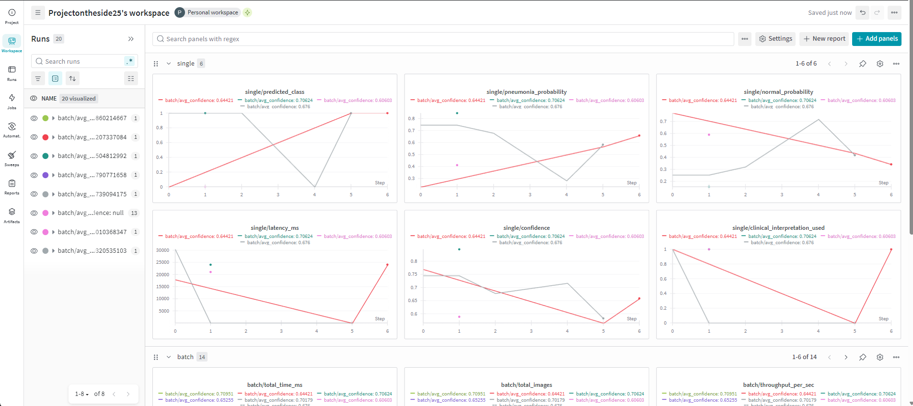
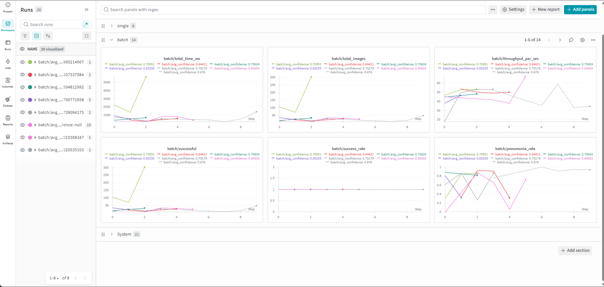
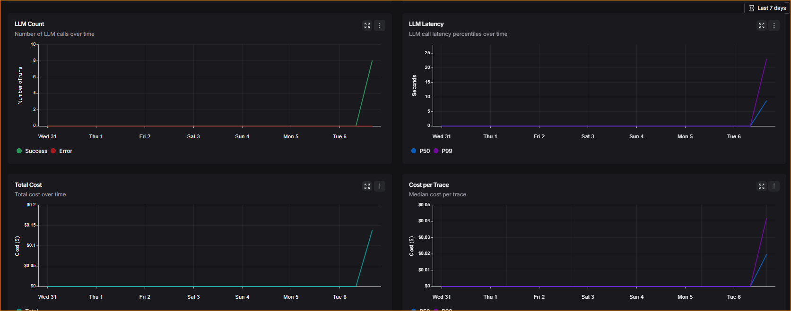
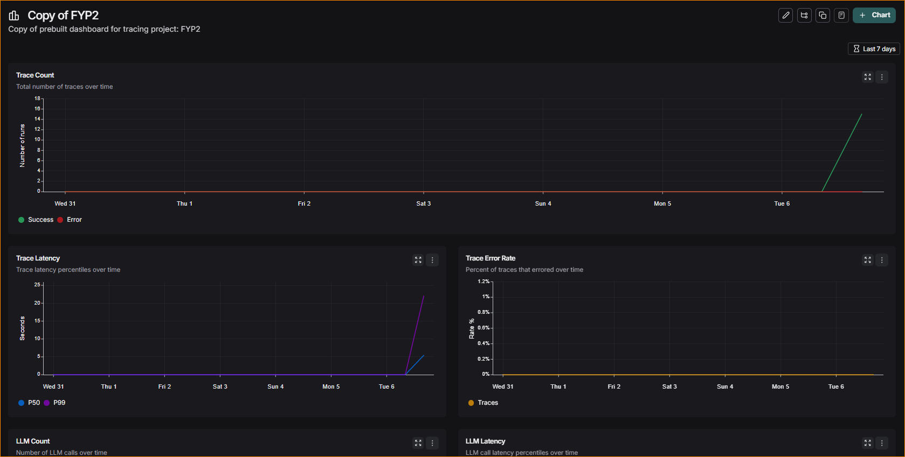

# Federated Pneumonia Detection System

[](https://www.python.org/downloads/)
[](https://pytorchlightning.ai/)
[](https://flower.dev/)
[](LICENSE)

A production-ready federated learning system for pneumonia detection from chest X-ray images. Enables privacy-preserving collaborative medical AI across distributed institutions without centralizing sensitive patient data.

## System Architecture

```mermaid
graph TB
    subgraph frontend["🖥️ Frontend Layer"]
        direction TB
        UI["React UI<br/>(Dashboard)"]
        WS_Client["WebSocket<br/>Client"]
    end

    subgraph api_layer["🌐 API Layer (Boundary)"]
        direction TB
        FastAPI["FastAPI<br/>REST Server"]
        WS_Server["WebSocket<br/>Server"]
        Schemas["Request/Response<br/>Schemas"]
    end

    subgraph control_layer["🎮 Control Layer"]
        direction TB
        subgraph ct["Centralized Training"]
            CentralizedTrainer["CentralizedTrainer<br/>(PyTorch Lightning)"]
        end
        subgraph fl["Federated Learning"]
            ServerApp["FL ServerApp<br/>(Flower)"]
            ClientApp["FL ClientApp<br/>(Flower)"]
            DataPartitioner["Data Partitioner<br/>(IID/Non-IID/Stratified)"]
        end
        Orchestrator["ExperimentOrchestrator<br/>(Comparison)"]
    end

    subgraph entities_layer["📦 Entities Layer"]
        direction TB
        ResNet["ResNetWithCustomHead<br/>(Model)"]
        Dataset["XRayDataModule<br/>(Data)"]
        Config["SystemConstants<br/>ExperimentConfig"]
    end

    subgraph boundary_layer["🧱 Boundary Layer"]
        direction TB
        RunDAO["Run DAO<br/>(ORM)"]
        MetricDAO["Metric DAO<br/>(ORM)"]
    end

    subgraph utils_layer["⚙️ Utils Layer"]
        direction TB
        ConfigLoader["ConfigLoader<br/>(YAML)"]
        MetricsSender["MetricsWebSocketSender<br/>(Real-time)"]
        Logging["Logging & Error<br/>Handling"]
    end

    subgraph data["💾 Data Layer"]
        direction TB
        DB[("PostgreSQL<br/>(Metrics & Runs)")]
        FileSystem["File System<br/>(Datasets & Models)"]
    end

    UI -->|HTTP| FastAPI
    UI -->|WebSocket| WS_Client
    WS_Client <-->|Stream Updates| WS_Server

    FastAPI -->|Validate| Schemas
    FastAPI -->|Invoke| CentralizedTrainer
    FastAPI -->|Invoke| ServerApp
    FastAPI -->|Query| RunDAO

    CentralizedTrainer -->|Uses| ResNet
    CentralizedTrainer -->|Uses| Dataset
    CentralizedTrainer -->|Uses| Config
    CentralizedTrainer -->|Sends Metrics| MetricsSender

    ServerApp -->|Uses| ResNet
    ServerApp -->|Coordinates| ClientApp
    ServerApp -->|Uses| DataPartitioner
    ServerApp -->|Sends Metrics| MetricsSender

    ClientApp -->|Uses| ResNet
    ClientApp -->|Uses| Dataset

    DataPartitioner -->|Loads| Dataset

    CentralizedTrainer -->|Persists| RunDAO
    CentralizedTrainer -->|Logs| MetricDAO

    ServerApp -->|Persists| RunDAO
    ServerApp -->|Logs| MetricDAO

    MetricsSender -->|Broadcasts| WS_Server

    Orchestrator -->|Runs| CentralizedTrainer
    Orchestrator -->|Runs| ServerApp
    Orchestrator -->|Uses| ConfigLoader

    ConfigLoader -->|Loads| Config
    Logging -->|Monitors| CentralizedTrainer
    Logging -->|Monitors| ServerApp

    RunDAO -->|Read/Write| DB
    MetricDAO -->|Read/Write| DB
    Dataset -->|Read| FileSystem
    ResNet -->|Checkpoint| FileSystem

    style frontend fill:#007BFF,stroke:#333,stroke-width:2px,color:#fff
    style api_layer fill:#FF6F00,stroke:#333,stroke-width:2px,color:#fff
    style control_layer fill:#2962FF,stroke:#333,stroke-width:2px,color:#fff
    style entities_layer fill:#D50000,stroke:#333,stroke-width:2px,color:#fff
    style boundary_layer fill:#AA00FF,stroke:#333,stroke-width:2px,color:#fff
    style utils_layer fill:#00897B,stroke:#333,stroke-width:2px,color:#fff
    style data fill:#558B2F,stroke:#333,stroke-width:2px,color:#fff
```



## Key Features

- **Dual Training Modes**: Centralized or federated learning from a single API
- **Privacy-Preserving**: Flower framework—hospitals send weights, not patient data
- **Production-Ready**: Built on PyTorch Lightning + Flower
- **Data Distribution**: IID, Non-IID (patient-based), or Stratified partitioning
- **Real-Time Monitoring**: WebSocket streaming to React dashboard
- **Built-in Comparison**: Side-by-side centralized vs federated evaluation
- **Type-Safe**: Full type hints, >90% test coverage

## Quick Start

### Prerequisites

- Python 3.12+ with `uv` package manager
- PostgreSQL
- Node.js 20+
- CUDA-capable GPU (recommended)

### Installation

```bash
git clone <repository-url>
cd FYP2
uv sync
cd xray-vision-ai-forge && npm install && cd ..
```

### Start the System

```bash
# Terminal 1: Backend
python -m federated_pneumonia_detection.src.api.main

# Terminal 2: Frontend
cd xray-vision-ai-forge && npm run dev

# Terminal 3: WebSocket relay (optional)
python scripts/websocket_server.py
```

Visit `http://localhost:5173` for the dashboard.

## Architecture Layers

| Layer        | Purpose                                 | Location                |
| ------------ | --------------------------------------- | ----------------------- |
| **Frontend** | React UI dashboard                      | `xray-vision-ai-forge/` |
| **API**      | FastAPI REST + WebSocket                | `src/api/`              |
| **Control**  | Training orchestration                  | `src/control/`          |
| **Entities** | Domain models (ResNet, Dataset, Config) | `src/entities/`         |
| **Boundary** | Database access (ORM/CRUD)              | `src/boundary/`         |
| **Utils**    | Config loading, metrics, logging        | `src/utils/`            |
| **Data**     | PostgreSQL + file system                | External                |

See individual module READMEs for details:

- [API Documentation](federated_pneumonia_detection/src/api/README.md)
- [Control Layer](federated_pneumonia_detection/src/control/README.md)
- [Entities](federated_pneumonia_detection/src/entities/README.md)
- [Boundary/Database](federated_pneumonia_detection/src/boundary/README.md)

## Technologies

| Category               | Tech                                     |
| ---------------------- | ---------------------------------------- |
| **Deep Learning**      | PyTorch, PyTorch Lightning               |
| **Federated Learning** | Flower, NumPy, Scikit-learn              |
| **API & Web**          | FastAPI, Uvicorn, WebSockets, Pydantic   |
| **Database**           | SQLAlchemy 2.0, PostgreSQL, Pandas       |
| **Monitoring**         | Weights & Biases, TensorBoard, LangSmith |
| **Frontend**           | React 18+, TypeScript, Chart.js          |

## Configuration

All parameters in one YAML file: `federated_pneumonia_detection/config/default_config.yaml`

```yaml
system:
  img_size: [256, 256]
  batch_size: 32
  validation_split: 0.20

experiment:
  learning_rate: 0.0015
  epochs: 15
  num_rounds: 15
  num_clients: 5
  clients_per_round: 3
```

Load in code:

```python
from federated_pneumonia_detection.src.utils.config_loader import ConfigLoader

config_loader = ConfigLoader(config_dir="federated_pneumonia_detection/config")
config = config_loader.create_experiment_config()
print(f"Batch size: {config.batch_size}")
```

## Federated Learning Modes

**Non-IID (Patient-Based)** — Realistic multi-hospital distribution:

```python
from federated_pneumonia_detection.src.control.federated_learning.federated_trainer import FederatedTrainer

trainer = FederatedTrainer(partition_strategy="non-iid")
results = trainer.train(source_path="path/to/dataset.zip")
```

**IID** — Controlled baseline experiments
**Stratified** — Maintains class balance

## Monitoring & Visualization

### Weights & Biases Integration

Real-time tracking of predictions, batches, and system resources:

#### Single Prediction Monitoring



- Prediction confidence scores (Normal/Pneumonia)
- Inference latency
- Input preprocessing metrics
- Model output logits

#### Batch Prediction Monitoring



- Throughput: Up to 500 predictions/batch
- Class distribution and error rates
- Processing time breakdown

#### System Resource Monitoring


- GPU/CPU memory and utilization
- Disk I/O for dataset loading
- Thermal metrics

### LangSmith Observability

LLM tracing and evaluation for the research assistant:




- Full conversation traces with token usage
- Automated hallucination detection (25% sampling)
- Answer relevance scoring

## Testing

```bash
pytest                           # All tests
pytest --cov=federated_pneumonia_detection  # With coverage
pytest tests/unit/               # Component tests only
pytest tests/integration/        # End-to-end workflows
```

Test structure:

```
tests/
├── unit/                 # Component-level tests
├── integration/          # Full training workflows
├── api/                  # HTTP endpoint tests
└── conftest.py          # Shared fixtures
```

## Common Workflows

### Centralized Training

```python
from federated_pneumonia_detection.src.control.dl_model.centralized_trainer import CentralizedTrainer

trainer = CentralizedTrainer(config_path="federated_pneumonia_detection/config/default_config.yaml")
results = trainer.train(source_path="path/to/dataset.zip", experiment_name="baseline")
print(f"Best F1: {results['best_model_score']:.4f}")
```

### Federated Learning

```python
from federated_pneumonia_detection.src.control.federated_learning.federated_trainer import FederatedTrainer

trainer = FederatedTrainer(partition_strategy="non-iid")
results = trainer.train(source_path="path/to/dataset.zip", experiment_name="federated")
print(f"Completed {results['num_rounds']} rounds across {results['num_clients']} clients")
```

### Compare Both Approaches

```python
from federated_pneumonia_detection.src.control.comparison import ExperimentOrchestrator

orchestrator = ExperimentOrchestrator()
comparison = orchestrator.run_comparison("path/to/dataset.zip")
print(f"Centralized F1: {comparison['centralized']['metrics']['f1']:.4f}")
print(f"Federated F1: {comparison['federated']['metrics']['f1']:.4f}")
```

## Dataset Format

```
dataset/
├── Images/
│   ├── NORMAL/
│   │   ├── image_001.png
│   │   └── ...
│   └── PNEUMONIA/
│       ├── image_001.png
│       └── ...
└── metadata.csv
```

Metadata CSV columns: `patientId, filename, Target` (0=Normal, 1=Pneumonia)

## Performance Metrics

| Metric        | Purpose                             |
| ------------- | ----------------------------------- |
| **Accuracy**  | (TP + TN) / Total                   |
| **Precision** | TP / (TP + FP)                      |
| **Recall**    | TP / (TP + FN)                      |
| **F1 Score**  | Harmonic mean of precision & recall |
| **AUC-ROC**   | Area under ROC curve                |

## Additional Resources

- **[USAGE_EXAMPLE.md](USAGE_EXAMPLE.md)** — Detailed usage examples
- **[FEDERATED_INTEGRATION_SUMMARY.md](FEDERATED_INTEGRATION_SUMMARY.md)** — Implementation overview
- **[Flower Docs](https://flower.dev/)** — Federated learning framework
- **[PyTorch Lightning Docs](https://pytorchlightning.ai/)** — Training abstractions

## Contributing

1. Create a feature branch: `git checkout -b feature/your-feature`
2. Follow code standards: type hints, docstrings, tests
3. Run tests: `pytest --cov=federated_pneumonia_detection`
4. Commit: `git commit -m "Add your feature"`
5. Open a PR

## License

MIT License - see [LICENSE](LICENSE)

---

**Note**: This is a research project for educational purposes. For clinical deployment, consult medical professionals and follow regulatory guidelines (FDA, HIPAA).
