# Federated Pneumonia Detection System

[](https://www.python.org/downloads/)
[](https://pytorchlightning.ai/)
[](https://flower.dev/)
[](LICENSE)

A production-ready federated learning system for pneumonia detection from chest X-ray images, built with PyTorch Lightning and Flower framework. Enables privacy-preserving collaborative medical AI across distributed institutions without centralizing sensitive patient data.

## System Architecture

```mermaid
graph TB
    subgraph frontend["🖥️ Frontend Layer"]
        direction TB
        UI["React UI<br/>(Dashboard)"]
        WS_Client["WebSocket<br/>Client"]
    end

    subgraph api_layer["🌐 API Layer (Boundary)"]
        direction TB
        FastAPI["FastAPI<br/>REST Server"]
        WS_Server["WebSocket<br/>Server"]
        Schemas["Request/Response<br/>Schemas"]
    end

    subgraph control_layer["🎮 Control Layer"]
        direction TB
        subgraph ct["Centralized Training"]
            CentralizedTrainer["CentralizedTrainer<br/>(PyTorch Lightning)"]
        end
        subgraph fl["Federated Learning"]
            ServerApp["FL ServerApp<br/>(Flower)"]
            ClientApp["FL ClientApp<br/>(Flower)"]
            DataPartitioner["Data Partitioner<br/>(IID/Non-IID/Stratified)"]
        end
        Orchestrator["ExperimentOrchestrator<br/>(Comparison)"]
    end

    subgraph entities_layer["📦 Entities Layer"]
        direction TB
        ResNet["ResNetWithCustomHead<br/>(Model)"]
        Dataset["XRayDataModule<br/>(Data)"]
        Config["SystemConstants<br/>ExperimentConfig"]
    end

    subgraph boundary_layer["🧱 Boundary Layer"]
        direction TB
        RunDAO["Run DAO<br/>(ORM)"]
        MetricDAO["Metric DAO<br/>(ORM)"]
    end

    subgraph utils_layer["⚙️ Utils Layer"]
        direction TB
        ConfigLoader["ConfigLoader<br/>(YAML)"]
        MetricsSender["MetricsWebSocketSender<br/>(Real-time)"]
        Logging["Logging & Error<br/>Handling"]
    end

    subgraph data["💾 Data Layer"]
        direction TB
        DB[("PostgreSQL<br/>(Metrics & Runs)")]
        FileSystem["File System<br/>(Datasets & Models)"]
    end

    UI -->|HTTP| FastAPI
    UI -->|WebSocket| WS_Client
    WS_Client <-->|Stream Updates| WS_Server

    FastAPI -->|Validate| Schemas
    FastAPI -->|Invoke| CentralizedTrainer
    FastAPI -->|Invoke| ServerApp
    FastAPI -->|Query| RunDAO

    CentralizedTrainer -->|Uses| ResNet
    CentralizedTrainer -->|Uses| Dataset
    CentralizedTrainer -->|Uses| Config
    CentralizedTrainer -->|Sends Metrics| MetricsSender

    ServerApp -->|Uses| ResNet
    ServerApp -->|Coordinates| ClientApp
    ServerApp -->|Uses| DataPartitioner
    ServerApp -->|Sends Metrics| MetricsSender

    ClientApp -->|Uses| ResNet
    ClientApp -->|Uses| Dataset

    DataPartitioner -->|Loads| Dataset

    CentralizedTrainer -->|Persists| RunDAO
    CentralizedTrainer -->|Logs| MetricDAO

    ServerApp -->|Persists| RunDAO
    ServerApp -->|Logs| MetricDAO

    MetricsSender -->|Broadcasts| WS_Server

    Orchestrator -->|Runs| CentralizedTrainer
    Orchestrator -->|Runs| ServerApp
    Orchestrator -->|Uses| ConfigLoader

    ConfigLoader -->|Loads| Config
    Logging -->|Monitors| CentralizedTrainer
    Logging -->|Monitors| ServerApp

    RunDAO -->|Read/Write| DB
    MetricDAO -->|Read/Write| DB
    Dataset -->|Read| FileSystem
    ResNet -->|Checkpoint| FileSystem

    style frontend fill:#007BFF,stroke:#333,stroke-width:2px,color:#fff
    style api_layer fill:#FF6F00,stroke:#333,stroke-width:2px,color:#fff
    style control_layer fill:#2962FF,stroke:#333,stroke-width:2px,color:#fff
    style entities_layer fill:#D50000,stroke:#333,stroke-width:2px,color:#fff
    style boundary_layer fill:#AA00FF,stroke:#333,stroke-width:2px,color:#fff
    style utils_layer fill:#00897B,stroke:#333,stroke-width:2px,color:#fff
    style data fill:#558B2F,stroke:#333,stroke-width:2px,color:#fff
```



## Project Overview

**Federated Pneumonia Detection** is a research-grade system that demonstrates privacy-preserving AI for medical imaging. Instead of centralizing patient X-rays in a single location, this system allows multiple medical institutions to collaboratively train a pneumonia detection model while keeping sensitive patient data at the source.

**Key Insight**: Hospitals send model weights, not patient data. The trained model is centrally aggregated using Flower's federated averaging algorithm (FedAvg).

## Key Features

- **Dual Training Modes**: Run identical experiments in centralized or federated mode from a single API
- **Privacy-Preserving**: Implements Flower framework for true federated learning without centralizing patient images
- **Production-Ready**: Built on battle-tested PyTorch Lightning and Flower frameworks
- **Configurable Data Distribution**: Three partitioning strategies for federated clients
  - IID (Independent and Identically Distributed) for controlled experiments
  - Non-IID (Patient-based) for realistic multi-hospital scenarios
  - Stratified for maintaining class balance
- **Real-Time Monitoring**: WebSocket streaming of training metrics to React dashboard
- **Comprehensive Comparison**: Built-in orchestrator for side-by-side evaluation of approaches
- **Type-Safe & Well-Tested**: Full type hints, >90% test coverage, clean architecture

## Architecture Overview

This system follows **Clean Architecture** with **Entity-Control-Boundary (ECB)** pattern:

| Layer              | Purpose                                                                                  | Directory               |
| ------------------ | ---------------------------------------------------------------------------------------- | ----------------------- |
| **Frontend**       | React dashboard for experiment monitoring                                                | `xray-vision-ai-forge/` |
| **API Layer**      | FastAPI REST endpoints & WebSocket server for client communication                       | `src/api/`              |
| **Control Layer**  | Training orchestration (centralized/federated), data partitioning, experiment comparison | `src/control/`          |
| **Entities Layer** | Core domain objects: models, datasets, configuration                                     | `src/entities/`         |
| **Boundary Layer** | Data access objects (DAOs) for database persistence                                      | `src/boundary/`         |
| **Utils Layer**    | Shared utilities: config loading, metrics broadcasting, logging                          | `src/utils/`            |
| **Data Layer**     | PostgreSQL for metrics/runs, file system for datasets/checkpoints                        | External                |

### Separation of Concerns

- **Entities** know nothing about frameworks; they're pure domain logic
- **Control** orchestrates entities; decides how to train
- **Boundary** handles database I/O; no business logic
- **API** translates HTTP to control layer calls
- **Utils** are shared helpers; no dependencies on control/entities

## Module Directory

Each module has detailed documentation explaining its purpose, components, and usage:

| Module                 | Purpose                                                           | Link                                                                                                                     |
| ---------------------- | ----------------------------------------------------------------- | ------------------------------------------------------------------------------------------------------------------------ |
| **API Layer**          | REST endpoints, WebSocket integration, request validation         | [src/api/README.md](federated_pneumonia_detection/src/api/README.md)                                                     |
| **Control Layer**      | Training orchestration, federated learning, experiment management | [src/control/README.md](federated_pneumonia_detection/src/control/README.md)                                             |
| **Entities Layer**     | Model architecture, dataset definitions, configuration objects    | [src/entities/README.md](federated_pneumonia_detection/src/entities/README.md)                                           |
| **Boundary Layer**     | Database schema, ORM mappings, data access objects                | [src/boundary/README.md](federated_pneumonia_detection/src/boundary/README.md)                                           |
| **Utils Layer**        | Configuration loading, metrics broadcasting, error handling       | [src/utils/README.md](federated_pneumonia_detection/src/utils/README.md)                                                 |
| **Federated Learning** | Flower framework, server/client apps, data partitioning           | [src/control/federated_new_version/README.md](federated_pneumonia_detection/src/control/federated_new_version/README.md) |

## LLM Observability & Evaluation

The system includes comprehensive LLM observability through **LangSmith** for the research assistant agent:

### Tracing & Monitoring

All LLM interactions are traced and logged to LangSmith, providing:

- **Full conversation traces** with input/output capture
- **Token usage tracking** for cost monitoring
- **Latency metrics** for performance optimization
- **Error tracking** with full stack traces

### Automated Evaluation (25% Sampling)

The system automatically evaluates LLM responses using a **25% sampling rate** with the following metrics:

| Metric                      | Description                                                        | Threshold                    |
| --------------------------- | ------------------------------------------------------------------ | ---------------------------- |
| **Hallucination Detection** | Identifies fabricated information not grounded in source documents | Score 0-1 (lower is better)  |
| **Answer Relevance**        | Measures how well the response addresses the user's query          | Score 0-1 (higher is better) |
| **Composite Score**         | Weighted combination of hallucination and relevance metrics        | Score 0-1 (higher is better) |


## Quick Start

### Prerequisites

- **Python 3.12+** with `uv` package manager
- **CUDA-capable GPU** (recommended for training)
- **PostgreSQL** (for metrics/runs storage)
- **Node.js 20+** (for frontend dashboard)

### Installation

```bash
# Clone and navigate
git clone <repository-url>
cd FYP2

# Backend setup with uv
uv sync

# Frontend setup
cd xray-vision-ai-forge
npm install
cd ..
```

### Verification

```bash
# Start API server (runs on http://localhost:8000)
python -m federated_pneumonia_detection.src.api.main

# In another terminal, run a simple test
python -c "
from federated_pneumonia_detection.src.utils.config_loader import ConfigLoader
config_loader = ConfigLoader(config_dir='federated_pneumonia_detection/config')
config = config_loader.create_experiment_config()
print(f'Config loaded. Batch size: {config.batch_size}')
"
```

## Technologies Used

### Core Deep Learning

| Technology                     | Purpose                        | Version |
| ------------------------------ | ------------------------------ | ------- |
| **PyTorch**                    | Deep learning framework        | Latest  |
| **PyTorch Lightning**          | Training abstraction & logging | Latest  |
| **PyTorch Lightning Advanced** | Callbacks, strategies, plugins | Latest  |

### Federated Learning

| Technology       | Purpose                      | Version |
| ---------------- | ---------------------------- | ------- |
| **Flower**       | Federated learning framework | Latest  |
| **NumPy**        | Numerical computations       | Latest  |
| **Scikit-learn** | Data partitioning utilities  | Latest  |

### API & Infrastructure

| Technology     | Purpose                     | Version            |
| -------------- | --------------------------- | ------------------ |
| **FastAPI**    | REST API framework          | Latest             |
| **Uvicorn**    | ASGI server                 | Latest             |
| **WebSockets** | Real-time metric streaming  | WebSocket Protocol |
| **Pydantic**   | Request/response validation | Latest             |

### Data & Storage

| Technology         | Purpose                           | Version |
| ------------------ | --------------------------------- | ------- |
| **SQLAlchemy 2.0** | ORM for database access           | 2.0+    |
| **PostgreSQL**     | Metrics & experiment runs storage | 12+     |
| **Pandas**         | Data manipulation & analysis      | Latest  |
| **Pillow**         | Image processing                  | Latest  |

### Monitoring & Logging

| Technology           | Purpose                        | Version  |
| -------------------- | ------------------------------ | -------- |
| **Weights & Biases** | Experiment tracking (optional) | Latest   |
| **TensorBoard**      | Metric visualization           | Latest   |
| **Python Logging**   | Structured logging             | Built-in |

### Frontend

| Technology     | Purpose                 | Version |
| -------------- | ----------------------- | ------- |
| **React**      | UI framework            | 18+     |
| **TypeScript** | Type-safe JavaScript    | Latest  |
| **Chart.js**   | Real-time metric charts | Latest  |

## File Structure

```
FYP2/
├── federated_pneumonia_detection/      # Main application package
│   ├── src/
│   │   ├── api/                        # REST & WebSocket endpoints
│   │   │   ├── main.py                # FastAPI app entry point
│   │   │   ├── routes/                # Endpoint definitions
│   │   │   ├── schemas/               # Pydantic request/response models
│   │   │   └── README.md              # API documentation
│   │   │
│   │   ├── control/                   # Training orchestration
│   │   │   ├── dl_model/              # Centralized training system
│   │   │   │   ├── centralized_trainer.py
│   │   │   │   └── utils/
│   │   │   ├── federated_learning/    # Federated learning system
│   │   │   │   ├── federated_trainer.py
│   │   │   │   ├── data_partitioner.py
│   │   │   │   └── federated_new_version/  # Flower implementation
│   │   │   ├── comparison.py          # ExperimentOrchestrator
│   │   │   └── README.md              # Control layer documentation
│   │   │
│   │   ├── entities/                  # Domain models & data structures
│   │   │   ├── model/                 # ResNet architecture
│   │   │   ├── dataset/               # XRayDataModule
│   │   │   ├── config/                # Configuration classes
│   │   │   └── README.md              # Entities documentation
│   │   │
│   │   ├── boundary/                  # Database & persistence
│   │   │   ├── models/                # SQLAlchemy ORM models
│   │   │   ├── repositories/          # Data access objects (DAOs)
│   │   │   └── README.md              # Boundary documentation
│   │   │
│   │   └── utils/                     # Shared utilities
│   │       ├── config_loader.py       # YAML config loading
│   │       ├── data_utils.py          # Data processing helpers
│   │       ├── logging.py             # Structured logging
│   │       └── README.md              # Utils documentation
│   │
│   ├── config/
│   │   └── default_config.yaml        # All system parameters (single source of truth)
│   │
│   └── tests/                         # Comprehensive test suite
│       ├── unit/                      # Component-level tests
│       ├── integration/               # End-to-end workflows
│       └── api/                       # HTTP endpoint tests
│
├── xray-vision-ai-forge/              # React frontend dashboard
│   ├── src/
│   │   ├── components/                # React components
│   │   ├── pages/                     # Application pages
│   │   └── services/                  # API client & WebSocket
│   └── package.json
│
├── scripts/                           # Utility scripts
│   ├── websocket_server.py            # Standalone WebSocket relay
│   └── setup_db.py                    # Database initialization
│
└── README.md                          # This file
```

## Getting Started: Common Workflows

### Workflow 1: Run Centralized Training

```python
from federated_pneumonia_detection.src.control.dl_model.centralized_trainer import CentralizedTrainer

trainer = CentralizedTrainer(
    config_path="federated_pneumonia_detection/config/default_config.yaml",
    checkpoint_dir="checkpoints",
    logs_dir="logs"
)

results = trainer.train(
    source_path="path/to/dataset.zip",
    experiment_name="pneumonia_baseline"
)

print(f"Best model saved to: {results['best_model_path']}")
print(f"Best F1 score: {results['best_model_score']:.4f}")
```

### Workflow 2: Run Federated Learning

```python
from federated_pneumonia_detection.src.control.federated_learning.federated_trainer import FederatedTrainer

trainer = FederatedTrainer(
    config_path="federated_pneumonia_detection/config/default_config.yaml",
    checkpoint_dir="checkpoints",
    logs_dir="logs",
    partition_strategy="non-iid"  # Patient-based data distribution
)

results = trainer.train(
    source_path="path/to/dataset.zip",
    experiment_name="pneumonia_federated"
)

print(f"Trained across {results['num_clients']} simulated clients")
print(f"Completed {results['num_rounds']} communication rounds")
```

### Workflow 3: Compare Both Approaches

```python
from federated_pneumonia_detection.src.control.comparison import ExperimentOrchestrator

orchestrator = ExperimentOrchestrator(
    config_path="federated_pneumonia_detection/config/default_config.yaml",
    partition_strategy="non-iid"
)

comparison = orchestrator.run_comparison("path/to/dataset.zip")

print(f"Results saved to: {orchestrator.experiment_dir}")
print(f"Centralized F1: {comparison['centralized']['metrics']['f1']:.4f}")
print(f"Federated F1: {comparison['federated']['metrics']['f1']:.4f}")
```

### Workflow 4: Monitor Training via React Dashboard

```bash
# Terminal 1: Start API server
python -m federated_pneumonia_detection.src.api.main

# Terminal 2: Start WebSocket server
python scripts/websocket_server.py

# Terminal 3: Start React dashboard
cd xray-vision-ai-forge
npm start

# Open http://localhost:3000 to see real-time metrics
```

## Configuration

All parameters are centralized in **one YAML file**: `federated_pneumonia_detection/config/default_config.yaml`

This single source of truth controls:

- Image preprocessing (size, normalization, augmentation)
- Model architecture (learning rate, dropout, freeze layers)
- Training (epochs, batch size, early stopping)
- Federated learning (number of rounds, clients, partitioning)
- Output paths (checkpoints, logs, results)

**Example configuration**:

```yaml
system:
  img_size: [256, 256]
  batch_size: 32
  validation_split: 0.20
  seed: 42

experiment:
  learning_rate: 0.0015
  weight_decay: 0.0001
  epochs: 15

  # Federated learning parameters
  num_rounds: 15
  num_clients: 5
  clients_per_round: 3
  local_epochs: 2
```

Load configuration in code:

```python
from federated_pneumonia_detection.src.utils.config_loader import ConfigLoader

config_loader = ConfigLoader(config_dir="federated_pneumonia_detection/config")
constants = config_loader.create_system_constants()
config = config_loader.create_experiment_config()

print(f"Image size: {constants.IMG_SIZE}")
print(f"Batch size: {config.batch_size}")
print(f"FL rounds: {config.num_rounds}")
```

## Data Preparation

### Dataset Format

Place chest X-ray images in this structure:

```
dataset/
├── Images/
│   ├── NORMAL/
│   │   ├── image_001.png
│   │   ├── image_002.png
│   │   └── ...
│   └── PNEUMONIA/
│       ├── image_001.png
│       ├── image_002.png
│       └── ...
└── metadata.csv
```

### Metadata CSV Format

Columns required in `metadata.csv`:

```csv
patientId,filename,Target
P001,image_001.png,0
P001,image_002.png,0
P002,image_003.png,1
P003,image_004.png,0
```

- `patientId`: Unique patient identifier (used for non-IID partitioning)
- `filename`: Image filename (relative to Images/)
- `Target`: Binary label (0=Normal, 1=Pneumonia)

## Testing

Run the comprehensive test suite:

```bash
# All tests
pytest

# With coverage report
pytest --cov=federated_pneumonia_detection

# Specific test categories
pytest tests/unit/                          # Component tests only
pytest tests/integration/                   # End-to-end workflows
pytest tests/api/                           # HTTP endpoint tests
pytest tests/unit/control/test_centralized_trainer.py  # Single file
```

**Test Organization**:

```
tests/
├── unit/
│   ├── control/              # Training logic tests
│   ├── entities/             # Model & dataset tests
│   ├── boundary/             # Database tests
│   └── utils/                # Utility function tests
├── integration/
│   ├── data_pipeline/        # Dataset loading & partitioning
│   ├── training/             # Full training workflows
│   ├── federated_learning/   # FL round execution
│   └── comparison/           # Centralized vs Federated
├── api/                      # REST & WebSocket endpoint tests
└── conftest.py               # Shared fixtures & configuration
```

**Key Test Fixtures**:

- `sample_dataset`: Pre-generated X-ray dataset for testing
- `config_loader`: Pre-configured settings object
- `db_session`: In-memory SQLite database
- `websocket_client`: Mock WebSocket connection

## Federated Learning Details

### What is Federated Learning?

Instead of centralizing patient data:

1. Each hospital keeps its patient X-rays
2. Downloads the latest model weights from central server
3. Trains the model locally on its data
4. Sends updated weights back (not data)
5. Server aggregates weights from all hospitals using FedAvg algorithm

**Result**: A model trained on distributed data without moving sensitive images.

### Data Partitioning Strategies

The system offers three strategies to distribute data across simulated clients:

#### IID (Independent & Identically Distributed)

```python
trainer = FederatedTrainer(partition_strategy="iid")
```

- Random distribution of samples
- Each client gets similar data distribution
- Good for controlled baseline experiments
- Unrealistic for real medical scenarios

#### Non-IID (Patient-Based)

```python
trainer = FederatedTrainer(partition_strategy="non-iid")
```

- Each client gets data from distinct patients
- Simulates real multi-hospital distribution
- Different clients may have different class balances
- Recommended for realistic evaluation

#### Stratified

```python
trainer = FederatedTrainer(partition_strategy="stratified")
```

- Maintains class balance (Normal/Pneumonia ratio) across clients
- Good for imbalanced datasets
- Ensures fair performance comparison

### Flower Framework Integration

This system uses **Flower**, a production-ready federated learning framework:

**Server-Side**:

- Manages global model weights
- Orchestrates client selection
- Aggregates client updates using FedAvg
- Performs server-side evaluation
- Broadcasts metrics to frontend

**Client-Side** (Simulated):

- Receives global weights
- Trains locally on its data partition
- Computes local metrics
- Returns updated weights

See [Flower documentation](https://flower.dev/) for production deployment.

## Monitoring & Visualization

### Real-Time Metrics via WebSocket

The system streams real-time metrics to the React dashboard:

```
Backend Training → MetricsWebSocketSender → WebSocket Server → React Dashboard
```

**Streamed Metrics**:

- Per-epoch: loss, accuracy, precision, recall, F1, AUC-ROC
- Per-round (FL): client updates, aggregation stats
- Training events: start, end, early stopping, errors

### WandB & TensorBoard

Optionally integrate with monitoring platforms:

```python
from pytorch_lightning.loggers import WandbLogger

logger = WandbLogger(project="pneumonia-detection")
trainer = LitResNet(..., logger=logger)
```

## Development Guidelines

### Code Quality Standards

- **Type Hints**: Full type annotation coverage (no `Any`)
- **Docstrings**: Every public method has a docstring
- **Testing**: >90% code coverage target
- **File Size**: Maximum 150 lines per file
- **Error Handling**: Try-except with logging for I/O and external calls
- **SOLID Principles**:
  - **S**ingle Responsibility: One class, one job
  - **O**pen/Closed: Open to extension, closed to modification
  - **L**iskov Substitution: Subclasses interchangeable with parents
  - **I**nterface Segregation: Small, focused interfaces
  - **D**ependency Inversion: Inject dependencies, don't create them

### Adding a New Feature

1. **Add configuration** to `config/default_config.yaml`
2. **Create/extend entities** in `src/entities/`
3. **Implement logic** in `src/control/`
4. **Add database models** if needed in `src/boundary/`
5. **Expose API endpoints** in `src/api/routes/`
6. **Write tests** (unit + integration)
7. **Update module README** with documentation

### Common Patterns

**Dependency Injection**:

```python
class CentralizedTrainer:
    def __init__(self, config: ExperimentConfig, data_module: XRayDataModule):
        self.config = config
        self.data_module = data_module
```

**Result Objects**:

```python
@dataclass
class TrainingResult:
    best_model_path: str
    best_model_score: float
    final_metrics: Dict[str, float]
```

**Error Handling**:

```python
try:
    result = train_model(config)
except FileNotFoundError as e:
    logger.error(f"Dataset not found: {e}", exc_info=True)
    raise
```

## Performance Metrics

The system tracks comprehensive metrics for medical AI:

| Metric                   | Purpose                                 | Formula                         |
| ------------------------ | --------------------------------------- | ------------------------------- |
| **Accuracy**             | Correct predictions / Total predictions | (TP + TN) / (TP + TN + FP + FN) |
| **Precision**            | True positives / Predicted positives    | TP / (TP + FP)                  |
| **Recall (Sensitivity)** | True positives / Actual positives       | TP / (TP + FN)                  |
| **F1 Score**             | Harmonic mean of precision & recall     | 2 _ (P _ R) / (P + R)           |
| **Specificity**          | True negatives / Actual negatives       | TN / (TN + FP)                  |
| **AUC-ROC**              | Area under receiver operating curve     | 0.0-1.0 (higher better)         |

Where: TP=True Positives, TN=True Negatives, FP=False Positives, FN=False Negatives

## Additional Resources

### Documentation Files

- **[USAGE_EXAMPLE.md](USAGE_EXAMPLE.md)** - Detailed usage examples for all features
- **[FEDERATED_INTEGRATION_SUMMARY.md](FEDERATED_INTEGRATION_SUMMARY.md)** - Complete implementation overview
- **[documentation/guidelines.md](documentation/guidelines.md)** - Development guidelines and project phases

### External Resources

- **[Flower Documentation](https://flower.dev/)** - Federated learning framework
- **[PyTorch Lightning Documentation](https://pytorchlightning.ai/)** - Training abstractions
- **[FastAPI Documentation](https://fastapi.tiangolo.com/)** - API framework
- **[SQLAlchemy 2.0 Documentation](https://docs.sqlalchemy.org/)** - ORM and database access

## Contributing

1. Fork the repository
2. Create a feature branch: `git checkout -b feature/your-feature`
3. Follow code quality standards (type hints, docstrings, tests)
4. Run tests: `pytest --cov=federated_pneumonia_detection`
5. Commit: `git commit -m "Add your feature"`
6. Push: `git push origin feature/your-feature`
7. Open a Pull Request

## License

This project is licensed under the MIT License - see [LICENSE](LICENSE) for details.

## Acknowledgments

- **PyTorch Lightning Team** for the excellent deep learning framework
- **Flower Community** for production-ready federated learning
- **Medical AI Research Community** for advancing healthcare through machine learning
- **Open-Source Contributors** for essential libraries and tools

## Support

For questions, issues, or collaboration opportunities:

- Open a GitHub Issue for bug reports
- Start a GitHub Discussion for questions
- Contact project maintainers for collaboration

---

**Note**: This is a research project for educational purposes. When deploying medical AI systems in clinical settings, always:

- Consult with medical professionals
- Follow regulatory guidelines (FDA, HIPAA, etc.)
- Validate models on clinically representative data
- Implement proper audit trails and explainability
