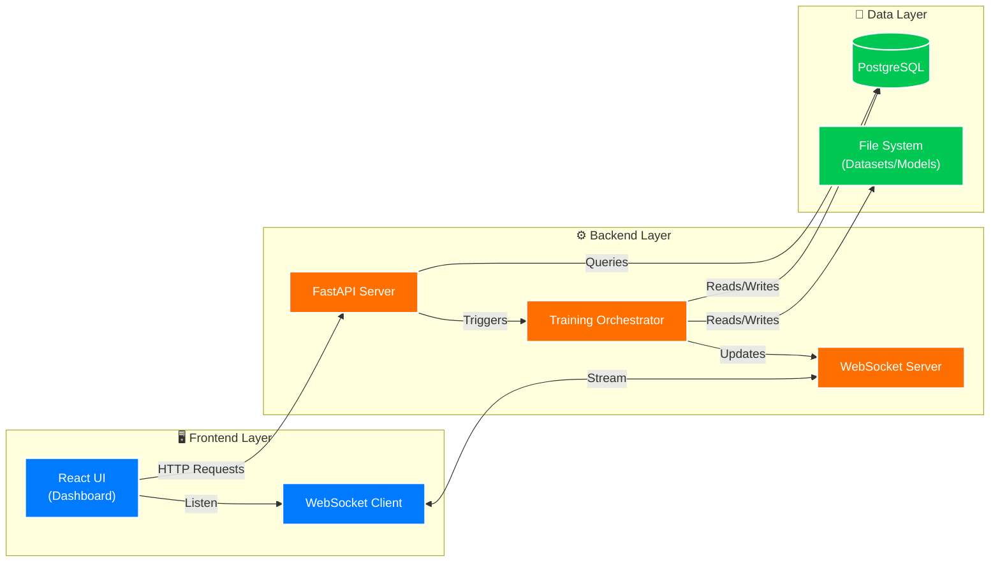
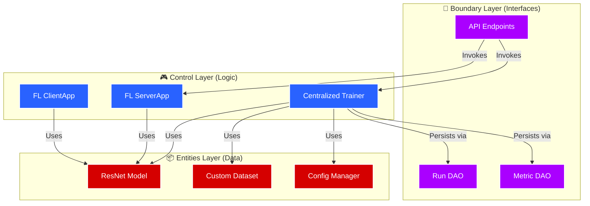
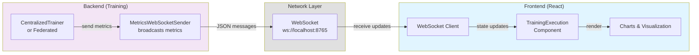
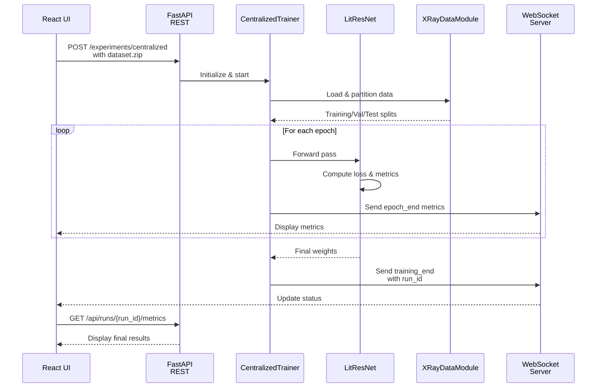
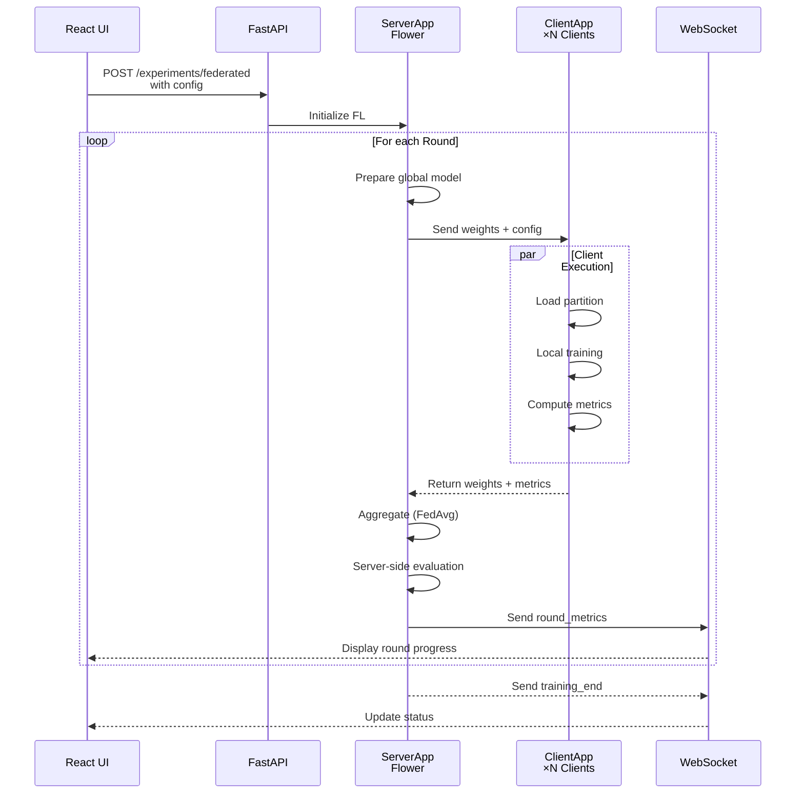

# Federated Pneumonia Detection System

[](https://www.python.org/downloads/)
[](https://pytorchlightning.ai/)
[](LICENSE)

A sophisticated federated learning system for pneumonia detection from chest X-ray images, built with PyTorch Lightning and designed for privacy-preserving collaborative medical AI.

## 📌 Navigation

| Section | Description | Link |
|---------|-------------|------|
| **Core App** | Main Backend Source | [federated_pneumonia_detection/](federated_pneumonia_detection/) |
| **API** | REST & WebSocket Layer | [src/api/](federated_pneumonia_detection/src/api/) |
| **Control** | Training Orchestration | [src/control/](federated_pneumonia_detection/src/control/) |
| **Entities** | Models & Datasets | [src/entities/](federated_pneumonia_detection/src/entities/) |
| **Boundary** | Database & Persistence | [src/boundary/](federated_pneumonia_detection/src/boundary/) |
| **Frontend** | React Dashboard | [xray-vision-ai-forge/](xray-vision-ai-forge/) |
| **Config** | System Settings | [config/](federated_pneumonia_detection/config/) |

## 🏗️ Architecture

### System Architecture Overview



### Backend Architecture (ECB Pattern)



## 🚀 Quick Start

### Prerequisites

- **Python 3.12+**
- **CUDA-capable GPU** (recommended)
- **uv** (high-performance package manager)
- **Node.js 20+** (for frontend)

### Installation & Setup

1. **Clone the repository**
   ```bash
   git clone <repository-url>
   cd FYP2
   ```

2. **Backend Setup (using uv)**
   ```bash
   # Install dependencies and create venv
   uv sync
   ```

3. **Frontend Setup**
   ```bash
   cd xray-vision-ai-forge
   npm install
   ```

4. **Verify Backend Installation**
   ```bash
   uv run python -m federated_pneumonia_detection.src.api.main
   ```

## 🛠️ Key Technologies

- **Federated Learning**: [Flower](https://flower.dev/)
- **Deep Learning**: [PyTorch Lightning](https://pytorchlightning.ai/)
- **API Framework**: [FastAPI](https://fastapi.tiangolo.com/)
- **Logging & Viz**: [WandB](https://wandb.ai/) / Tensorboard
- **Database**: PostgreSQL with SQLAlchemy 2.0

### Dataset Setup

1. **Prepare your chest X-ray dataset**

   - Place images in `Training/` or `Test/` directories
   - Ensure metadata CSV files contain required columns:
     - `patient_id`: Unique patient identifier
     - `filename`: Image filename
     - `label`: Binary classification (0=Normal, 1=Pneumonia)

2. **Configure paths**
   - Update `federated_pneumonia_detection/config/` with your dataset paths
   - Modify `SystemConstants` if needed for your data structure

## 💡 Usage Examples

### Quick Comparison (Centralized vs Federated)

Compare both training approaches with a single command:

```python
from federated_pneumonia_detection.src.control.comparison import run_quick_comparison

# Run both centralized and federated training, then compare
results = run_quick_comparison(
    source_path="path/to/dataset.zip",  # or directory path
    config_path="federated_pneumonia_detection/config/default_config.yaml",
    partition_strategy="non-iid"  # Options: 'iid', 'non-iid', 'stratified'
)

print(f"Results saved to: {results['experiment_dir']}")
print(f"Centralized status: {results['centralized']['status']}")
print(f"Federated status: {results['federated']['status']}")
```

### Centralized Training

```python
from federated_pneumonia_detection.src.control.dl_model.centralized_trainer import CentralizedTrainer

# Initialize trainer
trainer = CentralizedTrainer(
    config_path="federated_pneumonia_detection/config/default_config.yaml",
    checkpoint_dir="centralized_checkpoints",
    logs_dir="centralized_logs"
)

# Train model from zip file or directory
results = trainer.train(
    source_path="dataset.zip",
    experiment_name="pneumonia_centralized"
)

print(f"Best model: {results['best_model_path']}")
print(f"Best score: {results['best_model_score']:.4f}")
print(f"Final metrics: {results['final_metrics']}")
```

### Federated Learning

```python
from federated_pneumonia_detection.src.control.federated_learning.federated_trainer import FederatedTrainer

# Initialize federated trainer
trainer = FederatedTrainer(
    config_path="federated_pneumonia_detection/config/default_config.yaml",
    checkpoint_dir="federated_checkpoints",
    logs_dir="federated_logs",
    partition_strategy="non-iid"  # Patient-based partitioning
)

# Run federated training
results = trainer.train(
    source_path="dataset.zip",
    experiment_name="pneumonia_federated"
)

print(f"Federated training completed")
print(f"Number of clients: {results['num_clients']}")
print(f"Number of rounds: {results['num_rounds']}")
print(f"Final model: {results['checkpoint_dir']}")
```

### Advanced Orchestration

For full control over experiments:

```python
from federated_pneumonia_detection.src.control.comparison import ExperimentOrchestrator

# Create orchestrator
orchestrator = ExperimentOrchestrator(
    config_path="federated_pneumonia_detection/config/default_config.yaml",
    base_output_dir="experiments",
    partition_strategy="stratified"
)

# Run individual experiments
centralized_results = orchestrator.run_centralized("dataset.zip")
federated_results = orchestrator.run_federated("dataset.zip")

# Or run full comparison
comparison = orchestrator.run_comparison("dataset.zip")

print(f"Experiment directory: {orchestrator.experiment_dir}")
```

### Configuration Loading

```python
from federated_pneumonia_detection.src.utils.config_loader import ConfigLoader

# Load configuration from YAML
config_loader = ConfigLoader(config_dir="federated_pneumonia_detection/config")
constants = config_loader.create_system_constants()
config = config_loader.create_experiment_config()

print(f"Image size: {constants.IMG_SIZE}")
print(f"Batch size: {config.batch_size}")
print(f"Learning rate: {config.learning_rate}")
print(f"FL rounds: {config.num_rounds}")
print(f"FL clients: {config.num_clients}")
```

### Complete Examples

See detailed usage examples:

```bash
# View usage examples
cat USAGE_EXAMPLE.md

# View implementation summary
cat FEDERATED_INTEGRATION_SUMMARY.md
```

## ⚙️ Configuration

All configuration is centralized in `config/default_config.yaml`. Both centralized and federated training use the same configuration file.

### Configuration File Structure

```yaml
# System Constants
system:
  img_size: [256, 256]
  image_extension: ".png"
  batch_size: 512
  sample_fraction: 0.10
  validation_split: 0.20
  seed: 42

# File Paths
paths:
  base_path: "."
  main_images_folder: "Images"
  images_subfolder: "Images"
  metadata_filename: "Train_metadata.csv"

# Data Column Names
columns:
  patient_id: "patientId"
  target: "Target"
  filename: "filename"

# Experiment Configuration
experiment:
  # Model parameters (shared by both centralized and federated)
  learning_rate: 0.0015
  epochs: 15 # For centralized training
  weight_decay: 0.0001
  freeze_backbone: true
  dropout_rate: 0.3
  num_classes: 1

  # Training parameters
  early_stopping_patience: 7
  reduce_lr_patience: 3
  reduce_lr_factor: 0.5

  # Federated Learning parameters
  num_rounds: 15 # Number of FL communication rounds
  num_clients: 5 # Total number of simulated clients
  clients_per_round: 3 # Clients participating per round
  local_epochs: 2 # Epochs each client trains locally

  # System parameters
  device: "cuda"
  num_workers: 10

  # Image processing
  color_mode: "RGB"
  use_imagenet_norm: true
  augmentation_strength: 1.0
  validate_images_on_init: true

# Output Directories
output:
  checkpoint_dir: "models/checkpoints"
  results_dir: "results"
  log_dir: "logs"
```

### Programmatic Configuration

Load configuration using `ConfigLoader`:

```python
from federated_pneumonia_detection.src.utils.config_loader import ConfigLoader

# Load from default config
config_loader = ConfigLoader(config_dir="federated_pneumonia_detection/config")
constants = config_loader.create_system_constants()
config = config_loader.create_experiment_config()

# Or load custom config
custom_config = config_loader.load_config("custom_config.yaml")
constants = config_loader.create_system_constants(custom_config)
config = config_loader.create_experiment_config(custom_config)
```

### Data Partitioning Strategies

Configure how data is split across federated clients:

- **IID (Independent and Identically Distributed)**: Random distribution

  ```python
  trainer = FederatedTrainer(partition_strategy="iid")
  ```

- **Non-IID (Patient-based)**: Each client gets distinct patients (realistic for medical scenarios)

  ```python
  trainer = FederatedTrainer(partition_strategy="non-iid")
  ```

- **Stratified**: Maintains class balance across clients
  ```python
  trainer = FederatedTrainer(partition_strategy="stratified")
  ```

## 🧪 Testing

Run the comprehensive test suite:

```bash
# Run all tests
pytest

# Run with coverage
pytest --cov=federated_pneumonia_detection

# Run specific test categories
pytest tests/unit/          # Unit tests only
pytest tests/integration/   # Integration tests only
```

### Test Structure

- **Unit Tests**: Test individual components in isolation
- **Integration Tests**: Test end-to-end data pipelines
- **Fixtures**: Reusable test data and configurations in `conftest.py`

## 📊 Model Performance

### Metrics Tracked

- **Classification Metrics**: Accuracy, Precision, Recall, F1-Score
- **Medical AI Metrics**: Sensitivity, Specificity, AUC-ROC
- **Training Metrics**: Loss curves, Learning rate schedules
- **Federated Learning**: Communication rounds, client contributions

### Visualization Tools

The system includes comprehensive visualization capabilities:

- Training/validation curves
- Confusion matrices
- ROC curves and AUC analysis
- Feature importance maps
- Client contribution tracking (FL)

## 🔮 Federated Learning Features

### Flower Integration

Built on [Flower](https://flower.dev/) framework for production-ready federated learning:

- **FedAvg Strategy**: Standard federated averaging algorithm
- **Configurable Clients**: Simulate multiple medical institutions
- **Privacy-Preserving**: Data never leaves client devices
- **Scalable Architecture**: Ready for real-world deployment

### Key Features

1. **Unified Model Architecture**: Same `ResNetWithCustomHead` used in both centralized and federated modes
2. **Flexible Data Partitioning**: IID, non-IID (patient-based), and stratified strategies
3. **Configuration-Driven**: All FL parameters in `default_config.yaml`
4. **Easy Comparison**: Side-by-side evaluation with centralized training

### Data Partitioning

The system supports three partitioning strategies optimized for medical data:

#### IID (Independent and Identically Distributed)

```python
from federated_pneumonia_detection.src.control.federated_learning.data_partitioner import partition_data_iid

partitions = partition_data_iid(df, num_clients=5, seed=42)
```

- Random distribution of samples across clients
- Each client gets similar data distribution
- Good baseline for FL experiments

#### Non-IID (Patient-based)

```python
from federated_pneumonia_detection.src.control.federated_learning.data_partitioner import partition_data_by_patient

partitions = partition_data_by_patient(
    df,
    num_clients=5,
    patient_column="patientId",
    seed=42
)
```

- Each client gets data from distinct patients
- More realistic for medical scenarios
- Simulates real hospital data distribution

#### Stratified

```python
from federated_pneumonia_detection.src.control.federated_learning.data_partitioner import partition_data_stratified

partitions = partition_data_stratified(
    df,
    num_clients=5,
    target_column="Target",
    seed=42
)
```

- Maintains class balance across all clients
- Good for imbalanced datasets
- Ensures fair performance evaluation

### Multi-Institution Simulation

```python
from federated_pneumonia_detection.src.control.federated_learning.federated_trainer import FederatedTrainer

# Simulate 5 hospitals collaborating
trainer = FederatedTrainer(
    config_path="config/default_config.yaml",
    partition_strategy="non-iid"  # Patient-based partitioning
)

# Run federated training
results = trainer.train(
    source_path="hospital_dataset.zip",
    experiment_name="multi_hospital_fl"
)

print(f"Trained across {results['num_clients']} institutions")
print(f"Completed {results['num_rounds']} communication rounds")
```

### Comparison with Centralized

The system makes it easy to compare federated and centralized approaches:

```python
from federated_pneumonia_detection.src.control.comparison import ExperimentOrchestrator

orchestrator = ExperimentOrchestrator(partition_strategy="non-iid")

# Run both and compare
comparison = orchestrator.run_comparison("dataset.zip")

# Results automatically saved with metrics comparison
print(f"Results: {orchestrator.experiment_dir}/comparison_report.json")
```

## 🔌 WebSocket Architecture

Real-time metrics streaming from training backend to frontend visualization:



**Message Types Streamed**:

- `training_mode`: Initial signal with mode (centralized/federated) and parameters
- `epoch_end`: Per-epoch metrics (loss, accuracy, precision, recall, f1, auroc)
- `round_end`: Per-round metrics (federated only)
- `training_end`: Final status with run_id for database lookup
- `early_stopping`: Early stopping triggered signal
- `error`: Training errors

See [WebSocket Documentation](federated_pneumonia_detection/src/control/dl_model/utils/data/websocket_metrics_sender.py) for implementation details.

---

## 💡 Training Flow Diagrams

### Centralized Training Flow



### Federated Learning Flow



---

## 📚 Additional Documentation

### Module-Specific Guides

| Module                 | Documentation                                                                                                                                                          |
| ---------------------- | ---------------------------------------------------------------------------------------------------------------------------------------------------------------------- |
| **Federated Learning** | [federated_new_version/README.md](federated_pneumonia_detection/src/control/federated_new_version/README.md) - Flower framework, server/client apps, data partitioning |
| **API Layer**          | [api/README.md](federated_pneumonia_detection/src/api/README.md) - REST endpoints, schemas, dependency injection                                                       |
| **WebSocket Metrics**  | [websocket_metrics_sender.py](federated_pneumonia_detection/src/control/dl_model/utils/data/websocket_metrics_sender.py) - Real-time metric broadcasting               |
| **WebSocket Server**   | [scripts/websocket_server.py](scripts/websocket_server.py) - WebSocket relay implementation                                                                            |
| **Control Layer**      | [control/README.md](federated_pneumonia_detection/src/control/README.md) - Training components overview                                                                |

### Complete Examples

- **[USAGE_EXAMPLE.md](USAGE_EXAMPLE.md)** - Comprehensive usage examples for all features
- **[FEDERATED_INTEGRATION_SUMMARY.md](FEDERATED_INTEGRATION_SUMMARY.md)** - Complete implementation overview
- **[documentation/guidelines.md](documentation/guidelines.md)** - Development guidelines and project phases

### Key Features Summary

✅ **Dual Training Modes**: Run centralized or federated learning with identical API
✅ **Configuration-Driven**: Single YAML file controls all parameters
✅ **Model Consistency**: Same ResNet50 V2 architecture for fair comparison
✅ **Flexible Partitioning**: IID, non-IID (patient-based), and stratified strategies
✅ **Easy Comparison**: Built-in orchestrator for side-by-side evaluation
✅ **Component Reuse**: Maximum code reuse between approaches
✅ **Production-Ready**: Built on Flower framework for real-world deployment

### Recent Updates

#### Federated Learning Integration (Latest)

- Implemented Flower-based federated learning system
- Added three data partitioning strategies (IID, non-IID, stratified)
- Created unified API for both centralized and federated training
- Built comparison framework for easy evaluation
- Maintained 100% component reuse from existing system
- Added comprehensive documentation and examples

## 🛠️ Development

### Project Structure Philosophy

This project follows **Clean Architecture** principles with **Entity-Control-Boundary (ECB)** pattern:

- **Entities** (`src/entities/`): Core domain objects and data structures
- **Control** (`src/control/`): Business logic and orchestration
  - `dl_model/`: Centralized training system
  - `federated_learning/`: Federated learning system
  - `comparison/`: Experiment orchestration
- **Boundary** (`src/boundary/`): External interfaces and APIs
- **Utils** (`src/utils/`): Shared utilities and helpers

### Adding New Features

1. **Configuration**: Add parameters to `config/default_config.yaml`
2. **Models**: Create/extend entities in `src/entities/`
3. **Data Processing**: Extend utilities in `src/utils/`
4. **Training Logic**: Implement in `src/control/`
5. **Tests**: Add unit and integration tests
6. **Documentation**: Update README and add docstrings

### Code Quality Standards

- **Type Hints**: Full type annotation coverage
- **Docstrings**: Comprehensive documentation for all public methods
- **Testing**: >90% code coverage target
- **Linting**: Follow PEP 8 standards
- **SOLID Principles**: Single Responsibility, Dependency Injection
- **File Size**: Maximum 150 lines per file
- **Error Handling**: Comprehensive try-catch with logging

## 🤝 Contributing

1. Fork the repository
2. Create a feature branch (`git checkout -b feature/amazing-feature`)
3. Commit your changes (`git commit -m 'Add amazing feature'`)
4. Push to the branch (`git push origin feature/amazing-feature`)
5. Open a Pull Request

## 📝 License

This project is licensed under the MIT License - see the [LICENSE](LICENSE) file for details.

## 🙏 Acknowledgments

- **PyTorch Lightning** for the excellent deep learning framework
- **Medical AI Community** for advancing healthcare through AI
- **Federated Learning Research** for privacy-preserving ML innovations

## 📧 Contact

For questions, suggestions, or collaboration opportunities, please open an issue or reach out through the project's GitHub page.

---

**Note**: This is a research project for educational purposes. Always consult with medical professionals and follow proper regulatory guidelines when deploying medical AI systems in clinical settings.
