# 🫁 Federated Pneumonia Detection System

[](https://www.python.org/downloads/)
[](https://pytorchlightning.ai/)
[](https://flower.dev/)
[](https://fastapi.tiangolo.com/)
[](https://react.dev/)
[](LICENSE)

> **Privacy-Preserving Medical AI for Multi-Institutional Collaboration**

A production-ready hybrid learning system enabling hospitals to collaboratively train pneumonia detection models on chest X-rays **without sharing sensitive patient data**. Compare centralized deep learning against federated learning (Flower) through a unified, real-time dashboard.

---

## 🎤 Project Pitch

1. **Pneumonia is silent, fast, and dangerous.**
   It is a lung infection that can quickly reduce oxygen levels and become life-threatening, especially for older adults and children. Early detection is critical because every hour can influence outcomes.

2. **Chest X-rays can reveal it early, but experts are not always available.**
   Pneumonia signs are visible in X-ray images, yet radiologists are limited in number and unevenly distributed across regions, creating delays where speed matters most.

3. **Computer vision models can scale expert-level screening.**
   Deep vision models can learn pneumonia patterns from X-ray images and support clinicians with fast, consistent, and repeatable screening assistance.

4. **The best medical data is locked behind strict privacy boundaries.**
   High-quality hospital data is protected by regulations and governance frameworks such as HIPAA and WHO-aligned policies, making centralized data sharing difficult.

5. **Federated learning with FedAvg solves the collaboration bottleneck.**
   Each hospital trains locally, keeps patient records on-site, and shares only model updates. FedAvg securely aggregates these updates into a stronger global model without moving raw data.

6. **This project delivers more than a model.**
   It provides real-time analytics, an AI research chatbot, clinical inference workflows, and automated report generation in one unified platform for practical deployment and research.

---

## 🏗️ System Architecture

### High-Level Overview


### Training Mode Comparison


### AI Agentic & RAG Architecture

```mermaid
graph TB
    subgraph UserQuery["💬 User Query"]
        Query["Clinical Question"]
    end

    subgraph AgentRouter["🤖 Agent Router"]
        Router["Intent Classification"]
        
        subgraph Agents["Specialized Agents"]
            Research["Research Agent"]
            Clinical["Clinical Agent"]
            Explain["Explanation Agent"]
        end
    end

    subgraph RAG["📚 RAG Pipeline"]
        Retriever["Vector Store Retriever<br/>(pgvector)"]
        Reranker["BM25 + Semantic Reranker"]
        Generator["Context-Aware Generator"]
    end

    subgraph Tools["🔧 External Tools"]
        ArXiv["ArXiv MCP Search"]
        Embeddings["Sentence Transformers"]
    end

    subgraph Memory["🧠 Memory"]
        ChatHistory["PostgreSQL Chat History"]
        Context["Session Context"]
    end

    Query --> Router
    Router --> Research
    Router --> Clinical
    Router --> Explain

    Research --> Retriever
    Clinical --> Retriever
    Explain --> Retriever

    Retriever --> Reranker
    Reranker --> Generator
    
    Research -.->|Literature Search| ArXiv
    Retriever -.->|Embeddings| Embeddings
    
    Generator --> ChatHistory
    Generator --> Context
    
    Generator --> Response["✅ AI Response"]

    style UserQuery fill:#E1F5FE,stroke:#0288D1,color:#000
    style AgentRouter fill:#F3E5F5,stroke:#7B1FA2,color:#000
    style RAG fill:#FFF8E1,stroke:#F57F17,color:#000
    style Tools fill:#E8F5E9,stroke:#2E7D32,color:#000
    style Memory fill:#FFF3E0,stroke:#E65100,color:#000
```



---

## ✨ Key Features

### 🔬 Machine Learning
- **Dual Training Modes**: Seamlessly switch between centralized and federated learning
- **Privacy-Preserving**: Flower framework—hospitals share weights, never patient data
- **Data Distribution Strategies**: IID, Non-IID (patient-based), or Stratified partitioning
- **Custom ResNet50**: Pre-trained backbone with domain-specific classification head
- **Advanced Augmentation**: Contrast stretching, adaptive histogram equalization

### 🖥️ User Interface
- **Real-Time Dashboard**: WebSocket-streamed metrics with Recharts visualizations
- **Interactive Training**: Start, monitor, and compare experiments from your browser
- **Inference Interface**: Single/batch prediction with Grad-CAM heatmap overlays
- **AI Research Assistant**: RAG-powered chat for clinical literature queries

### 📊 Analytics & Observability
- **AnalyticsFacade**: Unified API for metrics, summaries, rankings, and exports
- **Weights & Biases**: Comprehensive experiment tracking and visualization
- **LangSmith Tracing**: Full observability for AI agent interactions
- **Multi-Format Exports**: CSV, JSON, and text report generation

### 🏛️ Architecture Quality
- **Clean Architecture**: Strict N-layer design (API → Control → Boundary → Entities)
- **Type Safety**: Full Python type hints, TypeScript frontend
- **Testing**: >90% coverage with pytest and Vitest
- **Production-Ready**: Async FastAPI, PostgreSQL with connection pooling

---

## 🚀 Quick Start

### Prerequisites

| Component | Version | Check |
|-----------|---------|-------|
| Python | 3.12+ | `python --version` |
| uv | latest | `uv --version` |
| Node.js | 20+ | `node --version` |
| PostgreSQL | 14+ | `psql --version` |
| CUDA (optional) | 12.0+ | `nvidia-smi` |

### Installation

```bash
# Clone repository
git clone <repository-url>
cd FYP2

# Install Python dependencies
uv sync

# Install frontend dependencies
cd xray-vision-ai-forge && npm install && cd ..

# Configure environment
cp .env.example .env
# Edit .env with your database credentials
```

### Launch System

```bash
# One-command launch (PowerShell)
.\scripts\start.ps1

# Or manually - Backend
uv run uvicorn federated_pneumonia_detection.src.api.main:app --reload --host 127.0.0.1 --port 8001

# Or manually - Frontend
cd xray-vision-ai-forge && npm run dev
```

**Access Points:**
- 🖥️ **Dashboard**: http://localhost:5173
- 📚 **API Docs**: http://127.0.0.1:8001/docs
- 🔌 **WebSocket**: ws://localhost:8765

---

## 📖 Usage Examples

### Centralized Training

```python
from federated_pneumonia_detection.src.control.dl_model.centralized_trainer import CentralizedTrainer

trainer = CentralizedTrainer(
    config_path="federated_pneumonia_detection/config/default_config.yaml"
)
results = trainer.train(
    source_path="path/to/dataset.zip",
    experiment_name="baseline_centralized"
)
print(f"Best F1: {results['best_model_score']:.4f}")
```

### Federated Training

```python
from federated_pneumonia_detection.src.control.federated_learning.federated_trainer import FederatedTrainer

trainer = FederatedTrainer(partition_strategy="non-iid")
results = trainer.train(
    source_path="path/to/dataset.zip",
    experiment_name="federated_hospitals"
)
print(f"Rounds: {results['num_rounds']}, Clients: {results['num_clients']}")
```

### AI Research Assistant (API)

```python
import requests

# Ask a clinical question
response = requests.post("http://localhost:8001/api/v1/chat/stream", json={
    "message": "What are the latest findings on pneumonia detection using deep learning?",
    "session_id": "research-session-1"
})

# Stream the AI response
for chunk in response.iter_content():
    print(chunk.decode(), end="")
```

---

## 🏛️ Architecture Layers

```mermaid
graph LR
    subgraph Layers["Clean Architecture Layers"]
        direction TB
        API["🌐 API Layer<br/>FastAPI / WebSocket"]
        Control["🎮 Control Layer<br/>Business Logic"]
        Boundary["🧱 Boundary Layer<br/>DB / External APIs"]
        Entities["📦 Entities Layer<br/>Models / Datasets"]
        Internals["⚙️ Internals<br/>Utils / Logging"]
    end

    API --> Control
    Control --> Boundary
    Control --> Entities
    Boundary --> Entities
    Internals --> API
    Internals --> Control
    Internals --> Boundary
    Internals --> Entities

    style API fill:#FF6F00,stroke:#E65100,color:#fff
    style Control fill:#2962FF,stroke:#1565C0,color:#fff
    style Boundary fill:#AA00FF,stroke:#7B1FA2,color:#fff
    style Entities fill:#D50000,stroke:#B71C1C,color:#fff
    style Internals fill:#00897B,stroke:#00695C,color:#fff
```



| Layer | Purpose | Key Components |
|-------|---------|----------------|
| **API** | HTTP/WebSocket entry points | FastAPI routers, middleware, schemas |
| **Control** | Business logic orchestration | Trainers, AnalyticsFacade, AgenticSystem |
| **Boundary** | External interface adapters | SQLAlchemy CRUD, Vector DB queries |
| **Entities** | Pure domain models | ResNet model, XRay dataset, config |
| **Internals** | Cross-cutting utilities | Transforms, logging, constants |

---

## 🧪 Experiment Workflow


---

## 📊 Monitoring & Observability

### Weights & Biases Integration

| Feature | Capability |
|---------|------------|
| 📈 **Metrics Tracking** | Loss, accuracy, recall, precision per epoch |
| 🖼️ **Media Logging** | Confusion matrices, Grad-CAM visualizations |
| 🔍 **Hyperparameter Sweeps** | Automated hyperparameter optimization |
| 📊 **System Monitoring** | GPU/CPU utilization, memory usage |

### LangSmith Observability

| Feature | Capability |
|---------|------------|
| 🔍 **Trace Visualization** | Full conversation flow with token usage |
| 📊 **Hallucination Detection** | Automated evaluation (25% sampling) |
| 📈 **Performance Metrics** | Latency, token count, cost tracking |
| 🔄 **Feedback Loops** | Answer relevance scoring |

---

## 🛠️ Technology Stack

### Backend
| Category | Technologies |
|----------|--------------|
| **Deep Learning** | PyTorch, PyTorch Lightning, TorchVision |
| **Federated Learning** | Flower (flwr), flwr-datasets |
| **API Framework** | FastAPI, Uvicorn, WebSockets |
| **Database** | SQLAlchemy 2.0, PostgreSQL, pgvector |
| **AI/LLM** | LangChain, LangGraph, Google Generative AI |
| **Experiment Tracking** | Weights & Biases, TensorBoard |
| **Data Science** | NumPy, Pandas, Matplotlib, Seaborn |

### Frontend
| Category | Technologies |
|----------|--------------|
| **Framework** | React 18, Vite, TypeScript |
| **Styling** | Tailwind CSS, Shadcn UI, Radix Primitives |
| **State Management** | React Query, React Context |
| **Visualization** | Recharts, Framer Motion |
| **Testing** | Vitest, React Testing Library |

---

## 🧪 Testing

```bash
# Backend tests
pytest                           # All tests
pytest --cov=federated_pneumonia_detection  # With coverage
pytest tests/unit/               # Component tests
pytest tests/integration/        # End-to-end workflows

# Frontend tests
cd xray-vision-ai-forge
npm run test                     # Unit tests
npm run test:coverage            # With coverage
```

---

## 📁 Project Structure

```
FYP2/
├── 📁 federated_pneumonia_detection/    # Backend Python package
│   ├── 📁 src/
│   │   ├── 📁 api/                      # FastAPI entry points
│   │   ├── 📁 control/                  # Business logic
│   │   │   ├── 📁 dl_model/             # Centralized training
│   │   │   ├── 📁 federated_new_version/# Federated learning
│   │   │   ├── 📁 analytics/            # Analytics services
│   │   │   └── 📁 agentic_systems/      # AI chat & RAG
│   │   ├── 📁 boundary/                 # Database access
│   │   ├── 📁 entities/                 # Domain models
│   │   └── 📁 internals/                # Utilities
│   ├── 📁 config/                       # YAML configurations
│   └── 📁 tests/                        # Test suites
├── 📁 xray-vision-ai-forge/             # React frontend
│   ├── 📁 src/
│   │   ├── 📁 components/               # React components
│   │   ├── 📁 services/                 # API/WebSocket clients
│   │   └── 📁 types/                    # TypeScript definitions
│   └── package.json
├── 📁 docs/                             # Documentation
├── 📁 scripts/                          # Orchestration scripts
├── 📁 alembic/                          # Database migrations
└── 📁 docker/                           # Container configurations
```

---

## ⚙️ Configuration

All experiment parameters are defined in `federated_pneumonia_detection/config/default_config.yaml`:

```yaml
system:
  img_size: [256, 256]
  batch_size: 32
  validation_split: 0.20

experiment:
  learning_rate: 0.0015
  epochs: 15
  num_rounds: 15          # Federated rounds
  num_clients: 5          # Federated clients
  clients_per_round: 3
  partition_strategy: "non-iid"  # iid | non-iid | stratified

monitoring:
  wandb_enabled: true
  tensorboard_enabled: true
```

---

## 🔐 Security & Privacy

| Feature | Implementation |
|---------|----------------|
| **Input Validation** | Pydantic schemas for all API inputs |
| **Prompt Injection Detection** | MaliciousPromptMiddleware for AI endpoints |
| **Error Sanitization** | Structured error responses without stack traces |
| **Request Tracing** | X-Request-ID middleware for audit trails |
| **Data Privacy** | Federated learning—raw data never leaves clients |

---

## 📚 Documentation

| Document | Description |
|----------|-------------|
| [AGENTS.md](AGENTS.md) | AI agent entry point and system overview |
| [docs/INDEX.md](docs/INDEX.md) | Complete documentation index |
| [docs/architecture/INTEGRATION.md](docs/architecture/INTEGRATION.md) | System integration map |
| [docs/operations/ANALYTICS_API.md](docs/operations/ANALYTICS_API.md) | Analytics API reference |
| [scripts/README.md](scripts/README.md) | Orchestration scripts guide |

---

## 🤝 Contributing

1. **Create Feature Branch**: `git checkout -b feature/your-feature`
2. **Follow Standards**: Type hints, docstrings, max 150 lines per file
3. **Run Tests**: `pytest --cov=federated_pneumonia_detection`
4. **Commit**: `git commit -m "feat: add your feature"`
5. **Open PR**: Link to relevant issue and include test results

### Code Quality
- **Ruff**: Linting and import sorting (`ruff check .`)
- **Pre-commit**: Automated checks before commits
- **Type Safety**: Strict mypy and TypeScript checking

---

## 📄 License

MIT License - see [LICENSE](LICENSE)

---

## ⚠️ Disclaimer

> **This is a research project for educational purposes.** 
> 
> For clinical deployment, consult medical professionals and ensure compliance with regulatory guidelines (FDA, HIPAA, GDPR). The system is not intended for direct patient diagnosis without proper validation and approval.

---

<p align="center">
  <strong>🫁 Privacy-Preserving Medical AI for Everyone</strong><br>
  <em>Enabling collaborative healthcare research while protecting patient privacy</em>
</p>
