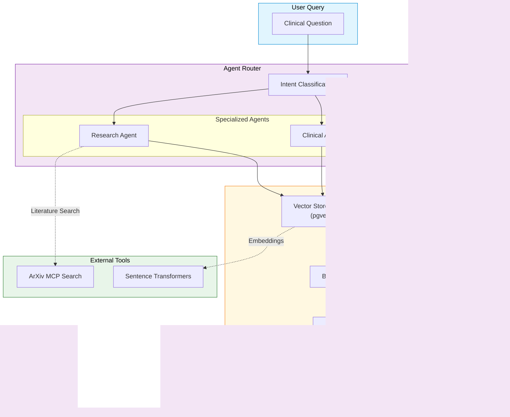

# Federated Pneumonia Detection System

[](https://www.python.org/downloads/)
[](https://pytorchlightning.ai/)
[](https://flower.dev/)
[](https://fastapi.tiangolo.com/)
[](https://react.dev/)
[](LICENSE)

> **Privacy-Preserving Medical AI for Multi-Institutional Collaboration**

---

## The Problem

Pneumonia is a lung infection that can quickly reduce oxygen levels and become life-threatening, especially for older adults and children. Early detection is critical — every hour influences outcomes.

Chest X-rays can reveal it early. But radiologists are limited in number and unevenly distributed across regions. Computer vision models can scale expert-level screening — they learn pneumonia patterns and support clinicians with fast, consistent, repeatable assistance.

The catch: **the best medical data is locked behind strict privacy boundaries.** Hospital data is protected by HIPAA, GDPR, and institutional governance. You can't just pool it centrally.

---

## The Solution

**Federated learning with FedAvg.** Each hospital trains locally, keeps patient records on-site, and shares only model weight updates. A central server aggregates these updates into a stronger global model — without any raw data ever leaving the institution.

This project builds that system end-to-end: a privacy-preserving training pipeline, a real-time monitoring dashboard, clinical inference with explainability (Grad-CAM), and an AI research assistant — all in one platform.

---

## System Architecture


The system follows a strict **N-layer Clean Architecture** — API never touches the database directly, the Control layer owns all business logic, and the Entities layer is framework-agnostic:


| Layer | Purpose | Key Components |
|-------|---------|----------------|
| **API** | HTTP/WebSocket entry points | FastAPI routers, middleware, schemas |
| **Control** | Business logic orchestration | Trainers, AnalyticsFacade, AgenticSystem |
| **Boundary** | External interface adapters | SQLAlchemy CRUD, Vector DB queries |
| **Entities** | Pure domain models | ResNet model, XRay dataset, config |
| **Internals** | Cross-cutting utilities | Transforms, logging, constants |

---

## Two Training Modes, One Codebase

A core design decision: the federated client **reuses the same `CentralizedTrainer` pipeline** rather than duplicating training logic. Each Flower client is just a `CentralizedTrainer` scoped to its local data partition. This means:

- Bugs fixed in the centralized pipeline automatically benefit federated clients
- Metrics collection, callbacks, and checkpointing behave identically in both modes
- The `is_federated` flag on `MetricsCollectorCallback` is the only divergence point


The `ConfigurableFedAvg` strategy extends standard FedAvg with weighted aggregation by client example counts, real-time WebSocket broadcasting after each round, and direct database persistence — so the dashboard reflects federated progress in the same format as centralized training.

### Data Distribution Strategies

Federated training supports three partitioning strategies to simulate realistic hospital scenarios:

| Strategy | Description | When to Use |
|----------|-------------|-------------|
| `iid` | Uniform random splits | Baseline comparison |
| `non-iid` | Patient-based splits with class skew | Realistic hospital variation |
| `stratified` | Balanced class distribution per client | Controlled experiments |

---

## The DL Module as an Experimental Platform

The `dl_model` control module was deliberately designed to be **purely experimental** — every hyperparameter, architecture choice, and training behavior is driven by `default_config.yaml`. Nothing is hardcoded.

This was a deliberate choice for reproducibility: given the same config file, you get the exact same model, the same data splits (seeded), the same callback thresholds, and the same optimizer schedule. Experiments can be diff'd by config alone.

```yaml
system:
  img_size: [256, 256]
  batch_size: 32
  validation_split: 0.20
  seed: 42

experiment:
  learning_rate: 0.0015
  epochs: 15
  num_rounds: 15          # Federated rounds
  num_clients: 5          # Federated clients
  clients_per_round: 3
  partition_strategy: "non-iid"  # iid | non-iid | stratified
  optimizer_type: "adamw"
  scheduler_type: "cosine"
  early_stopping_patience: 5

monitoring:
  wandb_enabled: true
  tensorboard_enabled: true
```

The model itself is a ResNet50 backbone with a custom classification head, trained with progressive unfreezing — backbone layers are frozen early, then gradually released across four scheduled checkpoints at 15%, 35%, 55%, and 75% of total epochs. This prevents catastrophic forgetting of pretrained ImageNet features while still allowing domain adaptation.

---

## Real-Time Experiment Flow

Every training run — centralized or federated — streams metrics to the dashboard over WebSocket, persists epoch data to PostgreSQL, and tracks the full experiment in Weights & Biases.


---

## Monitoring & Observability

Monitoring is not an afterthought — it's a first-class concern. Two independent observability stacks run in parallel:

### Weights & Biases

Every training run logs loss curves, accuracy, recall, precision, and F1 per epoch. Confusion matrices and Grad-CAM visualizations are logged as media artifacts. The system monitor tracks GPU/CPU utilization and memory throughout training.

| Feature | Capability |
|---------|------------|
| Metrics Tracking | Loss, accuracy, recall, precision per epoch |
| Media Logging | Confusion matrices, Grad-CAM visualizations |
| Hyperparameter Sweeps | Automated hyperparameter optimization |
| System Monitoring | GPU/CPU utilization, memory usage |

**Batch-level metrics streaming:**


**Single run metrics dashboard:**


**System resource monitoring:**


### LangSmith — AI Agent Observability

Every AI research assistant interaction is traced end-to-end: the full conversation flow, retrieval steps, reranking decisions, and LLM generation are all captured with token counts and latency. Automated hallucination detection runs on a 25% sample of responses.

| Feature | Capability |
|---------|------------|
| Trace Visualization | Full conversation flow with token usage |
| Hallucination Detection | Automated evaluation (25% sampling) |
| Performance Metrics | Latency, token count, cost tracking |
| Feedback Loops | Answer relevance scoring |

**Agent trace visualization:**


**Training dynamics captured through the agent pipeline:**


---

## AI Research Assistant

Beyond training, the system includes a RAG-powered chat interface for clinical literature queries. Questions are routed to specialized agents, retrieved against a pgvector store of indexed papers, reranked with BM25 + semantic scoring, and answered with full source attribution.



---

## Quick Start

### Prerequisites

| Component | Version | Check |
|-----------|---------|-------|
| Python | 3.12+ | `python --version` |
| uv | latest | `uv --version` |
| Node.js | 20+ | `node --version` |
| PostgreSQL | 14+ | `psql --version` |
| CUDA (optional) | 12.0+ | `nvidia-smi` |

### Installation

```bash
# Clone repository
git clone <repository-url>
cd FYP2

# Install Python dependencies
uv sync

# Install frontend dependencies
cd xray-vision-ai-forge && npm install && cd ..

# Configure environment
cp .env.example .env
# Edit .env with your database credentials
```

### Launch System

```bash
# One-command launch (PowerShell)
.\scripts\start.ps1

# Or manually - Backend
uv run uvicorn federated_pneumonia_detection.src.api.main:app --reload --host 127.0.0.1 --port 8001

# Or manually - Frontend
cd xray-vision-ai-forge && npm run dev
```

**Access Points:**
- Dashboard: http://localhost:5173
- API Docs: http://127.0.0.1:8001/docs
- WebSocket: ws://localhost:8765

---

## Usage

### Centralized Training

```python
from federated_pneumonia_detection.src.control.dl_model.centralized_trainer import CentralizedTrainer

trainer = CentralizedTrainer(
    config_path="federated_pneumonia_detection/config/default_config.yaml"
)
results = trainer.train(
    source_path="path/to/dataset.zip",
    experiment_name="baseline_centralized"
)
print(f"Best F1: {results['best_model_score']:.4f}")
```

### Federated Training

```python
from federated_pneumonia_detection.src.control.federated_learning.federated_trainer import FederatedTrainer

trainer = FederatedTrainer(partition_strategy="non-iid")
results = trainer.train(
    source_path="path/to/dataset.zip",
    experiment_name="federated_hospitals"
)
print(f"Rounds: {results['num_rounds']}, Clients: {results['num_clients']}")
```

### AI Research Assistant

```python
import requests

response = requests.post("http://localhost:8001/api/v1/chat/stream", json={
    "message": "What are the latest findings on pneumonia detection using deep learning?",
    "session_id": "research-session-1"
})

for chunk in response.iter_content():
    print(chunk.decode(), end="")
```

---

## Testing

```bash
# Backend tests
pytest                                          # All tests
pytest --cov=federated_pneumonia_detection      # With coverage
pytest tests/unit/                              # Component tests
pytest tests/integration/                       # End-to-end workflows

# Frontend tests
cd xray-vision-ai-forge
npm run test                                    # Unit tests
npm run test:coverage                           # With coverage
```

---

## Technology Stack

### Backend
| Category | Technologies |
|----------|--------------|
| **Deep Learning** | PyTorch, PyTorch Lightning, TorchVision |
| **Federated Learning** | Flower (flwr), flwr-datasets |
| **API Framework** | FastAPI, Uvicorn, WebSockets |
| **Database** | SQLAlchemy 2.0, PostgreSQL, pgvector |
| **AI/LLM** | LangChain, LangGraph, Google Generative AI |
| **Experiment Tracking** | Weights & Biases, TensorBoard, LangSmith |
| **Data Science** | NumPy, Pandas, Matplotlib, Seaborn |

### Frontend
| Category | Technologies |
|----------|--------------|
| **Framework** | React 18, Vite, TypeScript |
| **Styling** | Tailwind CSS, Shadcn UI, Radix Primitives |
| **State Management** | React Query, React Context |
| **Visualization** | Recharts, Framer Motion |
| **Testing** | Vitest, React Testing Library |

---

## Project Structure

```
FYP2/
├── federated_pneumonia_detection/    # Backend Python package
│   ├── src/
│   │   ├── api/                      # FastAPI entry points
│   │   ├── control/                  # Business logic
│   │   │   ├── dl_model/             # Centralized training (experimental platform)
│   │   │   ├── federated_new_version/# Federated learning (reuses dl_model)
│   │   │   ├── analytics/            # Analytics services
│   │   │   └── agentic_systems/      # AI chat & RAG
│   │   ├── boundary/                 # Database access
│   │   ├── entities/                 # Domain models
│   │   └── internals/                # Utilities
│   ├── config/                       # YAML configurations
│   └── tests/                        # Test suites
├── xray-vision-ai-forge/             # React frontend
│   ├── src/
│   │   ├── components/               # React components
│   │   ├── services/                 # API/WebSocket clients
│   │   └── types/                    # TypeScript definitions
│   └── package.json
├── docs/                             # Documentation & monitoring screenshots
├── scripts/                          # Orchestration scripts
├── alembic/                          # Database migrations
└── docker/                           # Container configurations
```

---

## Security & Privacy

| Feature | Implementation |
|---------|----------------|
| **Input Validation** | Pydantic schemas for all API inputs |
| **Prompt Injection Detection** | MaliciousPromptMiddleware for AI endpoints |
| **Error Sanitization** | Structured error responses without stack traces |
| **Request Tracing** | X-Request-ID middleware for audit trails |
| **Data Privacy** | Federated learning — raw data never leaves clients |

---

## Documentation

| Document | Description |
|----------|-------------|
| [AGENTS.md](AGENTS.md) | AI agent entry point and system overview |
| [docs/INDEX.md](docs/INDEX.md) | Complete documentation index |
| [docs/architecture/INTEGRATION.md](docs/architecture/INTEGRATION.md) | System integration map |
| [docs/operations/ANALYTICS_API.md](docs/operations/ANALYTICS_API.md) | Analytics API reference |
| [scripts/README.md](scripts/README.md) | Orchestration scripts guide |

---

## License

MIT License — see [LICENSE](LICENSE)

---

> **This is a research project for educational purposes.**
>
> For clinical deployment, consult medical professionals and ensure compliance with regulatory guidelines (FDA, HIPAA, GDPR). The system is not intended for direct patient diagnosis without proper validation and approval.
