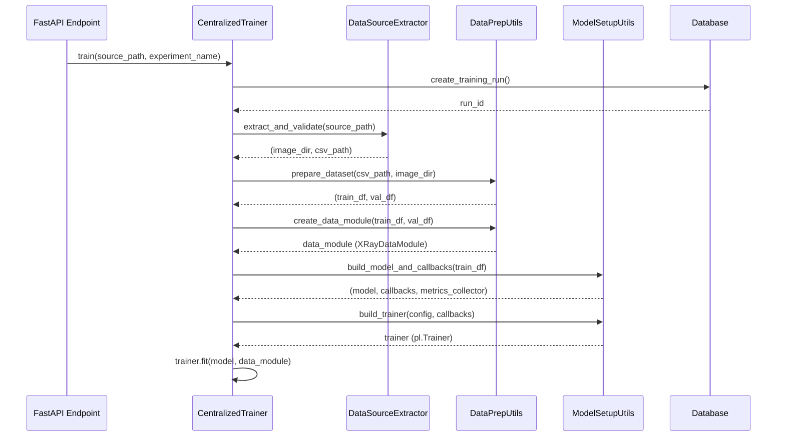
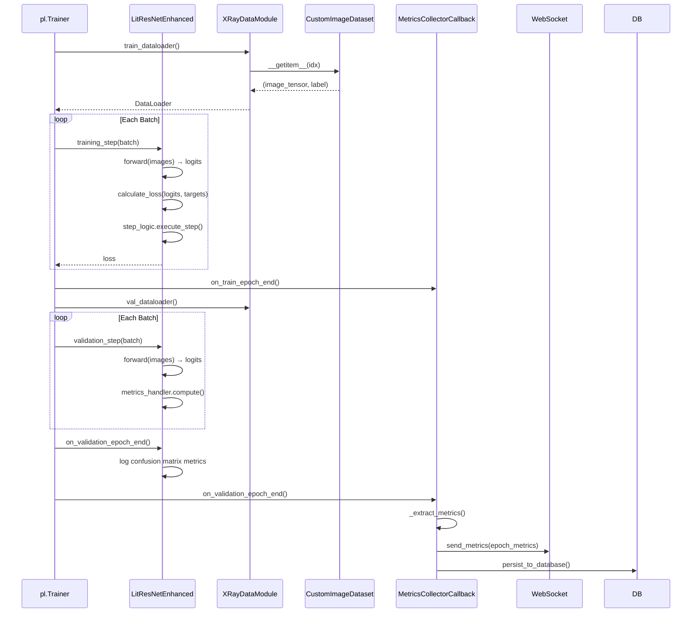

# CentralizedTrainer Architecture - Class Diagram

**Component**: `CentralizedTrainer` (Control Layer Orchestrator)  
**Domain**: Centralized Deep Learning Training Pipeline  
**Entry Point**: `centralized_trainer.py:25-160`

---

## Overview

The `CentralizedTrainer` is the main orchestrator for centralized pneumonia detection model training. It coordinates the complete training workflow from raw data (ZIP/directory) to a trained ResNet50 model with comprehensive logging, metrics collection, and real-time WebSocket streaming.

### Architecture Pattern: Clean Architecture (ECB)

```
┌─────────────────────────────────────────────────────────────────────────────┐
│  API Layer (FastAPI) - Entry Point                                          │
│  Delegates to CentralizedTrainer.train()                                    │
└─────────────────────────┬───────────────────────────────────────────────────┘
                          │ uses
┌─────────────────────────▼───────────────────────────────────────────────────┐
│  CONTROL LAYER - CentralizedTrainer (Orchestrator)                          │
│  • Coordinates data extraction, preparation, model building, training       │
│  • Manages training lifecycle (start → epochs → completion/failure)         │
│  • Integrates callbacks for checkpointing, metrics, early stopping          │
└─────────────────────────┬───────────────────────────────────────────────────┘
          │               │               │               │
          ▼               ▼               ▼               ▼
┌─────────────────┐ ┌─────────────┐ ┌─────────────┐ ┌─────────────────────┐
│  DataModule     │ │  Model      │ │  Callbacks  │ │  Database/Files     │
│  (XRayDataModule)│ │(LitResNet)  │ │  (8 types)  │ │  (Persistence)      │
└─────────────────┘ └─────────────┘ └─────────────┘ └─────────────────────┘
```

---

## Class Diagram

```mermaid
classDiagram
    %% Main Orchestrator
    class CentralizedTrainer {
        +str checkpoint_dir
        +str logs_dir
        +Logger logger
        +ConfigManager config
        +DataSourceExtractor data_source_extractor
        +__init__(config_path, checkpoint_dir, logs_dir)
        +train(source_path, experiment_name, csv_filename, run_id) Dict
        +get_training_status() Dict
        -_load_config(config_path) ConfigManager
    }

    %% Data Layer
    class DataSourceExtractor {
        +Logger logger
        +Path temp_extract_dir
        +extract_and_validate(source_path, csv_filename) Tuple
    }

    class XRayDataModule {
        +DataFrame train_df
        +DataFrame val_df
        +DataFrame test_df
        +Path image_dir
        +ConfigManager config
        +CustomImageDataset train_dataset
        +CustomImageDataset val_dataset
        +CustomImageDataset test_dataset
        +TransformBuilder transform_builder
        +__init__(train_df, val_df, config, image_dir)
        +setup(stage)
        +train_dataloader() DataLoader
        +val_dataloader() DataLoader
        +test_dataloader() DataLoader
    }

    class CustomImageDataset {
        +ndarray filenames
        +ndarray labels
        +ndarray valid_indices
        +Path image_dir
        +Callable transform
        +ConfigManager config
        +__init__(dataframe, image_dir, config, transform)
        +__getitem__(idx) Tuple
        +__len__() int
        +get_class_distribution() dict
        +get_memory_usage_estimate() dict
        +validate_all_images() Tuple
    }

    %% Model Layer
    class LitResNetEnhanced {
        +ResNetWithCustomHead model
        +ConfigManager config
        +MetricsHandler metrics_handler
        +StepLogic step_logic
        +LossFactory loss_factory
        +int num_classes
        +str monitor_metric
        +bool use_focal_loss
        +float focal_alpha
        +float focal_gamma
        +__init__(config, class_weights_tensor, use_focal_loss)
        +forward(x) Tensor
        +training_step(batch, batch_idx) Tensor
        +validation_step(batch, batch_idx) Tensor
        +test_step(batch, batch_idx) Tensor
        +configure_optimizers() Dict
        +progressive_unfreeze(layers_to_unfreeze)
        +freeze_backbone()
        +unfreeze_backbone()
    }

    class ResNetWithCustomHead {
        +nn.Module features
        +nn.Module classifier
        +ConfigManager config
        +int num_classes
        +float dropout_rate
        +int fine_tune_layers_count
        +ResNet50_Weights base_model_weights
        +__init__(config, num_classes, dropout_rate, fine_tune_layers_count)
        +forward(x) Tensor
        +freeze_backbone()
        +unfreeze_backbone()
        +set_dropout_rate(rate)
        +get_model_info() dict
        +get_feature_maps(x, layer_name) Tensor
        +_unfreeze_last_n_layers(n_layers)
    }

    %% Optimizer Layer
    class OptimizerFactory {
        +create_configuration(params, config, monitor_metric, use_cosine_scheduler) Dict
    }

    %% Callbacks Layer
    class CallbacksSetup {
        +prepare_trainer_and_callbacks_pl(train_df, config, checkpoint_dir) Dict
        +create_trainer_from_config(config, callbacks, is_federated) Trainer
        +compute_class_weights_for_pl(train_df, class_column) Tensor
    }

    class MetricsCollectorCallback {
        +Path save_dir
        +str experiment_name
        +int run_id
        +str training_mode
        +MetricsFilePersister file_persister
        +MetricsWebSocketSender ws_sender
        +List epoch_metrics
        +Dict metadata
        +on_train_start(trainer, pl_module)
        +on_train_epoch_end(trainer, pl_module)
        +on_validation_epoch_end(trainer, pl_module)
        +on_fit_end(trainer, pl_module)
        +persist_to_database(db)
        +_extract_metrics(trainer, pl_module, stage) Dict
    }

    class ProgressiveUnfreezeCallback {
        +List unfreeze_epochs
        +int layers_per_unfreeze
        +on_epoch_start(trainer, pl_module)
    }

    class ModelCheckpoint {
        +str dirpath
        +str filename
        +str monitor
        +str mode
        +int save_top_k
    }

    class EarlyStopping {
        +str monitor
        +str mode
        +int patience
        +float min_delta
    }

    %% Utility Functions (from centralized_trainer_utils)
    class ModelSetupUtils {
        +build_model_and_callbacks(train_df, config, checkpoint_dir, logs_dir, logger) Tuple
        +build_trainer(config, callbacks, logs_dir, experiment_name, logger) Trainer
    }

    class DataPrepUtils {
        +prepare_dataset(csv_path, image_dir, config, logger) Tuple
        +create_data_module(train_df, val_df, image_dir, config, logger) XRayDataModule
    }

    class DBOperationsUtils {
        +create_training_run(source_path, experiment_name, logger) int
        +complete_training_run(run_id, logger)
        +fail_training_run(run_id, logger)
    }

    class ResultsUtils {
        +collect_training_results(trainer, model, metrics_collector, logs_dir, checkpoint_dir, logger, run_id) Dict
    }

    %% Relationships
    CentralizedTrainer --> DataSourceExtractor : uses
    CentralizedTrainer --> DataPrepUtils : delegates to
    CentralizedTrainer --> ModelSetupUtils : delegates to
    CentralizedTrainer --> DBOperationsUtils : delegates to
    CentralizedTrainer --> ResultsUtils : delegates to

    DataPrepUtils --> XRayDataModule : creates
    XRayDataModule --> CustomImageDataset : creates/manages
    XRayDataModule --> TransformBuilder : uses

    ModelSetupUtils --> LitResNetEnhanced : creates
    ModelSetupUtils --> CallbacksSetup : uses
    ModelSetupUtils --> ProgressiveUnfreezeCallback : adds

    LitResNetEnhanced --> ResNetWithCustomHead : wraps
    LitResNetEnhanced --> OptimizerFactory : uses for configure_optimizers()
    LitResNetEnhanced --> MetricsHandler : uses
    LitResNetEnhanced --> StepLogic : uses

    CallbacksSetup --> MetricsCollectorCallback : creates
    CallbacksSetup --> ModelCheckpoint : creates
    CallbacksSetup --> EarlyStopping : creates
    CallbacksSetup --> MetricsWebSocketSender : creates/uses

    MetricsCollectorCallback --> MetricsFilePersister : uses
    MetricsCollectorCallback --> MetricsWebSocketSender : uses
    MetricsCollectorCallback --> run_crud : persists to DB
```



---

## Component Roles & Responsibilities

### 1. CentralizedTrainer (Orchestrator)

**File**: `centralized_trainer.py:25-160`

**Role**: Main entry point and workflow coordinator. Implements the **Facade Pattern** to simplify the complex training pipeline.

**Key Responsibilities**:
| Method | Lines | Purpose |
|--------|-------|---------|
| `__init__` | 31-51 | Initialize directories, config, logger, DataSourceExtractor |
| `train` | 53-131 | **Main workflow**: extract → prepare → create module → build model → train → collect results |
| `get_training_status` | 133-145 | Return current training configuration and state |
| `_load_config` | 147-159 | Load ConfigManager from path or use defaults |

**Workflow Steps** (train method):
1. **Create/Use Run** (72-75): Database run tracking
2. **Extract & Validate** (78-81): DataSourceExtractor handles ZIP/directory
3. **Prepare Dataset** (82-87): Split into train/val DataFrames
4. **Create DataModule** (88-94): XRayDataModule with DataLoaders
5. **Build Model & Callbacks** (95-103): LitResNetEnhanced + 8 callbacks
6. **Build Trainer** (104-110): PyTorch Lightning Trainer
7. **Execute Training** (111): `trainer.fit(model, data_module)`
8. **Complete & Collect** (113-125): Update DB run status, gather results
9. **Error Handling** (127-131): Fail run in DB on exception

---

### 2. Data Components

#### DataSourceExtractor
**File**: `internals/__init__.py:3` → `internals/data/data_source_extractor.py`

**Role**: Handles raw data ingestion from ZIP files or directories. Validates structure and extracts metadata.

**Key Methods**:
- `extract_and_validate(source_path, csv_filename)` → `(image_dir, csv_path)`

---

#### XRayDataModule
**File**: `internals/data/xray_data_module.py:30-238`

**Role**: **PyTorch Lightning DataModule** - manages the entire data pipeline including dataset creation, transforms, and DataLoader configuration.

**Key Responsibilities**:
| Method | Purpose |
|--------|---------|
| `__init__` | Store DataFrames, config, image_dir; setup transform builder |
| `setup(stage)` | Create train/val/test datasets with appropriate transforms |
| `train_dataloader()` | Return DataLoader with shuffling, augmentation |
| `val_dataloader()` | Return DataLoader without shuffling |
| `test_dataloader()` | Return DataLoader for test set |

**Configuration Parameters**:
- `color_mode`: "RGB" or "L" (grayscale)
- `pin_memory`: True if CUDA available
- `persistent_workers`: Based on num_workers
- `prefetch_factor`: DataLoader prefetching
- `validate_images_on_init`: Pre-validate image files

---

#### CustomImageDataset
**File**: `entities/custom_image_dataset.py:34-206`

**Role**: **PyTorch Dataset** - low-level data access with robust error handling.

**Key Responsibilities**:
- Load images on-demand (memory-efficient)
- Apply transforms (augmentation/normalization)
- Validate image files exist and are readable
- Handle corrupted images gracefully

**Internal Structure**:
```
CustomImageDataset
├── filenames: ndarray (all image filenames from DataFrame)
├── labels: ndarray (target values)
├── valid_indices: ndarray (indices of valid/loadable images)
├── image_dir: Path (root directory for images)
├── transform: Callable (torchvision transforms)
└── config: ConfigManager
```

**Why `valid_indices`?**: Some images may be corrupted or missing. The dataset filters these out at initialization, maintaining a mapping from "dataset index" to "DataFrame index".

---

### 3. Model Components

#### LitResNetEnhanced
**File**: `internals/model/lit_resnet_enhanced.py:28-182`

**Role**: **PyTorch Lightning Module** - wraps the neural network with training logic, loss computation, metrics, and optimization.

**Key Responsibilities**:
| Component | Purpose |
|-----------|---------|
| `model: ResNetWithCustomHead` | The actual neural network |
| `metrics_handler: MetricsHandler` | Computes accuracy, precision, recall, F1, AUROC |
| `step_logic: StepLogic` | Executes training/validation/test steps |
| `loss_factory: LossFactory` | Creates focal loss or weighted BCE loss |

**Training Hooks**:
- `training_step()`: Forward pass, loss computation, backward pass
- `validation_step()`: Forward pass, metrics computation
- `configure_optimizers()`: Returns optimizer + scheduler config
- `on_train_epoch_start()`: Log learning rate
- `on_validation_epoch_end()`: Log confusion matrix metrics

**Advanced Features**:
- **Progressive Unfreezing**: Gradually unfreeze backbone layers during training
- **Focal Loss**: Handles class imbalance better than BCE
- **Label Smoothing**: Regularization technique
- **Cosine Scheduler**: Learning rate annealing

---

#### ResNetWithCustomHead
**File**: `entities/resnet_with_custom_head.py:40-223`

**Role**: **Pure PyTorch nn.Module** - the actual neural network architecture. Lives in the **Entities layer** (no framework dependencies).

**Architecture**:
```
Input Image (3×256×256)
    ↓
ResNet50 Backbone (pretrained on ImageNet)
    ↓
Global Average Pooling
    ↓
Dense Layer (2048 → 512) + ReLU
    ↓
Dropout (configurable rate, default 0.5)
    ↓
Dense Layer (512 → 1) + Sigmoid
    ↓
Output (probability of pneumonia)
```

**Transfer Learning Support**:
- `freeze_backbone()`: Freeze all ResNet50 layers (train only head)
- `unfreeze_backbone()`: Unfreeze all layers
- `_unfreeze_last_n_layers(n)`: Progressive unfreezing (used by callbacks)
- `fine_tune_layers_count`: Configurable number of layers to fine-tune

---

#### OptimizerFactory
**File**: `internals/model/optimizers/factory.py:14-119`

**Role**: **Factory Pattern** - centralizes optimizer and scheduler creation logic.

**Supported Optimizers**:
| Type | Use Case |
|------|----------|
| AdamW | Default, good generalization |
| Adam | Alternative adaptive optimizer |
| SGD | With momentum, simpler |

**Supported Schedulers**:
| Type | Behavior |
|------|----------|
| CosineAnnealingWarmRestarts | Cyclical LR with warm restarts |
| ReduceLROnPlateau | Reduce LR when metric plateaus |

**Configuration Keys**:
- `experiment.optimizer_type`: "adamw", "adam", "sgd"
- `experiment.scheduler_type`: "cosine", "plateau"
- `experiment.learning_rate`: Base LR
- `experiment.weight_decay`: L2 regularization
- `experiment.use_cosine_scheduler`: Boolean flag

---

### 4. Callbacks System

#### CallbacksSetup (setup.py)
**File**: `internals/model/callbacks/setup.py:78-244`

**Role**: **Factory/Builder Pattern** - creates and configures all PyTorch Lightning callbacks.

**Callback Chain** (order matters):
| Index | Callback | Purpose |
|-------|----------|---------|
| 0 | `ModelCheckpoint` | Save best models by val_recall |
| 1 | `EarlyStopping` | Stop when val_recall stops improving |
| 2 | `EarlyStoppingSignalCallback` | Notify frontend via WebSocket |
| 3 | `LearningRateMonitor` | Log LR each epoch |
| 4 | `HighestValRecallCallback` | Track best recall value |
| 5 | `MetricsCollectorCallback` | Persist metrics to DB/files/WebSocket |
| 6 | `BatchMetricsCallback` | Real-time batch-level metrics |
| 7 | `GradientMonitorCallback` | Track gradient norms |

**Why Order Matters**: `EarlyStoppingSignalCallback` must come after `EarlyStopping` to detect when early stopping triggers.

---

#### MetricsCollectorCallback
**File**: `internals/model/collectors/metrics.py:20-510`

**Role**: **Observer Pattern** - collects, persists, and streams all training metrics.

**Multi-Channel Output**:
```
MetricsCollectorCallback
├── File Persister → JSON + CSV files
├── WebSocket Sender → Real-time frontend updates
└── Database CRUD → PostgreSQL persistence
```

**Key Lifecycle Hooks**:
| Hook | Action |
|------|--------|
| `on_train_start` | Create run in DB, send start event |
| `on_train_epoch_end` | Collect training metrics |
| `on_validation_epoch_end` | Collect validation metrics, send to WebSocket |
| `on_fit_end` | Save all metrics, send completion event |

**Federated Learning Support**:
- `client_id`: Track which client in FL
- `round_number`: Track FL round
- `federated_mode`: Different behavior for FL vs centralized

---

#### ProgressiveUnfreezeCallback
**File**: `internals/model/callbacks/progressive.py`

**Role**: Implements **progressive fine-tuning** - gradually unfreezes backbone layers during training.

**Mechanism**:
```python
unfreeze_epochs = [int(total_epochs * 0.15),  # Epoch 15% - unfreeze 4 layers
                   int(total_epochs * 0.35),  # Epoch 35% - unfreeze 4 more
                   int(total_epochs * 0.55),  # Epoch 55% - unfreeze 4 more
                   int(total_epochs * 0.75)]  # Epoch 75% - unfreeze all
```

**Benefits**: Prevents catastrophic forgetting of pretrained features early in training, then allows fine-tuning as training progresses.

---

### 5. Utility Modules (centralized_trainer_utils)

#### ModelSetupUtils (model_setup.py)
**Role**: Creates model and callbacks with all dependencies injected.

**Key Function**:
```python
build_model_and_callbacks(train_df, config, checkpoint_dir, logs_dir, logger, 
                          experiment_name, run_id, is_federated, client_id, 
                          round_number) -> (model, callbacks, metrics_collector)
```

---

#### DataPrepUtils (data_prep.py)
**Role**: Data preparation pipeline.

**Key Functions**:
| Function | Purpose |
|----------|---------|
| `prepare_dataset(csv_path, image_dir, config, logger)` | Load CSV, create train/val split |
| `create_data_module(train_df, val_df, image_dir, config, logger)` | Create XRayDataModule |

---

#### DBOperationsUtils (db_operations.py)
**Role**: Database lifecycle management for training runs.

**Key Functions**:
| Function | Purpose |
|----------|---------|
| `create_training_run(source_path, experiment_name, logger)` | Create DB run record, return run_id |
| `complete_training_run(run_id, logger)` | Mark run as completed |
| `fail_training_run(run_id, logger)` | Mark run as failed |

---

#### ResultsUtils (results.py)
**Role**: Collects and packages training results.

**Key Function**:
```python
collect_training_results(trainer, model, metrics_collector, logs_dir, 
                         checkpoint_dir, logger, run_id) -> Dict[str, Any]
```

**Returns**:
- Best model path
- Best validation recall score
- Total epochs run
- All collected metrics
- Training duration

---

## Data Flow

### Training Initialization Flow



### Epoch Training Flow



---

## Configuration Integration

The entire pipeline is driven by `ConfigManager` (YAML-based configuration).

**Key Configuration Sections**:

| Section | Key Parameters | Used By |
|---------|---------------|---------|
| `system` | `img_size`, `batch_size`, `num_workers`, `seed` | DataModule, DataLoader |
| `experiment` | `epochs`, `learning_rate`, `dropout_rate`, `optimizer_type`, `scheduler_type` | Model, OptimizerFactory |
| `experiment` | `early_stopping_patience`, `validation_split` | Callbacks, DataPrep |
| `columns` | `filename`, `target` | CustomImageDataset |
| `model` | `architecture`, `pretrained`, `fine_tune_layers_count` | ResNetWithCustomHead |

---

## File Reference

| Layer | File | Key Lines | Role |
|-------|------|-----------|------|
| **Control** | `centralized_trainer.py` | 25-160 | Main orchestrator |
| **Control** | `centralized_trainer_utils/__init__.py` | 1-18 | Public API exports |
| **Control** | `centralized_trainer_utils/model_setup.py` | 24-106 | Model & callbacks builder |
| **Control** | `centralized_trainer_utils/data_prep.py` | 18-83 | Data preparation |
| **Control** | `internals/data/xray_data_module.py` | 30-238 | DataModule implementation |
| **Control** | `internals/model/lit_resnet_enhanced.py` | 28-182 | Lightning module |
| **Control** | `internals/model/callbacks/setup.py` | 78-244 | Callback factory |
| **Control** | `internals/model/optimizers/factory.py` | 14-119 | Optimizer factory |
| **Control** | `internals/model/collectors/metrics.py` | 20-510 | Metrics collection |
| **Entities** | `entities/custom_image_dataset.py` | 34-206 | PyTorch Dataset |
| **Entities** | `entities/resnet_with_custom_head.py` | 40-223 | Neural network architecture |
| **Internals** | `internals/data/data_source_extractor.py` | - | Data extraction |
| **Internals** | `internals/image_transforms.py` | - | Transform pipelines |

---

## Related Documentation

- **Control Layer Guide**: [`src/control/AGENTS.md`](../../../src/control/AGENTS.md)
- **Entities Layer**: [`src/entities/CLAUDE.md`](../../../src/entities/CLAUDE.md)
- **Data Flow**: [`docs/data_flow/sequence_diagrams/training/training_pipeline.md`](../../data_flow/sequence_diagrams/training/training_pipeline.md) (if exists)
- **Configuration**: [`config/README.md`](../../../config/README.md)
