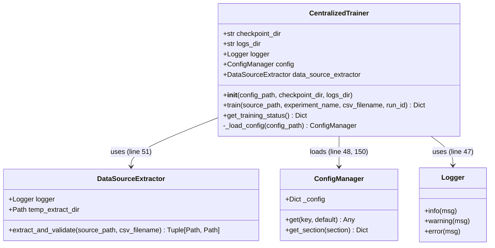
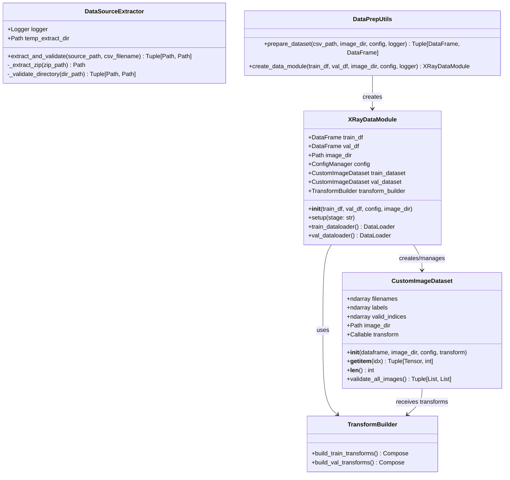
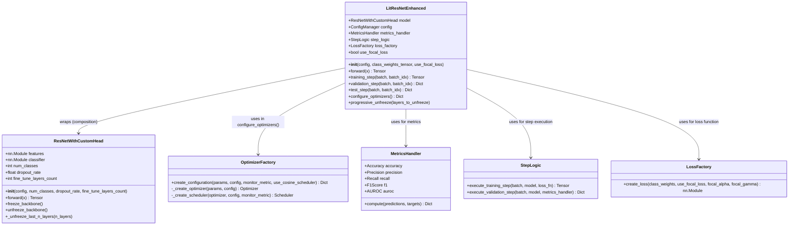
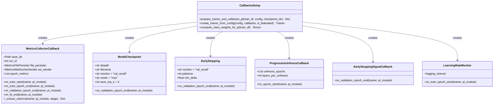
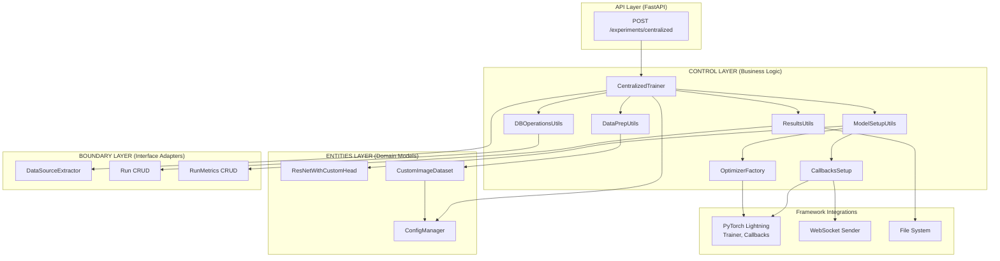

# CentralizedTrainer Architecture - Chunked Class Diagrams

**Component**: `CentralizedTrainer` Training Pipeline  
**Domain**: Centralized Deep Learning for Pneumonia Detection  
**Entry Point**: `centralized_trainer.py:25-160`

---

## Chunk 1: Main Orchestrator & Entry Point

**Focus**: The `CentralizedTrainer` class and its immediate collaborators



### CentralizedTrainer Role

**File**: `centralized_trainer.py:25-160`

**Purpose**: **Facade Pattern** - Simplifies the complex training pipeline by providing a single `train()` method that orchestrates 9 distinct steps.

**Key Workflow** (train method, lines 53-131):

| Step | Line | Action | Delegates To |
|------|------|--------|--------------|
| 1 | 72-75 | Create/Use training run | `create_training_run()` |
| 2 | 78-81 | Extract & validate data source | `DataSourceExtractor` |
| 3 | 82-87 | Prepare train/val splits | `prepare_dataset()` |
| 4 | 88-94 | Create DataModule | `create_data_module()` |
| 5 | 95-103 | Build model + callbacks | `build_model_and_callbacks()` |
| 6 | 104-110 | Build PyTorch Lightning Trainer | `build_trainer()` |
| 7 | 111 | Execute training | `trainer.fit()` |
| 8 | 113-114 | Mark run complete | `complete_training_run()` |
| 9 | 116-125 | Collect & return results | `collect_training_results()` |

**Error Handling** (lines 127-131): Any exception triggers `fail_training_run()` to update database status before re-raising.

---

## Chunk 2: Data Layer - From Files to Tensors

**Focus**: Data extraction, dataset creation, and DataModule management



### Data Layer Roles

| Component | File | Role |
|-----------|------|------|
| **DataSourceExtractor** | `internals/data/data_source_extractor.py` | Handles ZIP extraction and directory validation. Returns `(image_dir, csv_path)`. |
| **DataPrepUtils** | `centralized_trainer_utils/data_prep.py` | Orchestrates data splitting and DataModule creation. |
| **XRayDataModule** | `internals/data/xray_data_module.py:30-238` | **PyTorch Lightning DataModule**. Manages dataset lifecycle and DataLoader configuration. |
| **CustomImageDataset** | `entities/custom_image_dataset.py:34-206` | **PyTorch Dataset**. Low-level data access with corruption handling. |
| **TransformBuilder** | `internals/image_transforms.py` | Creates augmentation pipelines (rotation, flip, normalize). |

**Why `valid_indices` in CustomImageDataset?**
- Some images may be corrupted or missing
- Dataset filters these at initialization
- Maintains mapping: "dataset index" → "DataFrame index"
- Prevents training crashes from bad files

---

## Chunk 3: Model Layer - Neural Network & Training Logic

**Focus**: Model architecture, Lightning module, and optimization



### Model Layer Roles

| Component | File | Role |
|-----------|------|------|
| **LitResNetEnhanced** | `internals/model/lit_resnet_enhanced.py:28-182` | **PyTorch Lightning Module**. Wraps the neural network with training logic, loss computation, and metrics. |
| **ResNetWithCustomHead** | `entities/resnet_with_custom_head.py:40-223` | **Pure PyTorch nn.Module**. The actual neural network. Lives in Entities layer (no framework deps). |
| **OptimizerFactory** | `internals/model/optimizers/factory.py:14-119` | **Factory Pattern**. Creates optimizer + scheduler based on config. |
| **MetricsHandler** | `internals/model/utils/metrics_handler.py` | Computes accuracy, precision, recall, F1, AUROC using torchmetrics. |
| **StepLogic** | `internals/model/utils/step_logic.py` | Encapsulates training/validation step execution logic. |
| **LossFactory** | `internals/model/utils/loss_factory.py` | Creates focal loss or weighted BCE loss. |

**Architecture Flow**:
```
Input (3×256×256)
    ↓
ResNet50 Backbone (pretrained)
    ↓
Global Average Pooling
    ↓
Dense (2048→512) + ReLU
    ↓
Dropout (0.5)
    ↓
Dense (512→1) + Sigmoid
    ↓
Output (pneumonia probability)
```

**Transfer Learning Support**:
- `freeze_backbone()`: Train only classification head
- `unfreeze_backbone()`: Fine-tune entire network
- `progressive_unfreeze()`: Gradually unfreeze layers during training

---

## Chunk 4: Callbacks System - Training Lifecycle Hooks

**Focus**: Callbacks that hook into the training loop for checkpointing, metrics, and monitoring



### Callbacks Chain (Order Matters!)

**File**: `internals/model/callbacks/setup.py:78-244`

| Index | Callback | Purpose | Trigger |
|-------|----------|---------|---------|
| 0 | `ModelCheckpoint` | Save best 3 models by `val_recall` | After validation |
| 1 | `EarlyStopping` | Stop training if no improvement for N epochs | After validation |
| 2 | `EarlyStoppingSignalCallback` | Notify frontend via WebSocket | After early stopping |
| 3 | `LearningRateMonitor` | Log learning rate each epoch | Epoch start |
| 4 | `HighestValRecallCallback` | Track best recall value | After validation |
| 5 | `MetricsCollectorCallback` | Persist metrics to DB/files/WebSocket | Epoch end |
| 6 | `BatchMetricsCallback` | Real-time batch-level metrics | Each batch |
| 7 | `GradientMonitorCallback` | Track gradient norms | After backward |

### MetricsCollectorCallback Details

**File**: `internals/model/collectors/metrics.py:20-510`

**Multi-Channel Output**:
```
┌─────────────────────────────────────┐
│  MetricsCollectorCallback           │
├─────────────────────────────────────┤
│  ┌──────────────┐  ┌──────────────┐ │
│  │ File Persister│  │ WebSocket    │ │
│  │ • JSON        │  │ • Real-time  │ │
│  │ • CSV         │  │   streaming  │ │
│  └──────────────┘  └──────────────┘ │
│  ┌──────────────┐                   │
│  │ Database CRUD │                  │
│  │ • run_metrics │                  │
│  │ • run table   │                  │
│  └──────────────┘                   │
└─────────────────────────────────────┘
```

**Key Lifecycle Hooks**:
- `on_train_start`: Create DB run record, send start event
- `on_train_epoch_end`: Collect training loss/accuracy
- `on_validation_epoch_end`: Collect val metrics, send WebSocket update
- `on_fit_end`: Save all metrics, send completion event

---

## Chunk 5: Utility Modules - Helper Functions

**Focus**: The utility functions that CentralizedTrainer delegates to

```mermaid
classDiagram
    class ModelSetupUtils {
        +build_model_and_callbacks(train_df, config, checkpoint_dir, logs_dir, logger, experiment_name, run_id) Tuple
        +build_trainer(config, callbacks, logs_dir, experiment_name, logger) Trainer
    }

    class DataPrepUtils {
        +prepare_dataset(csv_path, image_dir, config, logger) Tuple[DataFrame, DataFrame]
        +create_data_module(train_df, val_df, image_dir, config, logger) XRayDataModule
    }

    class DBOperationsUtils {
        +create_training_run(source_path, experiment_name, logger) int
        +complete_training_run(run_id, logger)
        +fail_training_run(run_id, logger)
    }

    class ResultsUtils {
        +collect_training_results(trainer, model, metrics_collector, logs_dir, checkpoint_dir, logger, run_id) Dict
    }

    class MetricsFilePersister {
        +save_metrics_to_json(metrics, path)
        +save_metrics_to_csv(metrics, path)
    }

    class MetricsWebSocketSender {
        +send_metrics(metrics)
        +send_training_complete()
        +send_training_failed(error)
    }

    ModelSetupUtils --> CallbacksSetup : uses
    ModelSetupUtils --> LitResNetEnhanced : creates
    ResultsUtils --> MetricsFilePersister : uses
    MetricsCollectorCallback --> MetricsFilePersister : uses
    MetricsCollectorCallback --> MetricsWebSocketSender : uses
```



### Utility Roles

| Module | File | Key Functions | Purpose |
|--------|------|---------------|---------|
| **ModelSetupUtils** | `centralized_trainer_utils/model_setup.py:24-106` | `build_model_and_callbacks()`, `build_trainer()` | Creates model with all callbacks and trainer |
| **DataPrepUtils** | `centralized_trainer_utils/data_prep.py:18-83` | `prepare_dataset()`, `create_data_module()` | Data splitting and DataModule creation |
| **DBOperationsUtils** | `centralized_trainer_utils/db_operations.py` | `create_training_run()`, `complete_training_run()`, `fail_training_run()` | Database lifecycle management |
| **ResultsUtils** | `centralized_trainer_utils/results.py` | `collect_training_results()` | Packages training results into dictionary |
| **MetricsFilePersister** | `internals/data/metrics_file_persister.py` | `save_metrics_to_json()`, `save_metrics_to_csv()` | File-based metrics persistence |
| **MetricsWebSocketSender** | `internals/data/websocket_metrics_sender.py` | `send_metrics()`, `send_training_complete()` | Real-time frontend updates |

---

## Chunk 6: Complete Architecture Overview

**Focus**: How all chunks connect together in the Clean Architecture pattern



### Clean Architecture (ECB) Mapping

| Layer | Components in This Pipeline |
|-------|----------------------------|
| **API** | FastAPI endpoint calls `CentralizedTrainer.train()` |
| **Control** | `CentralizedTrainer`, all `*Utils` modules, `CallbacksSetup`, `OptimizerFactory` |
| **Entities** | `ResNetWithCustomHead`, `CustomImageDataset`, `ConfigManager` (pure domain) |
| **Boundary** | `DataSourceExtractor`, Database CRUD operations, `MetricsFilePersister` |

**Dependency Rule**: Dependencies point inward. Control depends on Entities and Boundary interfaces, not concrete implementations.

---

## File Reference Summary

| Chunk | Primary File | Supporting Files |
|-------|-------------|------------------|
| **1 - Orchestrator** | `centralized_trainer.py:25-160` | `centralized_trainer_utils/__init__.py` |
| **2 - Data Layer** | `internals/data/xray_data_module.py` | `entities/custom_image_dataset.py`, `internals/data/data_source_extractor.py`, `centralized_trainer_utils/data_prep.py` |
| **3 - Model Layer** | `internals/model/lit_resnet_enhanced.py` | `entities/resnet_with_custom_head.py`, `internals/model/optimizers/factory.py` |
| **4 - Callbacks** | `internals/model/callbacks/setup.py` | `internals/model/collectors/metrics.py`, `internals/model/callbacks/progressive.py` |
| **5 - Utilities** | `centralized_trainer_utils/*.py` | `internals/data/metrics_file_persister.py`, `internals/data/websocket_metrics_sender.py` |

---

## Related Documentation

- **Control Layer Guide**: [`src/control/AGENTS.md`](../../../src/control/AGENTS.md)
- **Full Class Diagram** (single page): [`centralized_trainer.md`](./centralized_trainer.md)
- **Entities Layer**: [`src/entities/README.md`](../../../src/entities/README.md)
