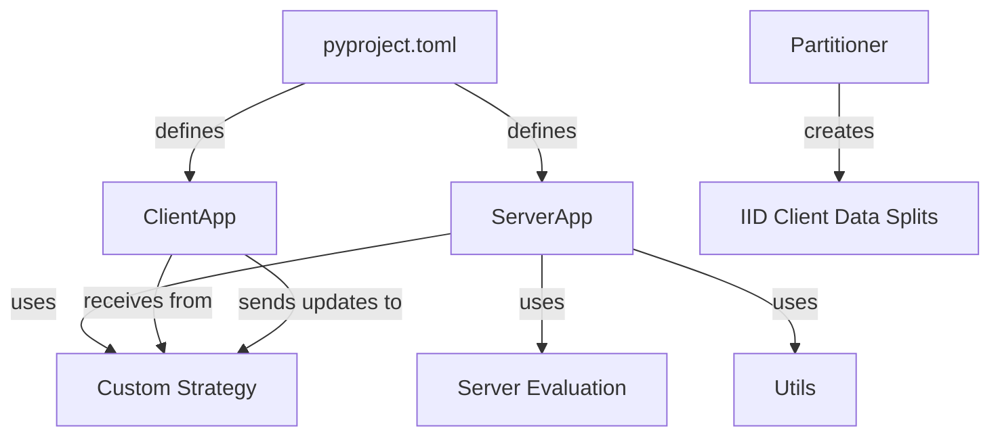
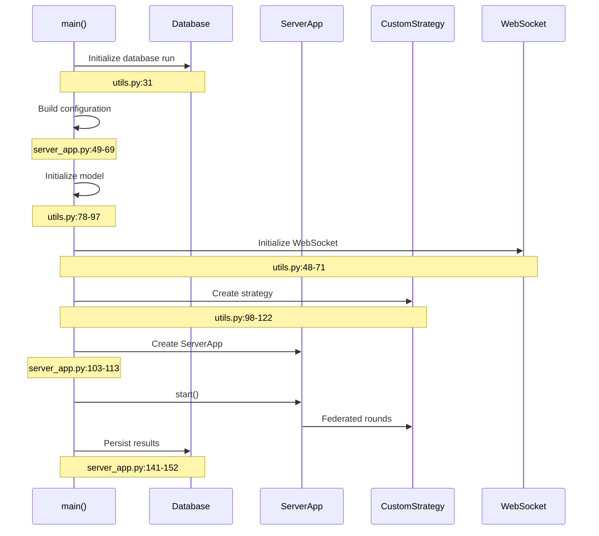
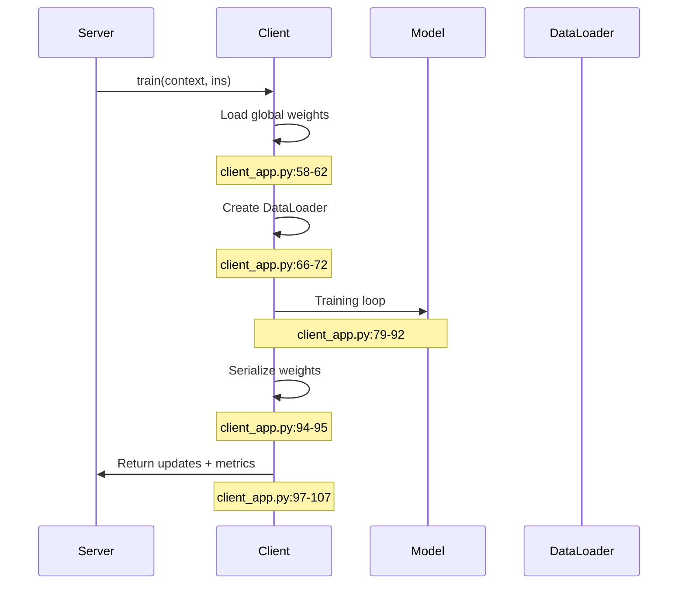
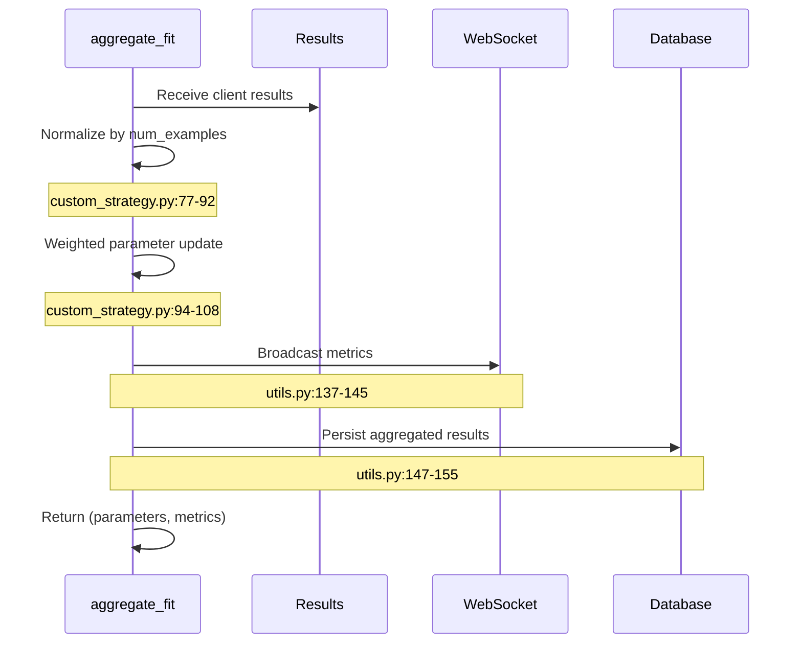
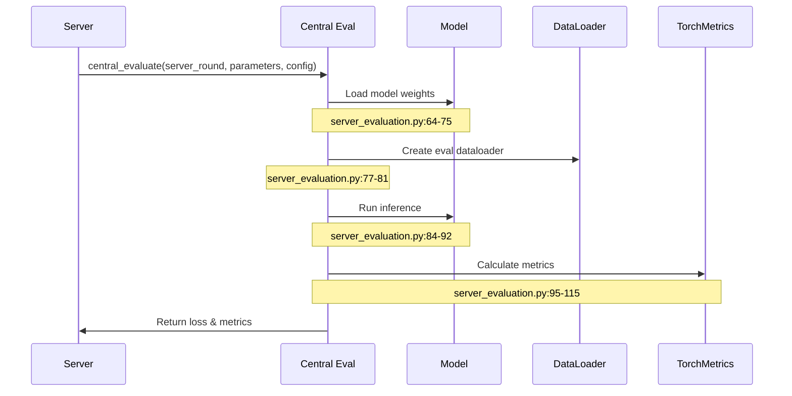

# Federated Learning New Version

**Location**: `federated_pneumonia_detection/src/control/federated_new_version/`

This directory contains the modern Flower-based federated learning implementation with improved architecture and modular design.

---

## Architecture Overview



---

## Core Components

### 1. Server App (`core/server_app.py`)

**Purpose**: Orchestrates the federated server lifecycle.

**Key Functions**:

| Function | Lines | Description |
|----------|-------|-------------|
| `main()` | 36-155 | Main server entry point, coordinates all components |
| `_set_run_id()` | 161-194 | Sets unique run ID for database persistence |

**Main Flow**:



**Key Code**:
```python
# server_app.py:36-155
app = utils.initialize_database_and_get_config()
config = app.state.config
# ... build server_config, model, strategy
server_app = ServerApp(server_config=server_config)
server_app.start()
# Persist results after completion
```

---

### 2. Client App (`core/client_app.py`)

**Purpose**: Handles local training and evaluation on each client.

**Key Functions**:

| Function | Lines | Description |
|----------|-------|-------------|
| `train()` | 37-107 | Local training with global weight loading |
| `evaluate()` | 110-148 | Local evaluation with metrics calculation |

**Training Flow**:



**Key Code**:
```python
# client_app.py:58-62
from_numpy = parameters_to_ndarrays(ins.parameters)
state_dict = {k: torch.from_numpy(v) for k, v in from_numpy.items()}
model.load_state_dict(state_dict)

# client_app.py:79-92
for images, labels in trainloader:
    images, labels = images.to(device), labels.to(device)
    optimizer.zero_grad()
    outputs = model(images)
    loss = criterion(outputs, labels)
    loss.backward()
    optimizer.step()
```

---

### 3. Custom Strategy (`core/custom_strategy.py`)

**Purpose**: Custom FedAvg with WebSocket broadcasting and metrics persistence.

**Key Class**: `ConfigurableFedAvg`

**Features**:
- Config passing to server
- Weighted aggregation by client example counts
- Metrics broadcasting via WebSocket
- Database persistence

**Aggregation Flow**:



**Key Code**:
```python
# custom_strategy.py:77-92
num_examples_total = sum([fit_res.num_examples for _, fit_res in results])
num_examples_clients = [fit_res.num_examples for _, fit_res in results]
scaling_factors = [num_examples / num_examples_total for num_examples in num_examples_clients]

# custom_strategy.py:94-108
weighted_weights = []
for i, scaling_factor in enumerate(scaling_factors):
    client_weights = parameters_to_ndarrays(results[i][1].parameters)
    weighted = [layer * scaling_factor for layer in client_weights]
    weighted_weights.append(weighted)

weights_prime: NDArrays = [reduce(np.add, layer_updates) for layer_updates in zip(*weighted_weights)]
```

---

### 4. Server Evaluation (`core/server_evaluation.py`)

**Purpose**: Factory function for centralized server-side evaluation.

**Function**: `create_central_evaluate_fn()`

**Flow**:



**Key Code**:
```python
# server_evaluation.py:64-75
model = model.to(device)
state_dict = {k: torch.from_numpy(v) for k, v in ndarrays_to_state_dict(parameters).items()}
model.load_state_dict(state_dict)

# server_evaluation.py:95-115
metrics = {
    'accuracy': Accuracy(task="binary").to(device),
    'precision': Precision(task="binary").to(device),
    'recall': Recall(task="binary").to(device),
    'f1_score': F1Score(task="binary").to(device),
    'specificity': Specificity(task="binary").to(device)
}
```

---

### 5. Partitioner (`partioner.py`)

**Purpose**: Creates IID data splits across federated clients.

**Class**: `CustomPartitioner`

**Key Code**:
```python
# partioner.py:45-54
def load_partition(self, partition_id: int) -> Dataset:
    partition_size = len(self.dataset) // self._num_partitions
    return Subset(self.dataset, range(partition_id * partition_size, (partition_id + 1) * partition_size))
```

---

### 6. Utilities (`core/utils.py`)

**Helper Functions**:

| Function | Lines | Description |
|----------|-------|-------------|
| `initialize_database_and_get_config()` | 31 | Creates DB run, returns FastAPI app |
| `initialize_websocket()` | 48-71 | Sets up WebSocket manager for metrics broadcast |
| `build_model()` | 78-97 | Creates model, loads weights, freezes backbone |
| `build_strategy()` | 98-122 | Configures ConfigurableFedAvg strategy |
| `convert_and_persist_results()` | 147-155 | Saves aggregated metrics to database |

**Key Code**:
```python
# utils.py:48-71
def initialize_websocket(config):
    ws_manager = WebSocketManager.get_instance()
    ws_manager.connections = []  # Initialize empty connections list
    return ws_manager

# utils.py:147-155
def convert_and_persist_results(app, metrics, server_round):
    run_id = app.state.run_id
    for metric_name, metric_value in metrics.items():
        db_metrics = {
            'round': server_round,
            metric_name: metric_value
        }
        log_run_results(run_id, db_metrics)
```

---

## Configuration

**pyproject.toml** defines Flower apps:
```toml
[tool.flwr.app.components]
serverapp = "federated_pneumonia_detection.src.control.federated_new_version.core.server_app:app"
clientapp = "federated_pneumonia_detection.src.control.federated_new_version.core.client_app:app"
```

---

## File Reference

| Component | File | Key Lines |
|-----------|------|-----------|
| Server | `core/server_app.py` | 36-155 (main), 161-194 (run_id) |
| Client | `core/client_app.py` | 37-107 (train), 110-148 (evaluate) |
| Strategy | `core/custom_strategy.py` | 77-92 (weighting), 94-108 (aggregation) |
| Evaluation | `core/server_evaluation.py` | 64-75 (model loading), 95-115 (metrics) |
| Partitioner | `partioner.py` | 45-54 (load_partition) |
| Utils | `core/utils.py` | 31 (database), 48-71 (websocket), 78-97 (model) |
