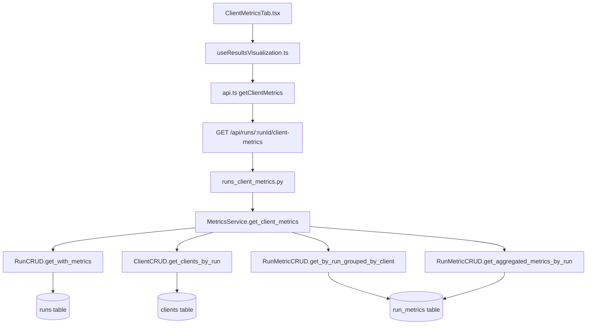
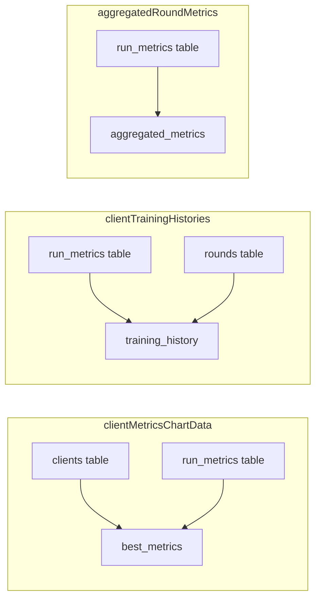
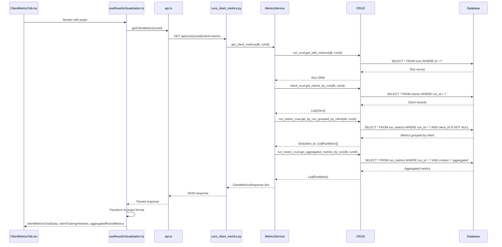

# ClientMetricsTab Data Flow

**File**: `xray-vision-ai-forge/src/components/training/tabs/ClientMetricsTab.tsx` (lines 51-64)

---

## Props Interface

```typescript
interface ClientMetricsTabProps {
  clientMetricsChartData: ClientChartData[];        // Best metrics per client
  clientTrainingHistories: Record<string, TrainingHistoryData[]>;  // Per-client history
  aggregatedRoundMetrics: Array<{round, accuracy, ...}>;  // Global aggregated
  numClients: number;
}
```

---

## Data Flow Diagram



---

## 1. Component Layer

**File**: `xray-vision-ai-forge/src/components/training/tabs/ClientMetricsTab.tsx`

**Props received from parent** (ResultsVisualization.tsx line 121-127):
```typescript
<ClientMetricsTab
  clientMetricsChartData={clientMetricsChartData}
  clientTrainingHistories={clientTrainingHistories}
  aggregatedRoundMetrics={aggregatedRoundMetrics}
  numClients={clientMetrics?.num_clients || 0}
/>
```

---

## 2. Hook Layer

**File**: `xray-vision-ai-forge/src/hooks/useResultsVisualization.ts` (lines 55-75)

```typescript
// Fetch client metrics (federated only)
const clientData = await api.results.getClientMetrics(runId);

// Transform to component props
const clientMetricsChartData = clientData.clients.map(client => ({
  clientId: client.client_id,
  clientIdentifier: client.client_identifier,
  accuracy: client.best_metrics.best_val_accuracy,
  precision: client.best_metrics.best_val_precision,
  recall: client.best_metrics.best_val_recall,
  f1: client.best_metrics.best_val_f1,
  auroc: client.best_metrics.best_val_auroc,
  loss: client.best_metrics.lowest_val_loss,
}));

const clientTrainingHistories = clientData.clients.reduce((acc, client) => {
  acc[client.client_identifier] = client.training_history.map(h => ({
    epoch: h.epoch,
    trainLoss: h.train_loss,
    valLoss: h.val_loss,
    trainAcc: h.train_accuracy,
    valAcc: h.val_accuracy,
    ...
  }));
  return acc;
}, {});

const aggregatedRoundMetrics = clientData.aggregated_metrics.map(m => ({
  round: m.round,
  accuracy: m.accuracy,
  precision: m.precision,
  recall: m.recall,
  f1: m.f1,
  auroc: m.auroc,
  loss: m.loss,
}));
```

---

## 3. API Service Layer

**File**: `xray-vision-ai-forge/src/services/api.ts` (lines 135-140)

```typescript
getClientMetrics: (runId: number) => 
  api.get(`/api/runs/${runId}/client-metrics`)
```

**Response Type**: `ClientMetricsResponse` (api.ts lines 350-380)

---

## 4. Backend API Layer

**File**: `federated_pneumonia_detection/src/api/endpoints/runs_endpoints/runs_client_metrics.py` (lines 25-35)

```python
@router.get("/{run_id}/client-metrics")
async def get_client_metrics(
    run_id: int, 
    db: Session = Depends(get_db)
):
    return analytics.metrics.get_client_metrics(db, run_id)
```

---

## 5. Control/Analytics Layer

**File**: `federated_pneumonia_detection/src/control/analytics/internals/services/metrics_service.py` (lines 180-250)

```python
def get_client_metrics(self, db: Session, run_id: int):
    key = cache_key("get_client_metrics", (run_id,), {})
    
    def _compute():
        # Line 192: Get run with all metrics
        run = self._run_crud.get_with_metrics(db, run_id)
        
        # Line 194: Get all clients for this run
        clients = self._client_crud.get_clients_by_run(db, run_id)
        
        # Line 196: Get metrics grouped by client_id
        grouped_metrics = self._run_metric_crud.get_by_run_grouped_by_client(db, run_id)
        
        # Line 198: Get aggregated (server-side) metrics
        aggregated = self._run_metric_crud.get_aggregated_metrics_by_run(db, run_id)
        
        # Transform each client's data
        clients_data = []
        for client in clients:
            client_metrics = grouped_metrics.get(client.id, [])
            clients_data.append({
                "client_id": client.id,
                "client_identifier": client.client_identifier,
                "total_steps": len(client_metrics),
                "training_history": self._transform_client_history(client_metrics),
                "best_metrics": self._extract_best_metrics(client_metrics),
            })
        
        return {
            "run_id": run_id,
            "is_federated": True,
            "num_clients": len(clients_data),
            "clients": clients_data,
            "aggregated_metrics": self._transform_aggregated(aggregated),
        }
    
    return self._cache.get_or_set(key, _compute)
```

---

## 6. Boundary/CRUD Layer

### 6.1 RunCRUD
**File**: `federated_pneumonia_detection/src/boundary/CRUD/run.py` (lines 45-60)

```python
def get_with_metrics(self, db: Session, id: int):
    return (
        db.query(self.model)
        .options(
            selectinload(Run.metrics),
            selectinload(Run.clients),
        )
        .filter(self.model.id == id)
        .first()
    )
```

### 6.2 ClientCRUD
**File**: `federated_pneumonia_detection/src/boundary/CRUD/client.py` (lines 25-35)

```python
def get_clients_by_run(self, db: Session, run_id: int):
    return (
        db.query(Client)
        .filter(Client.run_id == run_id)
        .all()
    )
```

### 6.3 RunMetricCRUD
**File**: `federated_pneumonia_detection/src/boundary/CRUD/run_metric.py` (lines 60-85)

```python
def get_by_run_grouped_by_client(self, db: Session, run_id: int):
    """Get metrics grouped by client_id for per-client history"""
    metrics = (
        db.query(RunMetric)
        .filter(RunMetric.run_id == run_id, RunMetric.client_id.isnot(None))
        .options(joinedload(RunMetric.round))
        .all()
    )
    grouped = defaultdict(list)
    for metric in metrics:
        grouped[metric.client_id].append(metric)
    return grouped

def get_aggregated_metrics_by_run(self, db: Session, run_id: int):
    """Get server-aggregated metrics per round"""
    return (
        db.query(RunMetric)
        .filter(RunMetric.run_id == run_id, RunMetric.context == "aggregated")
        .order_by(RunMetric.step)
        .all()
    )
```

---

## 7. Database Schema

### Tables Used

| Table | Purpose | Key Columns |
|-------|---------|-------------|
| `runs` | Experiment metadata | `id`, `training_mode` |
| `clients` | Client list per run | `id`, `run_id`, `client_identifier` (e.g., "client_0") |
| `run_metrics` | All metrics | `run_id`, `client_id`, `metric_name`, `metric_value`, `step`, `context` |
| `rounds` | Federated rounds | `id`, `client_id`, `round_number` |

### Data Source by Prop



---

## 8. Complete Sequence



---

## File Reference Quick List

| Layer | File | Key Lines |
|-------|------|-----------|
| Component | `xray-vision-ai-forge/src/components/training/tabs/ClientMetricsTab.tsx` | 51-64 (props interface) |
| Parent | `xray-vision-ai-forge/src/components/training/ResultsVisualization.tsx` | 121-127 (prop passing) |
| Hook | `xray-vision-ai-forge/src/hooks/useResultsVisualization.ts` | 55-75 (API call + transform) |
| API Service | `xray-vision-ai-forge/src/services/api.ts` | 135-140 (endpoint) |
| API Endpoint | `federated_pneumonia_detection/src/api/endpoints/runs_endpoints/runs_client_metrics.py` | 25-35 |
| Analytics Facade | `federated_pneumonia_detection/src/control/analytics/facade.py` | 60-70 |
| Metrics Service | `federated_pneumonia_detection/src/control/analytics/internals/services/metrics_service.py` | 180-250 |
| Run CRUD | `federated_pneumonia_detection/src/boundary/CRUD/run.py` | 45-60 |
| Client CRUD | `federated_pneumonia_detection/src/boundary/CRUD/client.py` | 25-35 |
| RunMetric CRUD | `federated_pneumonia_detection/src/boundary/CRUD/run_metric.py` | 60-85 |
| Run Model | `federated_pneumonia_detection/src/boundary/models/run.py` | 1-50 |
| Client Model | `federated_pneumonia_detection/src/boundary/models/client.py` | 1-30 |
| RunMetric Model | `federated_pneumonia_detection/src/boundary/models/run_metric.py` | 1-40 |
