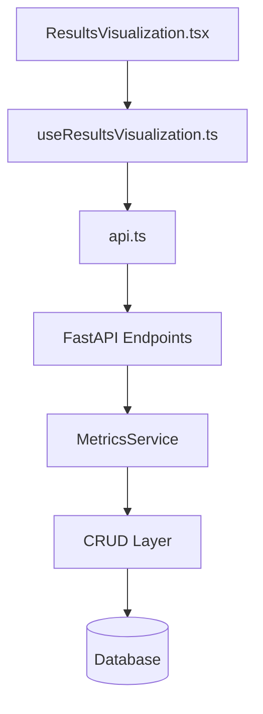
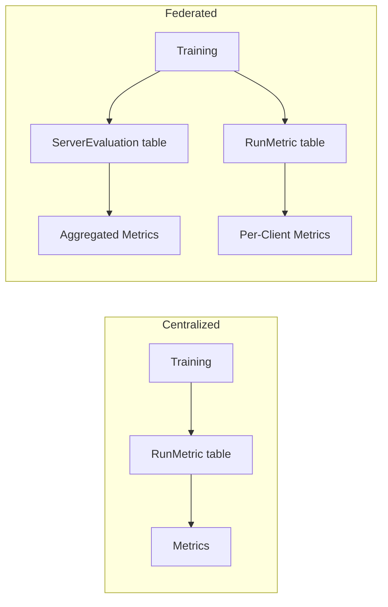
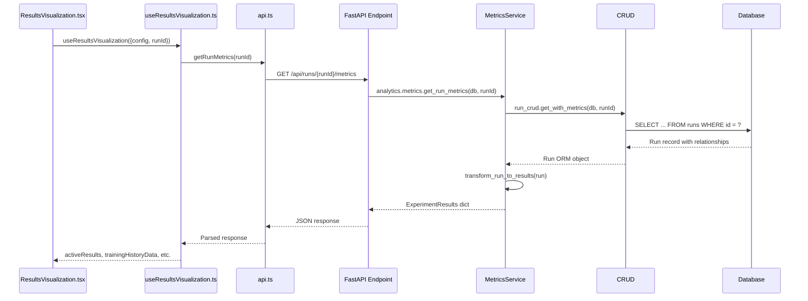

# Metrics Data Flow

**File**: `xray-vision-ai-forge/src/components/training/ResultsVisualization.tsx`  
**Purpose**: Trace data from React component to database

---

## Quick Flow



---

## 1. Frontend Layer

**Hook**: `useResultsVisualization.ts` (lines 30-39)

| API Call | Endpoint | When |
|----------|----------|------|
| `getRunMetrics(runId)` | `GET /api/runs/{runId}/metrics` | Always |
| `getServerEvaluation(runId)` | `GET /api/runs/{runId}/server-evaluation` | Federated only |
| `getClientMetrics(runId)` | `GET /api/runs/{runId}/client-metrics` | Federated only |

---

## 2. API Service Layer

**File**: `xray-vision-ai-forge/src/services/api.ts` (lines 120-140)

```typescript
getRunMetrics: (runId: number) => 
  api.get(`/api/runs/${runId}/metrics`)

getServerEvaluation: (runId: number) => 
  api.get(`/api/runs/${runId}/server-evaluation`)

getClientMetrics: (runId: number) => 
  api.get(`/api/runs/${runId}/client-metrics`)
```

---

## 3. Backend API Layer

### 3.1 Server Evaluation
**File**: `federated_pneumonia_detection/src/api/endpoints/runs_endpoints/runs_server_evaluation.py` (lines 30-50)

```python
@router.get("/{run_id}/server-evaluation")
async def get_server_evaluation(run_id: int, db: Session = Depends(get_db)):
    run = run_crud.get(db, run_id)                    # Line 45
    evaluations = server_eval_crud.get_by_run(db, run_id)  # Line 52
    summary = server_eval_crud.get_summary_stats(db, run_id)  # Line 53
    return {...}
```

### 3.2 Client Metrics
**File**: `federated_pneumonia_detection/src/api/endpoints/runs_endpoints/runs_client_metrics.py` (lines 25-35)

```python
@router.get("/{run_id}/client-metrics")
async def get_client_metrics(run_id: int, db: Session = Depends(get_db)):
    return analytics.metrics.get_client_metrics(db, run_id)  # Line 30
```

---

## 4. Control/Analytics Layer

### 4.1 Get Run Metrics
**File**: `federated_pneumonia_detection/src/control/analytics/internals/services/metrics_service.py` (lines 80-110)

```python
def get_run_metrics(self, db: Session, run_id: int):
    key = cache_key("get_run_metrics", (run_id,), {})
    
    def _compute():
        run = self._run_crud.get_with_metrics(db, run_id)  # Line 95
        persisted_stats = self._get_persisted_stats(db, run)  # Line 97
        return transform_run_to_results(run, persisted_stats)  # Line 99
    
    return self._cache.get_or_set(key, _compute)  # Line 101
```

### 4.2 Get Client Metrics
**File**: Same file (lines 180-220)

```python
def get_client_metrics(self, db: Session, run_id: int):
    key = cache_key("get_client_metrics", (run_id,), {})
    
    def _compute():
        run = self._run_crud.get_with_metrics(db, run_id)  # Line 192
        clients = self._client_crud.get_clients_by_run(db, run_id)  # Line 194
        grouped_metrics = self._run_metric_crud.get_by_run_grouped_by_client(db, run_id)  # Line 196
        aggregated = self._run_metric_crud.get_aggregated_metrics_by_run(db, run_id)  # Line 198
        return {...}
    
    return self._cache.get_or_set(key, _compute)
```

### 4.3 Transform Run to Results
**File**: `federated_pneumonia_detection/src/control/analytics/internals/utils/transformers.py` (lines 50-120)

```python
def transform_run_to_results(run, persisted_stats=None):
    is_federated = run.training_mode == "federated"
    metrics_by_epoch = defaultdict(dict)
    
    if is_federated:
        # Read from server_evaluations relationship (line 65)
        for eval in run.server_evaluations:
            metrics_by_epoch[eval.round_number] = {...}
    else:
        # Read from RunMetric table (line 75)
        for metric in run.metrics:
            metrics_by_epoch[metric.step][metric.metric_name] = metric.metric_value
    
    return {...}
```

---

## 5. Boundary/CRUD Layer

### 5.1 RunCRUD
**File**: `federated_pneumonia_detection/src/boundary/CRUD/run.py` (lines 45-60)

```python
def get_with_metrics(self, db: Session, id: int):
    return (
        db.query(self.model)
        .options(
            selectinload(Run.metrics),           # Eager load
            selectinload(Run.clients),
            selectinload(Run.server_evaluations)
        )
        .filter(self.model.id == id)
        .first()
    )
```

### 5.2 ServerEvaluationCRUD
**File**: `federated_pneumonia_detection/src/boundary/CRUD/server_evaluation.py` (lines 35-50)

```python
def get_by_run(self, db: Session, run_id: int, order_by_round: bool = True):
    query = (
        db.query(ServerEvaluation)
        .filter(ServerEvaluation.run_id == run_id)
    )
    if order_by_round:
        query = query.order_by(ServerEvaluation.round_number)
    return query.all()
```

### 5.3 RunMetricCRUD
**File**: `federated_pneumonia_detection/src/boundary/CRUD/run_metric.py` (lines 60-75)

```python
def get_by_run_grouped_by_client(self, db: Session, run_id: int):
    metrics = (
        db.query(RunMetric)
        .filter(RunMetric.run_id == run_id, RunMetric.client_id.isnot(None))
        .all()
    )
    grouped = defaultdict(list)
    for metric in metrics:
        grouped[metric.client_id].append(metric)
    return grouped
```

---

## 6. Database Schema

### Tables

| Table | Purpose | Key Columns |
|-------|---------|-------------|
| `runs` | Experiment metadata | `id`, `training_mode`, `status` |
| `run_metrics` | Per-epoch metrics | `run_id`, `metric_name`, `metric_value`, `step`, `client_id` |
| `server_evaluations` | Federated round results | `run_id`, `round_number`, `loss`, `accuracy`, `recall`, `f1_score` |
| `clients` | Federated client list | `run_id`, `client_identifier` |

### Data Source by Mode



---

## 7. Complete Data Flow



---

## File Reference Quick List

| Layer | File | Key Lines |
|-------|------|-----------|
| Component | `xray-vision-ai-forge/src/components/training/ResultsVisualization.tsx` | 30-39 (hook usage) |
| Hook | `xray-vision-ai-forge/src/hooks/useResultsVisualization.ts` | 45-75 (API calls) |
| API Service | `xray-vision-ai-forge/src/services/api.ts` | 120-140 (endpoints) |
| Types | `xray-vision-ai-forge/src/types/api.ts` | 400-500 (response types) |
| API Endpoint (Server Eval) | `federated_pneumonia_detection/src/api/endpoints/runs_endpoints/runs_server_evaluation.py` | 30-50 |
| API Endpoint (Client) | `federated_pneumonia_detection/src/api/endpoints/runs_endpoints/runs_client_metrics.py` | 25-35 |
| Analytics Facade | `federated_pneumonia_detection/src/control/analytics/facade.py` | 40-60 |
| Metrics Service | `federated_pneumonia_detection/src/control/analytics/internals/services/metrics_service.py` | 80-110, 180-220 |
| Transformers | `federated_pneumonia_detection/src/control/analytics/internals/utils/transformers.py` | 50-120 |
| Run CRUD | `federated_pneumonia_detection/src/boundary/CRUD/run.py` | 45-60 |
| Server Eval CRUD | `federated_pneumonia_detection/src/boundary/CRUD/server_evaluation.py` | 35-50 |
| Run Metric CRUD | `federated_pneumonia_detection/src/boundary/CRUD/run_metric.py` | 60-75 |
| Run Model | `federated_pneumonia_detection/src/boundary/models/run.py` | 1-50 |
| Run Metric Model | `federated_pneumonia_detection/src/boundary/models/run_metric.py` | 1-40 |
| Server Eval Model | `federated_pneumonia_detection/src/boundary/models/server_evaluation.py` | 1-50 |
