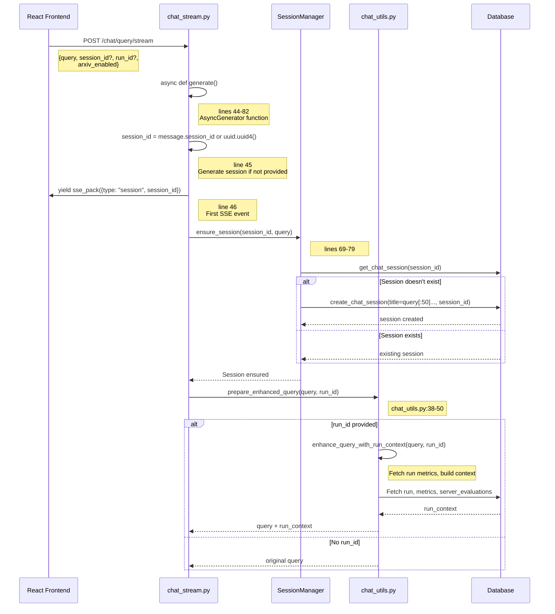
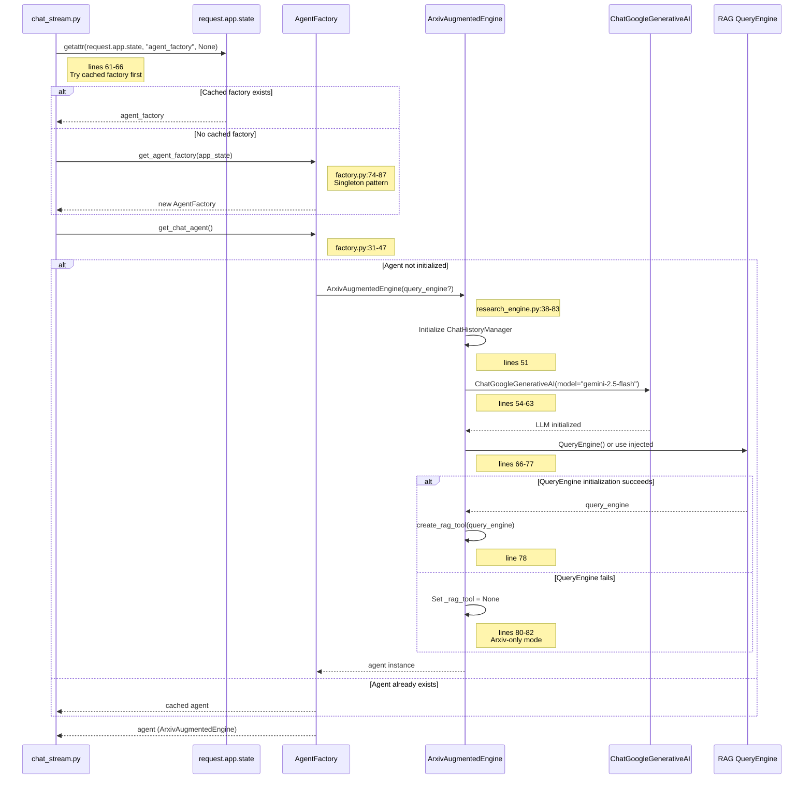
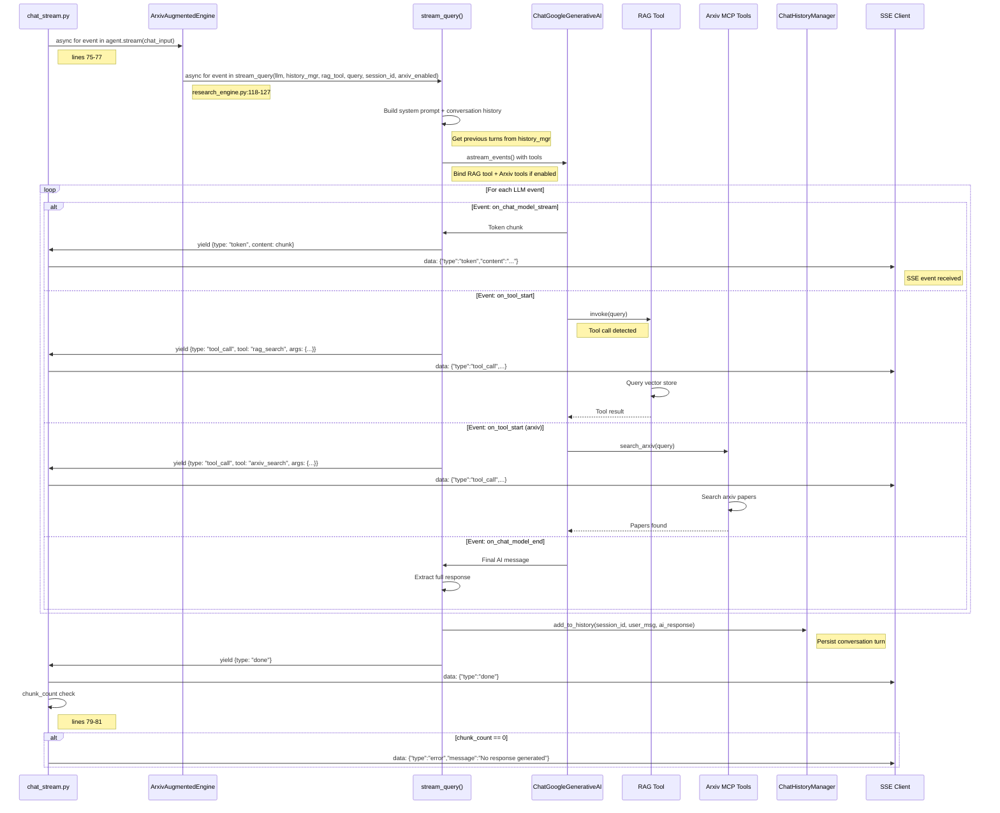
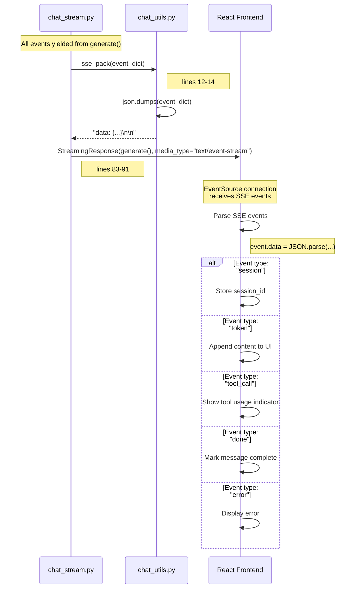

# Chat Streaming Flow - SSE Token-by-Token Response

**API**: `POST /api/chat/query/stream`
**Entry Point**: `chat_stream.py:34` → `query_chat_stream()`
**Pattern**: Server-Sent Events (SSE) with AsyncGenerator

---

## Step 1: Request Reception & Session Initialization

**Files**:
- `chat_stream.py` (lines 34-58)
- `chat_utils.py` (sse_pack, prepare_enhanced_query)
- `session_manager.py` (ensure_session, lines 69-79)



**Key Code**:
```python
# chat_stream.py lines 44-58
async def generate():
    session_id = message.session_id or str(uuid.uuid4())
    yield sse_pack({"type": AgentEventType.SESSION.value, "session_id": session_id})

    session_manager.ensure_session(session_id, message.query)
    enhanced_query = await prepare_enhanced_query(message.query, message.run_id)

    chat_input = ChatInput(
        query=enhanced_query,
        session_id=session_id,
        arxiv_enabled=message.arxiv_enabled,
        run_id=message.run_id,
        original_query=message.query,
    )
```

```python
# chat_utils.py lines 38-50 (prepare_enhanced_query)
async def prepare_enhanced_query(query: str, run_id: Optional[int]) -> str:
    """Enhance a query with run context if a run_id is provided (async)."""
    if run_id is None:
        return query

    try:
        logger.info(f"[Helper] Enhancing query with run context for run_id: {run_id}")
        enhanced = await enhance_query_with_run_context(query, run_id)
        logger.info("[Helper] Query enhanced successfully")
        return enhanced
    except Exception as e:
        logger.error(f"[Helper] Failed to enhance query (using original): {e}")
        return query
```

---

## Step 2: Agent Factory & Chat Agent Initialization

**Files**:
- `chat_stream.py` (lines 59-72)
- `factory.py` (get_agent_factory, lines 74-87)
- `research_engine.py` (ArxivAugmentedEngine, lines 35-83)



**Key Code**:
```python
# chat_stream.py lines 59-72
try:
    # Use pre-initialized factory from app.state (fallback to on-demand creation)
    agent_factory = getattr(request.app.state, "agent_factory", None)
    if agent_factory is None:
        logger.warning("[STREAM] No cached factory in app.state, creating on-demand")
        agent_factory = get_agent_factory(app_state=request.app.state)

    agent = agent_factory.get_chat_agent()
except Exception as exc:
    logger.error("[STREAM] Failed to initialize chat agent: %s", exc)
    yield sse_error(f"Failed to initialize engine: {exc}")
    return
```

```python
# factory.py lines 31-47 (get_chat_agent)
def get_chat_agent(self) -> BaseAgent:
    """Return the primary chat agent for streaming queries."""
    if self._research_agent is None:
        # Try to get pre-initialized engines from app.state
        arxiv_engine = None
        if self._app_state is not None and hasattr(self._app_state, "arxiv_engine"):
            arxiv_engine = self._app_state.arxiv_engine

        self._research_agent = (
            arxiv_engine if arxiv_engine is not None else ArxivAugmentedEngine()
        )
    return self._research_agent
```

---

## Step 3: Stream Execution - Token-by-Token Response

**Files**:
- `chat_stream.py` (lines 74-81)
- `research_engine.py` (stream method, lines 176-184)
- `research_stream.py` (stream_query - delegated)



**Key Code**:
```python
# chat_stream.py lines 74-81
chunk_count = 0
async for event in agent.stream(chat_input):
    chunk_count += 1
    yield sse_pack(event)

if chunk_count == 0:
    logger.warning("[STREAM] No chunks generated - empty response")
    yield sse_error("No response generated from the query engine")
```

```python
# research_engine.py lines 176-184
async def stream(self, chat_input: ChatInput) -> AsyncIterator[AgentEvent]:
    """Stream agent events for the given chat input (BaseAgent contract)."""
    async for event in self.query_stream(
        chat_input.query,
        chat_input.session_id,
        arxiv_enabled=chat_input.arxiv_enabled,
        original_query=chat_input.original_query,
    ):
        yield cast(AgentEvent, event)
```

---

## Step 4: SSE Response Formatting & Delivery

**Files**:
- `chat_stream.py` (lines 83-91)
- `chat_utils.py` (sse_pack, lines 12-14)



**Key Code**:
```python
# chat_stream.py lines 83-91
return StreamingResponse(
    generate(),
    media_type="text/event-stream",
    headers={
        "Cache-Control": "no-cache",
        "Connection": "keep-alive",
        "X-Accel-Buffering": "no",
    },
)
```

```python
# chat_utils.py lines 12-14
def sse_pack(data: dict) -> str:
    """Pack a dictionary into Server-Sent Events format."""
    return f"data: {json.dumps(data)}\n\n"
```

---

## File Reference

| Layer | File | Key Lines |
|-------|------|-----------|
| **API Endpoint** | `chat_stream.py` | 34-91 |
| **Session Manager** | `session_manager.py` | 69-79 (ensure), 58-67 (create) |
| **Query Enhancement** | `chat_utils.py` | 38-320 (context building) |
| **Agent Factory** | `factory.py` | 18-88 |
| **Chat Agent** | `research_engine.py` | 35-198 |
| **Streaming Logic** | `research_stream.py` | (delegated from agent) |
| **SSE Utilities** | `chat_utils.py` | 12-19 (pack, error) |

---

## SSE Event Types

| Event Type | Trigger | Payload | Frontend Action |
|------------|---------|---------|-----------------|
| `session` | Session initialization | `{type: "session", session_id: "..."}` | Store session_id for future requests |
| `token` | LLM streams token | `{type: "token", content: "word"}` | Append to message display |
| `tool_call` | Tool invocation | `{type: "tool_call", tool: "rag_search", args: {...}}` | Show tool usage badge |
| `status` | Processing update | `{type: "status", message: "Searching..."}` | Update status indicator |
| `done` | Stream complete | `{type: "done"}` | Mark message complete |
| `error` | Error occurred | `{type: "error", message: "..."}` | Display error message |

---

## Run Context Enhancement Example

When `run_id` is provided, the query is enhanced with training run context:

```
Original Query: "What was the best recall achieved?"

Enhanced Query:
"What was the best recall achieved?

[TRAINING RUN CONTEXT - Run #123]
============================================================
Training Mode: federated
Status: completed
Start Time: 2026-02-01 10:30:00
End Time: 2026-02-01 11:45:00
Duration: 1:15:00

METRICS SUMMARY (450 total metrics recorded):
------------------------------------------------------------

validation_recall:
  - Count: 10
  - Best: 0.9200
  - Worst: 0.7500
  - Average: 0.8600

FEDERATED LEARNING DETAILS:
------------------------------------------------------------
Number of Clients: 5
Server Evaluations: 10 rounds
...
"
```

---

## Agent Initialization Modes

| Mode | Condition | Behavior |
|------|-----------|----------|
| **Pre-initialized** | `request.app.state.agent_factory` exists | Use cached factory + agent (fastest) |
| **On-demand** | No cached factory | Create new AgentFactory + ArxivAugmentedEngine |
| **With injected QueryEngine** | `app.state.arxiv_engine` exists | Use pre-initialized engines |
| **Standalone** | No app.state available | Initialize all dependencies fresh |

---

## Error Handling

| Error Scenario | Handler | Response |
|----------------|---------|----------|
| Agent initialization fails | lines 69-72 | `yield sse_error("Failed to initialize engine: ...")` |
| No chunks generated | lines 79-81 | `yield sse_error("No response generated from the query engine")` |
| Query enhancement fails | chat_utils.py:48-50 | Log error, use original query |
| Session creation fails | session_manager.py:75-79 | Log warning (non-fatal) |

---

## Performance Optimizations

| Optimization | Implementation | Benefit |
|--------------|----------------|---------|
| **Singleton AgentFactory** | factory.py:71-87 | Reuse agent instances across requests |
| **Cached app.state** | chat_stream.py:61-66 | Avoid re-initialization on each request |
| **Async DB operations** | chat_utils.py:310-312 | Non-blocking context enhancement |
| **SSE streaming** | chat_stream.py:83-91 | Progressive UI updates, low latency |
| **History truncation** | research_engine.py:39 | Limit memory usage (max_history=10) |
