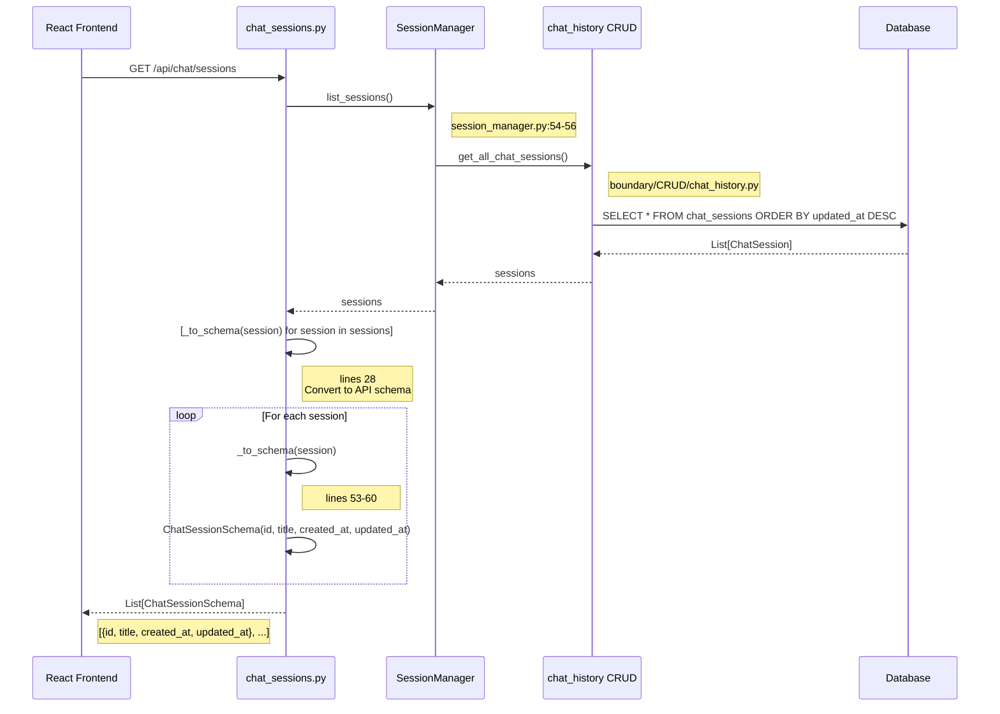
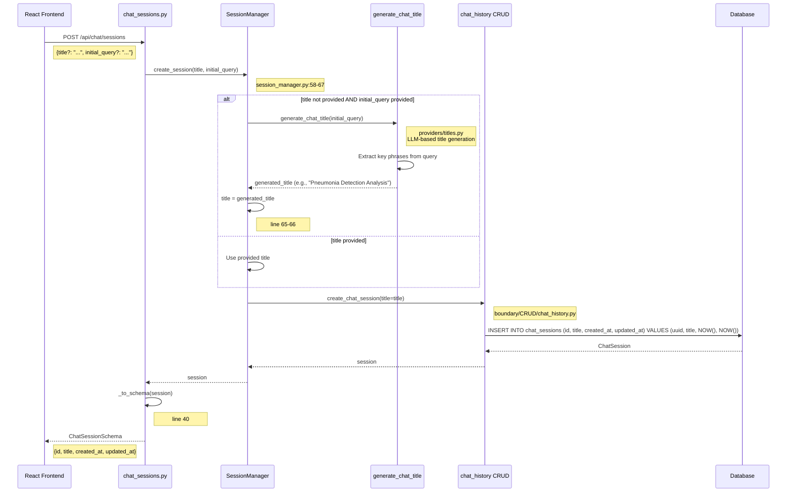
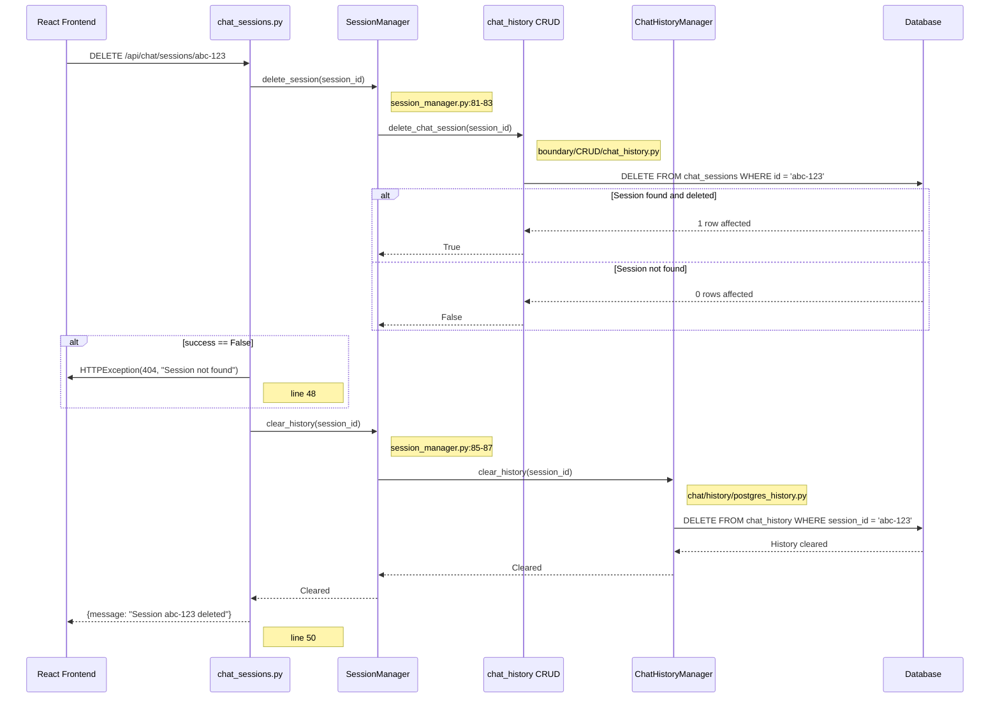
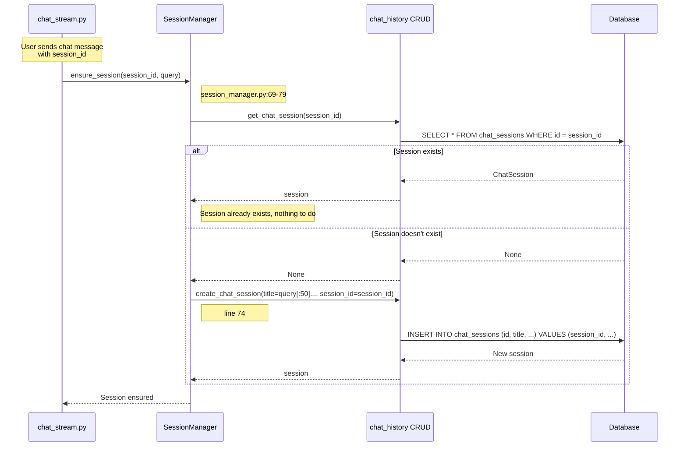
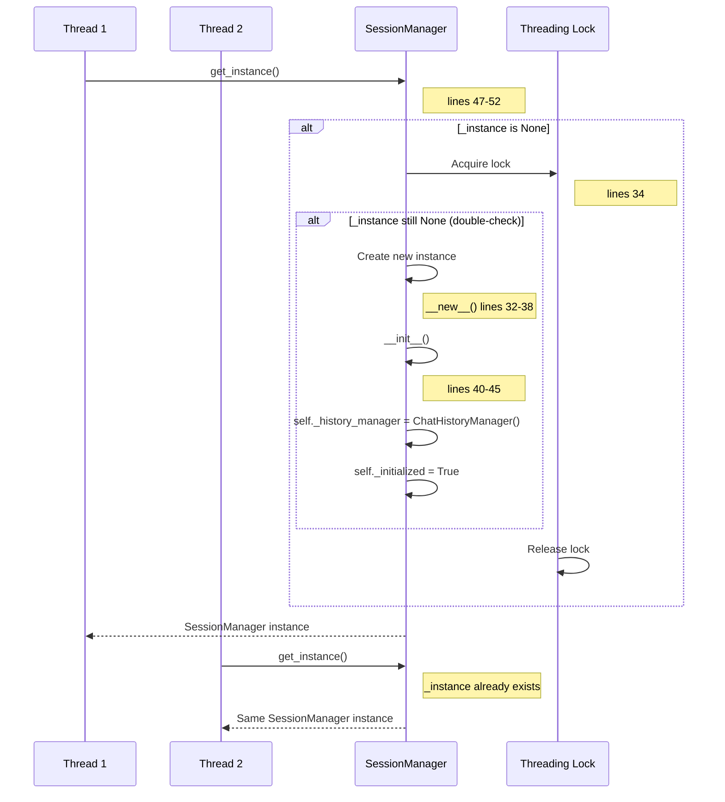

# Chat Session Management Flow

**API Base**: `/api/chat/sessions`
**Files**: `chat_sessions.py`, `session_manager.py`
**Pattern**: Singleton SessionManager + Database Persistence

---

## Step 1: List All Sessions

**API**: `GET /api/chat/sessions`
**Entry Point**: `chat_sessions.py:24` → `list_chat_sessions()`



**Key Code**:
```python
# chat_sessions.py lines 24-28
@router.get("/sessions", response_model=List[ChatSessionSchema])
async def list_chat_sessions() -> List[ChatSessionSchema]:
    """List all available chat sessions."""
    sessions = session_manager.list_sessions()
    return [_to_schema(session) for session in sessions]
```

```python
# chat_sessions.py lines 53-60
def _to_schema(session: ChatSession) -> ChatSessionSchema:
    """Convert a ChatSession model to API schema."""
    return ChatSessionSchema(
        id=str(session.id),
        title=str(session.title),
        created_at=session.created_at.isoformat(),
        updated_at=session.updated_at.isoformat(),
    )
```

---

## Step 2: Create New Session

**API**: `POST /api/chat/sessions`
**Entry Point**: `chat_sessions.py:31` → `create_new_chat_session()`



**Key Code**:
```python
# chat_sessions.py lines 31-40
@router.post("/sessions", response_model=ChatSessionSchema)
async def create_new_chat_session(
    request: CreateSessionRequest = CreateSessionRequest(),
) -> ChatSessionSchema:
    """Create a new chat session with optional auto-generated title."""
    session = session_manager.create_session(
        title=request.title,
        initial_query=request.initial_query,
    )
    return _to_schema(session)
```

```python
# session_manager.py lines 58-67
def create_session(
    self,
    title: Optional[str] = None,
    initial_query: Optional[str] = None,
) -> ChatSession:
    """Create a new chat session with optional title generation."""
    if not title and initial_query:
        title = generate_chat_title(initial_query)
        logger.info("[SessionManager] Generated title: '%s'", title)
    return create_chat_session(title=title)
```

---

## Step 3: Delete Session

**API**: `DELETE /api/chat/sessions/{session_id}`
**Entry Point**: `chat_sessions.py:43` → `delete_existing_chat_session()`



**Key Code**:
```python
# chat_sessions.py lines 43-50
@router.delete("/sessions/{session_id}")
async def delete_existing_chat_session(session_id: str) -> dict:
    """Delete a chat session and clear its history."""
    success = session_manager.delete_session(session_id)
    if not success:
        raise HTTPException(status_code=404, detail="Session not found")
    session_manager.clear_history(session_id)
    return {"message": f"Session {session_id} deleted"}
```

```python
# session_manager.py lines 81-87
def delete_session(self, session_id: str) -> bool:
    """Delete a chat session."""
    return delete_chat_session(session_id)

def clear_history(self, session_id: str) -> None:
    """Clear conversation history for a session."""
    self._history_manager.clear_history(session_id)
```

---

## Step 4: Ensure Session (Auto-Creation During Chat)

**Triggered By**: `chat_stream.py:48` during streaming
**Entry Point**: `session_manager.py:69` → `ensure_session()`



**Key Code**:
```python
# session_manager.py lines 69-79
def ensure_session(self, session_id: str, query: str) -> None:
    """Ensure a database-backed session exists for a session id."""
    try:
        existing = get_chat_session(session_id)
        if not existing:
            create_chat_session(title=f"{query[:50]}...", session_id=session_id)
    except Exception as exc:
        logger.warning(
            "[SessionManager] Failed to ensure DB session (non-fatal): %s",
            exc,
        )
```

---

## Singleton Pattern Implementation

**File**: `session_manager.py` (lines 26-52)



**Key Code**:
```python
# session_manager.py lines 26-52
class SessionManager:
    """Coordinates chat session persistence and history cleanup (Singleton)."""

    _instance = None
    _lock = threading.Lock()

    def __new__(cls):
        if cls._instance is None:
            with cls._lock:
                if cls._instance is None:
                    cls._instance = super().__new__(cls)
                    cls._instance._initialized = False
        return cls._instance

    def __init__(self) -> None:
        # Only initialize once
        if self._initialized:
            return
        self._history_manager = ChatHistoryManager()
        self._initialized = True

    @classmethod
    def get_instance(cls) -> "SessionManager":
        """Get the singleton instance."""
        if cls._instance is None:
            cls()
        return cls._instance
```

---

## File Reference

| Component | File | Key Lines |
|-----------|------|-----------|
| **API Endpoints** | `chat_sessions.py` | 24-60 |
| **Session Manager** | `session_manager.py` | 26-100 |
| **CRUD Operations** | `boundary/CRUD/chat_history.py` | (create, get, delete, list) |
| **Title Generation** | `chat/providers/titles.py` | (generate_chat_title) |
| **History Manager** | `chat/history/postgres_history.py` | (ChatHistoryManager) |

---

## Database Schema

### ChatSession Table
| Column | Type | Description |
|--------|------|-------------|
| `id` | UUID | Primary key (auto-generated or provided) |
| `title` | String | Session title (user-provided or auto-generated) |
| `created_at` | DateTime | Session creation timestamp |
| `updated_at` | DateTime | Last activity timestamp |

### ChatHistory Table (Related)
| Column | Type | Description |
|--------|------|-------------|
| `id` | Integer | Primary key |
| `session_id` | UUID | FK to ChatSession |
| `user_message` | Text | User's query |
| `ai_response` | Text | Agent's response |
| `created_at` | DateTime | Message timestamp |

---

## API Request/Response Examples

### List Sessions
```json
// GET /api/chat/sessions
Response: [
  {
    "id": "abc-123-def-456",
    "title": "Federated Learning Results Analysis",
    "created_at": "2026-02-01T10:30:00Z",
    "updated_at": "2026-02-01T11:45:00Z"
  },
  {
    "id": "xyz-789-uvw-012",
    "title": "Model Performance Comparison",
    "created_at": "2026-01-31T14:20:00Z",
    "updated_at": "2026-01-31T15:30:00Z"
  }
]
```

### Create Session
```json
// POST /api/chat/sessions
Request: {
  "initial_query": "What was the best recall in my last training run?"
}

Response: {
  "id": "new-session-uuid",
  "title": "Training Run Recall Analysis",  // Auto-generated
  "created_at": "2026-02-01T12:00:00Z",
  "updated_at": "2026-02-01T12:00:00Z"
}
```

### Delete Session
```json
// DELETE /api/chat/sessions/abc-123

Response: {
  "message": "Session abc-123 deleted"
}

// Error case (404)
{
  "detail": "Session not found"
}
```

---

## Session Lifecycle

```
1. User opens chat interface
   ↓
2. Frontend checks for existing session_id in localStorage
   ↓
   ├─ If exists: Use existing session_id
   └─ If not: Generate new UUID, don't create session yet
   ↓
3. User sends first message
   ↓
4. POST /api/chat/query/stream with session_id
   ↓
5. Backend: ensure_session() auto-creates if not exists
   ↓
6. Session persisted in database
   ↓
7. Subsequent messages use same session_id
   ↓
8. User deletes session
   ↓
9. DELETE /api/chat/sessions/{id}
   ↓
10. Session + history removed from database
```

---

## Title Generation Logic

**File**: `chat/providers/titles.py`

```python
# Simplified example
def generate_chat_title(query: str) -> str:
    """Generate a concise title from the query using LLM."""
    # Uses LLM to extract key phrases
    # Falls back to query[:50]... if LLM fails

    prompt = f"Generate a concise 3-5 word title for this query: {query}"
    # Call LLM, return title
    return title or f"{query[:50]}..."
```

**Examples**:
- Query: "What was the best recall in my federated training run with 5 clients?"
  - Title: "Federated Training Recall Analysis"

- Query: "Compare precision between centralized and federated modes"
  - Title: "Precision Mode Comparison"

---

## Error Handling

| Error Scenario | Handler | Response |
|----------------|---------|----------|
| Session not found (delete) | lines 47-48 | HTTPException(404, "Session not found") |
| Session creation fails (ensure) | lines 75-79 | Log warning (non-fatal, continue) |
| Title generation fails | titles.py | Fallback to query[:50]... |
| History clear fails | Non-blocking | Log error, continue |

---

## Concurrency Handling

**Pattern**: Thread-safe singleton with lock

```python
# Double-check locking pattern
if cls._instance is None:
    with cls._lock:  # Acquire lock
        if cls._instance is None:  # Double-check
            cls._instance = super().__new__(cls)
```

**Why**: Ensures only one SessionManager instance exists across all threads/requests, preventing:
- Multiple ChatHistoryManager instances
- Inconsistent session state
- Memory leaks from duplicate instances
