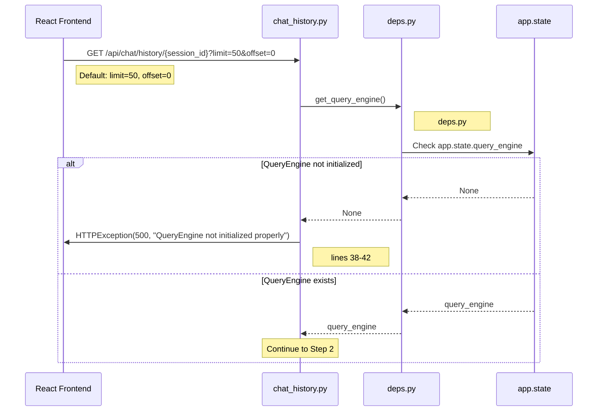
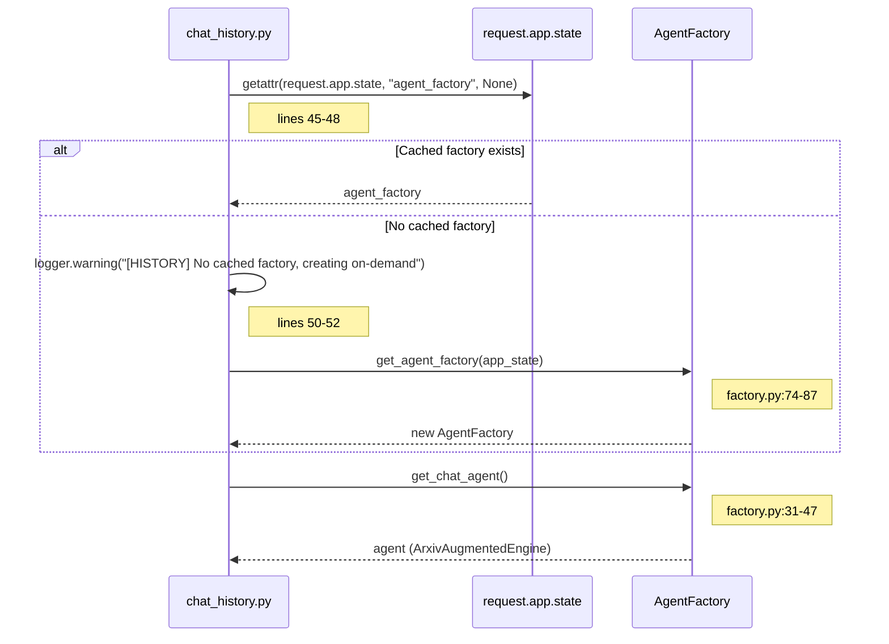
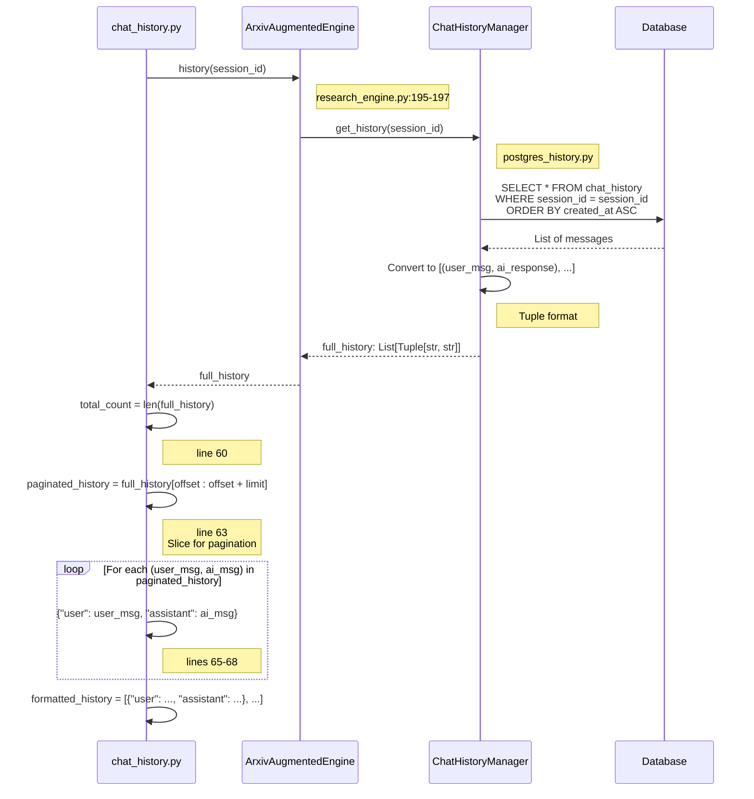
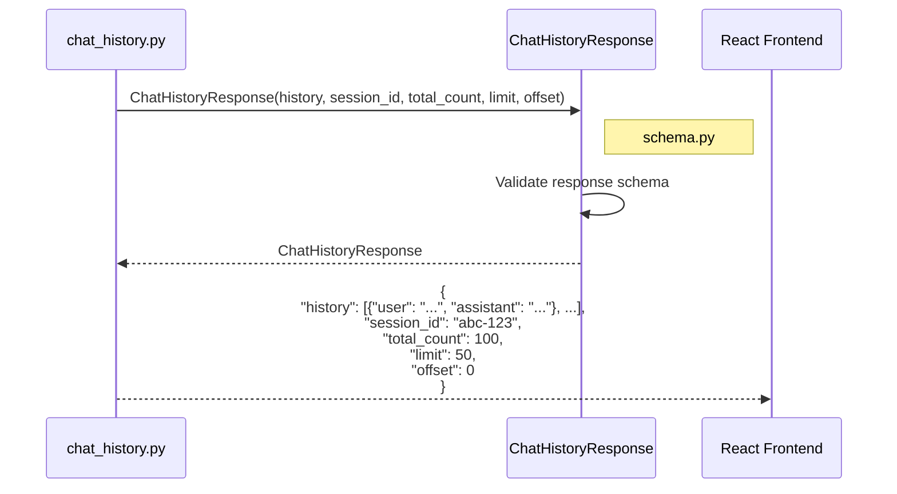
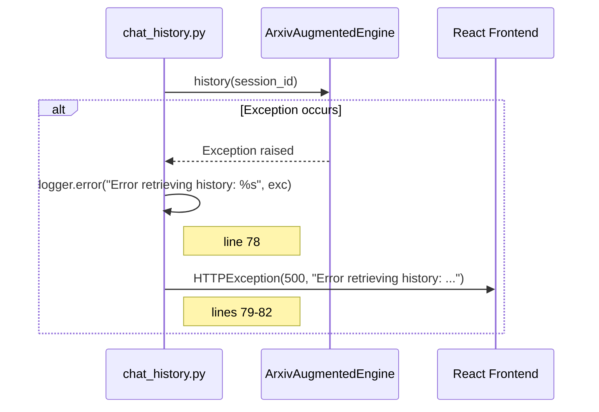
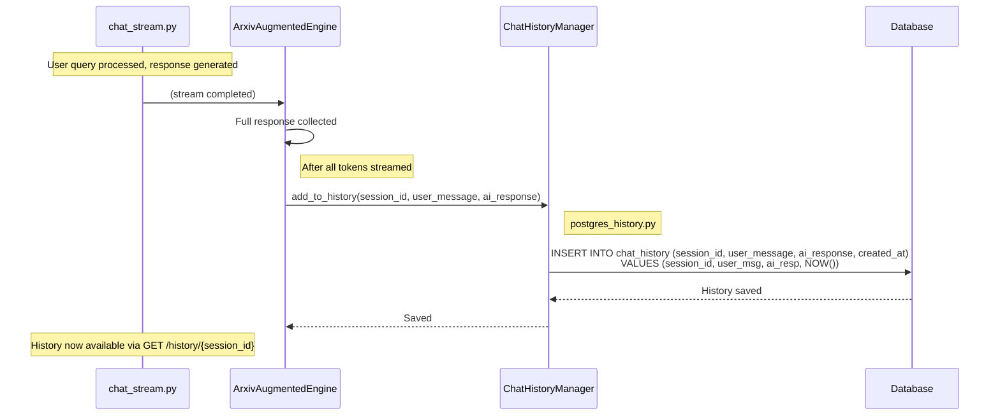

# Chat History Retrieval Flow

**API**: `GET /api/chat/history/{session_id}`
**Entry Point**: `chat_history.py:19` → `get_chat_history()`
**Pattern**: Paginated history retrieval with BaseAgent contract

---

## Step 1: Request Validation & QueryEngine Check

**Files**:
- `chat_history.py` (lines 19-42)
- `deps.py` (get_query_engine)



**Key Code**:
```python
# chat_history.py lines 38-42
if get_query_engine() is None:
    raise HTTPException(
        status_code=500,
        detail="QueryEngine not initialized properly",
    )
```

---

## Step 2: Agent Factory Initialization

**Files**:
- `chat_history.py` (lines 44-56)
- `factory.py` (get_agent_factory)



**Key Code**:
```python
# chat_history.py lines 44-56
try:
    # Use pre-initialized factory from app.state (fallback to on-demand creation)
    agent_factory = (
        getattr(request.app.state, "agent_factory", None) if request else None
    )
    if agent_factory is None:
        logger.warning(
            "[HISTORY] No cached factory in app.state, creating on-demand"
        )
        agent_factory = get_agent_factory(
            app_state=request.app.state if request else None
        )
    agent = agent_factory.get_chat_agent()
```

---

## Step 3: History Retrieval & Pagination

**Files**:
- `chat_history.py` (lines 58-68)
- `research_engine.py` (history method, lines 195-197)
- `postgres_history.py` (ChatHistoryManager.get_history)



**Key Code**:
```python
# chat_history.py lines 58-68
# Get full history
full_history = agent.history(session_id)
total_count = len(full_history)

# Apply pagination: skip 'offset' items, take 'limit' items
paginated_history = full_history[offset : offset + limit]

formatted_history = [
    {"user": user_msg, "assistant": ai_msg}
    for user_msg, ai_msg in paginated_history
]
```

```python
# research_engine.py lines 195-197
def history(self, session_id: str) -> List[Tuple[str, str]]:
    """Return conversation history (BaseAgent contract)."""
    return self.get_history(session_id)
```

---

## Step 4: Response Construction

**Files**:
- `chat_history.py` (lines 70-76)
- `schema.py` (ChatHistoryResponse)



**Key Code**:
```python
# chat_history.py lines 70-76
return ChatHistoryResponse(
    history=formatted_history,
    session_id=session_id,
    total_count=total_count,
    limit=limit,
    offset=offset,
)
```

---

## Error Handling

**File**: `chat_history.py` (lines 77-82)



**Key Code**:
```python
# chat_history.py lines 77-82
except Exception as exc:
    logger.error("Error retrieving history: %s", exc)
    raise HTTPException(
        status_code=500,
        detail=f"Error retrieving history: {str(exc)}",
    )
```

---

## File Reference

| Component | File | Key Lines |
|-----------|------|-----------|
| **API Endpoint** | `chat_history.py` | 19-83 |
| **Agent Interface** | `base_agent.py` | 23-24 (history method) |
| **Agent Implementation** | `research_engine.py` | 195-197 (history delegation) |
| **History Manager** | `postgres_history.py` | (ChatHistoryManager.get_history) |
| **Response Schema** | `schema.py` | (ChatHistoryResponse) |

---

## Pagination Behavior

### Example 1: Small History (< limit)
```
Total messages: 10
Request: limit=50, offset=0

Response:
{
  "history": [
    {"user": "msg1", "assistant": "resp1"},
    {"user": "msg2", "assistant": "resp2"},
    ...10 items total
  ],
  "total_count": 10,
  "limit": 50,
  "offset": 0
}
```

### Example 2: Large History with Pagination
```
Total messages: 150
Request 1: limit=50, offset=0
  → Returns messages 0-49 (first 50)

Request 2: limit=50, offset=50
  → Returns messages 50-99 (next 50)

Request 3: limit=50, offset=100
  → Returns messages 100-149 (last 50)
```

### Example 3: Offset Beyond Total
```
Total messages: 30
Request: limit=50, offset=100

Response:
{
  "history": [],  // Empty, offset beyond total
  "total_count": 30,
  "limit": 50,
  "offset": 100
}
```

---

## Response Schema

```typescript
// ChatHistoryResponse
{
  history: Array<{
    user: string;      // User's message
    assistant: string; // AI's response
  }>;
  session_id: string;  // Session identifier
  total_count: number; // Total messages in session
  limit: number;       // Page size
  offset: number;      // Starting index
}
```

---

## Frontend Integration Example

```typescript
// React component
const fetchChatHistory = async (sessionId: string, page: number = 0, pageSize: number = 50) => {
  const offset = page * pageSize;
  const response = await fetch(
    `/api/chat/history/${sessionId}?limit=${pageSize}&offset=${offset}`
  );
  const data = await response.json();

  // Calculate pagination info
  const totalPages = Math.ceil(data.total_count / data.limit);
  const hasMore = offset + data.history.length < data.total_count;

  return {
    messages: data.history,
    totalPages,
    hasMore,
    currentPage: page,
  };
};

// Infinite scroll example
const loadMoreHistory = async () => {
  const nextPage = currentPage + 1;
  const { messages, hasMore } = await fetchChatHistory(sessionId, nextPage);

  setHistory(prev => [...prev, ...messages]);
  setHasMore(hasMore);
  setCurrentPage(nextPage);
};
```

---

## History Storage Format (Database)

### ChatHistory Table
| Column | Type | Value Example |
|--------|------|---------------|
| `id` | Integer | 1, 2, 3, ... |
| `session_id` | UUID | "abc-123-def-456" |
| `user_message` | Text | "What was the best recall?" |
| `ai_response` | Text | "The best validation recall was **0.92** achieved in epoch 8..." |
| `created_at` | DateTime | "2026-02-01T10:30:00Z" |

### Retrieval Query
```sql
SELECT user_message, ai_response, created_at
FROM chat_history
WHERE session_id = 'abc-123-def-456'
ORDER BY created_at ASC;
```

**Result Format** (after conversion):
```python
[
  ("What was the best recall?", "The best validation recall was **0.92**..."),
  ("Compare it to centralized mode", "Centralized mode achieved **0.94** recall..."),
  ...
]
```

---

## History Persistence Flow

**When is history saved?**

During chat streaming (`chat_stream.py`):
1. User sends message → Stream starts
2. Agent generates response → Tokens streamed to frontend
3. Stream completes → `add_to_history()` called
4. History persisted to database



---

## Common Use Cases

### Use Case 1: Load Recent Conversation
```
GET /api/chat/history/abc-123?limit=20&offset=0

Use: Display last 20 messages in chat UI
```

### Use Case 2: Infinite Scroll
```
Initial load: offset=0, limit=50
User scrolls up: offset=50, limit=50
User scrolls more: offset=100, limit=50

Use: Progressive history loading
```

### Use Case 3: Search History
```
1. GET /api/chat/history/abc-123?limit=1000&offset=0
2. Frontend filters messages client-side

Use: Search within conversation
```

### Use Case 4: Export Conversation
```
GET /api/chat/history/abc-123?limit=10000&offset=0

Use: Download full conversation as JSON/PDF
```

---

## Performance Considerations

| Consideration | Implementation | Impact |
|---------------|----------------|--------|
| **Full history load** | `agent.history(session_id)` loads ALL messages | Can be slow for long conversations (100+ turns) |
| **In-memory pagination** | `full_history[offset:offset+limit]` | Memory efficient for Python slicing, but loads all first |
| **Database optimization** | Add indexes on `session_id`, `created_at` | Faster queries |
| **Caching** | Agent factory cached in `app.state` | Avoid re-initialization |

**Future Optimization**: Move pagination to database query:
```python
# Instead of loading all, then slicing
full_history = agent.history(session_id)
paginated = full_history[offset:offset+limit]

# Optimize to:
paginated_history = agent.history_paginated(session_id, limit, offset)
# Query: SELECT ... LIMIT 50 OFFSET 0
```

---

## Error Scenarios

| Error | HTTP Status | Response |
|-------|-------------|----------|
| QueryEngine not initialized | 500 | `{"detail": "QueryEngine not initialized properly"}` |
| Session not found | 200 | `{"history": [], "total_count": 0}` (empty history) |
| Database connection failed | 500 | `{"detail": "Error retrieving history: ..."}` |
| Invalid session_id format | 500 | `{"detail": "Error retrieving history: ..."}` |

---

## BaseAgent Contract

**Interface**: `base_agent.py` (lines 23-24)

```python
@abstractmethod
def history(self, session_id: str) -> List[Tuple[str, str]]:
    """Return conversation history for a session."""
```

**Implementation**: All agents must implement this method to be compatible with the history endpoint.

**Contract guarantees**:
- Returns list of (user_message, ai_response) tuples
- Ordered by creation time (oldest first)
- Empty list if session has no history
- Never raises exception (returns empty on error)
