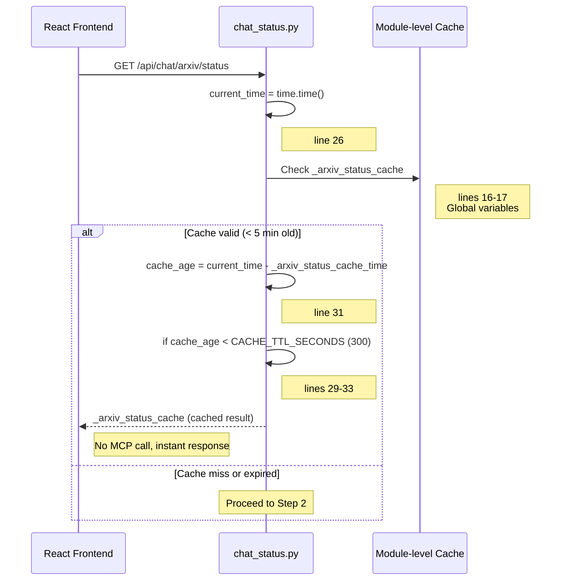
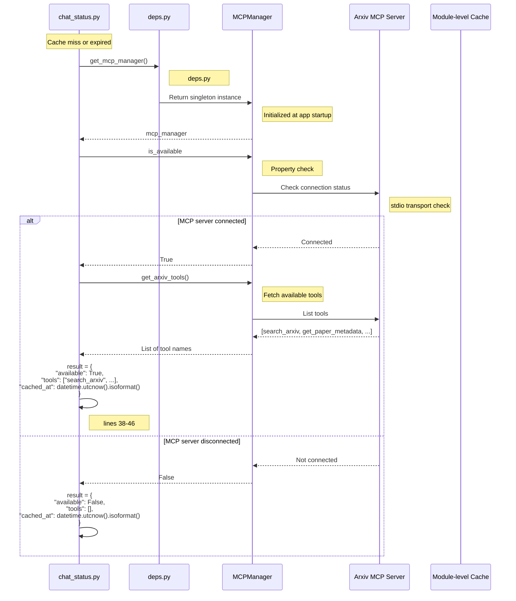
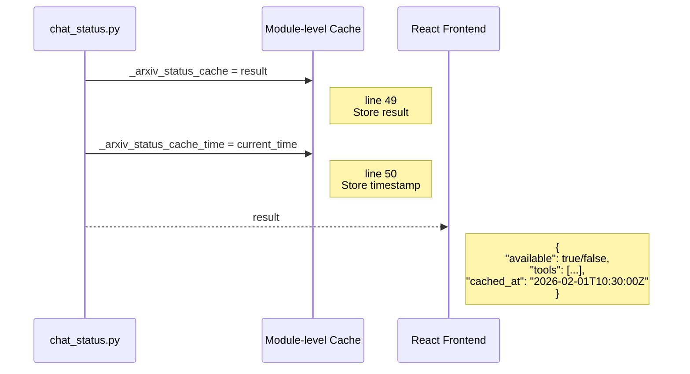
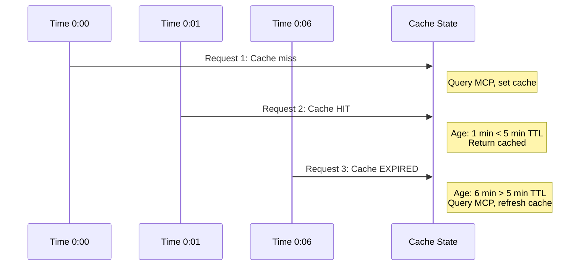

# Arxiv MCP Status Check Flow

**API**: `GET /api/chat/arxiv/status`
**Entry Point**: `chat_status.py:21` → `get_arxiv_status()`
**Pattern**: Cached status with 5-minute TTL

---

## Step 1: Cache Check

**Files**:
- `chat_status.py` (lines 21-33)



**Key Code**:
```python
# chat_status.py lines 15-33
# Cache for arxiv status with TTL
_arxiv_status_cache: Dict[str, Any] | None = None
_arxiv_status_cache_time: float = 0
CACHE_TTL_SECONDS: int = 300  # 5 minutes

@router.get("/arxiv/status")
async def get_arxiv_status() -> Dict[str, Any]:
    """Check if arxiv MCP server is available (cached with 5-min TTL)."""
    global _arxiv_status_cache, _arxiv_status_cache_time

    current_time = time.time()

    # Check if cache is valid
    if (
        _arxiv_status_cache
        and (current_time - _arxiv_status_cache_time) < CACHE_TTL_SECONDS
    ):
        return _arxiv_status_cache
```

---

## Step 2: MCP Manager Query (Cache Miss)

**Files**:
- `chat_status.py` (lines 35-46)
- `deps.py` (get_mcp_manager)
- `mcp_manager.py` (MCPManager)



**Key Code**:
```python
# chat_status.py lines 35-46
# Cache miss or expired - fetch fresh data
mcp_manager = get_mcp_manager()

result = {
    "available": mcp_manager.is_available,
    "tools": (
        [t.name for t in mcp_manager.get_arxiv_tools()]
        if mcp_manager.is_available
        else []
    ),
    "cached_at": datetime.utcnow().isoformat(),
}
```

---

## Step 3: Cache Update & Response

**Files**:
- `chat_status.py` (lines 48-52)



**Key Code**:
```python
# chat_status.py lines 48-52
# Update cache
_arxiv_status_cache = result
_arxiv_status_cache_time = current_time

return result
```

---

## Cache Lifetime Example



---

## File Reference

| Component | File | Key Lines |
|-----------|------|-----------|
| **API Endpoint** | `chat_status.py` | 21-52 |
| **MCP Manager Dependency** | `deps.py` | (get_mcp_manager) |
| **MCP Manager** | `mcp_manager.py` | (MCPManager class) |

---

## Response Schema

```typescript
// ArxivStatusResponse
{
  available: boolean;       // True if MCP server connected
  tools: string[];         // List of available tool names
  cached_at: string;       // ISO timestamp of when data was fetched
}
```

---

## Response Examples

### Case 1: MCP Server Available
```json
{
  "available": true,
  "tools": [
    "search_arxiv",
    "get_paper_metadata",
    "download_pdf"
  ],
  "cached_at": "2026-02-01T10:30:00.000000"
}
```

### Case 2: MCP Server Unavailable
```json
{
  "available": false,
  "tools": [],
  "cached_at": "2026-02-01T10:30:00.000000"
}
```

---

## Frontend Integration Example

```typescript
// React component
const [arxivStatus, setArxivStatus] = useState({
  available: false,
  tools: [],
  cached_at: null
});

const checkArxivStatus = async () => {
  const response = await fetch('/api/chat/arxiv/status');
  const data = await response.json();
  setArxivStatus(data);
};

// Check on component mount
useEffect(() => {
  checkArxivStatus();
}, []);

// Render UI based on status
{arxivStatus.available ? (
  <Badge variant="success">Arxiv Available</Badge>
) : (
  <Badge variant="warning">Arxiv Offline</Badge>
)}

// Show available tools
{arxivStatus.tools.map(tool => (
  <ToolBadge key={tool}>{tool}</ToolBadge>
))}
```

---

## Cache Invalidation Scenarios

| Scenario | Cache Behavior | Impact |
|----------|----------------|--------|
| **Server restart** | Cache cleared (module-level vars reset) | First request after restart queries MCP |
| **5 minutes elapsed** | Cache expired (TTL) | Next request queries MCP, refreshes cache |
| **MCP server reconnects** | Cache not invalidated | Status may be stale for up to 5 min |
| **Concurrent requests** | All use same cache | No race conditions, thread-safe |

---

## Performance Characteristics

| Metric | Value | Notes |
|--------|-------|-------|
| **Cache hit latency** | < 1 ms | Direct memory access |
| **Cache miss latency** | 50-200 ms | MCP server round-trip |
| **Cache TTL** | 300 seconds (5 min) | Configurable via CACHE_TTL_SECONDS |
| **Memory usage** | < 1 KB | Small dict cached |

---

## Cache Concurrency Handling

```python
# Module-level globals are NOT thread-safe by default
# BUT: Python GIL ensures atomic operations on simple types

global _arxiv_status_cache, _arxiv_status_cache_time

# Race condition scenario:
# Thread 1: Reads cache (expired)
# Thread 2: Reads cache (expired)
# Both threads query MCP simultaneously
# Both update cache (last write wins)

# Impact: Minimal - worst case is 2 MCP queries instead of 1
# Both will cache the same result
```

**Why no lock?**
- Cache value is immutable dict (not mutated, only replaced)
- Read-heavy workload (most requests are cache hits)
- Worst case: duplicate MCP query (rare, low cost)
- Simplicity preferred over lock overhead

---

## MCP Manager Integration

### MCPManager Interface
```python
class MCPManager:
    @property
    def is_available(self) -> bool:
        """Check if MCP server is connected."""
        return self._client is not None and self._session is not None

    def get_arxiv_tools(self) -> List[Tool]:
        """Get list of arxiv tools from MCP server."""
        if not self.is_available:
            return []
        return list(self._session.tools.values())
```

### Initialization (Startup)
```python
# services/startup.py (app.lifespan)
async def initialize_mcp_services(app: FastAPI):
    mcp_manager = MCPManager()
    await mcp_manager.connect()  # Connect to arxiv MCP server
    app.state.mcp_manager = mcp_manager
```

---

## Use Cases

### Use Case 1: Chat UI Initialization
```
User opens chat page
  ↓
Frontend calls GET /api/chat/arxiv/status
  ↓
If available:
  - Show "Arxiv search enabled" badge
  - Enable arxiv toggle in chat input
Else:
  - Hide arxiv toggle
  - Show "Research mode unavailable" message
```

### Use Case 2: Feature Toggle
```typescript
// Enable/disable arxiv checkbox based on status
const [arxivEnabled, setArxivEnabled] = useState(false);

useEffect(() => {
  checkArxivStatus().then(status => {
    if (!status.available) {
      setArxivEnabled(false); // Force disable if unavailable
    }
  });
}, []);

<Checkbox
  checked={arxivEnabled}
  onChange={setArxivEnabled}
  disabled={!arxivStatus.available}
/>
```

### Use Case 3: Monitoring Dashboard
```
Admin dashboard polls /api/chat/arxiv/status every 30 seconds
  ↓
Display service health:
  - Green: available = true
  - Red: available = false
  - Show available tools count
  - Show last check timestamp (cached_at)
```

---

## Error Handling

```python
# chat_status.py (simplified - actual code has no explicit error handling)

@router.get("/arxiv/status")
async def get_arxiv_status() -> Dict[str, Any]:
    # No try-except block
    # Relies on:
    # 1. MCPManager to handle connection errors gracefully
    # 2. is_available property to return False on error
    # 3. get_arxiv_tools() to return empty list on error

    # If mcp_manager.is_available raises exception:
    # → FastAPI global exception handler catches it
    # → Returns 500 error to frontend
```

**Graceful degradation**:
- MCP connection fails → `is_available = False`, `tools = []`
- Frontend adapts → Disable arxiv features
- Chat still works → RAG-only mode

---

## Cache Invalidation Strategy (Future)

**Current**: Time-based (TTL)

**Potential improvements**:
1. **Event-driven invalidation**:
   - MCP server sends reconnect event → Clear cache immediately
   - Requires MCP event subscription

2. **Manual invalidation**:
   - `POST /api/chat/arxiv/refresh` → Force cache clear
   - Useful for debugging

3. **Per-request bypass**:
   - `GET /api/chat/arxiv/status?no_cache=true` → Skip cache
   - Admin/monitoring use case

---

## Testing Cache Behavior

```python
# Test cache hit
response1 = client.get("/api/chat/arxiv/status")
response2 = client.get("/api/chat/arxiv/status")  # Should use cache

# Test cache expiration
response1 = client.get("/api/chat/arxiv/status")
time.sleep(301)  # Wait for cache to expire (5 min + 1 sec)
response2 = client.get("/api/chat/arxiv/status")  # Should query MCP again

# Test cache miss after server restart
# (Restart server → Cache cleared)
response = client.get("/api/chat/arxiv/status")  # Should query MCP
```
