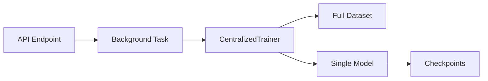
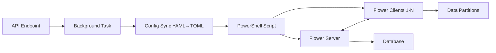
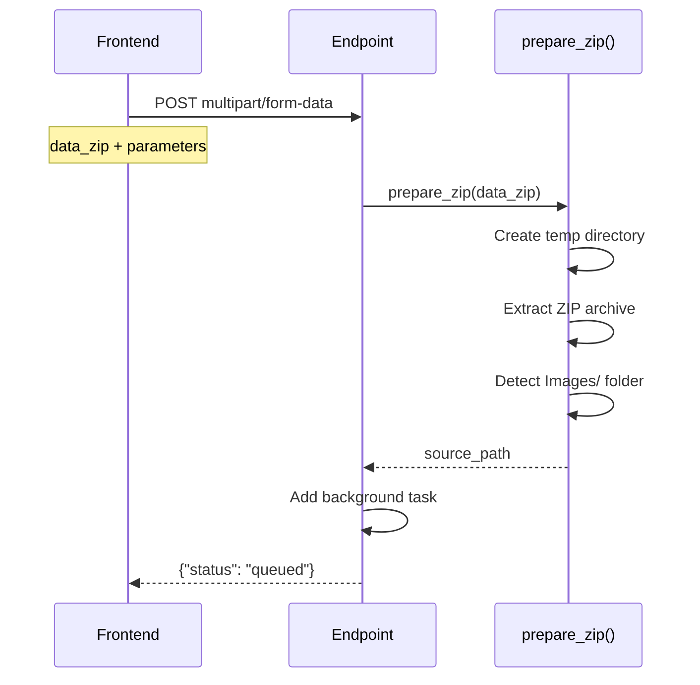
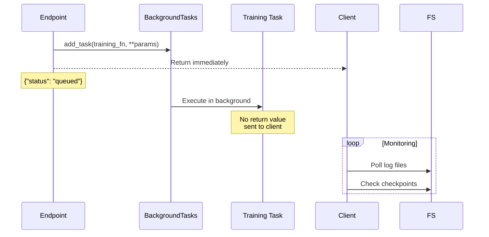

# Experiment Training Endpoints

This directory documents the training experiment endpoints for pneumonia detection models.

---

## Endpoint Overview

| Endpoint | Type | Primary Files | Status Tracking |
|----------|------|---------------|-----------------|
| `POST /experiments/centralized/train` | Centralized | `centralized_endpoints.py`<br/>`centralized_tasks.py`<br/>`centralized_trainer.py` | Log files + checkpoints |
| `POST /experiments/federated/train` | Federated | `federated_endpoints.py`<br/>`federated_tasks.py`<br/>`rf.ps1` + Flower | PowerShell output + DB |

---

## Architecture Comparison

### Centralized Training



**Characteristics**:
- All data processed by single trainer instance
- Standard supervised learning approach
- Direct Python execution (no subprocess)
- Simpler configuration management
- Faster for smaller datasets

### Federated Training



**Characteristics**:
- Data partitioned across multiple clients
- Federated averaging (FedAvg) aggregation
- Subprocess orchestration (PowerShell)
- Complex config flow (YAML → TOML)
- Privacy-preserving (data stays distributed)

---

## Common Flow: Upload & Preparation

Both endpoints share the initial upload handling:



**Shared Utilities**:
- `file_handling.py:prepare_zip()` - ZIP extraction and path detection
- `BackgroundTasks` - FastAPI async task execution
- Form validation via FastAPI `Form()` and `File()`

---

## Key Differences

| Aspect | Centralized | Federated |
|--------|-------------|-----------|
| **Execution Model** | Direct Python call | PowerShell subprocess |
| **Configuration** | YAML only | YAML → TOML sync required |
| **Data Distribution** | Single dataset | Partitioned across clients |
| **Training Algorithm** | Standard SGD | Federated Averaging (FedAvg) |
| **Rounds** | Epochs only | Server rounds × local epochs |
| **Environment Variables** | Not critical | Database creds required |
| **Process Count** | 1 (trainer) | N+1 (server + N clients) |
| **Aggregation** | N/A | Server-side model averaging |

---

## Configuration Management

### Centralized

```python
config_path = r"federated_pneumonia_detection\config\default_config.yaml"
trainer = CentralizedTrainer(
    config_path=config_path,
    checkpoint_dir=checkpoint_dir,
    logs_dir=logs_dir,
)
```

**Single Source**: YAML file loaded directly by trainer.

### Federated

```python
# Step 1: Update YAML
config_manager.set("experiment.file-path", csv_path)
config_manager.save()

# Step 2: Sync to TOML (CRITICAL)
flwr_configs = read_configs_to_toml()
update_flwr_config(**flwr_configs)

# Step 3: Flower reads from pyproject.toml
subprocess.Popen(["powershell", "rf.ps1"], env=env)
```

**Dual Source**: YAML → TOML synchronization required before Flower execution.

---

## Error Handling Patterns

### Common Errors

| Error | Centralized Handler | Federated Handler |
|-------|---------------------|-------------------|
| ZIP extraction failure | `file_handling.py:72-76` | Same |
| Missing CSV file | Raised by trainer | `federated_tasks.py:40-43` |
| Missing Images/ folder | Raised by trainer | `federated_tasks.py:42-43` |
| Config load failure | Propagates to endpoint | `federated_tasks.py:198-207` |

### Endpoint-Specific Errors

**Centralized**:
```python
# centralized_tasks.py:63-65
except Exception as e:
    task_logger.error(f"Error: {type(e).__name__}: {str(e)}")
    return {"status": "failed", "error": str(e)}
```

**Federated**:
```python
# federated_tasks.py:189-196
except FileNotFoundError as e:
    task_logger.error(f"File not found error: {str(e)}")
    return {
        "message": f"Federated training failed: {str(e)}",
        "status": "failed",
        "error": str(e),
    }
```

---

## Background Task Lifecycle



**Important**: Background tasks return values are NOT sent to the client. Monitoring relies on:
1. Log files
2. Checkpoint files
3. Database records (federated only)

---

## Monitoring & Observability

### Centralized

**Log Files**: `{logs_dir}/`
```
Training progress
Loss curves
Validation metrics per epoch
Final model performance
```

**Checkpoints**: `{checkpoint_dir}/`
```
best_model.pth (based on validation loss)
Epoch-specific checkpoints (optional)
```

### Federated

**Task Logger**: Prefixed with `[FLWR]`
```
Config synchronization status
PowerShell process output
Server round progress
Client training logs
Aggregation metrics
```

**Database Records**:
- Experiment metadata
- Per-round metrics
- Client-specific performance
- Aggregated model checkpoints

**PowerShell Exit Code**:
- `0` = Success
- Non-zero = Failure (check logs)

---

## File Organization

```
federated_pneumonia_detection/src/api/endpoints/experiments/
├── centralized_endpoints.py         # API route: /centralized/train
├── federated_endpoints.py           # API route: /federated/train
└── utils/
    ├── __init__.py                  # Exports all utilities
    ├── centralized_tasks.py         # Background task logic
    ├── federated_tasks.py           # Background task + config sync
    ├── file_handling.py             # prepare_zip() shared utility
    └── status_utils.py              # Progress tracking helpers
```

---

## Security Considerations

### Input Validation

**File Upload**:
- ZIP file verification happens on client side (trusted source)
- Temporary directory cleanup on errors
- Path traversal prevention via controlled extraction

**Form Parameters**:
- FastAPI automatic type validation
- Default values prevent missing parameters
- No user input in subprocess commands

### Subprocess Execution (Federated Only)

```python
# federated_tasks.py:129-135
ps_cmd = [
    "powershell",
    "-ExecutionPolicy", "Bypass",  # Required for script execution
    "-File", str(rf_script_path),  # Hardcoded script path
]
# No user input in command - safe from injection
```

**Bandit Suppressions**:
- `B404`: subprocess import justified for controlled orchestration
- `B603`: command arguments are hardcoded, not from user input

---

## Testing Strategy

### Integration Tests

**Centralized**: `tests/integration/api/endpoints/experiments/test_centralized_endpoints.py`
- Mock `prepare_zip` to return test data path
- Mock `CentralizedTrainer` to avoid actual training
- Verify background task queuing
- Check response format

**Federated**: (Test file TBD)
- Mock `prepare_zip` and `ConfigManager`
- Mock subprocess execution
- Verify TOML synchronization
- Check environment variable handling

### Unit Tests

**Centralized**: `tests/unit/api/endpoints/experiments/test_centralized_tasks.py`
- Test `run_centralized_training_task` with fixtures
- Mock trainer methods
- Verify error handling

**Federated**: `tests/unit/api/endpoints/experiments/test_federated_tasks.py`
- Test config update logic
- Mock TOML sync functions
- Test environment variable validation

---

## Related Documentation

- [Centralized Training Flow](./centralized_training.md)
- [Federated Training Flow](./federated_training.md)
- [API Layer Architecture](../../../../federated_pneumonia_detection/src/api/CLAUDE.md)
- [Configuration Management](../../../../federated_pneumonia_detection/config/README.md)

---

## Quick Reference

### Start Centralized Training

```bash
curl -X POST "http://localhost:8000/api/experiments/centralized/train" \
  -F "data_zip=@dataset.zip" \
  -F "experiment_name=my_experiment" \
  -F "checkpoint_dir=results/my_run/checkpoints" \
  -F "logs_dir=results/my_run/logs" \
  -F "csv_filename=metadata.csv"
```

### Start Federated Training

```bash
curl -X POST "http://localhost:8000/api/experiments/federated/train" \
  -F "data_zip=@dataset.zip" \
  -F "experiment_name=my_fed_experiment" \
  -F "csv_filename=metadata.csv" \
  -F "num_server_rounds=5"
```

### Monitor Progress

```bash
# Centralized
tail -f results/centralized/logs/training.log

# Federated
# Check FastAPI logs for [FLWR] prefixed output
# Or query database for experiment status
```
