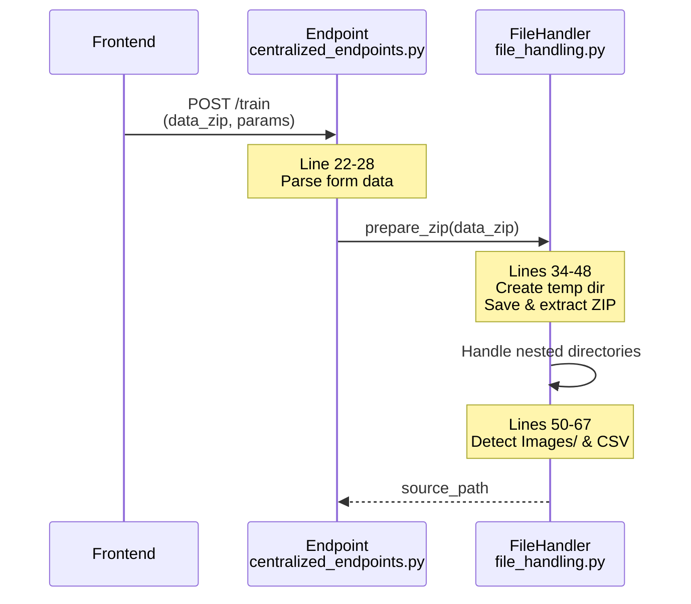
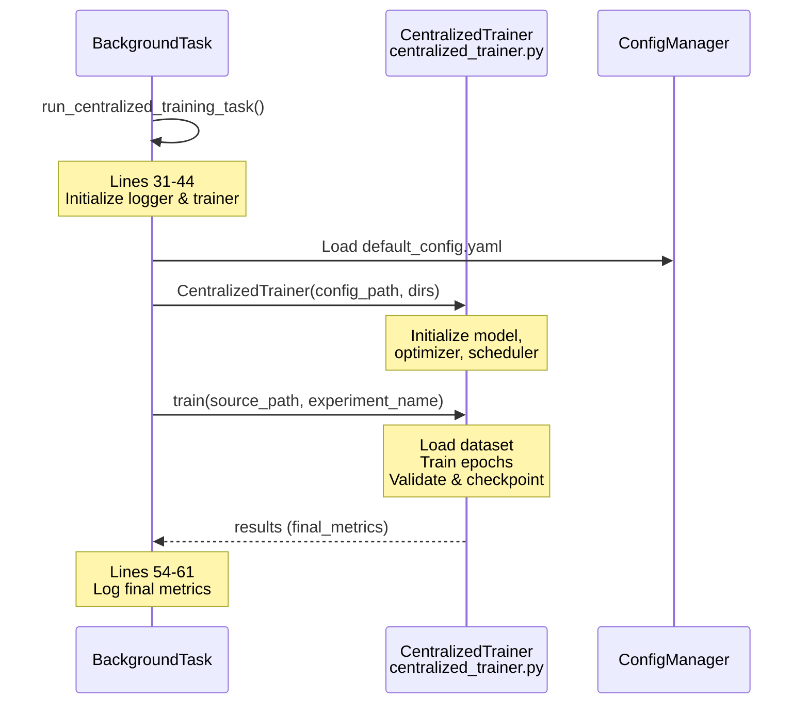
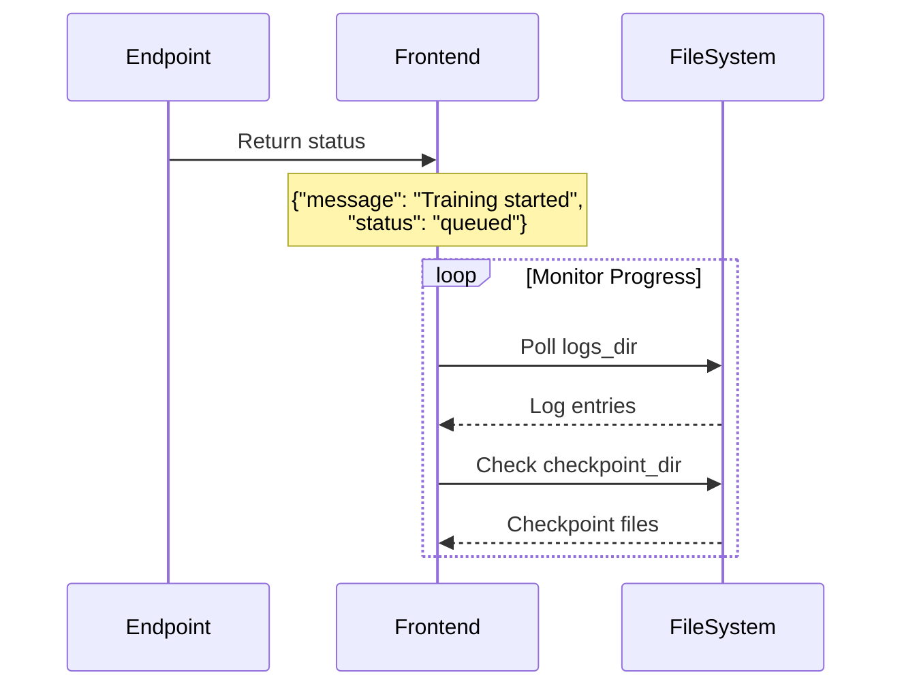
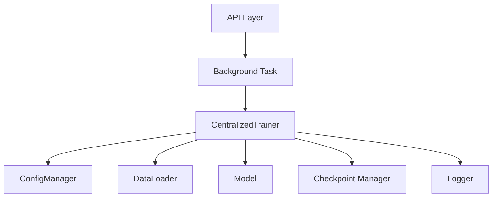

# Centralized Training Flow

**API**: `POST /api/experiments/centralized/train`
**Entry Point**: `centralized_endpoints.py:21-80` → `centralized_tasks.py:11-66`

---

## Overview

Centralized training uses all training data in a single unified trainer (no data partitioning across clients). The endpoint accepts a ZIP archive containing medical images and metadata, extracts the data, and executes training in a background task.

---

## Step 1: Upload & Validation

**Files**:
- `centralized_endpoints.py` (lines 21-59)
- `file_handling.py` (lines 17-77)



**Key Code**:
```python
# centralized_endpoints.py lines 59-67
source_path = await prepare_zip(data_zip, logger, experiment_name)
background_tasks.add_task(
    run_centralized_training_task,
    source_path=source_path,
    checkpoint_dir=checkpoint_dir,
    logs_dir=logs_dir,
    experiment_name=experiment_name,
    csv_filename=csv_filename,
)
```

**Form Parameters**:
| Parameter | Default | Purpose |
|-----------|---------|---------|
| `data_zip` | (required) | ZIP containing Images/ + metadata CSV |
| `checkpoint_dir` | `results/centralized/checkpoints` | Model checkpoint save location |
| `logs_dir` | `results/centralized/logs` | Training logs location |
| `experiment_name` | `pneumonia_centralized` | Experiment identifier |
| `csv_filename` | `stage2_train_metadata.csv` | Metadata file name |

---

## Step 2: Background Task Execution

**Files**:
- `centralized_tasks.py` (lines 11-66)
- `centralized_trainer.py` (lines TBD - Core training logic)



**Key Code**:
```python
# centralized_tasks.py lines 40-52
trainer = CentralizedTrainer(
    config_path=config_path,
    checkpoint_dir=checkpoint_dir,
    logs_dir=logs_dir,
)

results = trainer.train(
    source_path=source_path,
    experiment_name=experiment_name,
    csv_filename=csv_filename,
)
```

---

## Step 3: Response & Tracking

**Files**:
- `centralized_endpoints.py` (lines 69-75)



**Response Format**:
```json
{
  "message": "Centralized training started successfully",
  "experiment_name": "pneumonia_centralized",
  "checkpoint_dir": "results/centralized/checkpoints",
  "logs_dir": "results/centralized/logs",
  "status": "queued"
}
```

---

## Error Handling

**Files**:
- `centralized_endpoints.py` (lines 76-80)
- `centralized_tasks.py` (lines 63-65)

| Error Type | Handler Location | Response |
|------------|------------------|----------|
| File extraction failure | `file_handling.py:72-76` | Cleanup temp dir, re-raise |
| Training exception | `centralized_tasks.py:63-65` | `{"status": "failed", "error": str(e)}` |
| Endpoint exception | `centralized_endpoints.py:76-80` | Log error, cleanup temp dir, raise |

**Error Flow**:
```python
# centralized_tasks.py lines 63-65
except Exception as e:
    task_logger.error(f"Error: {type(e).__name__}: {str(e)}")
    return {"status": "failed", "error": str(e)}
```

---

## File Reference

| Layer | File | Key Lines | Purpose |
|-------|------|-----------|---------|
| **API** | `centralized_endpoints.py` | 21-80 | Endpoint definition, validation |
| **Utils** | `file_handling.py` | 17-77 | ZIP extraction & path handling |
| **Task** | `centralized_tasks.py` | 11-66 | Background training orchestration |
| **Core** | `centralized_trainer.py` | N/A | Model training logic |
| **Config** | `default_config.yaml` | N/A | Hyperparameters, paths |

---

## Configuration Dependencies

```python
# centralized_tasks.py line 39
config_path = r"federated_pneumonia_detection\config\default_config.yaml"
```

**Config Keys Used**:
- Model architecture settings
- Training hyperparameters (epochs, batch size, learning rate)
- Data augmentation parameters
- Early stopping criteria

---

## Monitoring Points

1. **Log Files**: `{logs_dir}/` - Training progress, loss curves, validation metrics
2. **Checkpoints**: `{checkpoint_dir}/` - Best model weights based on validation performance
3. **Return Value**: `results["final_metrics"]` - Final accuracy, loss, precision, recall

---

## Integration with Control Layer



**Dependency Flow**:
- API → Task (orchestration)
- Task → Trainer (execution)
- Trainer → Config (settings)
- Trainer → Data/Model/Logging (resources)
