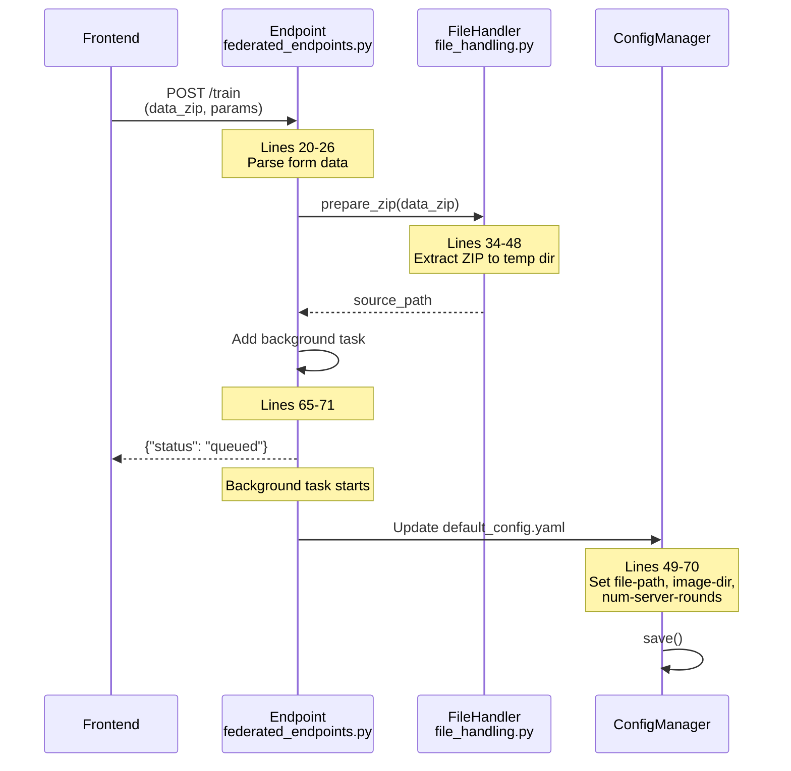
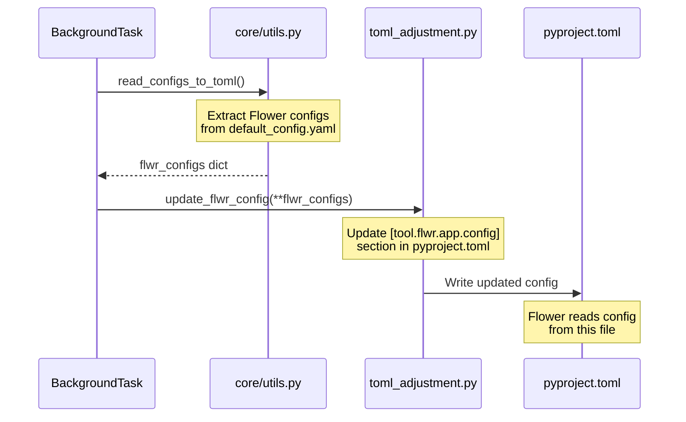
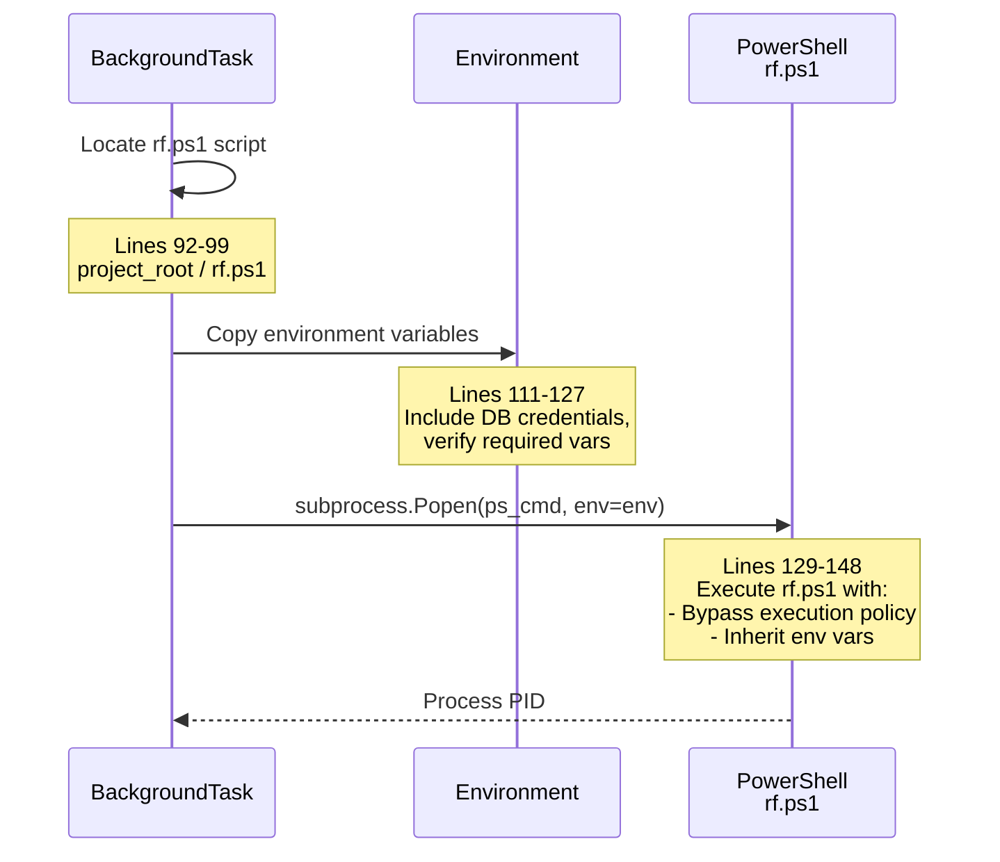
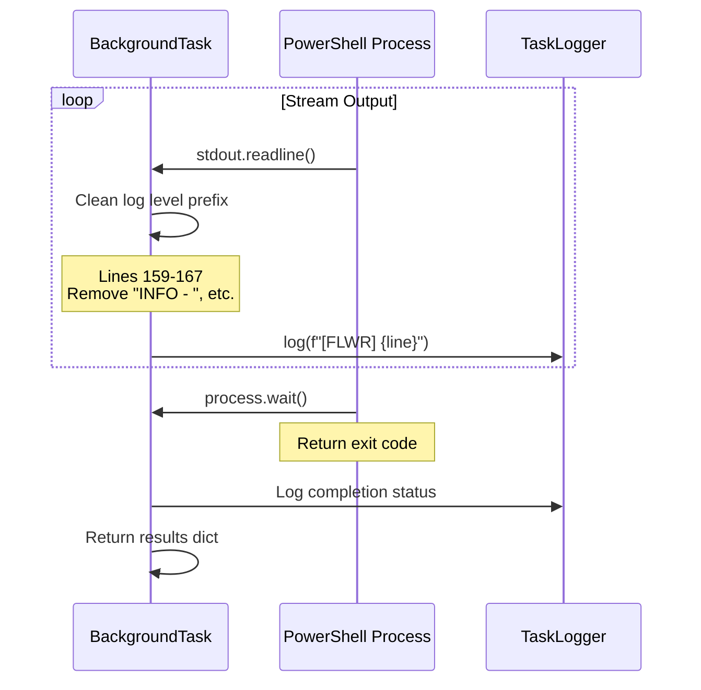
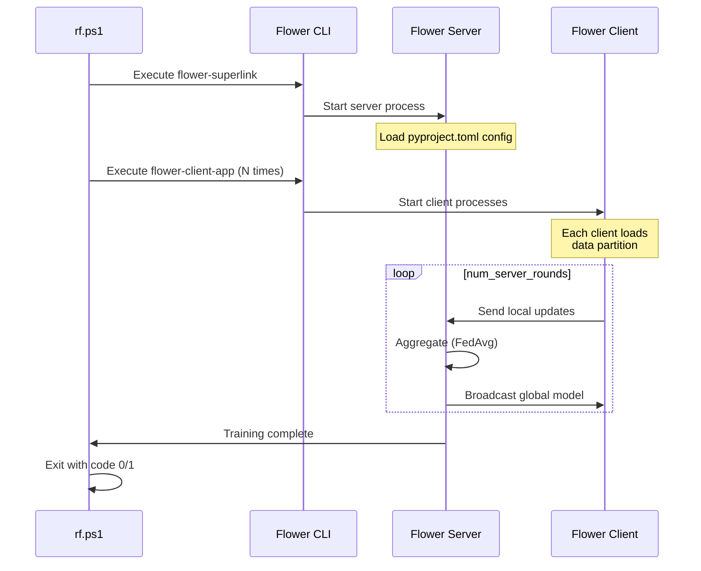
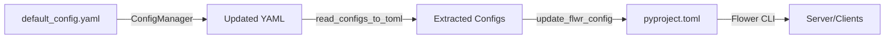
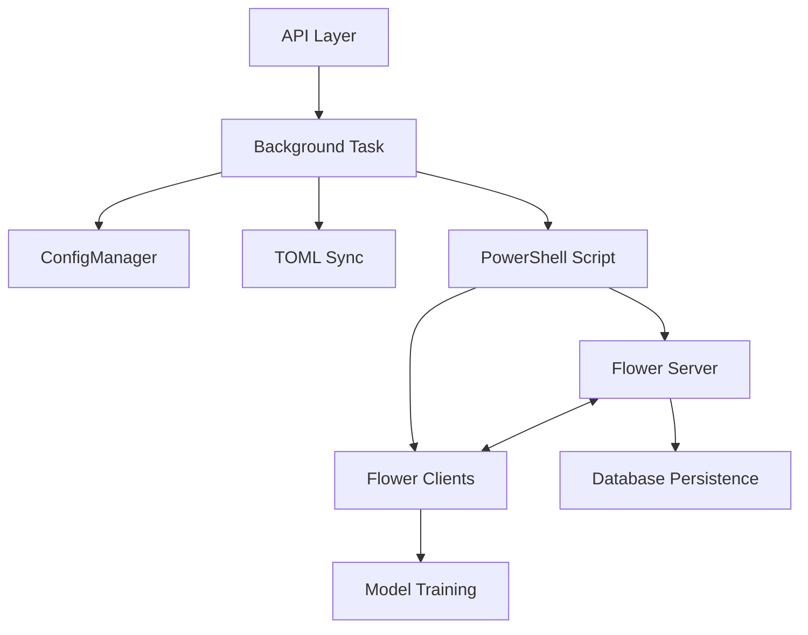

# Federated Training Flow

**API**: `POST /api/experiments/federated/train`
**Entry Point**: `federated_endpoints.py:19-86` → `federated_tasks.py:14-208`

---

## Overview

Federated training distributes data across multiple clients and aggregates model updates using the Flower framework. The endpoint uploads training data, updates configuration files, and spawns a PowerShell script (`rf.ps1`) that orchestrates the federated learning process.

---

## Step 1: Upload & Configuration Update

**Files**:
- `federated_endpoints.py` (lines 19-63)
- `file_handling.py` (lines 17-77)
- `federated_tasks.py` (lines 36-88)



**Key Code**:
```python
# federated_tasks.py lines 60-63
config_manager.set("experiment.file-path", csv_path)
config_manager.set("experiment.image-dir", image_dir)
config_manager.set("experiment.num-server-rounds", num_server_rounds)
config_manager.save()
```

**Form Parameters**:
| Parameter | Default | Purpose |
|-----------|---------|---------|
| `data_zip` | (required) | ZIP containing Images/ + metadata CSV |
| `experiment_name` | `pneumonia_federated` | Experiment identifier |
| `csv_filename` | `stage2_train_metadata.csv` | Metadata file name |
| `num_server_rounds` | 3 | Federated learning rounds |

---

## Step 2: TOML Synchronization (Critical)

**Files**:
- `federated_tasks.py` (lines 72-88)
- `core/utils.py` (function: `read_configs_to_toml`)
- `toml_adjustment.py` (function: `update_flwr_config`)



**Key Code**:
```python
# federated_tasks.py lines 75-86
from federated_pneumonia_detection.src.control.federated_new_version.core.utils import (
    read_configs_to_toml,
)
from federated_pneumonia_detection.src.control.federated_new_version.toml_adjustment import (
    update_flwr_config,
)

flwr_configs = read_configs_to_toml()
if flwr_configs:
    task_logger.info(f"  Configs to sync: {flwr_configs}")
    update_flwr_config(**flwr_configs)
```

**Why This Matters**:
- Flower framework reads configuration from `pyproject.toml`
- YAML config must be synced to TOML BEFORE starting Flower
- Failure to sync causes Flower to use stale/incorrect parameters

---

## Step 3: Environment Setup & Subprocess Spawn

**Files**:
- `federated_tasks.py` (lines 90-148)



**Key Code**:
```python
# federated_tasks.py lines 111-128
env = os.environ.copy()  # Copy current environment (includes .env vars)

# Verify critical env vars are present
required_vars = [
    "POSTGRES_DB_URI",
    "POSTGRES_DB",
    "POSTGRES_USER",
    "POSTGRES_PASSWORD",
]
missing_vars = [var for var in required_vars if var not in env]
if missing_vars:
    task_logger.warning(f"[WARN] Missing environment variables: {missing_vars}")
```

**PowerShell Command**:
```python
# federated_tasks.py lines 129-148
ps_cmd = [
    "powershell",
    "-ExecutionPolicy", "Bypass",
    "-File", str(rf_script_path),
]

process = subprocess.Popen(
    ps_cmd,
    cwd=str(project_root),
    stdout=subprocess.PIPE,
    stderr=subprocess.STDOUT,
    text=True,
    bufsize=1,
    env=env,  # CRITICAL: Pass environment to subprocess
)
```

**Environment Variables Required**:
| Variable | Purpose |
|----------|---------|
| `POSTGRES_DB_URI` | Database connection string |
| `POSTGRES_DB` | Database name |
| `POSTGRES_USER` | Database username |
| `POSTGRES_PASSWORD` | Database password |

---

## Step 4: Output Streaming & Completion

**Files**:
- `federated_tasks.py` (lines 152-187)



**Key Code**:
```python
# federated_tasks.py lines 152-172
if process.stdout:
    for line in iter(process.stdout.readline, ""):
        if line:
            stripped_line = line.rstrip()
            # Remove duplicate log level prefixes
            for level in ["INFO", "WARNING", "ERROR", "DEBUG", "CRITICAL"]:
                if stripped_line.startswith(f"{level} - "):
                    stripped_line = stripped_line[len(level) + 3:]
                    break
            task_logger.info(f"[FLWR] {stripped_line}")

return_code = process.wait()
```

**Return Value**:
```python
# federated_tasks.py lines 180-187
{
    "message": "Federated training completed",
    "experiment_name": experiment_name,
    "status": "completed" if return_code == 0 else "failed",
    "return_code": return_code,
    "source_path": source_path,
    "csv_filename": csv_filename,
}
```

---

## Step 5: Flower Execution (External Process)

**Files**:
- `rf.ps1` (PowerShell orchestration script)
- Flower framework (`flwr` CLI)



---

## Error Handling

**Files**:
- `federated_tasks.py` (lines 189-207)

| Error Type | Handler Location | Response |
|------------|------------------|----------|
| File not found | `federated_tasks.py:189-196` | `{"status": "failed", "error": str(e)}` |
| Config update failure | `federated_tasks.py:198-207` | Log exception with traceback |
| PowerShell script missing | `federated_tasks.py:96-97` | Raise `FileNotFoundError` |
| Missing environment vars | `federated_tasks.py:123-126` | Warning logged, may fail later |

**Error Flow**:
```python
# federated_tasks.py lines 198-207
except Exception as e:
    task_logger.error(
        f"Unexpected error during federated training: {str(e)}",
        exc_info=True,
    )
    return {
        "message": f"Federated training failed: {str(e)}",
        "experiment_name": experiment_name,
        "status": "failed",
        "error": str(e),
    }
```

---

## File Reference

| Layer | File | Key Lines | Purpose |
|-------|------|-----------|---------|
| **API** | `federated_endpoints.py` | 19-86 | Endpoint definition, validation |
| **Utils** | `file_handling.py` | 17-77 | ZIP extraction & path handling |
| **Task** | `federated_tasks.py` | 14-208 | Config update, TOML sync, subprocess orchestration |
| **Config** | `default_config.yaml` | N/A | Primary configuration source |
| **TOML** | `pyproject.toml` | N/A | Flower framework configuration |
| **Script** | `rf.ps1` | N/A | PowerShell orchestration script |
| **Core** | `core/utils.py` | N/A | Config-to-TOML transformation |
| **Adjustment** | `toml_adjustment.py` | N/A | TOML file updater |

---

## Configuration Flow



**Critical Sequence**:
1. Update `default_config.yaml` (lines 60-63)
2. Extract Flower configs (lines 82)
3. Sync to `pyproject.toml` (lines 85)
4. Start Flower process (lines 140-148)

**Failure Point**: If step 3 is skipped, Flower uses stale config values.

---

## Monitoring Points

1. **Task Logs**: `[FLWR]` prefixed lines streamed from PowerShell process
2. **Return Code**: `0` = success, non-zero = failure
3. **Environment Validation**: Missing DB vars logged as warnings
4. **Config Sync**: `[OK] pyproject.toml updated successfully`

---

## Integration with Control Layer



**Dependency Flow**:
- API → Task (orchestration)
- Task → Config (update YAML + TOML)
- Task → Subprocess (spawn rf.ps1)
- rf.ps1 → Flower (server + clients)
- Flower → Database (metrics, checkpoints)

---

## Security Considerations

**Subprocess Execution**:
```python
# federated_tasks.py lines 140, 147
process = subprocess.Popen(  # nosec B603 - hardcoded command args
    ps_cmd,  # nosec B603 - not user input
    ...
    env=env,  # nosec - environment vars are sanitized
)
```

**Bandit Suppressions**:
- `B404`: subprocess import allowed for controlled script execution
- `B603`: command args are hardcoded, not from user input

**Environment Variable Handling**:
- All vars copied from FastAPI process (loaded from `.env`)
- No user input directly injected into environment
- Missing vars logged as warnings (not failures)
