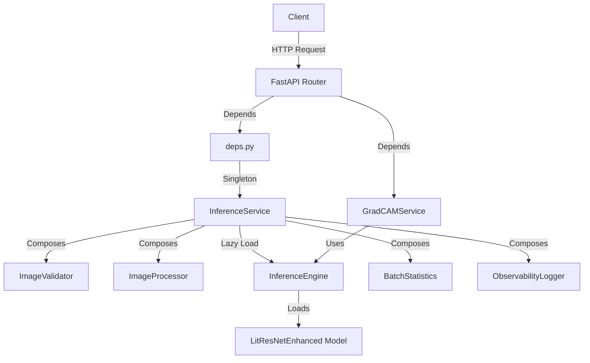

# Inference API Documentation Index

Complete sequence diagram documentation for the X-ray pneumonia detection inference endpoints.

---

## Available Flows

| Flow | Endpoint | Documentation |
|------|----------|---------------|
| **Single Prediction** | `POST /api/inference/predict` | [single_prediction.md](./single_prediction.md) |
| **Batch Prediction** | `POST /api/inference/predict-batch` | [batch_prediction.md](./batch_prediction.md) |
| **Health Check** | `GET /api/inference/health` | [health_check.md](./health_check.md) |
| **GradCAM Heatmap** | `POST /api/inference/heatmap` | [gradcam_heatmap.md](./gradcam_heatmap.md) |
| **Batch GradCAM** | `POST /api/inference/heatmap-batch` | [gradcam_heatmap.md](./gradcam_heatmap.md) |

---

## Architecture Overview



---

## Layer Breakdown

| Layer | Components | Responsibility |
|-------|------------|--------------|
| **API** | `single_prediction_endpoint.py`<br/>`batch_prediction_endpoints.py`<br/>`health_endpoints.py`<br/>`gradcam_endpoints.py` | Route handling, request validation, dependency injection |
| **Dependency** | `deps.py` | Singleton management, service instantiation |
| **Control** | `inference_service.py` | Business logic orchestration |
| **Control/Internals** | `inference_engine.py`<br/>`image_validator.py`<br/>`image_processor.py`<br/>`batch_statistics.py` | Core inference, validation, processing |
| **Schema** | `inference_schemas.py` | Pydantic request/response models |

---

## Common Patterns

### 1. Singleton Pattern
All services use module-level singletons for resource efficiency:

```python
# deps.py pattern
_service_instance: Optional[InferenceService] = None

def get_inference_service() -> InferenceService:
    global _service_instance
    if _service_instance is None:
        _service_instance = InferenceService()
    return _service_instance
```

### 2. Lazy Loading
The InferenceEngine is loaded only on first use:

```python
# inference_service.py:51-56
@property
def engine(self) -> Optional[InferenceEngine]:
    if self._engine is None:
        self._engine = _get_engine_singleton()
    return self._engine
```

### 3. Composition Over Inheritance
InferenceService composes multiple small components:

```python
# inference_service.py:46-49
self.validator = ImageValidator()
self.processor = ImageProcessor()
self.batch_stats = BatchStatistics()
self.logger = ObservabilityLogger()
```

---

## Error Handling

| Error Type | HTTP Status | Source |
|------------|-------------|--------|
| Invalid file type | 400 | `ImageValidator.validate_or_raise()` |
| Model not ready | 503 | `InferenceService.check_ready_or_raise()` |
| Batch size exceeded | 400 | `InferenceService.predict_batch()` |
| Image processing failed | 400 | `ImageProcessor.read_from_upload()` |
| GradCAM generation failed | 500 | `GradCAMService.generate_single_heatmap()` |

---

## File Locations

```
federated_pneumonia_detection/src/
├── api/
│   ├── deps.py                              # Dependency injection
│   └── endpoints/
│       ├── inference/
│       │   ├── single_prediction_endpoint.py    # POST /predict
│       │   ├── batch_prediction_endpoints.py    # POST /predict-batch
│       │   ├── health_endpoints.py              # GET /health
│       │   ├── gradcam_endpoints.py             # POST /heatmap*
│       │   └── __init__.py                      # Router exports
│       └── schema/
│           └── inference_schemas.py         # Pydantic models
└── control/
    └── model_inferance/
        ├── inference_service.py             # Main service facade
        └── internals/
            ├── inference_engine.py          # Model loading & inference
            ├── image_validator.py           # File validation
            ├── image_processor.py           # Image I/O
            ├── batch_statistics.py          # Stats calculation
            └── observability_logger.py      # Logging
```

---

## Quick Reference: API Endpoints

| Method | Endpoint | Request | Response |
|--------|----------|---------|----------|
| POST | `/api/inference/predict` | `UploadFile` | `InferenceResponse` |
| POST | `/api/inference/predict-batch` | `List[UploadFile]` | `BatchInferenceResponse` |
| GET | `/api/inference/health` | - | `HealthCheckResponse` |
| POST | `/api/inference/heatmap` | `UploadFile` + query params | `HeatmapResponse` |
| POST | `/api/inference/heatmap-batch` | `List[UploadFile]` + query params | `BatchHeatmapResponse` |

---

## Related Documentation

- [Backend Architecture](../../../../../federated_pneumonia_detection/AGENTS.md)
- [Control Layer](../../../../../federated_pneumonia_detection/src/control/AGENTS.md)
- [API Layer](../../../../../federated_pneumonia_detection/src/api/AGENTS.md)
