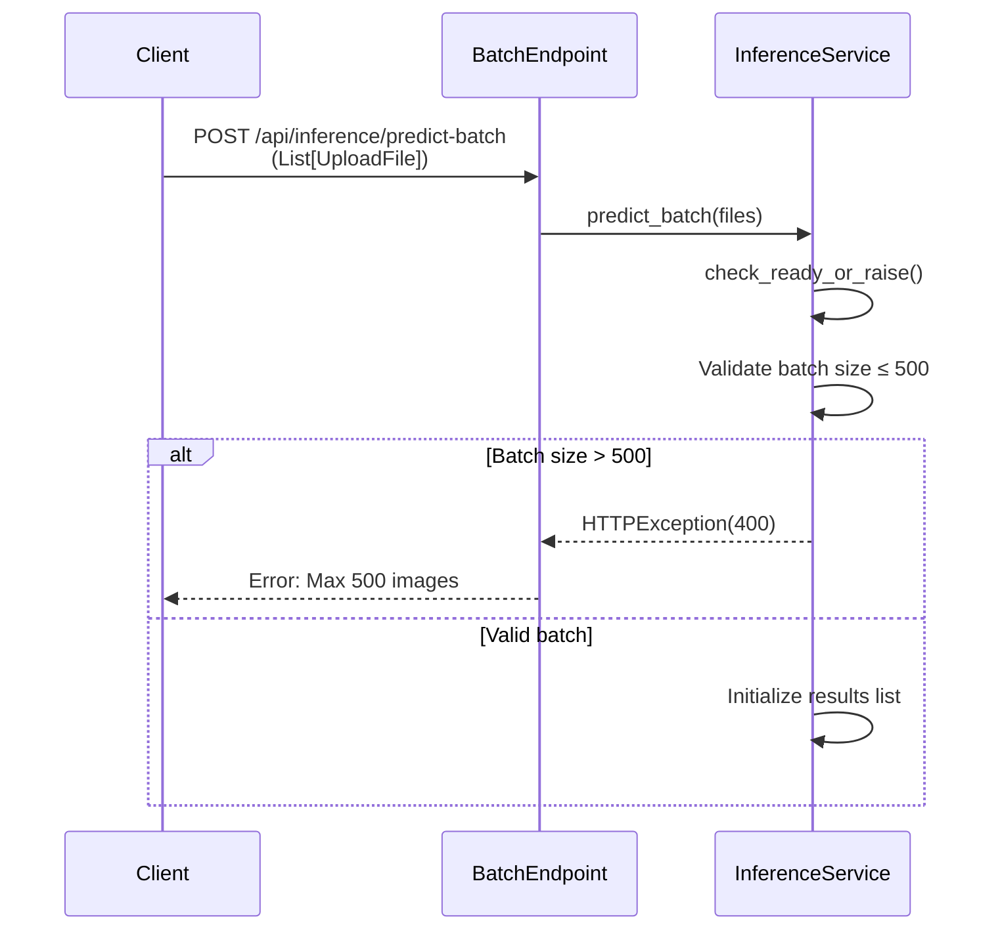
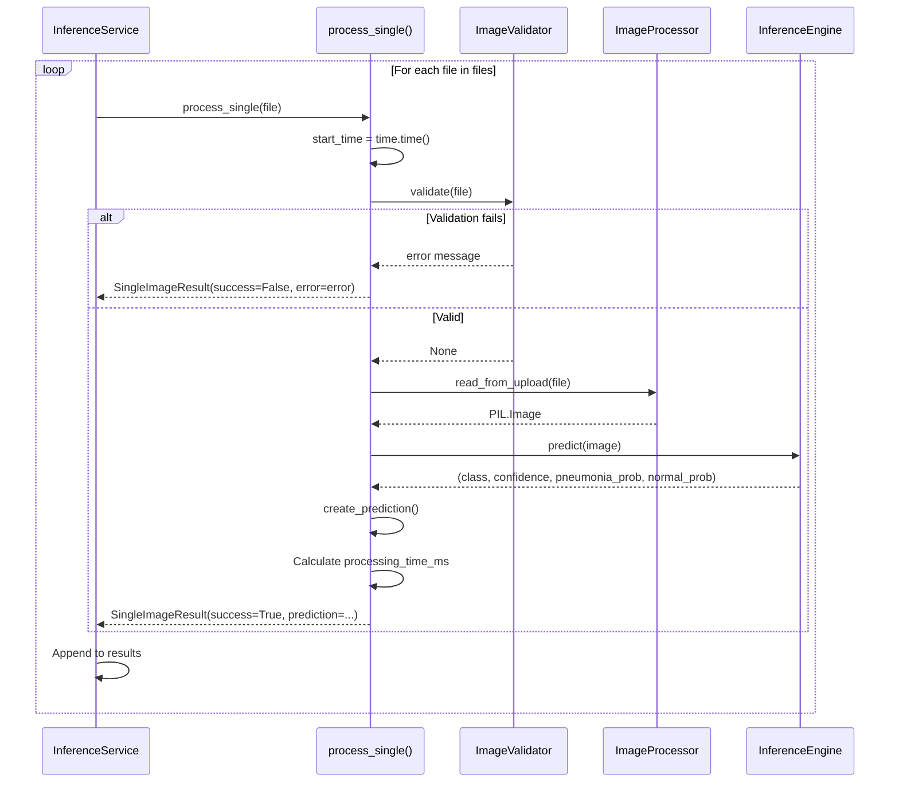
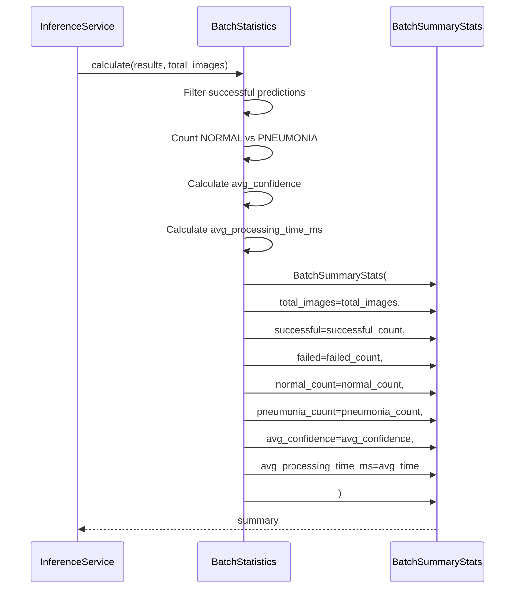
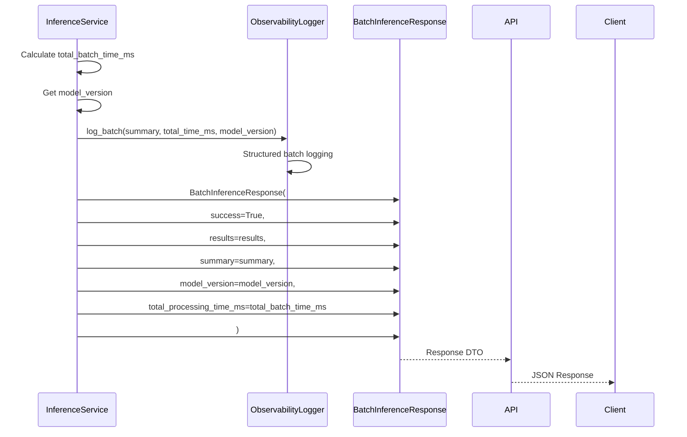

# Inference API - Batch Prediction Flow

**API**: `POST /api/inference/predict-batch`
**Entry**: `batch_prediction_endpoints.py:20-33` → `InferenceService.predict_batch()`

---

## Step 1: Request Validation & Batch Size Check

**Files**:
- `batch_prediction_endpoints.py` (lines 20-33)
- `inference_service.py` (lines 200-250)



**Key Code**:
```python
# inference_service.py:219-224
max_batch_size = 500
if len(files) > max_batch_size:
    raise HTTPException(
        status_code=400,
        detail=f"Maximum {max_batch_size} images allowed per batch request.",
    )
```

---

## Step 2: Sequential Single Image Processing

**Files**:
- `inference_service.py` (lines 226-230, 91-136)



**Key Code**:
```python
# inference_service.py:226-230
results = []
for file in files:
    result = await self.process_single(file=file)
    results.append(result)
    logger.info(f"Batch processing: {file.filename}, success: {result.success}")
```

---

## Step 3: Batch Statistics Calculation

**Files**:
- `inference_service.py` (lines 232)
- `batch_statistics.py` (lines 15-50)



**Key Code**:
```python
# batch_statistics.py:15-50
def calculate(
    self,
    results: List[SingleImageResult],
    total_images: int,
) -> BatchSummaryStats:
    successful = [r.prediction for r in results if r.success and r.prediction]
    successful_count = len(successful)
    
    normal_count = sum(
        1 for p in successful if p.predicted_class == PredictionClass.NORMAL
    )
    pneumonia_count = sum(
        1 for p in successful if p.predicted_class == PredictionClass.PNEUMONIA
    )
    
    avg_confidence = (
        sum(p.confidence for p in successful) / successful_count
        if successful_count > 0
        else 0.0
    )
```

---

## Step 4: Batch Observability Logging & Response Assembly

**Files**:
- `inference_service.py` (lines 234-250)
- `inference_schemas.py` (lines 118-140, 142-158)



**Key Code**:
```python
# inference_service.py:244-250
return BatchInferenceResponse(
    success=True,
    results=results,
    summary=summary,
    model_version=model_version,
    total_processing_time_ms=total_batch_time_ms,
)

# inference_schemas.py:142-158
class BatchInferenceResponse(BaseModel):
    success: bool = True
    results: List[SingleImageResult]
    summary: BatchSummaryStats
    model_version: str
    total_processing_time_ms: float
```

---

## File Reference

| Layer | File | Key Lines | Purpose |
|-------|------|-----------|---------|
| **API** | `batch_prediction_endpoints.py` | 20-33 | Batch route handler |
| **Control** | `inference_service.py` | 200-250 | Batch orchestration |
| **Control** | `inference_service.py` | 91-136 | Single image processing |
| **Control** | `batch_statistics.py` | 12-50 | Stats calculation |
| **Schema** | `inference_schemas.py` | 98-115 | SingleImageResult |
| **Schema** | `inference_schemas.py` | 118-140 | BatchSummaryStats |
| **Schema** | `inference_schemas.py` | 142-158 | BatchInferenceResponse |

---

## Data Transformations

| Stage | Input | Output | Transform |
|-------|-------|--------|-----------|
| Request | HTTP multipart | List[UploadFile] | FastAPI File() list |
| Validation | List[UploadFile] | List[UploadFile] | Size check ≤500 |
| Processing | UploadFile | SingleImageResult | Sequential inference |
| Aggregation | List[SingleImageResult] | BatchSummaryStats | Statistical summary |
| Response | DTOs | JSON | Pydantic serialization |

---

## Batch Processing Characteristics

| Property | Value | Notes |
|----------|-------|-------|
| Max Batch Size | 500 images | Hard limit for memory safety |
| Processing Mode | Sequential | One image at a time |
| Error Handling | Per-image | Failed images don't stop batch |
| Statistics | Aggregated | Success/failure counts, averages |
| Logging | Batch-level | Single log entry per batch |
