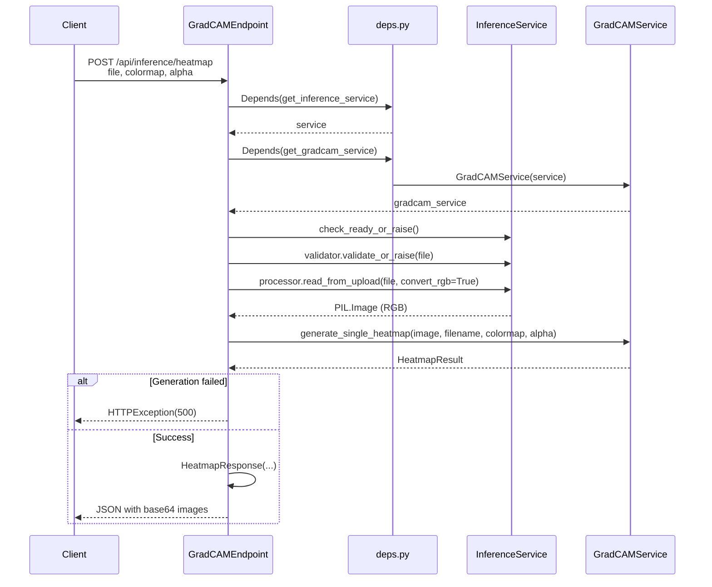
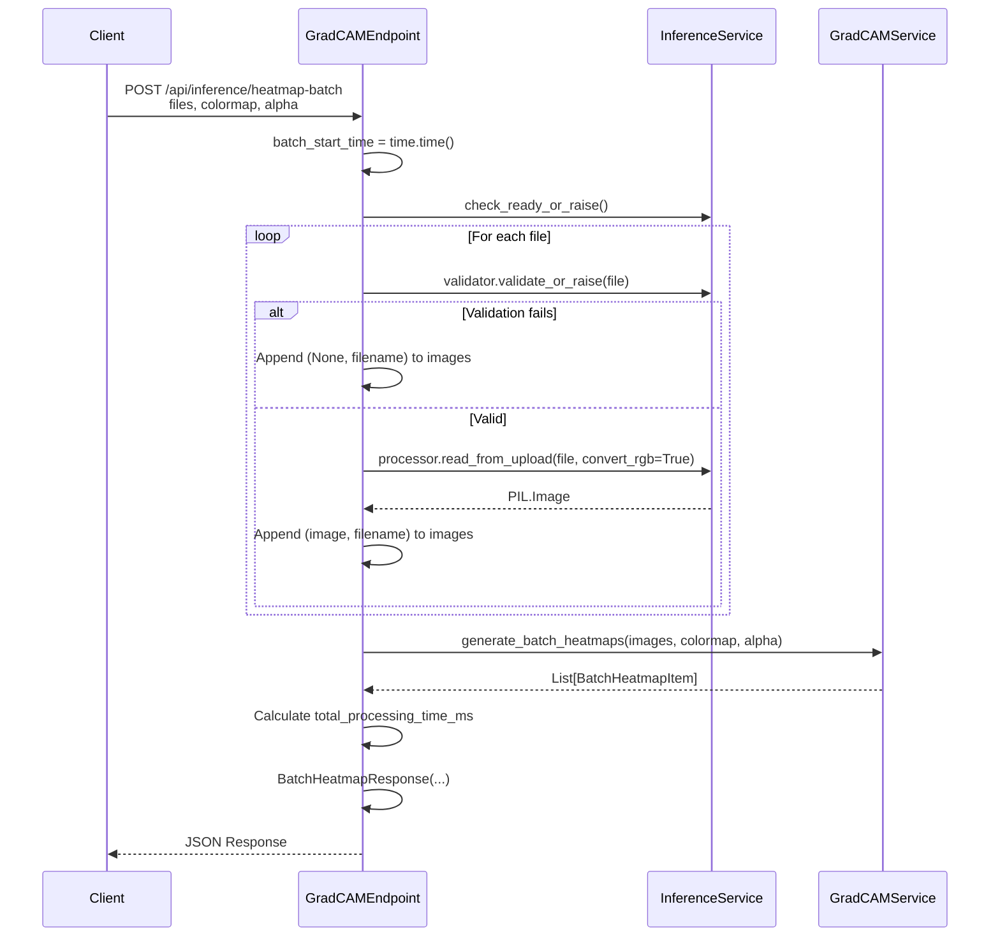
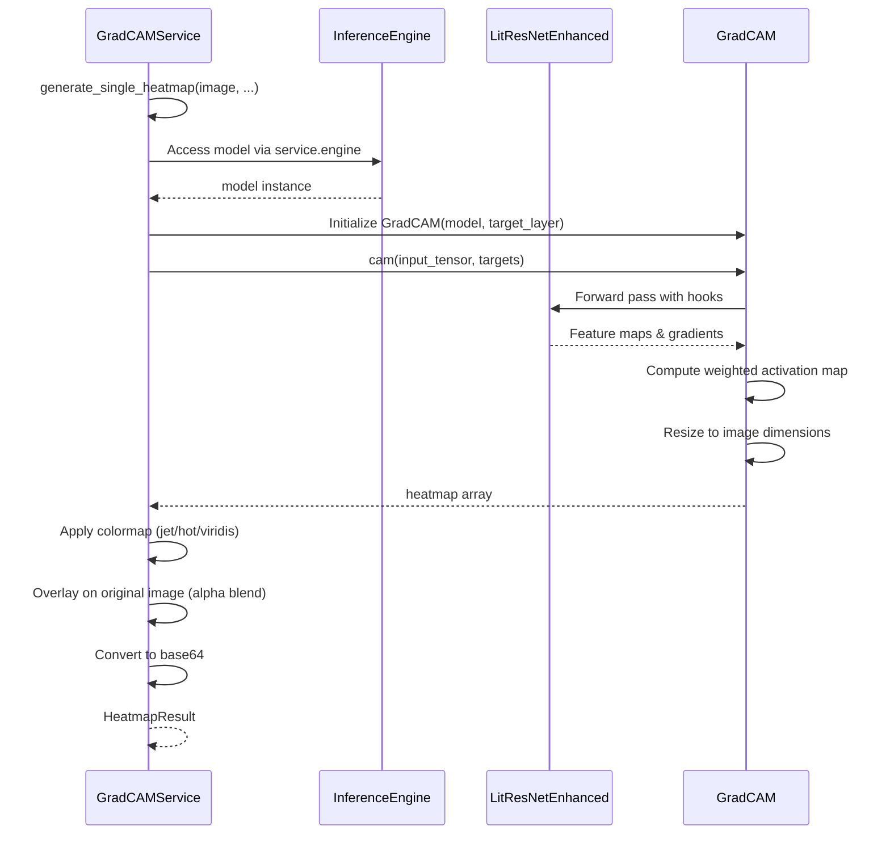

# Inference API - GradCAM Heatmap Flow

**API**: `POST /api/inference/heatmap` | `POST /api/inference/heatmap-batch`
**Entry**: `gradcam_endpoints.py:28-65` (single), `68-114` (batch)

---

## Step 1: Single Heatmap Generation

**Files**:
- `gradcam_endpoints.py` (lines 28-65)
- `deps.py` (lines 165-184)



**Key Code**:
```python
# gradcam_endpoints.py:28-65
@router.post("/heatmap", response_model=HeatmapResponse)
async def generate_heatmap(
    file: UploadFile = File(...),
    colormap: str = Query(default="jet"),
    alpha: float = Query(default=0.4, ge=0.1, le=0.9),
    service: InferenceService = Depends(get_inference_service),
    gradcam_service: GradCAMService = Depends(get_gradcam_service),
) -> HeatmapResponse:
    service.check_ready_or_raise()
    service.validator.validate_or_raise(file)
    image = await service.processor.read_from_upload(file, convert_rgb=True)
    
    result = await gradcam_service.generate_single_heatmap(...)
    if not result.success:
        raise HTTPException(status_code=500, detail=result.error)
    
    return HeatmapResponse(...)
```

---

## Step 2: Batch Heatmap Generation

**Files**:
- `gradcam_endpoints.py` (lines 68-114)



**Key Code**:
```python
# gradcam_endpoints.py:68-114
@router.post("/heatmap-batch", response_model=BatchHeatmapResponse)
async def generate_heatmaps_batch(
    files: List[UploadFile] = File(...),
    colormap: str = Query(default="jet"),
    alpha: float = Query(default=0.4, ge=0.1, le=0.9),
    service: InferenceService = Depends(get_inference_service),
    gradcam_service: GradCAMService = Depends(get_gradcam_service),
) -> BatchHeatmapResponse:
    batch_start_time = time.time()
    service.check_ready_or_raise()
    
    images = []
    for file in files:
        try:
            service.validator.validate_or_raise(file)
            image = await service.processor.read_from_upload(file, convert_rgb=True)
            images.append((image, file.filename or "unknown"))
        except HTTPException:
            images.append((None, file.filename or "unknown"))
    
    results = await gradcam_service.generate_batch_heatmaps(...)
    total_processing_time_ms = (time.time() - batch_start_time) * 1000
    
    return BatchHeatmapResponse(...)
```

---

## Step 3: GradCAM Service Processing (Internal)

**Files**:
- `gradcam_service.py` (assumed from imports)
- `inference_engine.py` (model access)



---

## File Reference

| Layer | File | Key Lines | Purpose |
|-------|------|-----------|---------|
| **API** | `gradcam_endpoints.py` | 28-65 | Single heatmap endpoint |
| **API** | `gradcam_endpoints.py` | 68-114 | Batch heatmap endpoint |
| **API** | `deps.py` | 165-184 | GradCAMService DI |
| **Schema** | `inference_schemas.py` | 179-194 | HeatmapResponse |
| **Schema** | `inference_schemas.py` | 197-214 | BatchHeatmapItem |
| **Schema** | `inference_schemas.py` | 217-228 | BatchHeatmapResponse |

---

## Query Parameters

| Parameter | Type | Default | Range | Description |
|-----------|------|---------|-------|-------------|
| `colormap` | string | `"jet"` | jet, hot, viridis | Color scheme for heatmap |
| `alpha` | float | `0.4` | 0.1 - 0.9 | Overlay transparency |

---

## Response Data

| Field | Type | Description |
|-------|------|-------------|
| `success` | bool | Generation status |
| `filename` | string | Original image name |
| `heatmap_base64` | string | Base64-encoded PNG heatmap |
| `original_image_base64` | string | Base64-encoded original |
| `processing_time_ms` | float | Generation time |

---

## GradCAM Visualization Flow

```
Input Image (PIL RGB)
    ↓
Preprocess (Resize 224x224, Normalize)
    ↓
Forward Pass with Hooks
    - Capture feature maps (target layer)
    - Capture gradients (backprop from class)
    ↓
Compute CAM
    - Global Average Pooling on gradients
    - Weighted combination of feature maps
    - ReLU activation
    ↓
Post-process
    - Resize to original image size
    - Normalize to 0-255
    - Apply colormap
    ↓
Overlay
    - Alpha blend heatmap on original
    - Convert to base64 PNG
```
