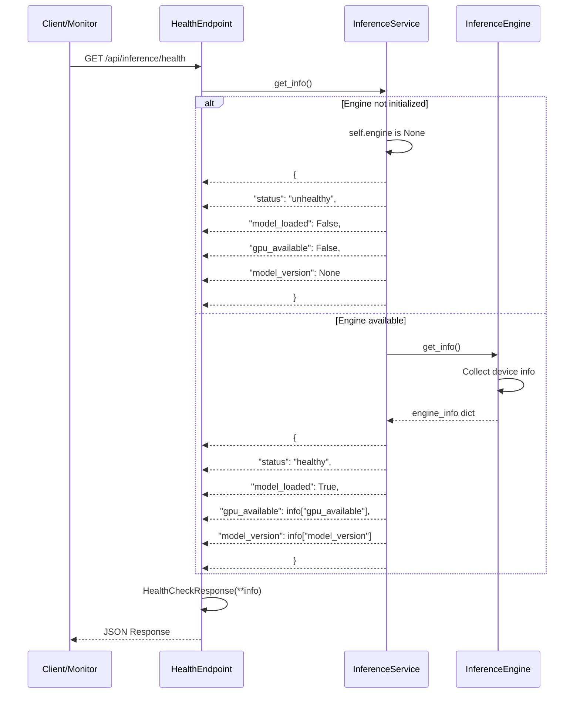
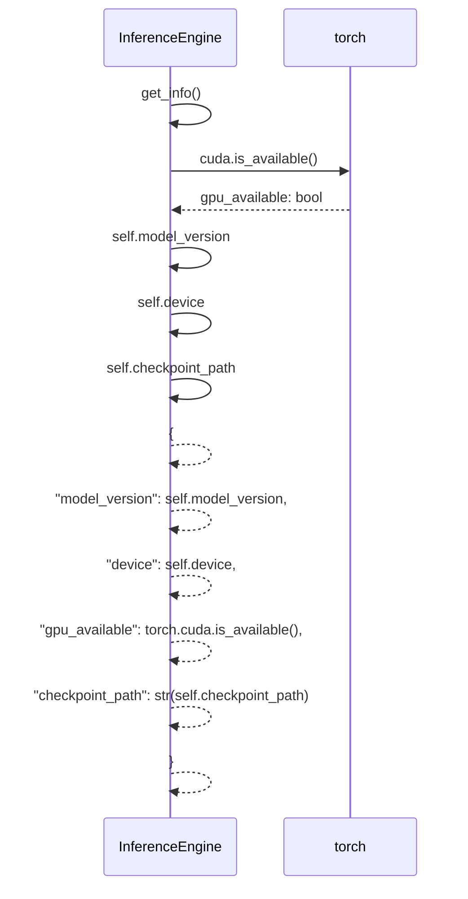

# Inference API - Health Check Flow

**API**: `GET /api/inference/health`
**Entry**: `health_endpoints.py:22-36` → `InferenceService.get_info()`

---

## Step 1: Service Status Retrieval

**Files**:
- `health_endpoints.py` (lines 22-36)
- `inference_service.py` (lines 252-267)
- `inference_engine.py` (lines 127-139)



**Key Code**:
```python
# health_endpoints.py:22-36
@router.get("/health", response_model=HealthCheckResponse)
async def health_check(
    service: InferenceService = Depends(get_inference_service),
) -> HealthCheckResponse:
    info = service.get_info()
    return HealthCheckResponse(
        status=info["status"],
        model_loaded=info["model_loaded"],
        gpu_available=info.get("gpu_available", False),
        model_version=info.get("model_version"),
    )

# inference_service.py:252-267
def get_info(self) -> dict:
    if self.engine is None:
        return {
            "status": "unhealthy",
            "model_loaded": False,
            "gpu_available": False,
            "model_version": None,
        }
    info = self.engine.get_info()
    return {
        "status": "healthy",
        "model_loaded": True,
        "gpu_available": info.get("gpu_available", False),
        "model_version": info.get("model_version"),
    }
```

---

## Step 2: Engine Information Collection

**Files**:
- `inference_engine.py` (lines 127-139)



**Key Code**:
```python
# inference_engine.py:132-139
def get_info(self) -> dict:
    return {
        "model_version": self.model_version,
        "device": self.device,
        "gpu_available": torch.cuda.is_available(),
        "checkpoint_path": str(self.checkpoint_path),
    }
```

---

## File Reference

| Layer | File | Key Lines | Purpose |
|-------|------|-----------|---------|
| **API** | `health_endpoints.py` | 22-36 | Health check route |
| **Control** | `inference_service.py` | 252-267 | Service health info |
| **Control** | `inference_engine.py` | 127-139 | Engine health info |
| **Schema** | `inference_schemas.py` | 160-173 | HealthCheckResponse |

---

## Health Status States

| Status | model_loaded | gpu_available | Meaning |
|--------|--------------|---------------|---------|
| `healthy` | True | True/False | Model loaded, ready for inference |
| `unhealthy` | False | False | Model not loaded, service unavailable |
| `degraded` | (Future) | - | Model loaded but with warnings |

---

## Response Schema

```python
# inference_schemas.py:160-173
class HealthCheckResponse(BaseModel):
    status: str                    # "healthy" | "unhealthy" | "degraded"
    model_loaded: bool             # Is model in memory
    gpu_available: bool            # Is CUDA available
    model_version: Optional[str]   # Checkpoint filename stem
```
