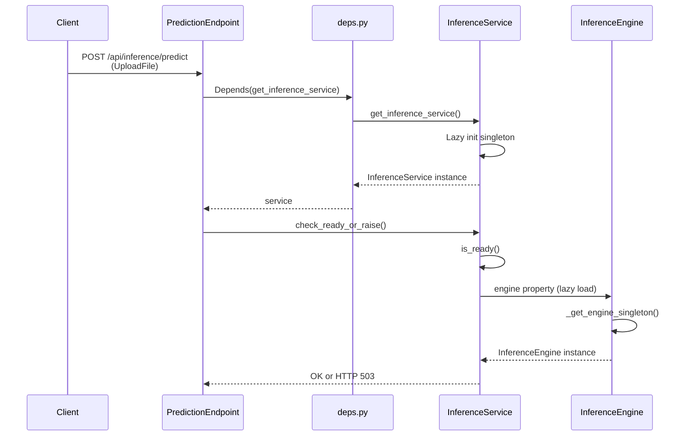
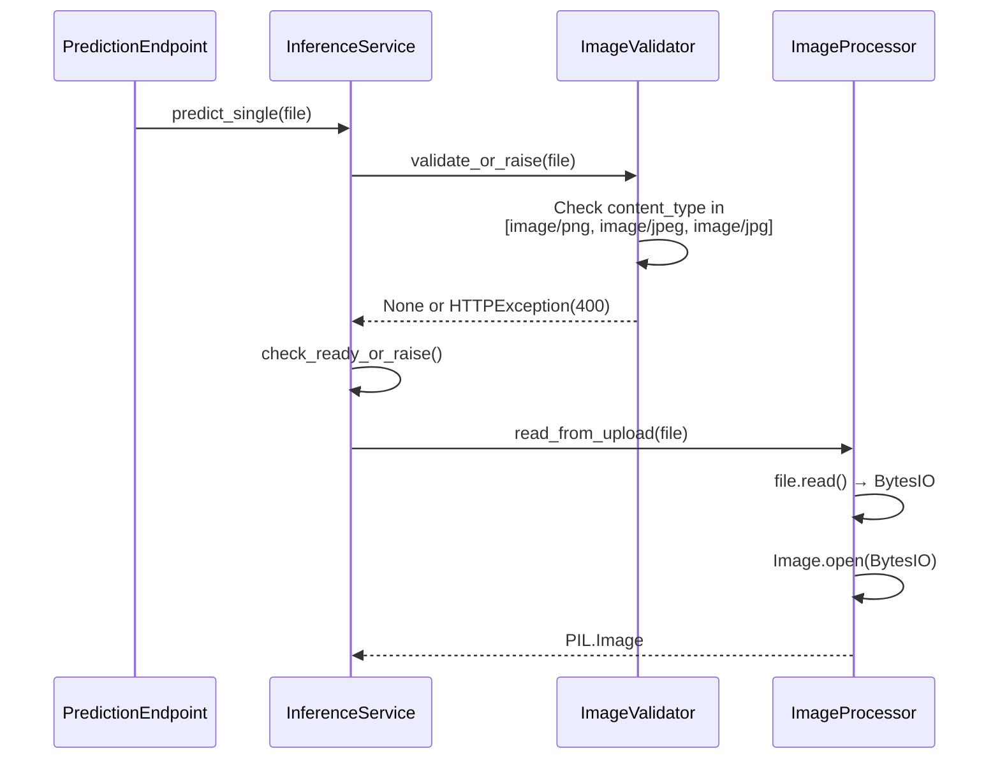
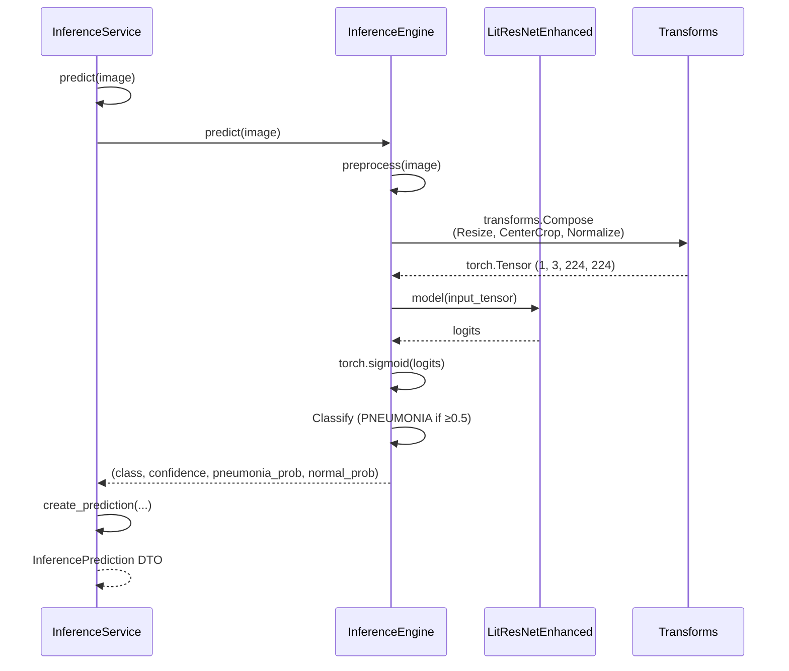
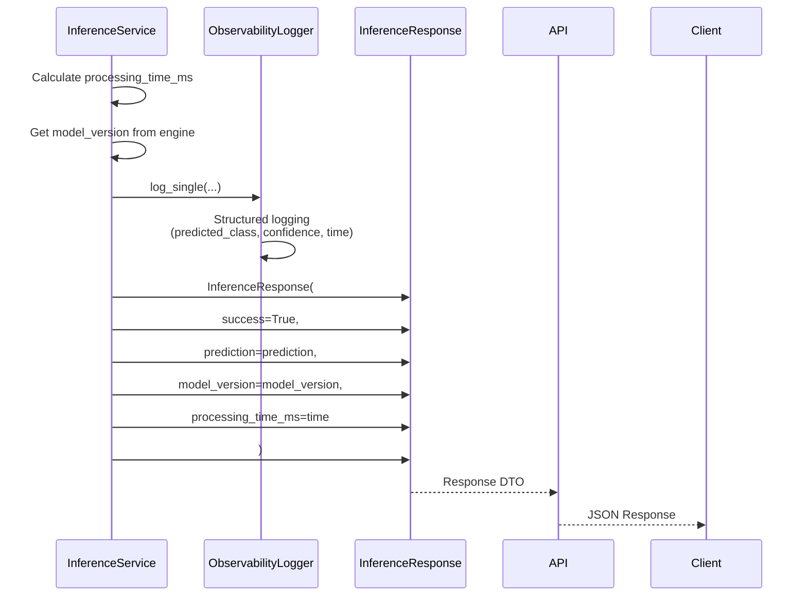

# Inference API - Single Prediction Flow

**API**: `POST /api/inference/predict`
**Entry**: `single_prediction_endpoint.py:18-28` → `InferenceService.predict_single()`

---

## Step 1: Request Validation & Service Readiness Check

**Files**:
- `single_prediction_endpoint.py` (lines 18-28)
- `inference_service.py` (lines 62-68, 138-156)
- `deps.py` (lines 124-133)



**Key Code**:
```python
# single_prediction_endpoint.py:18-28
@router.post("/predict", response_model=InferenceResponse)
async def predict(
    file: UploadFile = File(..., description="Chest X-ray image file (PNG, JPEG)"),
    service: InferenceService = Depends(get_inference_service),
) -> InferenceResponse:
    service.check_ready_or_raise()
    return await service.predict_single(file=file)
```

---

## Step 2: Image Validation & Processing

**Files**:
- `inference_service.py` (lines 91-136, 155-158)
- `image_validator.py` (lines 13-23)
- `image_processor.py` (lines 13-29)



**Key Code**:
```python
# inference_service.py:155-158
self.validator.validate_or_raise(file)
self.check_ready_or_raise()
image = await self.processor.read_from_upload(file)

# image_validator.py:13-23
def validate(self, file: UploadFile) -> Optional[str]:
    if file.content_type not in self.ALLOWED_CONTENT_TYPES:
        return f"Invalid file type: {file.content_type}. Must be PNG or JPEG."
    return None
```

---

## Step 3: Model Inference Execution

**Files**:
- `inference_service.py` (lines 70-74, 164-173)
- `inference_engine.py` (lines 95-125)



**Key Code**:
```python
# inference_engine.py:95-125
@torch.no_grad()
def predict(self, image: Image.Image) -> Tuple[str, float, float, float]:
    input_tensor = self.preprocess(image)
    logits = self.model(input_tensor)
    pneumonia_prob = torch.sigmoid(logits).item()
    normal_prob = 1.0 - pneumonia_prob
    
    if pneumonia_prob >= 0.5:
        predicted_class = "PNEUMONIA"
        confidence = pneumonia_prob
    else:
        predicted_class = "NORMAL"
        confidence = normal_prob
    
    return predicted_class, confidence, pneumonia_prob, normal_prob
```

---

## Step 4: Response Assembly & Observability Logging

**Files**:
- `inference_service.py` (lines 175-193)
- `inference_schemas.py` (lines 66-82)
- `observability_logger.py`



**Key Code**:
```python
# inference_service.py:188-193
return InferenceResponse(
    success=True,
    prediction=prediction,
    model_version=model_version,
    processing_time_ms=processing_time_ms,
)

# inference_schemas.py:66-82
class InferenceResponse(BaseModel):
    success: bool = True
    prediction: InferencePrediction
    clinical_interpretation: Optional[ClinicalInterpretation] = None
    model_version: str = Field(default="pneumonia_model_01_0.988-v2")
    processing_time_ms: float = Field(ge=0.0)
```

---

## File Reference

| Layer | File | Key Lines | Purpose |
|-------|------|-----------|---------|
| **API** | `single_prediction_endpoint.py` | 18-28 | Route handler, DI injection |
| **API** | `deps.py` | 124-133 | Dependency provider |
| **Control** | `inference_service.py` | 32-50, 62-68, 70-74, 138-199 | Service orchestration |
| **Control** | `inference_engine.py` | 29-47, 49-73, 88-94, 95-125 | Model loading & inference |
| **Control** | `image_validator.py` | 8-23 | File validation |
| **Control** | `image_processor.py` | 10-29 | Image I/O |
| **Schema** | `inference_schemas.py` | 13-18, 20-33, 66-82 | Pydantic models |

---

## Data Transformations

| Stage | Input | Output | Transform |
|-------|-------|--------|-----------|
| Upload | HTTP multipart | UploadFile | FastAPI File() |
| Validation | UploadFile | None/Error | Content-type check |
| Read | UploadFile | PIL.Image | BytesIO → Image.open() |
| Preprocess | PIL.Image | torch.Tensor | Resize, Crop, Normalize |
| Inference | Tensor | logits | Model forward pass |
| Post-process | logits | probabilities | sigmoid activation |
| Classify | probs | class+confidence | Threshold @ 0.5 |
| Response | DTOs | JSON | Pydantic serialization |
