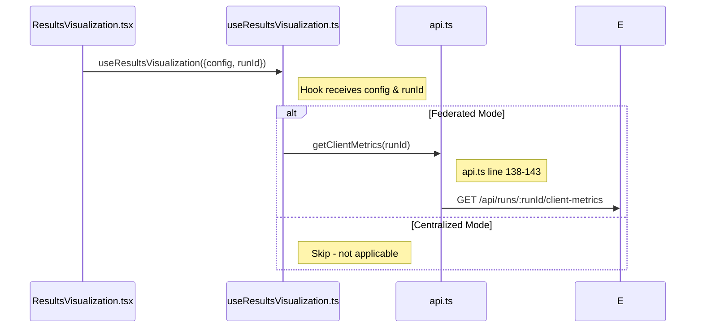
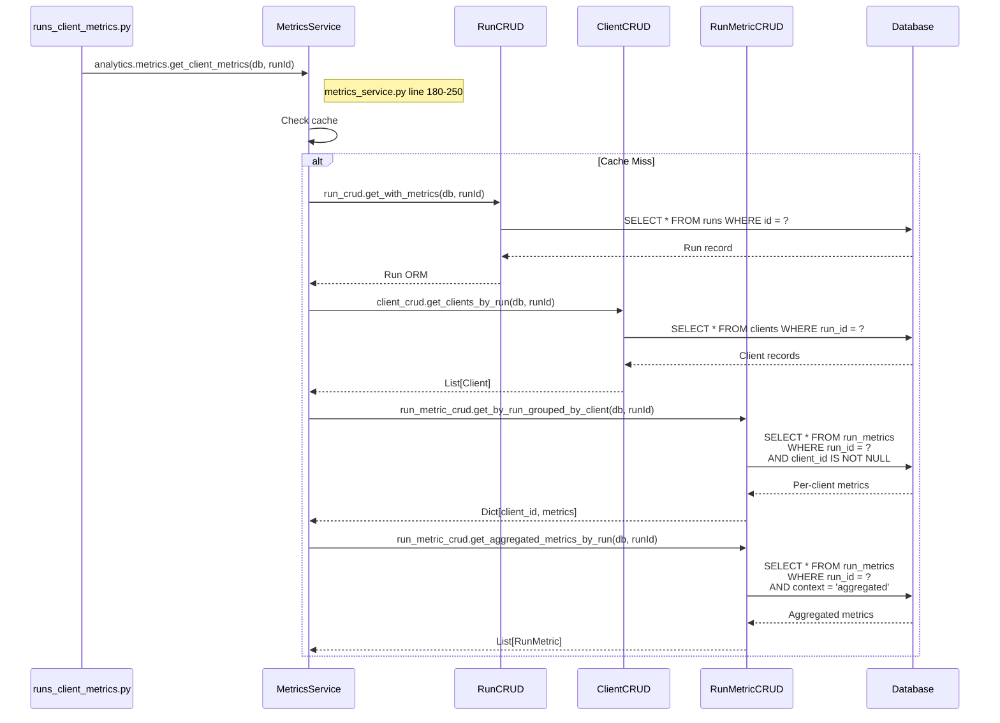
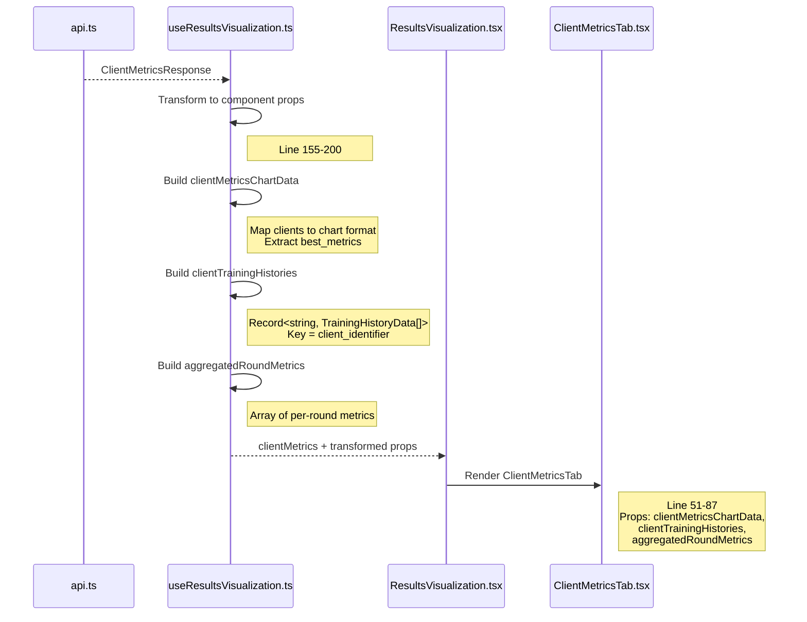

# Client Metrics Sequence Diagram

**API**: `GET /api/runs/{runId}/client-metrics`  
**Component**: `ResultsVisualization.tsx` (lines 37, 121-127) → `ClientMetricsTab.tsx`

---

## Step 1: Component to API Request

**Files**: 
- `ResultsVisualization.tsx` (lines 37, 121-127)
- `useResultsVisualization.ts` (line 60)
- `api.ts` (lines 138-143)



**Key Code**:
```typescript
// ResultsVisualization.tsx line 37
clientMetrics,              // ← From getClientMetrics
clientMetricsChartData,     // ← Transformed
clientTrainingHistories,    // ← Transformed
aggregatedRoundMetrics      // ← Transformed

// Line 121-127 - Conditional render
{hasClientMetrics && (
  <ClientMetricsTab
    clientMetricsChartData={clientMetricsChartData}
    clientTrainingHistories={clientTrainingHistories}
    aggregatedRoundMetrics={aggregatedRoundMetrics}
    numClients={clientMetrics?.num_clients || 0}
  />
)}
```

---

## Step 2: Backend Processing

**Files**:
- `runs_client_metrics.py` (lines 25-35)
- `metrics_service.py` (lines 180-250)



**Key Code**:
```python
# metrics_service.py line 180-250
def get_client_metrics(self, db: Session, run_id: int):
    key = cache_key("get_client_metrics", (run_id,), {})
    
    def _compute():
        run = self._run_crud.get_with_metrics(db, run_id)
        clients = self._client_crud.get_clients_by_run(db, run_id)
        grouped_metrics = self._run_metric_crud.get_by_run_grouped_by_client(db, run_id)
        aggregated = self._run_metric_crud.get_aggregated_metrics_by_run(db, run_id)
        
        clients_data = []
        for client in clients:
            client_metrics = grouped_metrics.get(client.id, [])
            clients_data.append({
                "client_id": client.id,
                "client_identifier": client.client_identifier,
                "training_history": self._transform_client_history(client_metrics),
                "best_metrics": self._extract_best_metrics(client_metrics),
            })
        
        return {
            "run_id": run_id,
            "num_clients": len(clients_data),
            "clients": clients_data,
            "aggregated_metrics": self._transform_aggregated(aggregated),
        }
    
    return self._cache.get_or_set(key, _compute)
```

---

## Step 3: Database Queries

**Files**: `run.py`, `client.py`, `run_metric.py`

| Query | Table | Condition | Purpose |
|-------|-------|-----------|---------|
| `SELECT * FROM runs WHERE id = ?` | runs | `id = runId` | Get experiment metadata |
| `SELECT * FROM clients WHERE run_id = ?` | clients | `run_id = runId` | Get client list |
| `SELECT * FROM run_metrics WHERE run_id = ? AND client_id IS NOT NULL` | run_metrics | `run_id = runId, client_id NOT NULL` | Per-client metrics |
| `SELECT * FROM run_metrics WHERE run_id = ? AND context = 'aggregated'` | run_metrics | `run_id = runId, context = 'aggregated'` | Server-aggregated metrics |

---

## Step 4: Transform & Response

**Files**: `useResultsVisualization.ts` (lines 155-200), `ClientMetricsTab.tsx` (lines 51-87)



**Transformations**:

| Source | Transformed To | Component Prop |
|--------|----------------|----------------|
| `clients[].best_metrics` | Bar chart format | `clientMetricsChartData` |
| `clients[].training_history` | Record with history | `clientTrainingHistories` |
| `aggregated_metrics` | Line chart format | `aggregatedRoundMetrics` |

**ClientMetricsTab Renders**:
1. Client summary cards (line 159-167)
2. Performance comparison bar chart (line 170-213)
3. Per-client training history charts (line 216-238)
4. Aggregated round metrics line chart (line 241-307)

---

## File Reference

| Layer | File | Key Lines |
|-------|------|-----------|
| Component | `ResultsVisualization.tsx` | 37, 121-127 |
| Component | `ClientMetricsTab.tsx` | 51-87 |
| Hook | `useResultsVisualization.ts` | 60, 155-200 |
| API Service | `api.ts` | 138-143 |
| API Endpoint | `runs_client_metrics.py` | 25-35 |
| Service | `metrics_service.py` | 180-250 |
| CRUD | `run.py` | 45-60 |
| CRUD | `client.py` | 25-35 |
| CRUD | `run_metric.py` | 60-85 |
