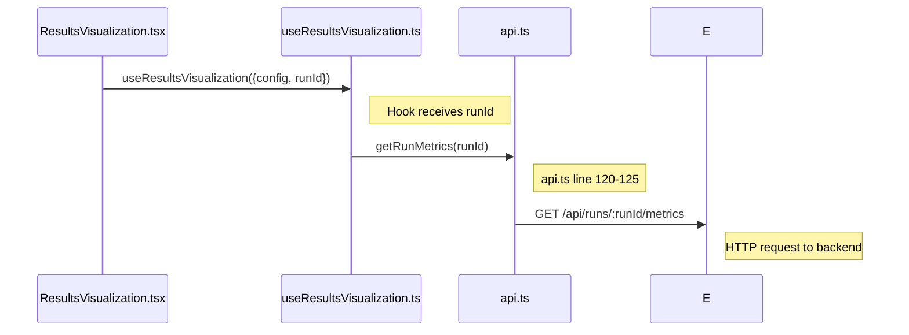
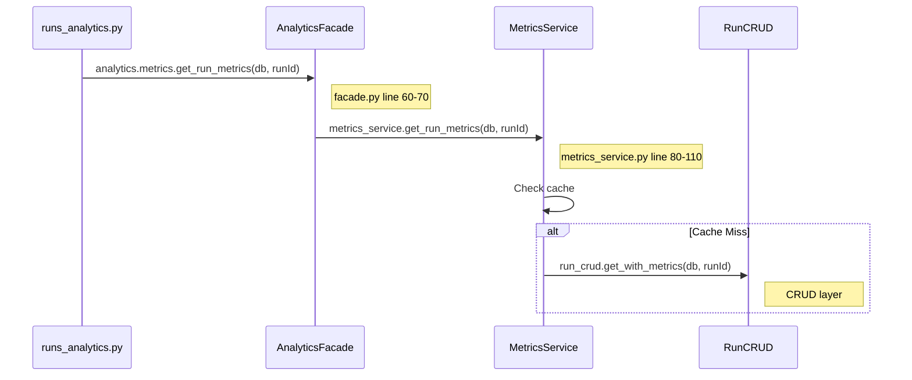
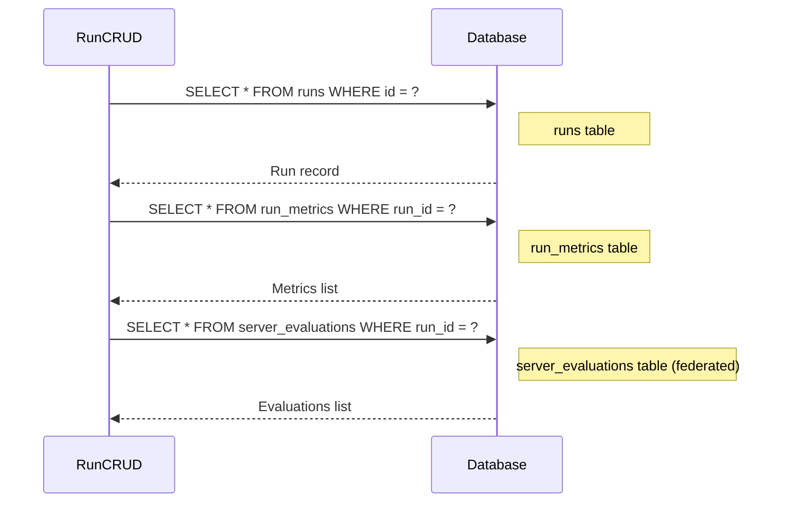
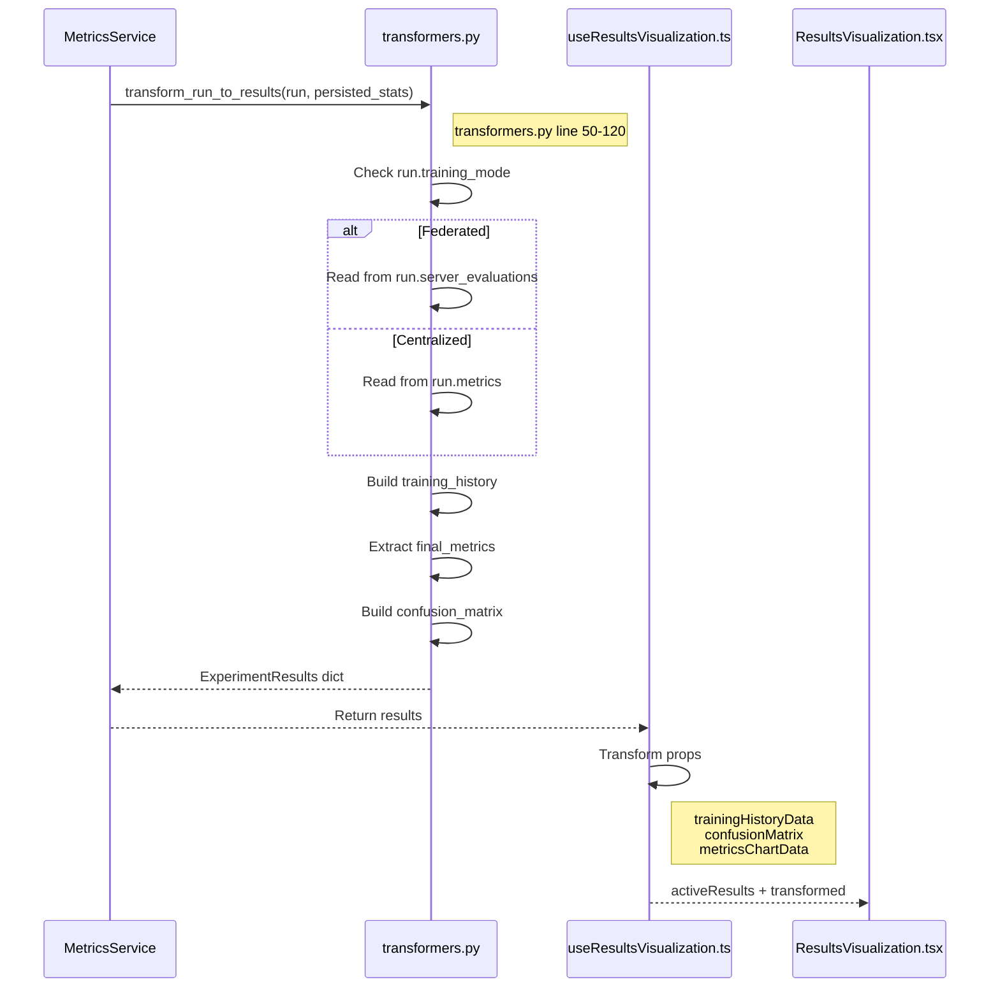

# Run Metrics Sequence Diagram

**API**: `GET /api/runs/{runId}/metrics`  
**Component**: `ResultsVisualization.tsx` (lines 30-39)

---

## Step 1: Component to API Request

**Files**: 
- `ResultsVisualization.tsx` (lines 30-39)
- `useResultsVisualization.ts` (line 45)
- `api.ts` (lines 120-125)



**Key Code**:
```typescript
// ResultsVisualization.tsx line 30-39
const {
  activeResults,           // ← From getRunMetrics
  trainingHistoryData,     // ← Transformed
  confusionMatrix,         // ← Transformed
  metricsChartData,        // ← Transformed
} = useResultsVisualization({ config, runId });
```

---

## Step 2: Backend Processing

**Files**:
- `runs_analytics.py` (lines 40-50)
- `facade.py` (lines 60-70)
- `metrics_service.py` (lines 80-110)



**Key Code**:
```python
# metrics_service.py line 80-110
def get_run_metrics(self, db: Session, run_id: int):
    key = cache_key("get_run_metrics", (run_id,), {})
    
    def _compute():
        run = self._run_crud.get_with_metrics(db, run_id)
        persisted_stats = self._get_persisted_stats(db, run)
        return transform_run_to_results(run, persisted_stats)
    
    return self._cache.get_or_set(key, _compute)
```

---

## Step 3: Database Queries

**File**: `run.py` (lines 45-60)



**Queries**:

| Table | Query | Purpose |
|-------|-------|---------|
| `runs` | `SELECT * FROM runs WHERE id = ?` | Get experiment metadata |
| `run_metrics` | `SELECT * FROM run_metrics WHERE run_id = ?` | Per-epoch metrics (centralized) |
| `server_evaluations` | `SELECT * FROM server_evaluations WHERE run_id = ? ORDER BY round_number` | Per-round metrics (federated) |

---

## Step 4: Transform & Response

**File**: `transformers.py` (lines 50-120)



**Transformations**:

| Source | Transformed To | Component Prop |
|--------|----------------|----------------|
| `training_history` | Chart format | `trainingHistoryData` |
| `confusion_matrix` | 2D array | `confusionMatrix` |
| `metadata` | Bar chart data | `metricsChartData` |

---

## File Reference

| Layer | File | Key Lines |
|-------|------|-----------|
| Component | `ResultsVisualization.tsx` | 30-39 |
| Hook | `useResultsVisualization.ts` | 45, 85-120 |
| API Service | `api.ts` | 120-125 |
| API Endpoint | `runs_analytics.py` | 40-50 |
| Analytics | `facade.py` | 60-70 |
| Service | `metrics_service.py` | 80-110 |
| Transformer | `transformers.py` | 50-120 |
| CRUD | `run.py` | 45-60 |
