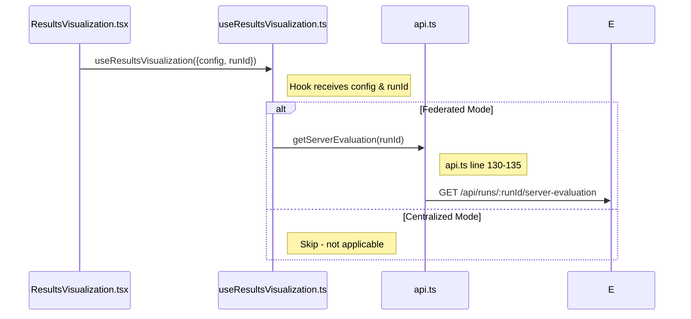
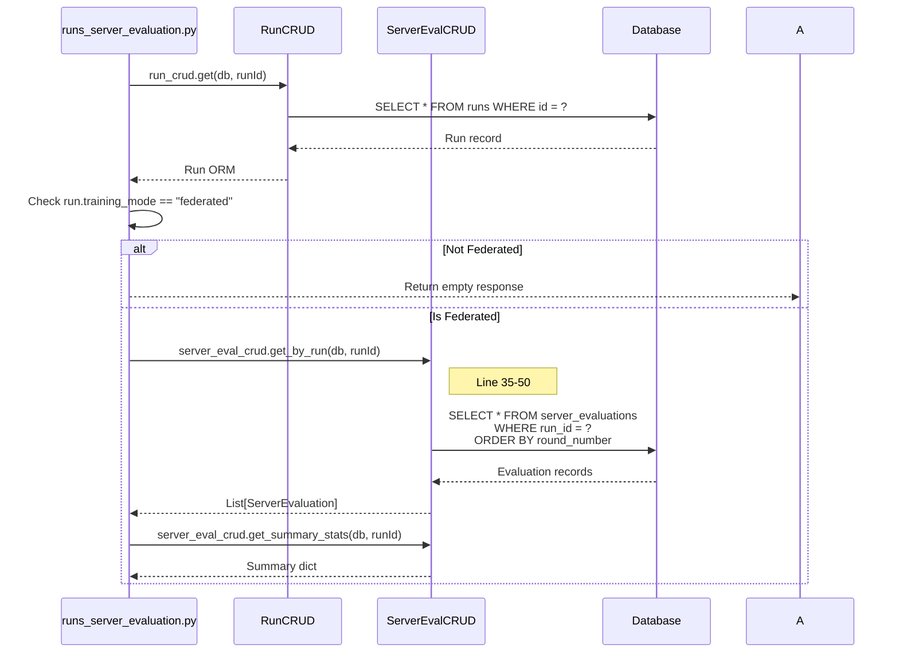
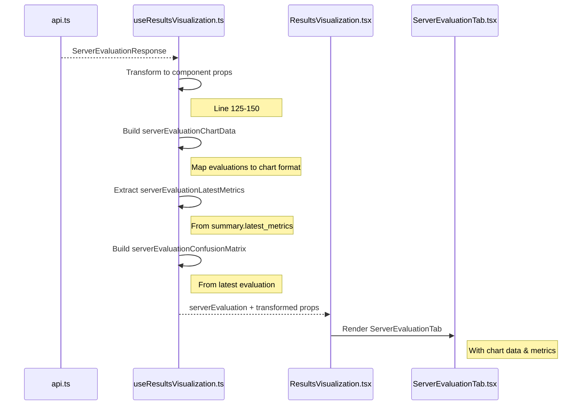

# Server Evaluation Sequence Diagram

**API**: `GET /api/runs/{runId}/server-evaluation`  
**Component**: `ResultsVisualization.tsx` (lines 35-37, 131-139)

---

## Step 1: Component to API Request

**Files**: 
- `ResultsVisualization.tsx` (lines 35-37, 131-139)
- `useResultsVisualization.ts` (line 55)
- `api.ts` (lines 130-135)



**Key Code**:
```typescript
// ResultsVisualization.tsx line 35-37
serverEvaluation,              // ← From getServerEvaluation
serverEvaluationChartData,     // ← Transformed  
serverEvaluationLatestMetrics, // ← Transformed
serverEvaluationConfusionMatrix // ← Transformed

// Line 131-139 - Conditional render
{serverEvaluation?.has_server_evaluation && (
  <ServerEvaluationTab ... />
)}
```

---

## Step 2: Backend Processing

**File**: `runs_server_evaluation.py` (lines 30-50)



**Key Code**:
```python
# runs_server_evaluation.py line 30-50
@router.get("/{run_id}/server-evaluation")
async def get_server_evaluation(run_id: int, db: Session = Depends(get_db)):
    run = run_crud.get(db, run_id)
    
    if run.training_mode != "federated":
        return {"has_server_evaluation": False}
    
    evaluations = server_eval_crud.get_by_run(db, run_id, order_by_round=True)
    summary = server_eval_crud.get_summary_stats(db, run_id)
    
    return {
        "run_id": run_id,
        "has_server_evaluation": True,
        "evaluations": [...],
        "summary": summary
    }
```

---

## Step 3: Database Queries

**File**: `server_evaluation.py` (lines 35-50, 80-120)

| Query | Table | Purpose |
|-------|-------|---------|
| `SELECT * FROM runs WHERE id = ?` | runs | Verify run exists & check mode |
| `SELECT * FROM server_evaluations WHERE run_id = ? ORDER BY round_number ASC` | server_evaluations | Get all evaluations ordered |
| `SELECT * FROM server_evaluations WHERE run_id = ?` | server_evaluations | Get all for summary stats |

**Summary Stats Calculation**:
```python
# server_evaluation.py line 80-120
def get_summary_stats(self, db: Session, run_id: int):
    evaluations = self.get_by_run(db, run_id)
    
    # Exclude round 0
    trained_evals = [e for e in evaluations if e.round_number > 0]
    
    # Calculate best metrics
    best_accuracy = max(evals_for_best, key=lambda x: x.accuracy)
    best_recall = max(evals_for_best, key=lambda x: x.recall)
    
    return {
        "total_rounds": len(evaluations),
        "best_accuracy": {"value": best_accuracy.accuracy, "round": best_accuracy.round_number},
        ...
    }
```

---

## Step 4: Transform & Response

**File**: `useResultsVisualization.ts` (lines 125-150)



**Transformations**:

| Source | Transformed To | Component Prop |
|--------|----------------|----------------|
| `evaluations` | Chart format | `serverEvaluationChartData` |
| `summary.latest_metrics` | Metrics object | `serverEvaluationLatestMetrics` |
| `latest.confusion_matrix` | 2D array | `serverEvaluationConfusionMatrix` |

---

## File Reference

| Layer | File | Key Lines |
|-------|------|-----------|
| Component | `ResultsVisualization.tsx` | 35-37, 131-139 |
| Component | `ServerEvaluationTab.tsx` | 1-50 |
| Hook | `useResultsVisualization.ts` | 55, 125-150 |
| API Service | `api.ts` | 130-135 |
| API Endpoint | `runs_server_evaluation.py` | 30-50 |
| CRUD | `run.py` | 25-35 |
| CRUD | `server_evaluation.py` | 35-50, 80-120 |
