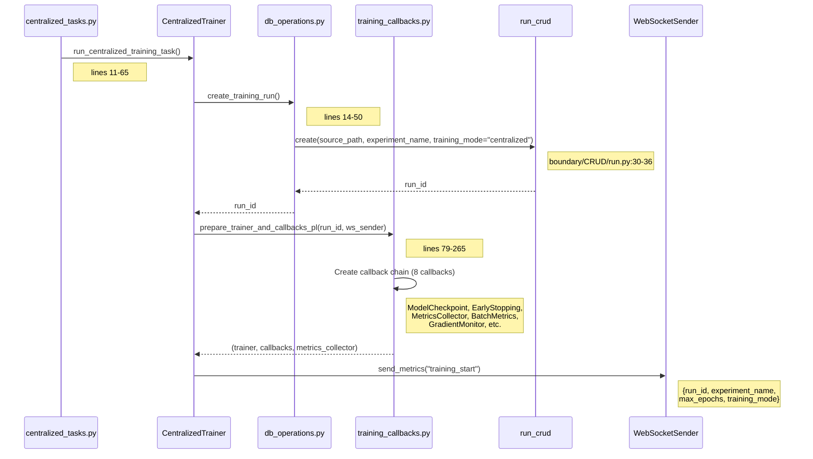
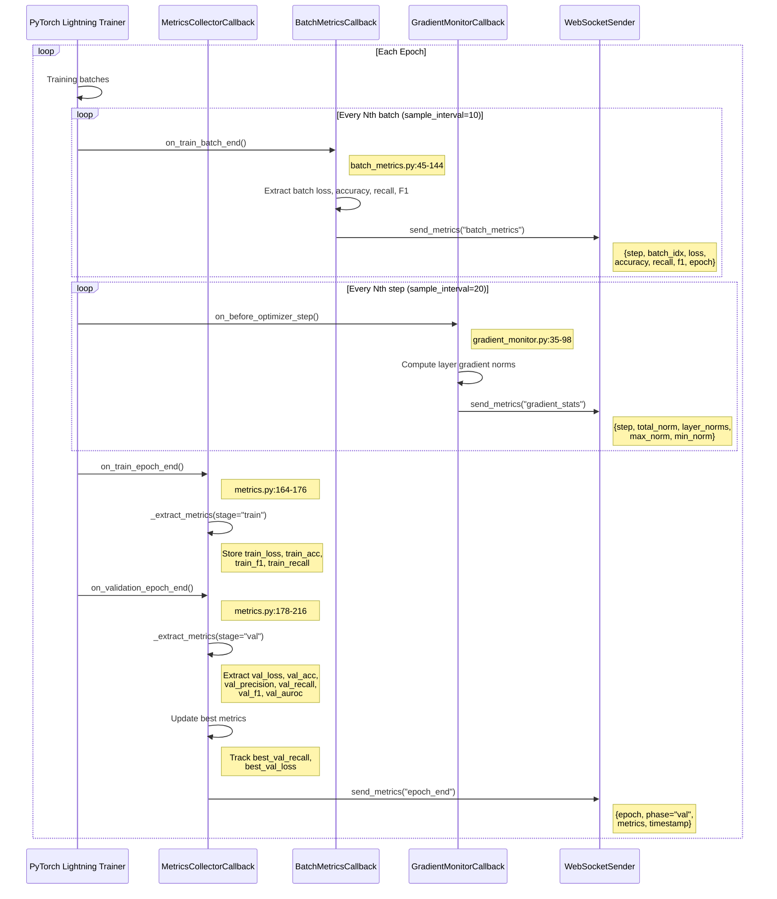
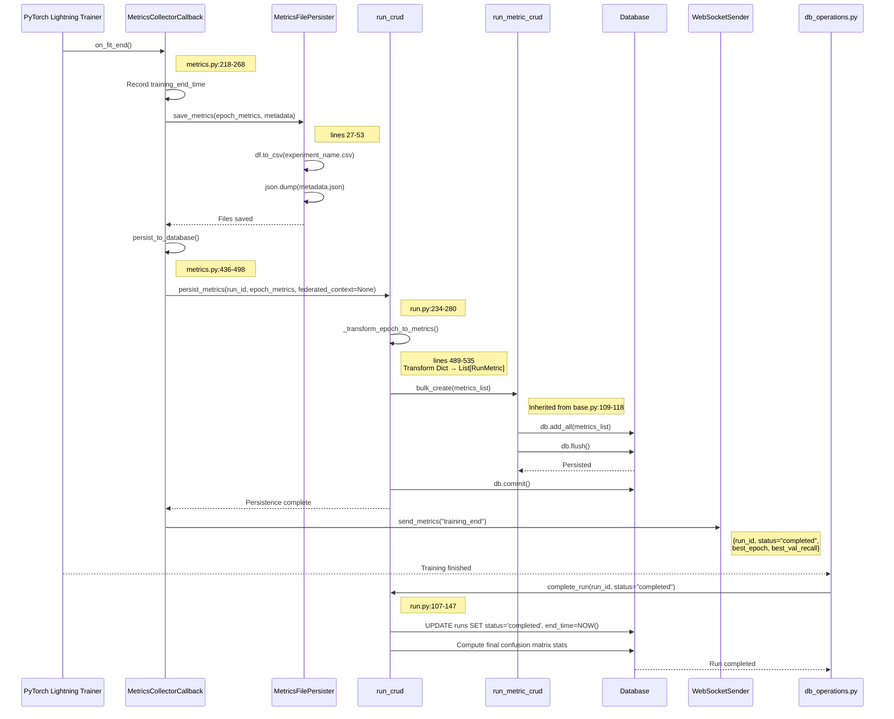
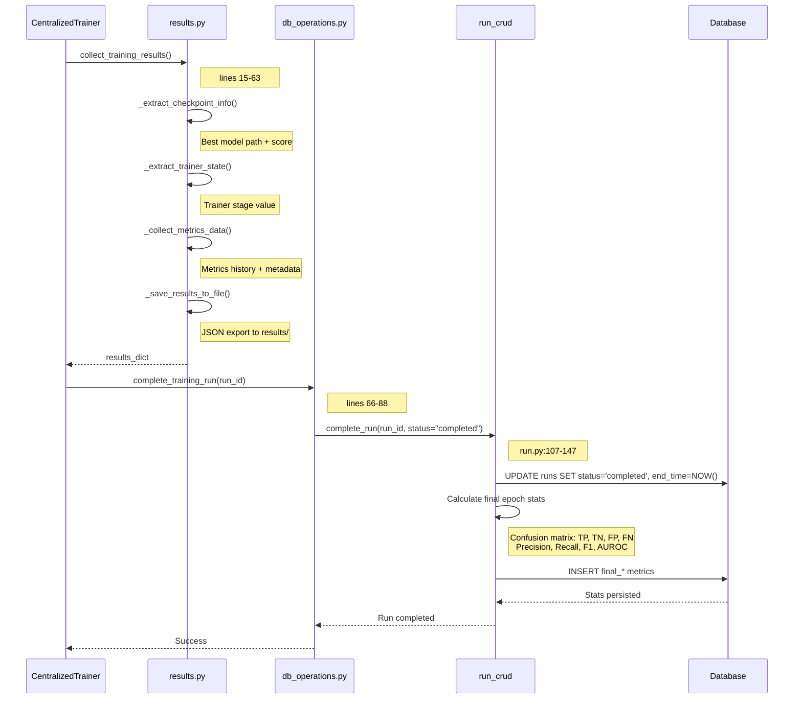

# Centralized Training - Metrics Collection Flow

**API**: `POST /api/experiments/centralized/train`
**Entry Point**: `centralized_tasks.py:11` → `CentralizedTrainer.train()`

---

## Step 1: Initialize Training Run & Callbacks

**Files**:
- `centralized_tasks.py` (lines 11-65)
- `centralized_trainer.py` (lines 25-150)
- `db_operations.py` (lines 14-50)
- `training_callbacks.py` (lines 79-265)



**Key Code**:
```python
# db_operations.py lines 14-50
def create_training_run(source_path, experiment_name, logger):
    db = get_session()
    try:
        run = run_crud.create(
            db,
            source_path=source_path,
            experiment_name=experiment_name,
            training_mode="centralized",
            status="in_progress",
            start_time=datetime.now(),
        )
        db.commit()
        return run.id
    except Exception as e:
        db.rollback()
        raise
    finally:
        db.close()
```

---

## Step 2: Training Loop - Epoch & Batch Metrics Collection

**Files**:
- `centralized_trainer.py` (lines 100-126)
- `metrics.py` (MetricsCollectorCallback, lines 164-216)
- `batch_metrics.py` (BatchMetricsCallback, lines 45-144)
- `gradient_monitor.py` (GradientMonitorCallback, lines 35-98)



**Key Code**:
```python
# metrics.py lines 178-216 (on_validation_epoch_end)
def on_validation_epoch_end(self, trainer, pl_module):
    if trainer.sanity_checking:
        return

    val_metrics = self._extract_metrics(trainer, pl_module, "val")

    # Update epoch metrics with validation data
    if self.epoch_metrics:
        self.epoch_metrics[-1].update(val_metrics)

    # Track best metrics
    if "val_recall" in val_metrics:
        if val_metrics["val_recall"] > self.best_metrics.get("val_recall", 0):
            self.best_metrics["val_recall"] = val_metrics["val_recall"]

    # Broadcast to frontend
    self.ws_sender.send_metrics(
        {
            "epoch": trainer.current_epoch,
            "phase": "val",
            "metrics": val_metrics,
        },
        "epoch_end",
    )
```

---

## Step 3: Training Completion - DB Persistence & File Export

**Files**:
- `metrics.py` (lines 218-268)
- `metrics_file_persister.py` (lines 27-53)
- `run.py` (RunCRUD.persist_metrics, lines 234-280)
- `run_metric.py` (RunMetricCRUD.bulk_create, inherited from base.py)
- `db_operations.py` (complete_training_run, lines 66-88)



**Key Code**:
```python
# run.py lines 234-280 (persist_metrics)
def persist_metrics(self, db, run_id, epoch_metrics, federated_context=None):
    metrics_to_create = []

    for epoch_data in epoch_metrics:
        epoch = epoch_data.get("epoch", 0)
        client_id, round_id = self._resolve_federated_context(federated_context)

        # Transform epoch dict to metric rows
        metrics_to_create.extend(
            self._transform_epoch_to_metrics(
                run_id=run_id,
                epoch=epoch,
                epoch_data=epoch_data,
                client_id=client_id,
                round_id=round_id,
            )
        )

    # Bulk insert for performance
    run_metric_crud.bulk_create(db, metrics_to_create)
    logger.info(f"Persisted {len(metrics_to_create)} metrics for run {run_id}")
```

---

## Step 4: Results Collection & Final Stats

**Files**:
- `results.py` (lines 15-154)
- `db_operations.py` (lines 66-88)
- `run.py` (complete_run, lines 107-147)



**Key Code**:
```python
# results.py lines 15-63
def collect_training_results(trainer, model, metrics_collector, logs_dir, checkpoint_dir, logger, run_id=None):
    results = {
        "checkpoint": _extract_checkpoint_info(trainer),
        "trainer_state": _extract_trainer_state(trainer),
        "metrics_history": metrics_collector.epoch_metrics,
        "metadata": {
            "total_epochs": trainer.current_epoch + 1,
            "best_val_recall": metrics_collector.best_metrics.get("val_recall"),
            "best_val_loss": metrics_collector.best_metrics.get("val_loss"),
            "training_time_seconds": (
                metrics_collector.training_end_time - metrics_collector.training_start_time
            ).total_seconds(),
            "run_id": run_id,
        },
    }

    _save_results_to_file(results, logs_dir)
    return results
```

---

## File Reference

| Layer | File | Key Lines |
|-------|------|-----------|
| **API Entry** | `centralized_tasks.py` | 11-65 |
| **Trainer** | `centralized_trainer.py` | 25-150 |
| **DB Setup** | `db_operations.py` | 14-50 (create), 66-88 (complete) |
| **Callbacks** | `training_callbacks.py` | 79-265 (orchestration) |
| **Metrics Collector** | `metrics.py` | 101-268 (lifecycle hooks) |
| **Batch Metrics** | `batch_metrics.py` | 45-144 |
| **Gradient Monitor** | `gradient_monitor.py` | 35-98 |
| **WebSocket** | `websocket_metrics_sender.py` | 35-106 |
| **File Persister** | `metrics_file_persister.py` | 27-53 |
| **Run CRUD** | `run.py` | 107-147 (complete), 234-280 (persist) |
| **RunMetric CRUD** | `run_metric.py` | Inherited bulk_create |
| **Results** | `results.py` | 15-154 |

---

## Metric Types Collected

| Metric Name | Source | Frequency | Storage |
|-------------|--------|-----------|---------|
| `train_loss` | MetricsCollectorCallback | Per epoch | DB + CSV |
| `train_acc`, `train_f1`, `train_recall` | MetricsCollectorCallback | Per epoch | DB + CSV |
| `val_loss`, `val_acc`, `val_precision` | MetricsCollectorCallback | Per epoch | DB + CSV |
| `val_recall`, `val_f1`, `val_auroc` | MetricsCollectorCallback | Per epoch | DB + CSV |
| `batch_loss`, `batch_accuracy` | BatchMetricsCallback | Every 10th batch | WebSocket only |
| `gradient_total_norm`, `layer_norms` | GradientMonitorCallback | Every 20th step | WebSocket only |
| `final_precision_cm`, `final_recall_cm` | FinalEpochStatsService | End of training | DB only |
| `final_f1_cm`, `final_auroc_cm` | FinalEpochStatsService | End of training | DB only |
| `cm_tp`, `cm_tn`, `cm_fp`, `cm_fn` | FinalEpochStatsService | End of training | DB only |

---

## WebSocket Event Types

| Event Type | Trigger | Payload |
|------------|---------|---------|
| `training_start` | on_train_start | {run_id, experiment_name, max_epochs, training_mode} |
| `epoch_end` | on_validation_epoch_end | {epoch, phase, metrics, timestamp} |
| `batch_metrics` | on_train_batch_end (sampled) | {step, batch_idx, loss, accuracy, recall, f1} |
| `gradient_stats` | on_before_optimizer_step (sampled) | {step, total_norm, layer_norms, max/min_norm} |
| `training_end` | on_fit_end | {run_id, status, best_epoch, best_val_recall} |
| `early_stopping` | EarlyStopping callback | {epoch, best_metric_value, patience} |
