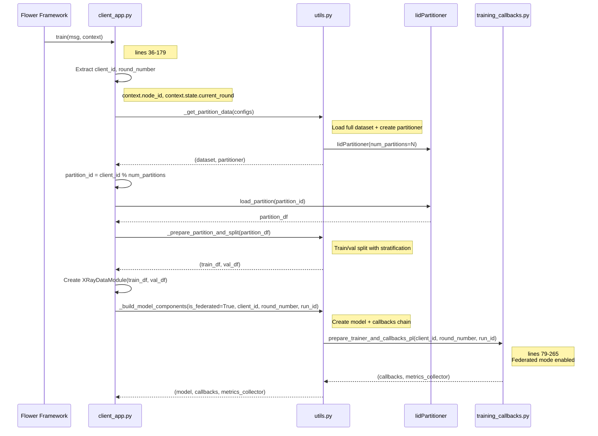
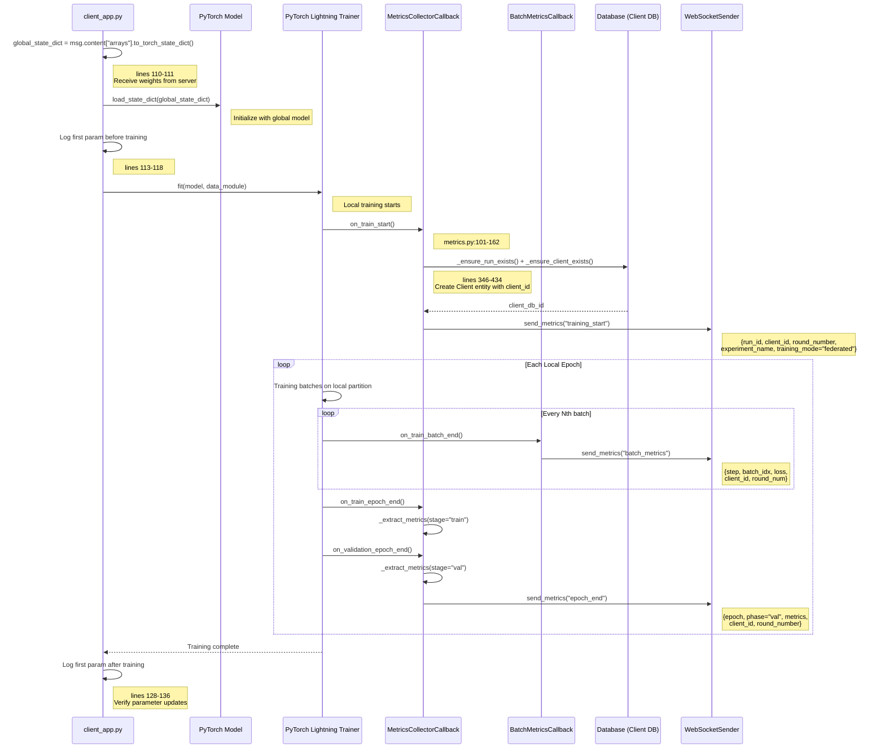
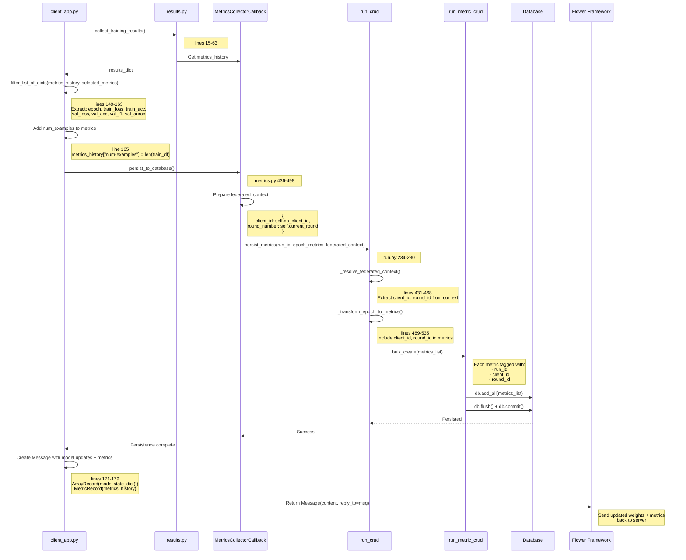
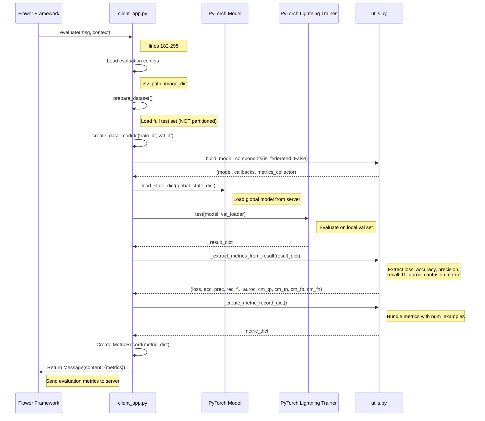

# Federated Client Training - Metrics Collection Flow

**Entry Point**: `client_app.py:36` → `@app.train(msg, context)`
**Pattern**: Flower ClientApp with local training on IID/non-IID partitions

---

## Step 1: Client Initialization & Partition Loading

**Files**:
- `client_app.py` (lines 36-108)
- `utils.py` (`_get_partition_data`, `_prepare_partition_and_split`)
- `training_callbacks.py` (lines 79-265)



**Key Code**:
```python
# client_app.py lines 36-108
@app.train()
def train(msg: Message, context: Context):
    centerlized_trainer, config = _load_trainer_and_config()

    client_id = context.node_id
    round_number = (
        context.state.current_round if hasattr(context.state, "current_round") else 0
    )

    configs = msg.content.get("config", {...})
    _, partioner = _get_partition_data(configs)
    partition_id = context.node_id % configs["num_partitions"]
    partion_df = partioner.load_partition(partition_id)

    train_df, val_df = _prepare_partition_and_split(
        partioner, partition_id, partion_df, seed=configs.get("seed", 42)
    )

    data_module = XRayDataModule(
        train_df=train_df, val_df=val_df, config=config, image_dir=configs["image_dir"]
    )

    run_id = configs.get("run_id", None)

    model, callbacks, metrics_collector = _build_model_components(
        centerlized_trainer,
        train_df,
        context,
        is_federated=True,
        client_id=client_id,
        round_number=round_number,
        run_id=run_id,
    )
```

---

## Step 2: Load Global Model & Local Training

**Files**:
- `client_app.py` (lines 110-136)
- `metrics.py` (MetricsCollectorCallback, federated mode)
- `batch_metrics.py` (with client_id tagging)



**Key Code**:
```python
# client_app.py lines 110-136
global_state_dict = msg.content["arrays"].to_torch_state_dict()
model.load_state_dict(global_state_dict)

first_param_name = list(model.state_dict().keys())[0]
first_param_before = model.state_dict()[first_param_name].clone()
centerlized_trainer.logger.info(
    f"[Client Train] BEFORE training - first param '{first_param_name}' "
    f"mean: {first_param_before.mean().item():.6f}"
)

trainer.fit(model, data_module)

first_param_after = model.state_dict()[first_param_name]
centerlized_trainer.logger.info(
    f"[Client Train] AFTER training - first param '{first_param_name}' "
    f"mean: {first_param_after.mean().item():.6f}"
)
centerlized_trainer.logger.info(
    f"[Client Train] Parameter change: "
    f"{(first_param_after - first_param_before).abs().mean().item():.6f}"
)
```

---

## Step 3: Collect Results & DB Persistence (Federated Context)

**Files**:
- `client_app.py` (lines 137-179)
- `results.py` (collect_training_results)
- `utils.py` (filter_list_of_dicts)
- `metrics.py` (persist_to_database with federated_context)
- `run.py` (persist_metrics with client_id, round_id)



**Key Code**:
```python
# client_app.py lines 137-179
results = collect_training_results(
    trainer=trainer,
    model=model,
    metrics_collector=metrics_collector,
    logs_dir=config.get("output.log_dir"),
    checkpoint_dir=config.get("output.checkpoint_dir"),
    logger=centerlized_trainer.logger,
    run_id=run_id,
)

num_examples = len(train_df)

metrics_history = filter_list_of_dicts(
    results.get("metrics_history", []),
    ["epoch", "train_loss", "train_acc", "train_f1", "val_loss", "val_acc",
     "val_precision", "val_recall", "val_f1", "val_auroc"],
)

metrics_history["num-examples"] = int(num_examples)

# Return to server
model_record = ArrayRecord(model.state_dict())
metric_record = MetricRecord(metrics_history)
content = RecordDict({
    "arrays": model_record,
    "metrics": metric_record,
})
return Message(content=content, reply_to=msg)
```

```python
# run.py lines 431-468 (_resolve_federated_context)
def _resolve_federated_context(self, db, federated_context):
    if not federated_context:
        return None, None

    client_id = federated_context.get("client_id")
    round_number = federated_context.get("round_number")

    # Get client DB ID
    client = db.query(Client).filter(Client.client_id == client_id).first()
    client_db_id = client.id if client else None

    # Get round DB ID
    round_obj = db.query(Round).filter(
        Round.round_number == round_number
    ).first()
    round_db_id = round_obj.id if round_obj else None

    return client_db_id, round_db_id
```

---

## Step 4: Client Evaluation (Optional)

**Files**:
- `client_app.py` (lines 182-295)
- `server_evaluation.py` (central evaluation function)



**Key Code**:
```python
# client_app.py lines 260-295
results = trainer.test(model, val_loader)
result_dict = results[0] if results else {}

loss, accuracy, precision, recall, f1, auroc, cm_tp, cm_tn, cm_fp, cm_fn = (
    _extract_metrics_from_result(result_dict)
)

num_examples = len(val_df)

metric_dict = _create_metric_record_dict(
    loss, accuracy, precision, recall, f1, auroc, num_examples,
    cm_tp, cm_tn, cm_fp, cm_fn,
)

centerlized_trainer.logger.info(
    f"[Client Evaluate] Extracted metrics: loss={loss}, acc={accuracy}, "
    f"prec={precision}, rec={recall}, f1={f1}, auroc={auroc}, "
    f"cm_tp={cm_tp}, cm_tn={cm_tn}, cm_fp={cm_fp}, cm_fn={cm_fn}, "
    f"num_examples={num_examples}"
)

metric_record = MetricRecord(metric_dict)
content = RecordDict({"metrics": metric_record})
return Message(content=content, reply_to=msg)
```

---

## File Reference

| Layer | File | Key Lines |
|-------|------|-----------|
| **Client Entry** | `client_app.py` | 36-179 (train), 182-295 (evaluate) |
| **Utils** | `utils.py` | Partition, model build, metric extraction |
| **Callbacks** | `training_callbacks.py` | 79-265 (federated mode) |
| **Metrics Collector** | `metrics.py` | 101-162 (federated client init), 346-434 (DB client) |
| **Batch Metrics** | `batch_metrics.py` | 45-144 (with client_id tagging) |
| **Run CRUD** | `run.py` | 234-280 (persist with federated_context), 431-468 (resolve context) |
| **RunMetric CRUD** | `run_metric.py` | Bulk create with client_id, round_id |
| **Results** | `results.py` | 15-63 (collect training results) |

---

## Federated Context Propagation

| Component | Context Fields | Lines |
|-----------|---------------|-------|
| **ClientApp** | `client_id = context.node_id` | client_app.py:45 |
| | `round_number = context.state.current_round` | client_app.py:46-48 |
| **MetricsCollectorCallback** | `self.client_id`, `self.current_round` | metrics.py:90-91 |
| | `self.db_client_id` (from DB Client entity) | metrics.py:155-161 |
| **RunCRUD.persist_metrics** | `federated_context = {client_id, round_number}` | run.py:234-280 |
| **RunMetricCRUD** | Each metric tagged with `client_id`, `round_id` | run_metric.py (inherited) |

---

## Key Differences from Centralized

| Aspect | Centralized | Federated Client |
|--------|-------------|------------------|
| **Run Creation** | API creates run | Server creates run, passes run_id in config |
| **Client Entity** | N/A | `_ensure_client_exists()` creates Client row |
| **Metrics Context** | `federated_context=None` | `federated_context={client_id, round_number}` |
| **DB Persistence** | All metrics under `run_id` | Metrics tagged with `run_id`, `client_id`, `round_id` |
| **WebSocket Events** | `training_end` sent by trainer | NO `training_end` (server sends it) |
| **Model Return** | N/A | Returns `ArrayRecord(state_dict)` to server |
| **Num Examples** | Total dataset size | Local partition size |

---

## Metrics Returned to Server

| Metric | Purpose |
|--------|---------|
| `num-examples` | Weight for FedAvg aggregation |
| `train_loss`, `train_acc`, `train_f1` | Training performance on local data |
| `val_loss`, `val_acc`, `val_f1`, `val_auroc` | Validation performance (if applicable) |
| `epoch` | Training progress indicator |

**Aggregation**: Server uses `num-examples` to compute weighted average in `custom_strategy.py:aggregate_fit()`.
