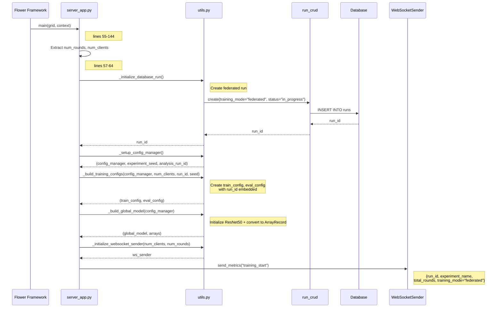
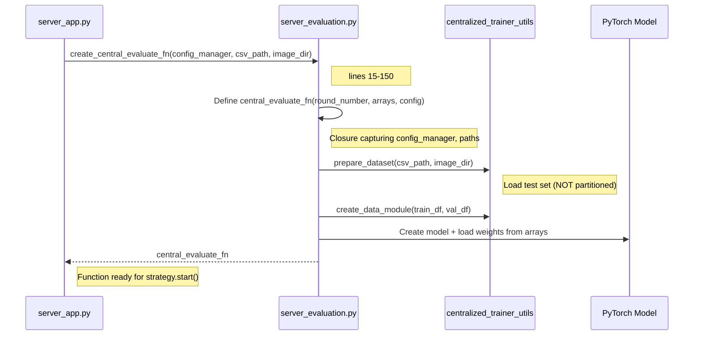
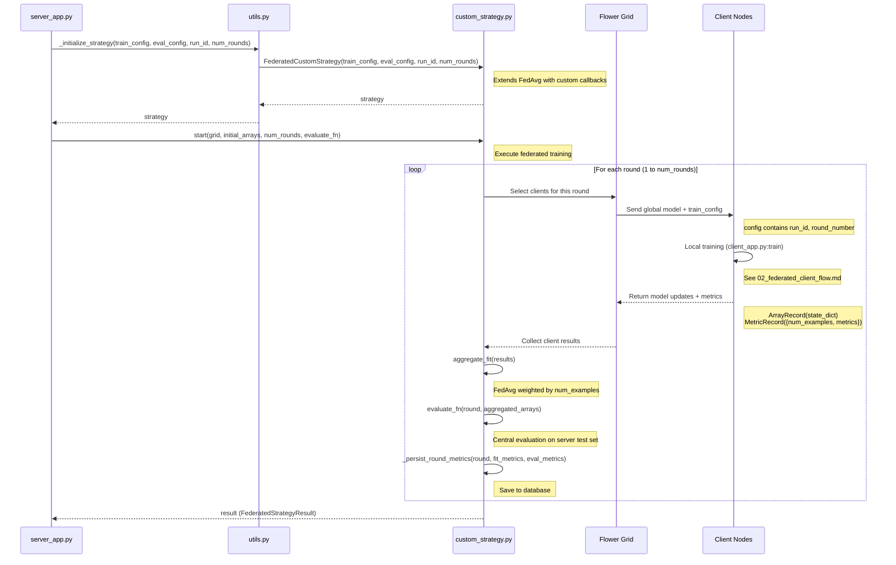
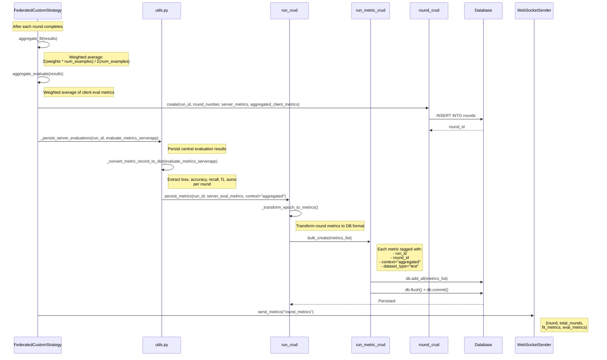
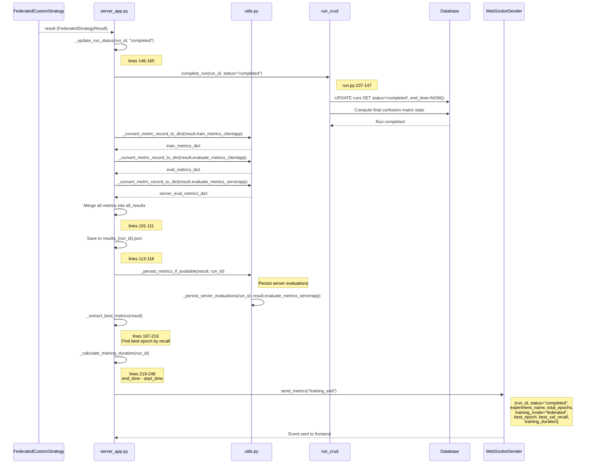

# Federated Server - Aggregation & Metrics Collection Flow

**Entry Point**: `server_app.py:55` → `@app.main(grid, context)`
**Pattern**: Flower ServerApp with FedAvg strategy + central evaluation

---

## Step 1: Server Initialization & Run Creation

**Files**:
- `server_app.py` (lines 55-83)
- `utils.py` (`_initialize_database_run`, `_setup_config_manager`, `_build_global_model`)
- `run.py` (RunCRUD.create)



**Key Code**:
```python
# server_app.py lines 55-72
@app.main()
def main(grid: Grid, context: Context) -> None:
    num_rounds: int = context.run_config["num-server-rounds"]
    num_clients: int = len(list(grid.get_node_ids()))

    logger.info("=" * 80)
    logger.info("FEDERATED LEARNING SESSION STARTING")
    logger.info("=" * 80)
    logger.info(f"Configuration: {num_clients} clients, {num_rounds} rounds")

    run_id, _ = _initialize_database_run()
    config_manager, experiment_seed, analysis_run_id = _setup_config_manager()
    train_config, eval_config = _build_training_configs(
        config_manager, num_clients, run_id, experiment_seed
    )
    global_model, arrays = _build_global_model(config_manager)
    ws_sender = _initialize_websocket_sender(num_clients, num_rounds)
```

---

## Step 2: Central Evaluation Function Setup

**Files**:
- `server_app.py` (lines 74-80)
- `server_evaluation.py` (create_central_evaluate_fn, lines 15-150)



**Key Code**:
```python
# server_evaluation.py lines 15-150 (simplified)
def create_central_evaluate_fn(config_manager, csv_path, image_dir):
    def central_evaluate_fn(round_number, arrays, config):
        # Prepare test dataset
        train_df, val_df = prepare_dataset(csv_path, image_dir, config, logger)
        data_module = create_data_module(train_df, val_df, image_dir, config, logger)

        # Create model and load global weights
        model = create_model(config)
        state_dict = arrays.to_torch_state_dict()
        model.load_state_dict(state_dict)

        # Evaluate on test set
        trainer = create_trainer(config)
        results = trainer.test(model, data_module.test_dataloader())

        # Extract metrics
        loss, accuracy, precision, recall, f1, auroc, cm_tp, cm_tn, cm_fp, cm_fn = (
            _extract_metrics_from_result(results[0])
        )

        # Return as MetricRecord
        return MetricRecord({
            "loss": loss,
            "accuracy": accuracy,
            "precision": precision,
            "recall": recall,
            "f1": f1,
            "auroc": auroc,
            "num_examples": len(val_df),
            "cm_tp": cm_tp,
            "cm_tn": cm_tn,
            "cm_fp": cm_fp,
            "cm_fn": cm_fn,
        })

    return central_evaluate_fn
```

---

## Step 3: Strategy Initialization & Federated Rounds

**Files**:
- `server_app.py` (lines 82-91)
- `custom_strategy.py` (FederatedCustomStrategy)
- `utils.py` (`_initialize_strategy`)



**Key Code**:
```python
# server_app.py lines 85-91
try:
    result = strategy.start(
        grid=grid,
        initial_arrays=arrays,
        num_rounds=num_rounds,
        evaluate_fn=central_evaluate_fn,
    )
    logger.info("Federated learning completed.")
    _update_run_status(run_id, "completed")
except Exception as e:
    logger.error(f"Federated learning failed: {str(e)}", exc_info=True)
    _update_run_status(run_id, "failed")
    raise
```

---

## Step 4: Metrics Aggregation & Persistence

**Files**:
- `custom_strategy.py` (aggregate_fit, aggregate_evaluate)
- `utils.py` (`_persist_server_evaluations`, `_convert_metric_record_to_dict`)
- `run.py` (RunCRUD.persist_metrics)



**Key Code**:
```python
# custom_strategy.py (aggregate_fit - simplified)
def aggregate_fit(self, server_round, results, failures):
    # Extract weights and num_examples from client results
    weights_results = [
        (parameters_to_ndarrays(fit_res.parameters), fit_res.num_examples)
        for _, fit_res in results
    ]

    # FedAvg weighted aggregation
    aggregated_weights = aggregate(weights_results)

    # Collect client metrics
    client_metrics = [fit_res.metrics for _, fit_res in results]

    # Persist round results
    self._persist_round_metrics(server_round, client_metrics, aggregated_weights)

    return aggregated_weights, {}
```

```python
# utils.py (_persist_server_evaluations - simplified)
def _persist_server_evaluations(run_id, evaluate_metrics_serverapp):
    server_metrics = _convert_metric_record_to_dict(evaluate_metrics_serverapp)

    # server_metrics = {
    #   "loss": [0.5, 0.4, 0.3, ...],  # per round
    #   "accuracy": [0.85, 0.87, 0.89, ...],
    #   "recall": [0.82, 0.84, 0.86, ...],
    #   ...
    # }

    db = get_session()
    try:
        # Transform to epoch-like format for persistence
        epoch_metrics = []
        for round_idx in range(len(server_metrics["loss"])):
            epoch_metrics.append({
                "epoch": round_idx + 1,
                "loss": server_metrics["loss"][round_idx],
                "accuracy": server_metrics["accuracy"][round_idx],
                "recall": server_metrics["recall"][round_idx],
                "f1": server_metrics["f1"][round_idx],
                "auroc": server_metrics["auroc"][round_idx],
            })

        run_crud.persist_metrics(
            db, run_id, epoch_metrics, federated_context={"context": "aggregated"}
        )
        db.commit()
    finally:
        db.close()
```

---

## Step 5: Training Completion & Final Stats

**Files**:
- `server_app.py` (lines 100-143)
- `utils.py` (`_convert_metric_record_to_dict`)
- `run.py` (complete_run, lines 107-147)



**Key Code**:
```python
# server_app.py lines 100-143 (simplified)
# Collect all available metrics
metrics_mapping = {
    "train_metrics_clientapp": result.train_metrics_clientapp,
    "evaluate_metrics_clientapp": result.evaluate_metrics_clientapp,
    "evaluate_metrics_serverapp": result.evaluate_metrics_serverapp,
}

all_results = {
    key: _convert_metric_record_to_dict(value)
    for key, value in metrics_mapping.items()
    if value
}

# Save to JSON
result_file_id = analysis_run_id if analysis_run_id else run_id
with open(f"results_{result_file_id}.json", "w") as f:
    import json
    json.dump(all_results, f, indent=2)

# Persist server evaluations to DB
_persist_metrics_if_available(result, run_id)

# Extract best metrics
best_epoch, best_val_recall = _extract_best_metrics(result)
training_duration = _calculate_training_duration(run_id)

# Send final WebSocket event
ws_sender.send_metrics(
    {
        "run_id": run_id,
        "status": "completed",
        "experiment_name": f"federated_{datetime.now().strftime('%Y%m%d_%H%M%S')}",
        "total_epochs": num_rounds,
        "training_mode": "federated",
        "best_epoch": best_epoch,
        "best_val_recall": best_val_recall,
        "training_duration": training_duration,
    },
    "training_end",
)
```

```python
# server_app.py lines 187-216 (_extract_best_metrics)
def _extract_best_metrics(result) -> tuple[int, float]:
    best_epoch = 1
    best_val_recall = 0.0

    if not result.evaluate_metrics_serverapp:
        return best_epoch, best_val_recall

    server_metrics = _convert_metric_record_to_dict(result.evaluate_metrics_serverapp)

    if "recall" not in server_metrics:
        return best_epoch, best_val_recall

    recalls = server_metrics["recall"]
    if not recalls:
        return best_epoch, best_val_recall

    best_epoch = recalls.index(max(recalls)) + 1
    best_val_recall = max(recalls)

    return best_epoch, best_val_recall
```

---

## File Reference

| Layer | File | Key Lines |
|-------|------|-----------|
| **Server Entry** | `server_app.py` | 55-144 (main), 146-248 (helpers) |
| **Strategy** | `custom_strategy.py` | aggregate_fit, aggregate_evaluate |
| **Server Evaluation** | `server_evaluation.py` | 15-150 (create_central_evaluate_fn) |
| **Utils** | `utils.py` | Initialization, persistence, conversion |
| **Run CRUD** | `run.py` | 107-147 (complete), 234-280 (persist), 431-468 (context) |
| **Round CRUD** | `round.py` | Create round with aggregated metrics |
| **RunMetric CRUD** | `run_metric.py` | Bulk create with round_id, context="aggregated" |

---

## Database Schema (Federated Entities)

### Run Table
- `id` - Primary key
- `training_mode` - "federated"
- `status` - "in_progress" → "completed" | "failed"
- `start_time`, `end_time` - Timestamps
- `experiment_name`, `source_path`

### Client Table
- `id` - Primary key
- `run_id` - Foreign key to Run
- `client_id` - Integer (Flower node_id % num_partitions)
- `client_name` - String identifier
- **Relationship**: `run.clients` (one-to-many)

### Round Table
- `id` - Primary key
- `run_id` - Foreign key to Run
- `round_number` - Integer (1 to num_rounds)
- `server_metrics` - JSON (central evaluation results)
- `aggregated_client_metrics` - JSON (weighted average of client metrics)
- **Relationship**: `run.server_evaluations` (one-to-many)

### RunMetric Table (Federated Context)
- `id` - Primary key
- `run_id` - Foreign key to Run
- `metric_name` - String
- `metric_value` - Float
- `step` - Integer (epoch/round number)
- `dataset_type` - "train" | "validation" | "test" | "other"
- `context` - "epoch_end" | "aggregated" | "final_epoch"
- `client_id` - Optional FK to Client (for client-specific metrics)
- `round_id` - Optional FK to Round (links to federated round)

---

## Metrics Flow Summary

```
┌─────────────────────────────────────────────────────────────┐
│                   Federated Metrics Sources                  │
├─────────────────────────────────────────────────────────────┤
│                                                              │
│ 1. CLIENT TRAINING METRICS (per client, per round)          │
│    - Collected by MetricsCollectorCallback on clients       │
│    - Persisted to DB with client_id, round_id               │
│    - Returned to server in MetricRecord                     │
│                                                              │
│ 2. SERVER AGGREGATED FIT METRICS (per round)                │
│    - Weighted average of client training metrics            │
│    - Computed by Strategy.aggregate_fit()                   │
│    - Stored in Round.aggregated_client_metrics (JSON)       │
│                                                              │
│ 3. SERVER CENTRAL EVALUATION METRICS (per round)            │
│    - Evaluated on server's full test set                    │
│    - Computed by central_evaluate_fn()                      │
│    - Persisted to DB with context="aggregated"              │
│    - Stored in Round.server_metrics (JSON)                  │
│                                                              │
│ 4. FINAL RUN STATS (end of training)                        │
│    - Best epoch, best recall, training duration             │
│    - Confusion matrix stats (TP, TN, FP, FN)                │
│    - Computed by RunCRUD.complete_run()                     │
│                                                              │
└─────────────────────────────────────────────────────────────┘
```

---

## WebSocket Events (Server)

| Event Type | Trigger | Payload |
|------------|---------|---------|
| `training_start` | Server startup | {run_id, experiment_name, total_rounds, training_mode="federated"} |
| `round_metrics` | After each round aggregation | {round, total_rounds, fit_metrics, eval_metrics} |
| `training_end` | After all rounds complete | {run_id, status, best_epoch, best_val_recall, training_duration} |

**Note**: Individual `epoch_end` and `batch_metrics` events are sent by **clients**, not the server.

---

## Key Patterns

### Pattern 1: FedAvg Weighted Aggregation
```python
# In Strategy.aggregate_fit()
def aggregate(weights_results):
    total_examples = sum(num_examples for _, num_examples in weights_results)

    aggregated_weights = [
        sum(layer * num_examples for layer, num_examples in zip(weights, num_examples))
        / total_examples
        for weights in zip(*[w for w, _ in weights_results])
    ]

    return aggregated_weights
```

### Pattern 2: Central Evaluation (Server Test Set)
```python
# In server_evaluation.py
def central_evaluate_fn(round_number, arrays, config):
    # Load FULL test set (not partitioned)
    train_df, val_df = prepare_dataset(csv_path, image_dir, config, logger)

    # Evaluate global model on server's test set
    model.load_state_dict(arrays.to_torch_state_dict())
    results = trainer.test(model, test_loader)

    return MetricRecord({...})
```

### Pattern 3: Multi-Source Metrics Persistence
```python
# Server persists THREE types of metrics:

# 1. Client metrics (received from clients)
# Already persisted by clients with client_id, round_id

# 2. Aggregated client metrics (weighted average)
round_crud.create(
    run_id=run_id,
    round_number=round_number,
    aggregated_client_metrics=aggregate_fit_metrics,  # JSON field
)

# 3. Server evaluation metrics (central test set)
run_crud.persist_metrics(
    db, run_id, server_eval_metrics,
    federated_context={"context": "aggregated", "round_id": round_id}
)
```
