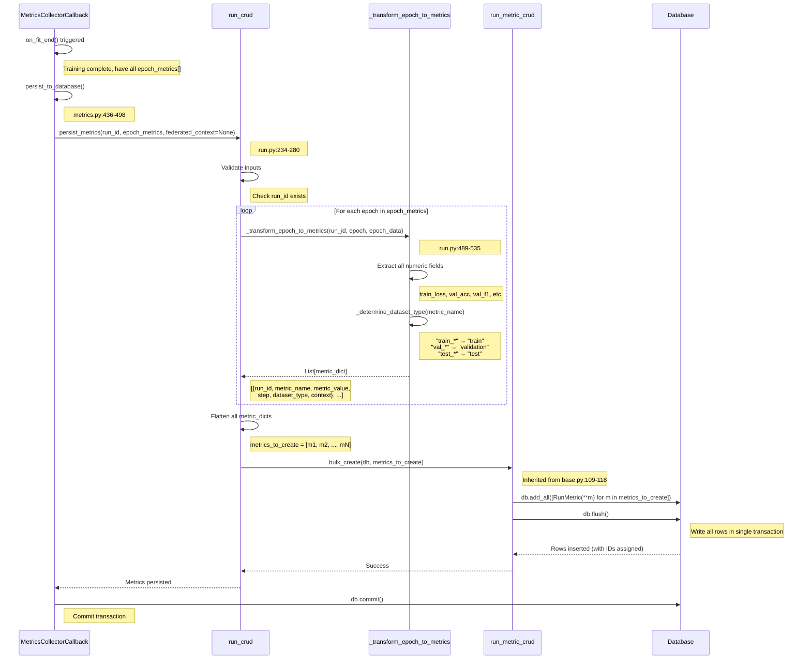
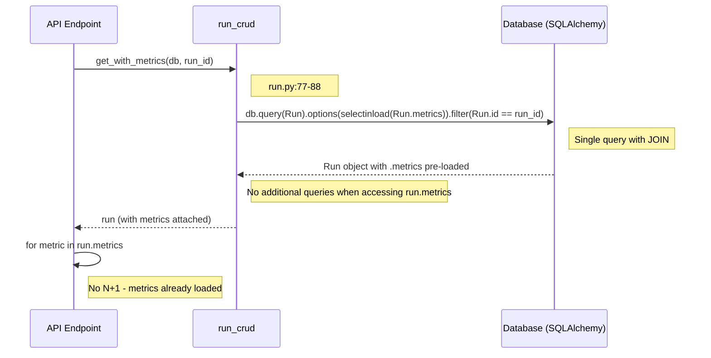
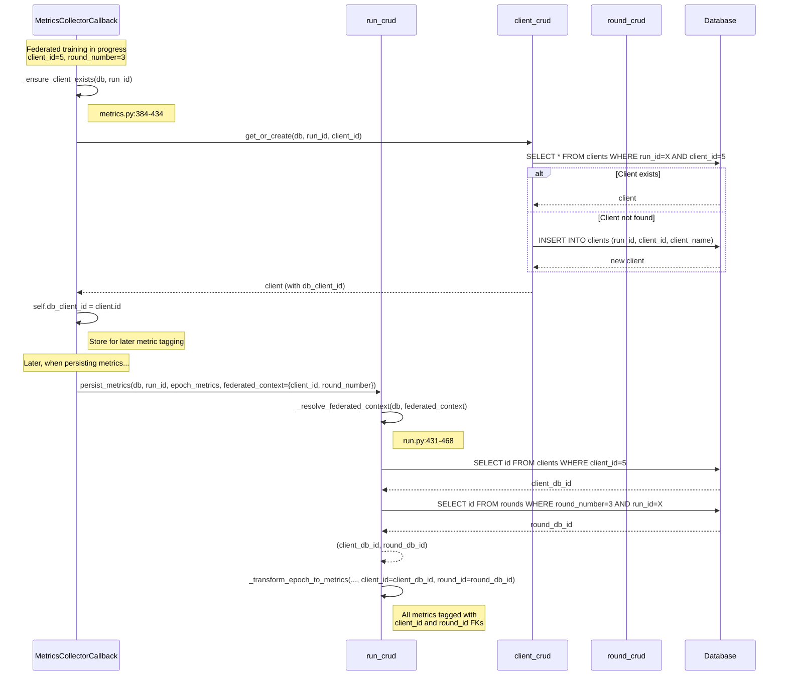
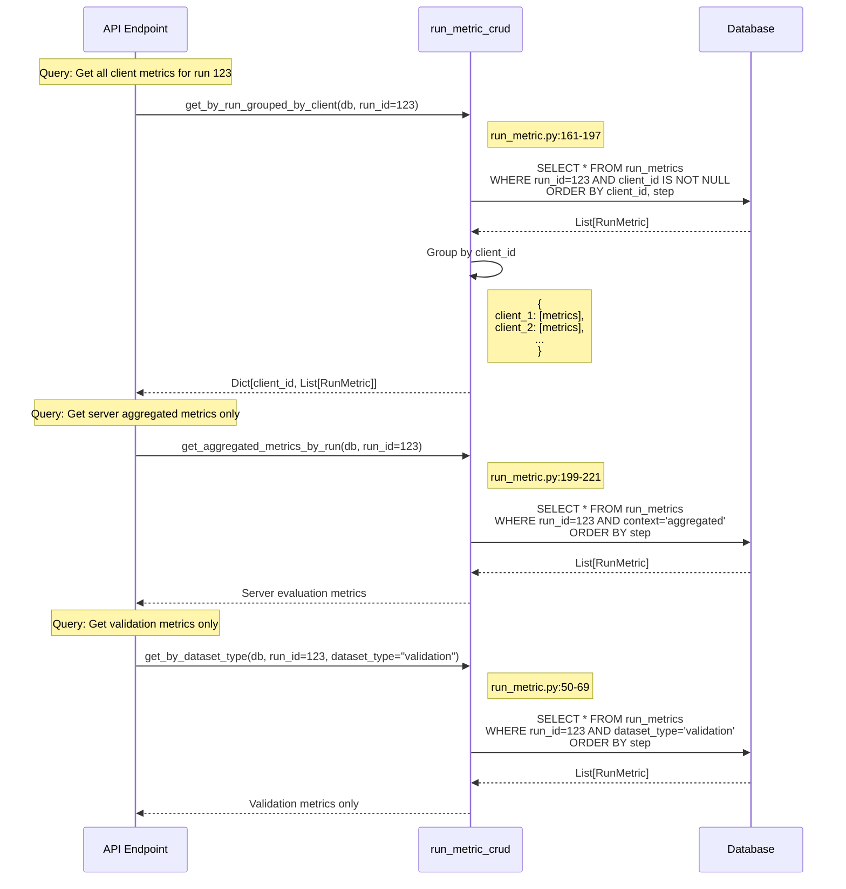
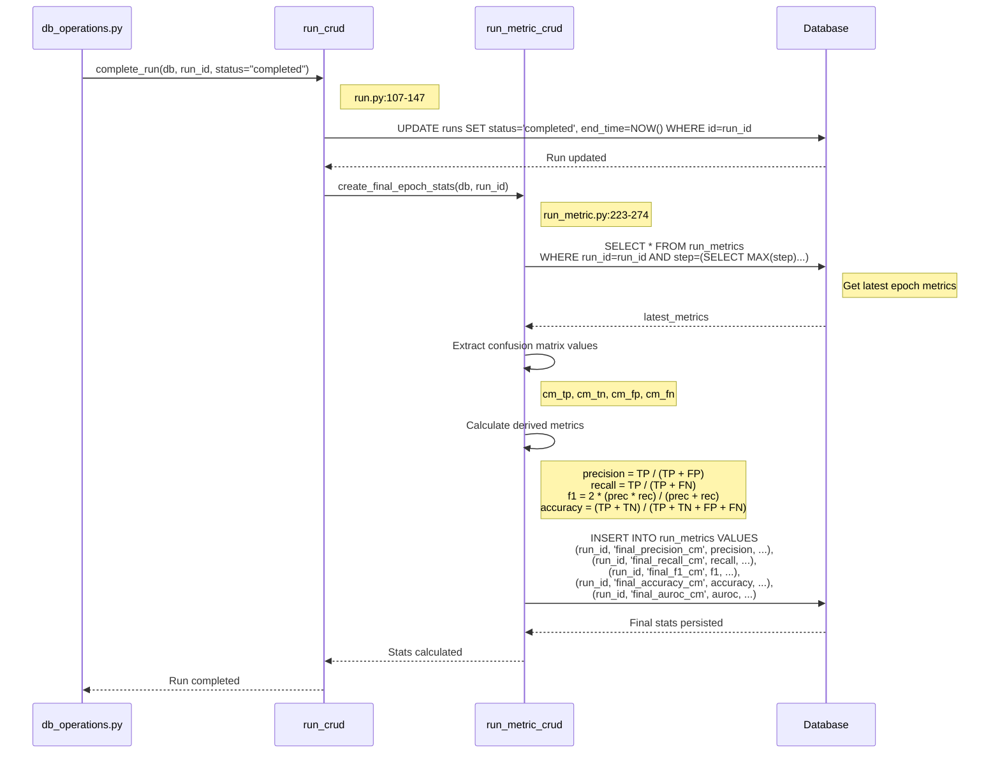
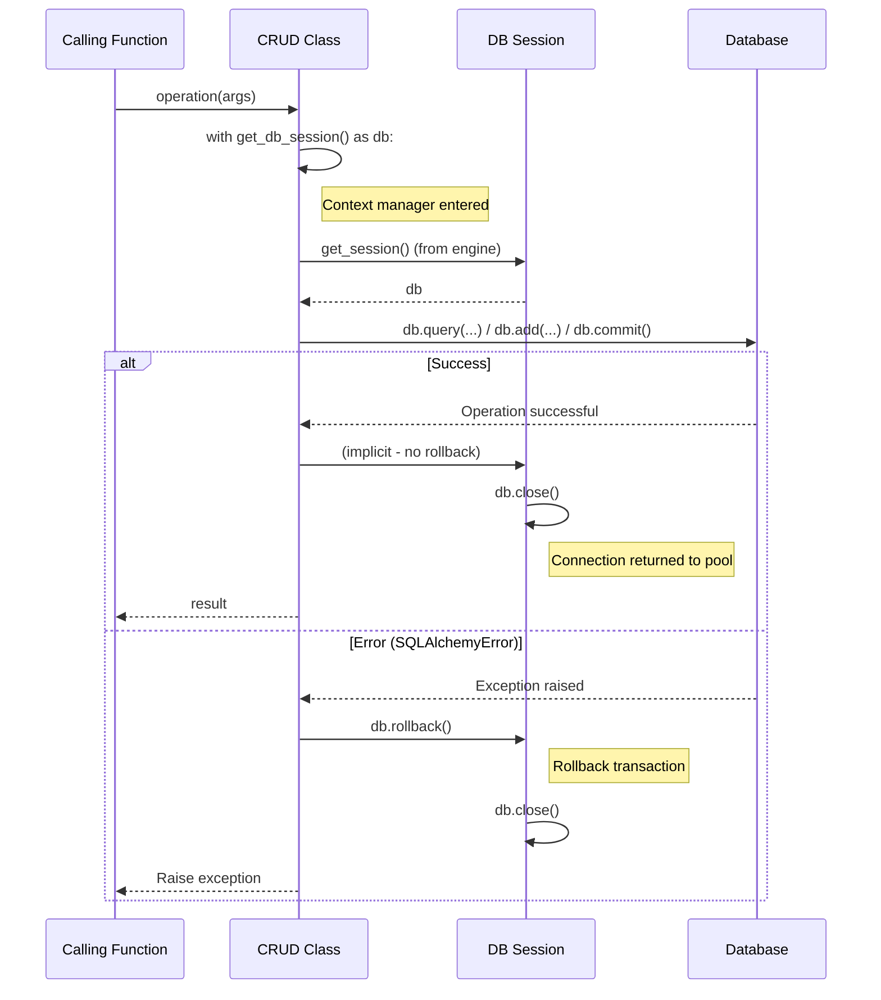

# Database Persistence Patterns - Metrics Collection

**Purpose**: Document CRUD operations, query patterns, and persistence strategies for metrics storage.

---

## Pattern 1: Bulk Metric Persistence (Centralized)

**Use Case**: Persist all epoch metrics at end of training to minimize DB transactions.

**Files**:
- `metrics.py` (MetricsCollectorCallback.persist_to_database, lines 436-498)
- `run.py` (RunCRUD.persist_metrics, lines 234-280)
- `run_metric.py` (RunMetricCRUD.bulk_create)
- `base.py` (BaseCRUD.bulk_create, lines 109-118)



**Key Code**:
```python
# run.py lines 234-280
def persist_metrics(self, db, run_id, epoch_metrics, federated_context=None):
    """Persist metrics to database with optional federated context.

    Args:
        db: Database session
        run_id: Run identifier
        epoch_metrics: List[Dict] - epoch-level metrics
        federated_context: Optional[Dict] - {client_id, round_number}
    """
    if not epoch_metrics:
        logger.warning("No metrics to persist")
        return

    metrics_to_create = []

    for epoch_data in epoch_metrics:
        epoch = epoch_data.get("epoch", 0)

        # Resolve federated context if provided
        client_id, round_id = self._resolve_federated_context(db, federated_context)

        # Transform epoch dict to metric rows
        metrics_to_create.extend(
            self._transform_epoch_to_metrics(
                run_id=run_id,
                epoch=epoch,
                epoch_data=epoch_data,
                client_id=client_id,
                round_id=round_id,
            )
        )

    # Bulk insert
    if metrics_to_create:
        run_metric_crud.bulk_create(db, metrics_to_create)
        logger.info(f"Persisted {len(metrics_to_create)} metrics for run {run_id}")
```

```python
# run.py lines 489-535 (_transform_epoch_to_metrics)
def _transform_epoch_to_metrics(self, run_id, epoch, epoch_data, client_id=None, round_id=None):
    """Transform epoch dict to list of RunMetric dicts."""
    metrics_list = []

    for key, value in epoch_data.items():
        # Skip non-numeric fields
        if key in ["epoch", "timestamp", "global_step"]:
            continue

        if isinstance(value, (int, float)):
            metrics_list.append({
                "run_id": run_id,
                "metric_name": key,
                "metric_value": float(value),
                "step": epoch,
                "dataset_type": self._determine_dataset_type(key),
                "context": "epoch_end",
                "client_id": client_id,
                "round_id": round_id,
            })

    return metrics_list
```

```python
# base.py lines 109-118 (bulk_create)
def bulk_create(self, db: Session, objects: List[Dict]) -> List[ModelType]:
    """Bulk insert objects for performance."""
    instances = [self.model(**obj) for obj in objects]
    db.add_all(instances)
    db.flush()  # Get IDs assigned, but don't commit
    return instances
```

---

## Pattern 2: Eager Loading (Prevent N+1 Queries)

**Use Case**: Fetch run with all related metrics in single query.

**Files**:
- `run.py` (get_with_metrics, lines 77-88)
- `run.py` (batch_get_final_metrics, lines 334-372)



**Key Code**:
```python
# run.py lines 77-88
def get_with_metrics(self, db: Session, id: int) -> Optional[Run]:
    """Fetch run with all metrics eagerly loaded (prevents N+1)."""
    return (
        db.query(self.model)
        .options(selectinload(self.model.metrics))
        .filter(self.model.id == id)
        .first()
    )
```

**Advanced Example (Federated)**:
```python
# run.py (get_federated_run_with_all_relations - hypothetical)
def get_federated_run_with_all_relations(self, db: Session, run_id: int):
    """Fetch federated run with all related entities."""
    return (
        db.query(Run)
        .options(
            selectinload(Run.metrics),  # All metrics
            selectinload(Run.clients).selectinload(Client.rounds),  # Client rounds
            selectinload(Run.server_evaluations),  # Server round evaluations
        )
        .filter(Run.id == run_id)
        .first()
    )
```

---

## Pattern 3: Federated Context Resolution

**Use Case**: Link metrics to specific client and round in federated learning.

**Files**:
- `run.py` (_resolve_federated_context, lines 431-468)
- `metrics.py` (MetricsCollectorCallback._ensure_client_exists, lines 384-434)



**Key Code**:
```python
# run.py lines 431-468
def _resolve_federated_context(self, db, federated_context):
    """Resolve client_id and round_id from federated context.

    Args:
        federated_context: {client_id: int, round_number: int}

    Returns:
        (client_db_id, round_db_id) or (None, None)
    """
    if not federated_context:
        return None, None

    client_id = federated_context.get("client_id")
    round_number = federated_context.get("round_number")

    client_db_id = None
    round_db_id = None

    # Resolve client
    if client_id is not None:
        client = db.query(Client).filter(Client.client_id == client_id).first()
        client_db_id = client.id if client else None

    # Resolve round
    if round_number is not None:
        round_obj = db.query(Round).filter(
            Round.round_number == round_number
        ).first()
        round_db_id = round_obj.id if round_obj else None

    return client_db_id, round_db_id
```

```python
# metrics.py lines 384-434 (_ensure_client_exists)
def _ensure_client_exists(self, db, run_id):
    """Create or get client entity for federated training."""
    if not self.federated_mode or self.client_id is None:
        return None

    # Check if client exists
    client = db.query(Client).filter(
        Client.run_id == run_id,
        Client.client_id == self.client_id,
    ).first()

    if not client:
        # Create new client
        client = Client(
            run_id=run_id,
            client_id=self.client_id,
            client_name=f"client_{self.client_id}",
        )
        db.add(client)
        db.flush()
        logger.info(f"Created client entity: client_id={self.client_id}, db_id={client.id}")
    else:
        logger.info(f"Found existing client: client_id={self.client_id}, db_id={client.id}")

    return client.id
```

---

## Pattern 4: Querying Metrics by Context

**Use Case**: Retrieve metrics for specific contexts (client, round, dataset type).

**Files**:
- `run_metric.py` (get_by_run_grouped_by_client, lines 161-197)
- `run_metric.py` (get_aggregated_metrics_by_run, lines 199-221)
- `run_metric.py` (get_by_dataset_type, lines 50-69)



**Key Code**:
```python
# run_metric.py lines 161-197
def get_by_run_grouped_by_client(self, db: Session, run_id: int):
    """Get metrics grouped by client for federated runs."""
    metrics = (
        db.query(self.model)
        .filter(
            self.model.run_id == run_id,
            self.model.client_id.isnot(None),
        )
        .order_by(self.model.client_id, self.model.step)
        .all()
    )

    # Group by client_id
    grouped = {}
    for metric in metrics:
        client_id = metric.client_id
        if client_id not in grouped:
            grouped[client_id] = []
        grouped[client_id].append(metric)

    return grouped
```

```python
# run_metric.py lines 199-221
def get_aggregated_metrics_by_run(self, db: Session, run_id: int):
    """Get server-side aggregated metrics (context='aggregated')."""
    return (
        db.query(self.model)
        .filter(
            self.model.run_id == run_id,
            self.model.context == "aggregated",
        )
        .order_by(self.model.step)
        .all()
    )
```

```python
# run_metric.py lines 50-69
def get_by_dataset_type(self, db: Session, run_id: int, dataset_type: str):
    """Get metrics for specific dataset type (train, validation, test)."""
    return (
        db.query(self.model)
        .filter(
            self.model.run_id == run_id,
            self.model.dataset_type == dataset_type,
        )
        .order_by(self.model.step)
        .all()
    )
```

---

## Pattern 5: Final Epoch Stats Calculation

**Use Case**: Compute confusion matrix stats at end of training.

**Files**:
- `run.py` (complete_run, lines 107-147)
- `run_metric.py` (create_final_epoch_stats, lines 223-274)



**Key Code**:
```python
# run.py lines 107-147
def complete_run(self, db: Session, run_id: int, status: str = "completed"):
    """Mark run as complete and calculate final stats."""
    # Update run status
    run = db.query(self.model).filter(self.model.id == run_id).first()
    if not run:
        logger.error(f"Run {run_id} not found")
        return

    run.status = status
    run.end_time = datetime.now()
    db.flush()

    # Calculate final epoch stats
    run_metric_crud.create_final_epoch_stats(db, run_id)

    logger.info(f"Run {run_id} marked as {status}")
```

```python
# run_metric.py lines 223-274 (create_final_epoch_stats)
def create_final_epoch_stats(self, db: Session, run_id: int):
    """Calculate confusion matrix-based final stats."""
    # Get latest epoch metrics
    latest_metrics = (
        db.query(self.model)
        .filter(self.model.run_id == run_id)
        .order_by(self.model.step.desc())
        .limit(100)  # Get last epoch's metrics
        .all()
    )

    # Extract confusion matrix values
    cm_tp = next((m.metric_value for m in latest_metrics if m.metric_name == "cm_tp"), 0)
    cm_tn = next((m.metric_value for m in latest_metrics if m.metric_name == "cm_tn"), 0)
    cm_fp = next((m.metric_value for m in latest_metrics if m.metric_name == "cm_fp"), 0)
    cm_fn = next((m.metric_value for m in latest_metrics if m.metric_name == "cm_fn"), 0)

    # Calculate derived metrics
    precision = cm_tp / (cm_tp + cm_fp) if (cm_tp + cm_fp) > 0 else 0
    recall = cm_tp / (cm_tp + cm_fn) if (cm_tp + cm_fn) > 0 else 0
    f1 = 2 * (precision * recall) / (precision + recall) if (precision + recall) > 0 else 0
    accuracy = (cm_tp + cm_tn) / (cm_tp + cm_tn + cm_fp + cm_fn) if (cm_tp + cm_tn + cm_fp + cm_fn) > 0 else 0

    # Get AUROC if available
    auroc = next((m.metric_value for m in latest_metrics if m.metric_name == "val_auroc"), None)

    # Persist final stats
    final_stats = [
        {"run_id": run_id, "metric_name": "final_precision_cm", "metric_value": precision, "step": 0, "context": "final_epoch"},
        {"run_id": run_id, "metric_name": "final_recall_cm", "metric_value": recall, "step": 0, "context": "final_epoch"},
        {"run_id": run_id, "metric_name": "final_f1_cm", "metric_value": f1, "step": 0, "context": "final_epoch"},
        {"run_id": run_id, "metric_name": "final_accuracy_cm", "metric_value": accuracy, "step": 0, "context": "final_epoch"},
    ]

    if auroc is not None:
        final_stats.append({"run_id": run_id, "metric_name": "final_auroc_cm", "metric_value": auroc, "step": 0, "context": "final_epoch"})

    self.bulk_create(db, final_stats)
    logger.info(f"Final epoch stats created for run {run_id}")
```

---

## Pattern 6: Session Management & Error Handling

**Use Case**: Ensure DB sessions are always closed and transactions rolled back on error.

**Files**:
- `base.py` (get_db_session context manager, lines 18-28)
- `db_operations.py` (create_training_run, lines 14-50)



**Key Code**:
```python
# base.py lines 18-28
@contextmanager
def get_db_session(self):
    """Context manager for database sessions with error handling."""
    session = get_session()
    try:
        yield session
    except SQLAlchemyError as e:
        session.rollback()
        logger.error(f"Database error: {e}")
        raise e
    finally:
        session.close()  # Always close session
```

```python
# db_operations.py lines 14-50
def create_training_run(source_path, experiment_name, logger):
    """Create training run with proper session management."""
    db = get_session()
    try:
        run = run_crud.create(
            db,
            source_path=source_path,
            experiment_name=experiment_name,
            training_mode="centralized",
            status="in_progress",
            start_time=datetime.now(),
        )
        db.commit()
        logger.info(f"Created run {run.id}")
        return run.id
    except Exception as e:
        db.rollback()
        logger.error(f"Failed to create run: {e}")
        raise
    finally:
        db.close()
```

---

## File Reference

| Pattern | File | Key Lines |
|---------|------|-----------|
| **Bulk Persistence** | `run.py`, `base.py` | 234-280, 109-118 |
| **Eager Loading** | `run.py` | 77-88, 334-372 |
| **Federated Context** | `run.py`, `metrics.py` | 431-468, 384-434 |
| **Query by Context** | `run_metric.py` | 161-221 |
| **Final Stats** | `run.py`, `run_metric.py` | 107-147, 223-274 |
| **Session Management** | `base.py`, `db_operations.py` | 18-28, 14-50 |

---

## Database Query Optimization Checklist

| Optimization | Pattern | File Reference |
|--------------|---------|----------------|
| **Bulk Insert** | Use `bulk_create()` instead of loop with `create()` | `base.py:109-118` |
| **Eager Loading** | Use `selectinload()` for relationships | `run.py:77-88` |
| **Index Usage** | Filter by indexed columns (run_id, client_id, round_id) | All CRUD files |
| **Connection Pooling** | Always close sessions in `finally` block | `base.py:18-28` |
| **Transaction Grouping** | Group related inserts in single transaction | `run.py:234-280` |
| **Avoid N+1** | Fetch related entities in single query | `run.py:77-88` |

---

## Context Field Values

| Context Value | Meaning | Used By |
|---------------|---------|---------|
| `"epoch_end"` | Metric collected at end of epoch | MetricsCollectorCallback |
| `"batch"` | Metric collected at batch level | BatchMetricsCallback |
| `"aggregated"` | Server-side aggregated metric (federated) | Server evaluation |
| `"final_epoch"` | Final confusion matrix stats | FinalEpochStatsService |

---

## Dataset Type Inference Rules

```python
# run.py:470-487 (_determine_dataset_type)
def _determine_dataset_type(self, metric_name: str) -> str:
    """Infer dataset type from metric name prefix."""
    if metric_name.startswith("train_"):
        return "train"
    elif metric_name.startswith("val_"):
        return "validation"
    elif metric_name.startswith("test_"):
        return "test"
    else:
        return "other"
```

| Metric Name | Dataset Type |
|-------------|--------------|
| `train_loss` | "train" |
| `val_accuracy` | "validation" |
| `test_f1` | "test" |
| `final_precision_cm` | "other" |
| `cm_tp` | "other" |
