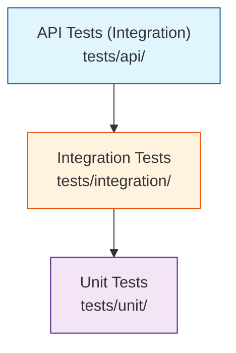
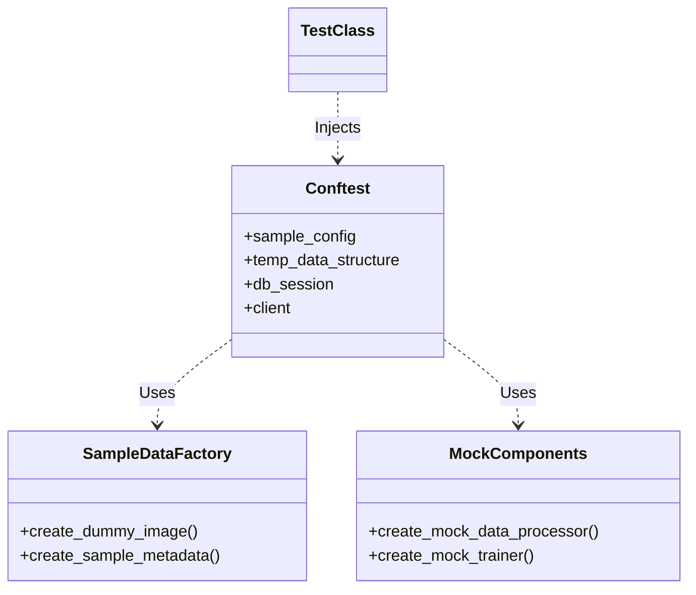

# Testing Architecture

**Scope**: `tests/` directory covering Unit, Integration, and API testing layers.
**Target**: >90% code coverage.

---

## Test Pyramid & Strategy

## Directory Structure & Mapping

| Source Path | Test Path | Description |
|---|---|---|
| `src/entities/` | `tests/unit/entities/` | Entity class validation |
| `src/control/` | `tests/unit/control/` | Core logic and algorithms |
| `src/boundary/` | `tests/unit/boundary/` | DB models and interfaces |
| `src/api/` | `tests/api/` | REST/WebSocket endpoints |
| *System Flows* | `tests/integration/` | Cross-component workflows |

## Core Configuration Components

| File | Purpose | Key Settings |
|---|---|---|
| `tests/pytest.ini` | Test runner config | Markers, coverage settings, log levels |
| `tests/conftest.py` | Shared fixtures | `db_session`, `mock_inference_service`, `temp_data` |
| `tests/test_config.yaml` | Test constants | `batch_size: 8`, `epochs: 2` (Speed optimization) |
| `tests/run_fl_tests.py` | FL Runner | Custom runner for federated learning suites |

---

## Fixture Architecture

Global fixtures are defined in `tests/conftest.py` and modularized in `tests/fixtures/`.

## File Reference

| Component | File | Key Lines |
|---|---|---|
| Global Setup | `tests/conftest.py` | 15-80 |
| Data Factory | `tests/fixtures/sample_data.py` | 12-100 |
| Runner | `tests/run_fl_tests.py` | 10-60 |
