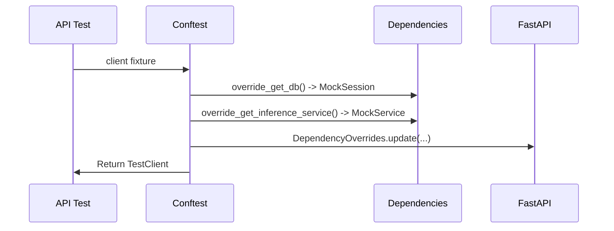
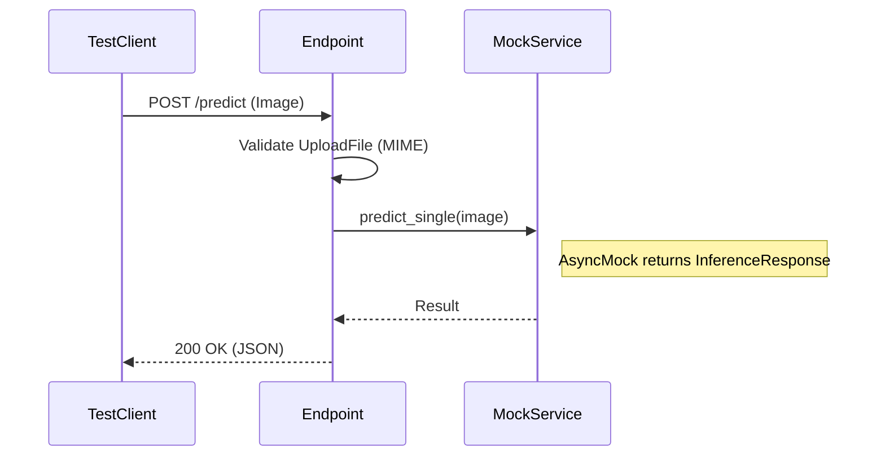

# API Test Flow

**Process**: REST Endpoint testing with Dependency Injection and Mocking.
**Entry Point**: `tests/unit/api/`

---

## Step 1: Client & Dependency Override

**Action**: The test fixture creates a `TestClient` and overrides core services (DB, Inference) to isolate the API layer.



**Key Code**:
```python
# tests/unit/api/conftest.py
@pytest.fixture
def client(mock_db_session, mock_inference_service):
    app.dependency_overrides[deps.get_db] = lambda: mock_db_session
    app.dependency_overrides[deps.get_inference_service] = lambda: mock_inference_service
    with TestClient(app) as c:
        yield c
```

---

## Step 2: Request Handling & Validation

**Action**: The endpoint receives the request, validates input using Pydantic models, and calls the mocked service.



**Key Code**:
```python
# tests/unit/api/endpoints/inference/test_predict.py
def test_predict_valid_image(client, mock_inference_service):
    response = client.post("/api/inference/predict", files={...})
    assert response.status_code == 200
    mock_inference_service.predict_single.assert_called_once()
```

---

## File Reference

| Layer | File | Description |
|-------|------|-------------|
| Fixtures | `tests/unit/api/conftest.py` | API-specific dependency overrides |
| Test | `tests/unit/api/endpoints/inference/test_predict.py` | Endpoint verification logic |
| Schema | `src/api/endpoints/schema/` | Pydantic models validated during test |
