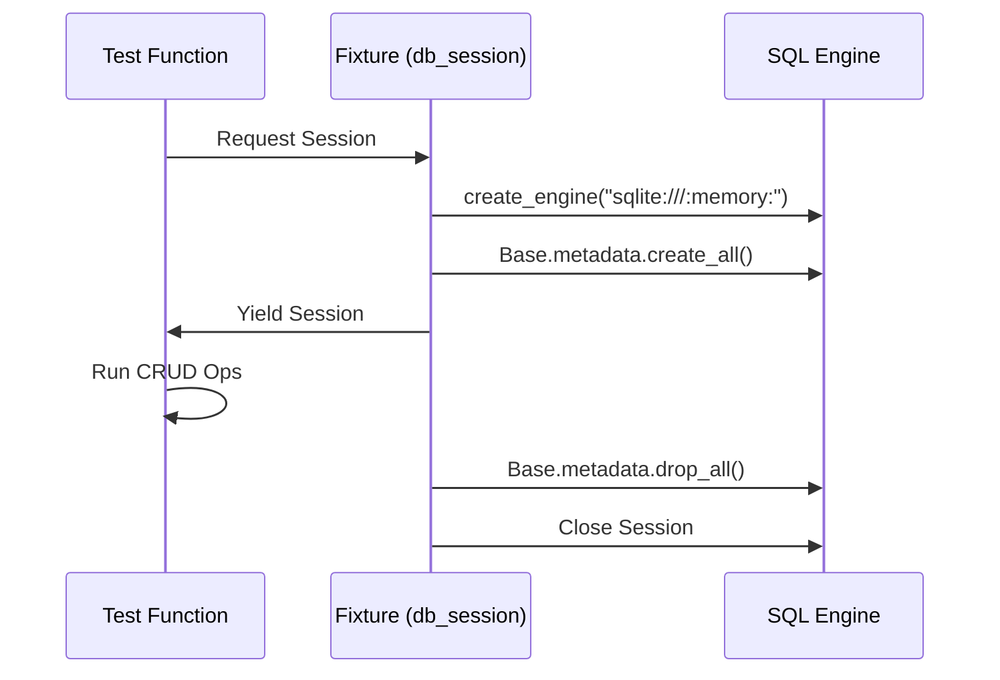
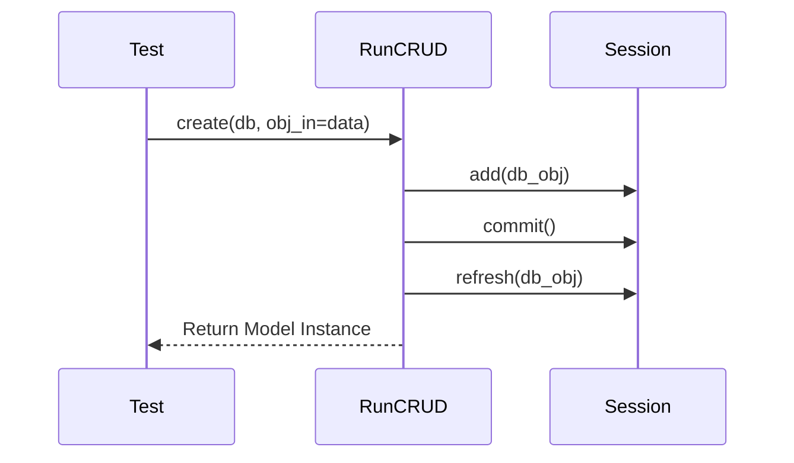

# CRUD Test Flow

**Process**: Database operation verification using ephemeral in-memory SQLite.
**Entry Point**: `tests/unit/boundary/test_run_crud.py`

---

## Step 1: Database Session Isolation

**Action**: The `db_session` fixture creates an isolated SQLite database for each test function to ensure state does not leak.



**Key Code**:
```python
# tests/conftest.py lines 230-250
@pytest.fixture(scope="function")
def db_session():
    engine = create_engine(
        "sqlite:///:memory:", 
        poolclass=StaticPool
    )
    Base.metadata.create_all(bind=engine)
    session = testing_session_local()
    yield session
    session.close()
```

---

## Step 2: Entity Creation & Persistence

**Action**: Tests validate that Pydantic models or raw dictionaries are correctly mapped to SQL rows.



**Key Code**:
```python
# tests/unit/boundary/test_run_crud.py
def test_create_run(db_session: Session):
    run_data = {"run_description": "Test", ...}
    run = run_crud.create(db_session, **run_data)
    assert run.id is not None
```

---

## File Reference

| Layer | File | Description |
|-------|------|-------------|
| Fixture | `tests/conftest.py` | `db_session` setup |
| Test | `tests/unit/boundary/test_run_crud.py` | CRUD verification logic |
| Implementation | `src/boundary/CRUD/run.py` | Actual CRUD operations |
