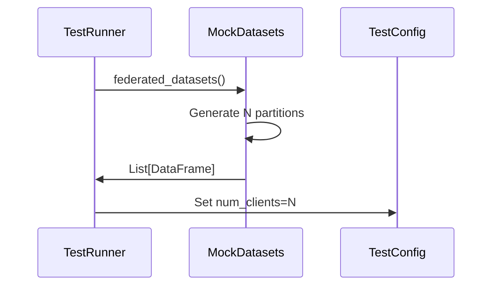
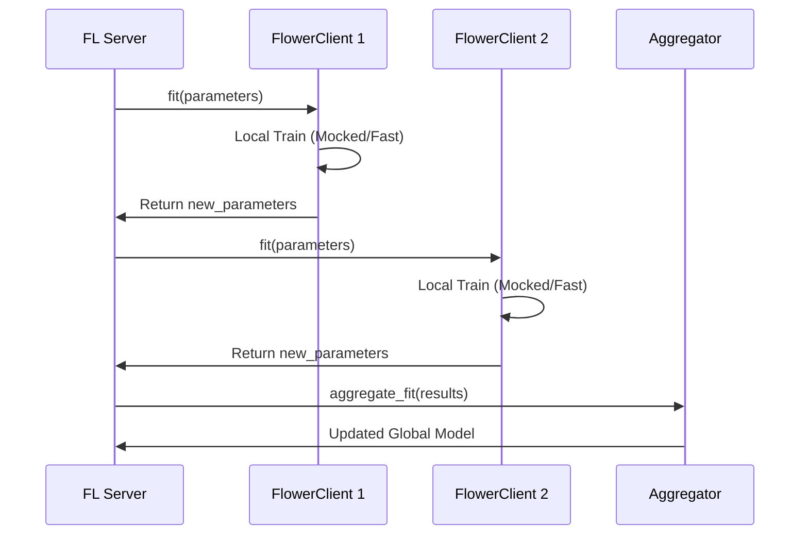

# Federated Learning Test Flow

**Process**: Simulation of Server-Client coordination for Federated Learning.
**Entry Point**: `tests/run_fl_tests.py` or `pytest -m federated`

---

## Step 1: Simulation Setup

**Action**: The test runner initializes the mocked environment for federated learning, creating virtual client datasets.



**Key Code**:
```python
# tests/fixtures/sample_data.py lines 180-210
@staticmethod
def federated_datasets() -> List[pd.DataFrame]:
    # Creates multiple datasets with different distributions
    # Simulates heterogeneous client data (non-IID)
    pass
```

---

## Step 2: Server-Client Round Execution

**Action**: The test simulates a training round where the server aggregates weights from clients.



**Key Code**:
```python
# tests/integration/federated_learning/test_fl_flow.py (Conceptual)
def test_round_aggregation(mock_server, mock_clients):
    # Simulate round
    results = [c.fit(params) for c in mock_clients]
    aggregated = mock_server.aggregate(results)
    assert aggregated is not None
```

---

## File Reference

| Layer | File | Description |
|-------|------|-------------|
| Runner | `tests/run_fl_tests.py` | CLI entry point for FL tests |
| Data | `tests/fixtures/sample_data.py` | `federated_datasets` factory |
| Config | `tests/test_config.yaml` | `federated` section params |
