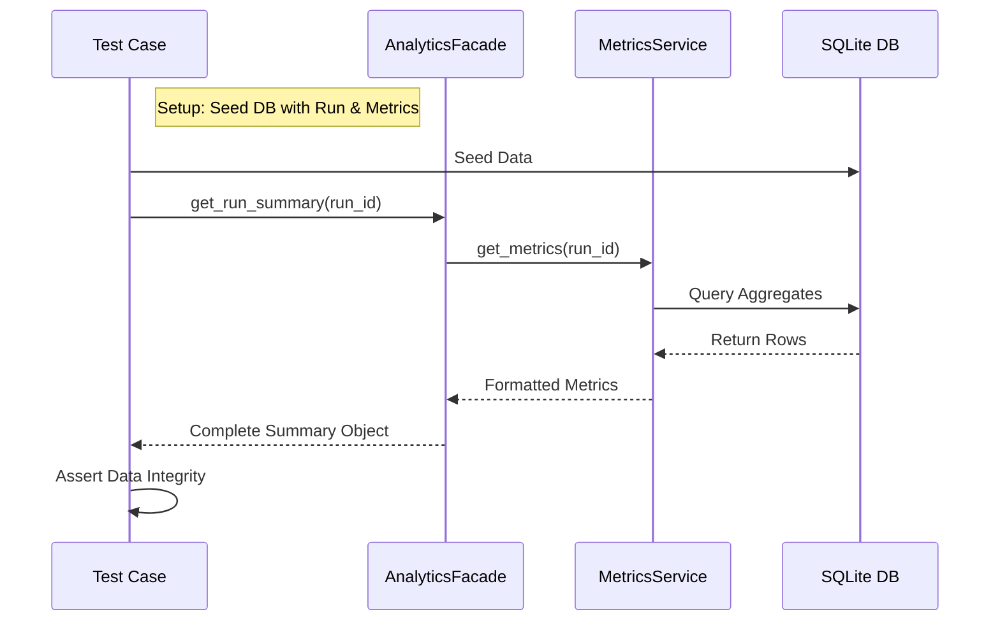
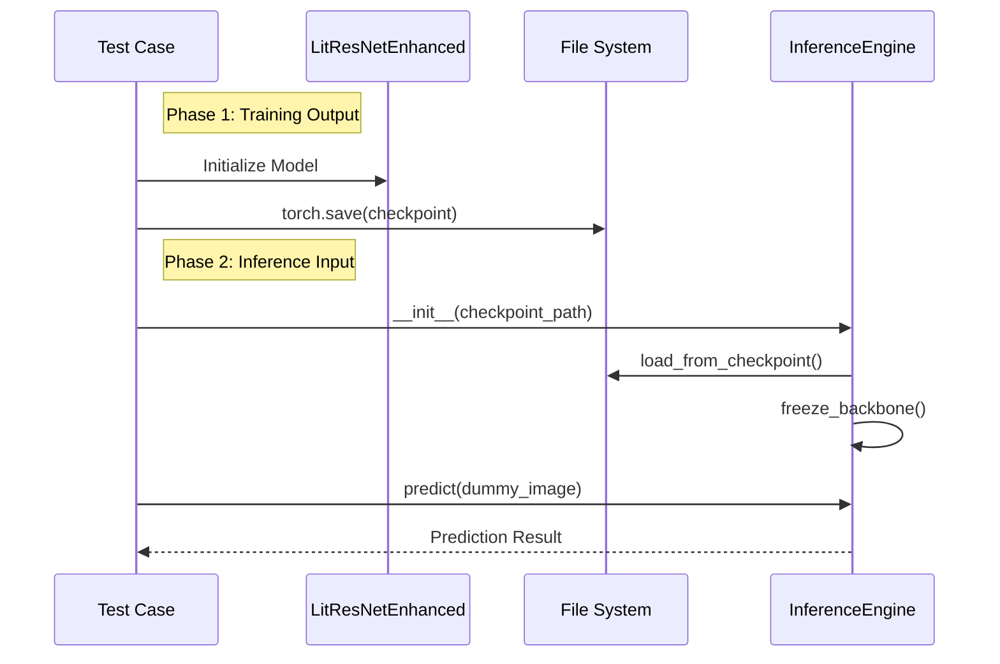

# Integration Test Flows

**Process**: Verification of cross-component interactions (Service-to-Service, Training-to-Inference).
**Entry Point**: `tests/integration/`

---

## Flow 1: Analytics Pipeline Integration

**Goal**: Verify that the Analytics Facade correctly orchestrates Metrics and Summary services using a real (in-memory) database.



**Key Code**:
```python
# tests/integration/control/analytics/test_analytics_integration.py
def test_full_analytics_flow_centralized():
    # ... Arrange (Seed DB) ...
    facade = AnalyticsFacade(summary=summary_service, metrics=metrics_service)
    result = facade.get_run_summary(session, run.id)
    assert result.metrics["best_accuracy"] == 0.9
```

---

## Flow 2: Model Training -> Inference Handover

**Goal**: Verify that a model checkpoint saved by the Training module can be successfully loaded and used by the Inference Engine.



**Key Code**:
```python
# tests/integration/control/model_inference/test_model_loading_integration.py
def test_model_loading_integration(tmp_path):
    # Save dummy checkpoint
    torch.save(checkpoint, checkpoint_path)
    
    # Load into Engine
    engine = InferenceEngine(checkpoint_path=checkpoint_path)
    result = engine.predict(dummy_img)
    assert result[0] in ["PNEUMONIA", "NORMAL"]
```

---

## File Reference

| Layer | File | Description |
|-------|------|-------------|
| Analytics Test | `tests/integration/control/analytics/test_analytics_integration.py` | Service composition test |
| Model Test | `tests/integration/control/model_inference/test_model_loading_integration.py` | Serialization/Deserialization test |
