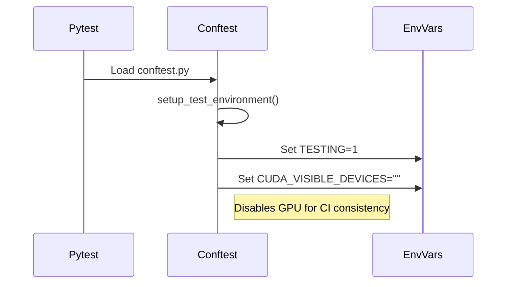
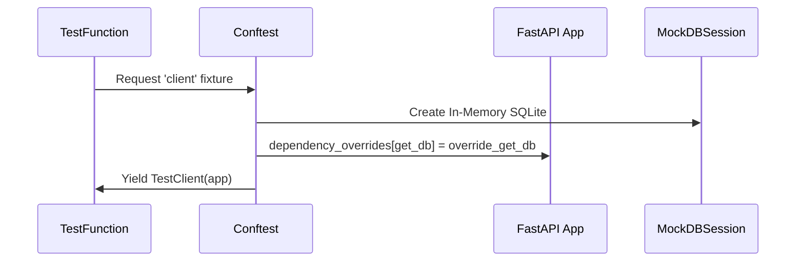
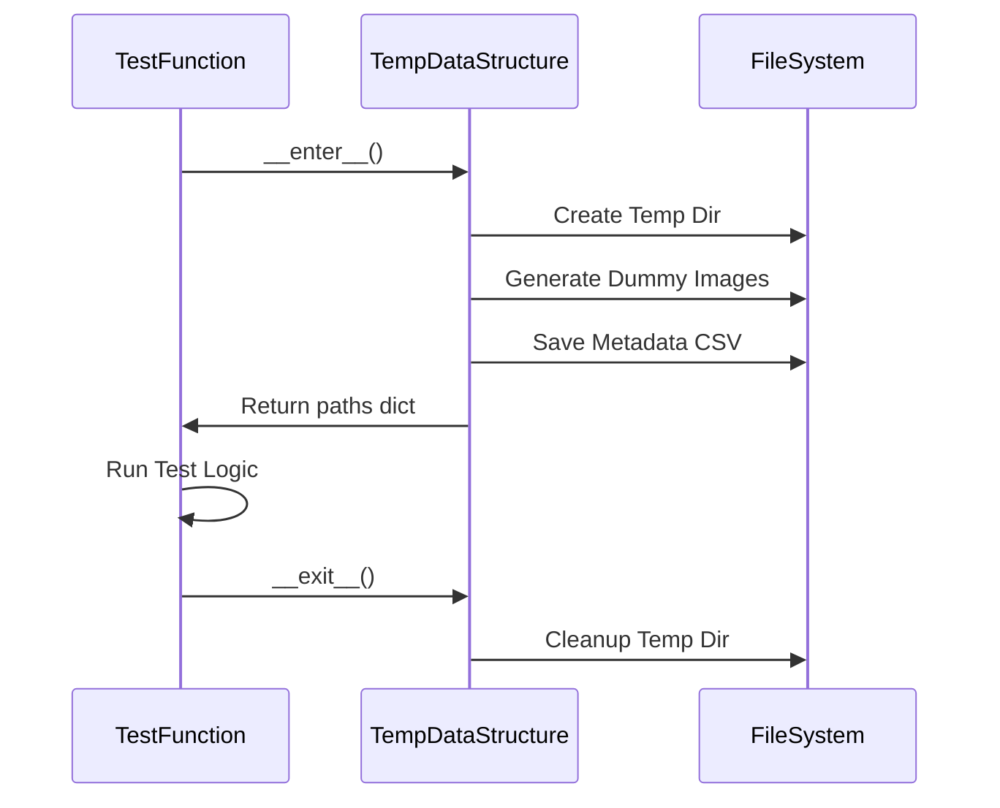

# Test Execution Flow

**Process**: `pytest` invocation → Environment Setup → Test Execution → Teardown
**Entry Point**: `tests/conftest.py`

---

## Step 1: Environment Initialization

**Action**: `pytest` loads `conftest.py` and sets up the test environment variables.



**Key Code**:
```python
# tests/conftest.py lines 145-152
@pytest.fixture(autouse=True)
def setup_test_environment(monkeypatch):
    monkeypatch.setenv("TESTING", "1")
    monkeypatch.setenv("CUDA_VISIBLE_DEVICES", "")
```

---

## Step 2: Database & Dependency Mocking (API Tests)

**Action**: For API tests, `conftest.py` overrides FastAPI dependencies with mocks.



**Key Code**:
```python
# tests/conftest.py lines 270-290
@pytest.fixture
def client(db_session, mock_inference_service):
    app.dependency_overrides[deps.get_db] = override_get_db
    # ... overrides ...
    with TestClient(app) as c:
        yield c
    app.dependency_overrides.clear()
```

---

## Step 3: Data Fixture Creation

**Action**: Tests requiring data request `temp_data_structure`.



**Key Code**:
```python
# tests/fixtures/sample_data.py lines 130-160
def __enter__(self) -> Dict[str, str]:
    self.temp_dir = tempfile.TemporaryDirectory()
    # ... generate images ...
    return self.paths
```

---

## File Reference

| Layer | File | Key Lines |
|-------|------|-----------|
| Setup | `tests/conftest.py` | 145-152 |
| API Client | `tests/conftest.py` | 270-295 |
| Data Fixture | `tests/fixtures/sample_data.py` | 110-170 |
