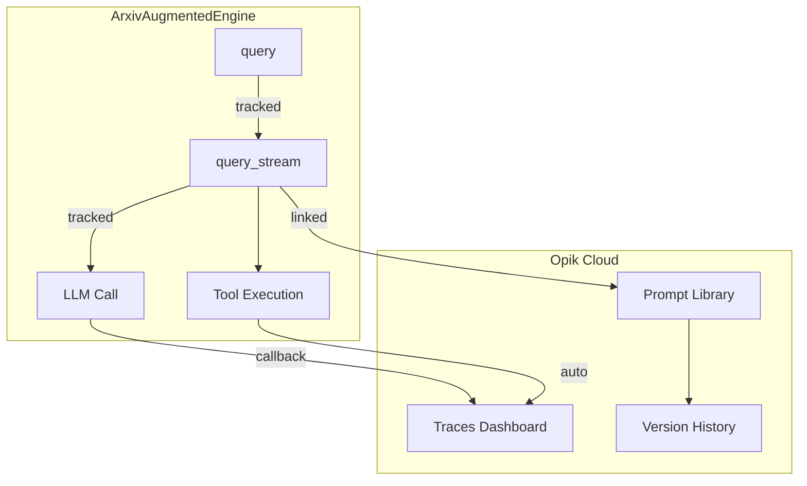

# Opik Integration for ArxivAugmentedEngine

## Overview

This document describes how Opik tracing and prompt versioning was integrated into the ArxivAugmentedEngine to provide observability for LLM calls, tool executions, and prompt management.

## Architecture



## Components

### 1. Prompt Versioning

**File:** `arxiv_agent_prompts.py:81-86`

```python
ARXIV_SYSTEM_CHAT_PROMPT = opik.ChatPrompt(
    name="arxiv-agent-system-prompt",
    messages=[{"role": "system", "content": ARXIV_AGENT_SYSTEM_PROMPT}],
    metadata={"agent": "arxiv-augmented-engine", "domain": "federated-learning"},
)
```

**How it works:**
- `opik.ChatPrompt` registers the prompt in Opik's cloud library
- Automatic versioning: new version created when prompt content changes
- Each version gets a unique commit hash for retrieval
- Metadata tags help organize prompts by agent and domain

### 2. LangChain Integration

**File:** `engine.py:78-82`

```python
self._opik_tracer = OpikTracer(
    project_name="arxiv-augmented-engine",
    tags=["federated-learning", "research-assistant"],
)
```

**Callback injection** (must be passed to each LLM call):

```python
# engine.py:232-234, 269-271, 292-294, 307-309
response = await model_with_tools.ainvoke(
    messages, config={"callbacks": [self._opik_tracer]}
)
```

**What gets traced:**
- All `ainvoke()` and `astream()` calls to the LLM
- Input prompts and output responses
- Token usage and latency metrics
- Tool calls and their results

### 3. Function-Level Tracing

**File:** `engine.py:180, 322`

```python
@opik.track(name="arxiv_query_stream")
async def query_stream(self, query: str, session_id: str, ...):
    ...

@opik.track(name="arxiv_query")
async def query(self, query: str, session_id: str, ...):
    ...
```

**What gets captured:**
- Function inputs (query, session_id, arxiv_enabled)
- Function outputs (streamed chunks or final response)
- Execution duration
- Any exceptions thrown

### 4. Prompt-Trace Linking

**File:** `engine.py:205-209`

```python
update_current_trace(
    prompts=[ARXIV_SYSTEM_CHAT_PROMPT],
    metadata={"session_id": session_id, "arxiv_enabled": arxiv_enabled},
)
```

**Purpose:**
- Links each trace to the exact prompt version used
- Enables tracking which prompt version produced which outputs
- Attaches session metadata for filtering in dashboard

## Configuration

### Environment Variables

| Variable | Description | Example |
|----------|-------------|---------|
| `OPIK_API_KEY` | API key from Opik dashboard | `UUABeVnu...` |
| `OPIK_WORKSPACE` | Your Opik workspace name | `h19overflow` |

### Getting Credentials

1. Visit https://comet.com/opik/your-workspace/get-started
2. Copy your API key
3. Add to `.env` file

## Trace Hierarchy

```
arxiv_query (parent span)
└── arxiv_query_stream (child span)
    ├── LLM: ChatGoogleGenerativeAI.ainvoke
    ├── Tool: search_local_knowledge_base
    ├── Tool: search_arxiv
    └── LLM: ChatGoogleGenerativeAI.astream
```

## Viewing Traces

1. Go to https://comet.com/opik
2. Select workspace: `h19overflow`
3. Navigate to project: `arxiv-augmented-engine`
4. View traces with:
   - Input/output for each span
   - Latency breakdown
   - Token usage
   - Linked prompt versions

## Viewing Prompt Versions

1. Go to Opik dashboard
2. Navigate to **Prompts** section
3. Find `arxiv-agent-system-prompt`
4. View version history with commit hashes
5. Compare versions side-by-side

## Files Modified

| File | Lines | Changes |
|------|-------|---------|
| `arxiv_agent_prompts.py` | 7, 81-86 | Added `opik` import and `ARXIV_SYSTEM_CHAT_PROMPT` |
| `engine.py` | 17-21 | Added opik imports |
| `engine.py` | 78-82 | Added `OpikTracer` initialization |
| `engine.py` | 180 | Added `@opik.track` decorator to `query_stream` |
| `engine.py` | 205-209 | Added `update_current_trace` for prompt linking |
| `engine.py` | 322 | Added `@opik.track` decorator to `query` |
| `.env` | 10-12 | Added `OPIK_API_KEY` and `OPIK_WORKSPACE` |

## Dependencies

```
opik==1.9.71
```

Installed via: `uv pip install opik`
