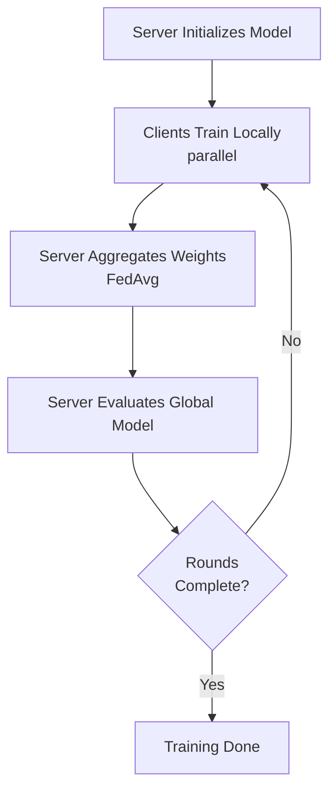
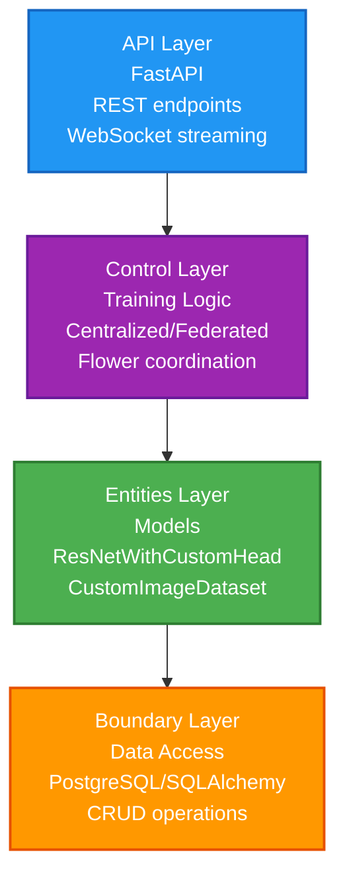

# Federated Pneumonia Detection 🏥

**Privacy-preserving AI for collaborative medical diagnosis**

Train pneumonia detection models across distributed hospitals without sharing patient data. Compare centralized and federated approaches with real-time monitoring and comprehensive metrics.

---

## 🎯 What It Does

This platform enables hospitals to collaboratively train AI models for chest X-ray pneumonia detection while keeping sensitive patient data on-premise. Choose between traditional centralized training or privacy-preserving federated learning.

### Key Capabilities

- **🔒 Privacy-Preserving Training**: Data never leaves client machines—only model weights are shared
- **⚖️ Dual Training Modes**: Compare centralized baseline with federated learning performance
- **📊 Real-Time Monitoring**: Watch training metrics stream live via WebSocket dashboard
- **🎯 Clinical Metrics**: Track accuracy, precision, recall, F1, AUROC, and confusion matrices
- **🚀 Production-Ready API**: FastAPI backend with automatic documentation and validation

---

## 🚀 Quick Start

### Prerequisites

- Python 3.11+
- PostgreSQL database
- UV package manager

### Installation

```bash
# Clone and navigate to project
cd federated_pneumonia_detection

# Install dependencies
uv install
```

### Run Centralized Training

```bash
# Start API server
uvicorn src.api.main:app --reload --port 8001

# In another terminal, trigger training
curl -X POST http://localhost:8001/experiments/centralized \
  -H "Content-Type: application/json" \
  -d '{
    "run_name": "baseline_001",
    "dataset_path": "data/chest_xray.zip"
  }'
```

### Run Federated Learning

```bash
# Launch federated simulation (3 clients, 10 rounds)
uv run flwr run src/control/federated_new_version

# Or use the PowerShell helper
./src/rf.ps1
```

### Monitor Training

- **API Docs**: http://localhost:8001/docs
- **WebSocket**: ws://localhost:8765 (real-time metrics)
- **Frontend Dashboard**: See [xray-vision-ai-forge](../xray-vision-ai-forge/)

---

## 💡 How It Works

### Centralized Mode

Traditional single-machine training for baseline comparisons. Fast iteration with full dataset access.


### Federated Mode

Distributed training across multiple clients with privacy preservation.



**Key Benefit**: Hospitals collaborate without exposing patient data. Each hospital trains on local data; only anonymized model updates are shared.

---

## 📊 Metrics & Outputs

### Training Metrics

- **Loss**: Binary cross-entropy loss
- **Accuracy**: Overall classification accuracy
- **Precision**: Positive predictive value (TP / [TP + FP])
- **Recall**: Sensitivity (TP / [TP + FN])
- **F1-Score**: Harmonic mean of precision and recall
- **AUROC**: Area under ROC curve
- **Confusion Matrix**: TP, TN, FP, FN breakdown

### Real-Time Streaming

```json
// WebSocket event (ws://localhost:8765)
{
  "event": "epoch_end",
  "epoch": 15,
  "train_loss": 0.234,
  "val_accuracy": 0.892,
  "val_recall": 0.884
}
```

### Data Persistence

- **PostgreSQL**: Runs, metrics, client sessions, server evaluations
- **Checkpoints**: Best models saved by validation recall
- **Exports**: JSON/CSV results for analysis

---

## 📦 Architecture Overview



### Module Documentation

| Module                                 | Purpose                      | Docs                                                  |
| -------------------------------------- | ---------------------------- | ----------------------------------------------------- |
| **src/api/**                           | REST endpoints & WebSocket   | [README](src/api/README.md)                           |
| **src/control/dl_model/**              | Centralized training         | [README](src/control/dl_model/README.md)              |
| **src/control/federated_new_version/** | Federated learning (Flower)  | [README](src/control/federated_new_version/README.md) |
| **src/entities/**                      | Neural network models        | [README](src/entities/README.md)                      |
| **src/boundary/**                      | Database operations          | [README](src/boundary/README.md)                      |
| **src/utils/**                         | Data processing & transforms | [README](src/utils/README.md)                         |
| **config/**                            | Configuration management     | [README](config/README.md)                            |

---

## 🛠️ Technology Stack

### Core ML

- **PyTorch 2.8.0** + **PyTorch Lightning 2.5.5**: Deep learning framework
- **torchvision**: ResNet50 backbone, image transforms
- **torchmetrics**: Metric computation

### Federated Learning

- **Flower 1.22.0**: Federated learning orchestration
- **Flower-datasets**: Vision dataset utilities

### Backend

- **FastAPI**: REST API with automatic documentation
- **PostgreSQL** + **SQLAlchemy 2.x**: Data persistence
- **WebSockets**: Real-time metric streaming

### Data & Config

- **pandas**: Data manipulation
- **PyYAML**: Configuration files
- **scikit-learn**: Train/val splitting, class weights

---

## 🔧 Configuration

Edit `config/default_config.yaml` or override parameters programmatically:

```python
from config.config_manager import load_config

config = load_config()
config["experiment"]["epochs"] = 100
config["experiment"]["batch_size"] = 64
```

**Key Parameters**:

- `experiment.epochs`: Training epochs (default: 50)
- `experiment.batch_size`: Batch size (default: 32)
- `federated.num_rounds`: Federated rounds (default: 10)
- `federated.num_clients`: Simulated clients (default: 3)

---

## 📖 Usage Examples

### Programmatic API

```python
from src.control.dl_model.centralized_trainer import CentralizedTrainer
from config.config_manager import load_config

config = load_config()
trainer = CentralizedTrainer(config=config, run_name="exp_001")
results = trainer.train(dataset_path="data/chest_xray.zip")

print(f"Best Accuracy: {results['best_accuracy']:.3f}")
print(f"Best Recall: {results['best_recall']:.3f}")
```

### HTTP API

```bash
# Start centralized training
POST http://localhost:8001/experiments/centralized
Content-Type: application/json

{
  "run_name": "baseline_resnet50",
  "dataset_path": "/data/chest_xray.zip",
  "config_overrides": {
    "experiment.epochs": 100,
    "experiment.learning_rate": 0.0001
  }
}

# Response
{
  "run_id": "uuid-123",
  "status": "training",
  "message": "Training started successfully"
}
```

### Retrieve Results

```bash
# Get run metrics
GET http://localhost:8001/runs/{run_id}/metrics

# Response
{
  "run_id": "uuid-123",
  "metrics": [
    {
      "epoch": 1,
      "train_loss": 0.543,
      "val_accuracy": 0.823,
      "val_recall": 0.801
    },
    ...
  ]
}
```

---

## 🧪 Testing

```bash
# Run all tests
pytest

# Run specific module tests
pytest tests/test_centralized_trainer.py

# With coverage
pytest --cov=src
```

---

## 🤝 Contributing

This project follows clean architecture principles:

- **One file = one responsibility** (max 150 lines)
- **Type hints throughout**
- **Structured logging** for all operations
- **Error handling** for I/O operations

---

## 📚 Related Projects

- **Frontend Dashboard**: [xray-vision-ai-forge](../xray-vision-ai-forge/) - React UI for training orchestration
- **Root Documentation**: [Project README](../README.md) - System-wide overview

---

## 📄 License

[Add your license here]

---

**Questions or Issues?** See individual module READMEs for detailed documentation, or check the [API documentation](http://localhost:8001/docs) after starting the server.

**Last Updated**: 2026-01-24
