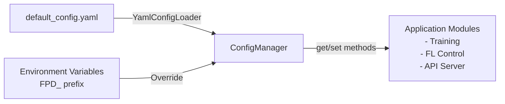

# Configuration Layer

Centralized YAML-based configuration management for the Federated Pneumonia Detection System. Supports type-safe access, environment variable overrides, and flexible configuration across training, federated learning, and inference modes.

## Configuration Flow



---

## Configuration Overview

The configuration system provides a single source of truth for all application settings. All configuration flows through `ConfigManager`, which:
- Loads defaults from `default_config.yaml`
- Applies environment variable overrides (using `FPD_` prefix)
- Provides type-safe access with dot notation
- Supports runtime modifications and persistence

**Key Files:**
- `default_config.yaml` - Default configuration values
- `config_manager.py` - Configuration loading and access layer

---

## Config Manager

The `ConfigManager` class (see: `config_manager.py`) handles all configuration operations:

| Operation | Method | Purpose |
|-----------|--------|---------|
| Load config | `ConfigManager()` | Initialize with defaults |
| Get value | `get(key_path)` | Retrieve config value using dot notation |
| Set value | `set(key_path, value)` | Modify configuration |
| Get section | `get_section(section)` | Retrieve entire config section |
| Check existence | `has_key(key_path)` | Verify key exists |
| List keys | `list_keys(section)` | View available keys |
| Save changes | `save()` | Persist to file |
| Reset | `reset()` | Discard unsaved changes |
| Reload | `reload()` | Reload from file |
| Backup | `backup(path)` | Create configuration backup |
| Flatten | `flatten_config(dict)` | Convert nested dict to dot notation |

**Dot Notation Examples:**
- `system.img_size` - Image dimensions
- `experiment.learning_rate` - Learning rate
- `experiment.federated.num_rounds` - FL rounds

---

## Configuration Sections

### System

Global parameters affecting both centralized and federated modes.

| Key | Type | Default | Description |
|-----|------|---------|-------------|
| `system.img_size` | List[int] | [256, 256] | Input image dimensions (height, width) |
| `system.batch_size` | int | 32 | Training batch size |
| `system.validation_split` | float | 0.2 | Fraction of data reserved for validation |
| `system.seed` | int | 42 | Random seed for reproducibility |
| `system.sample_fraction` | float | 0.05 | Fraction of dataset to sample |
| `system.image_extension` | str | .png | Image file extension |
| `system.use_imagenet_norm` | bool | true | Apply ImageNet normalization |

### Experiment

Hyperparameters for model training and optimization.

| Key | Type | Default | Description |
|-----|------|---------|-------------|
| `experiment.learning_rate` | float | 0.001 | Optimizer learning rate |
| `experiment.epochs` | int | 10 | Maximum training epochs (centralized) |
| `experiment.dropout_rate` | float | 0.3 | Model dropout for regularization |
| `experiment.weight_decay` | float | 0.0001 | L2 regularization strength |
| `experiment.early_stopping_patience` | int | 5 | Epochs without improvement before stopping |
| `experiment.monitor_metric` | str | val_loss | Metric to monitor for early stopping |
| `experiment.reduce_lr_patience` | int | 3 | Epochs before reducing learning rate |
| `experiment.reduce_lr_factor` | float | 0.5 | Factor to multiply learning rate by |
| `experiment.min_lr` | float | 1.0e-07 | Minimum learning rate threshold |
| `experiment.freeze_backbone` | bool | true | Freeze backbone weights during training |
| `experiment.fine_tune_layers_count` | int | 5 | Number of backbone layers to fine-tune |
| `experiment.num_classes` | int | 1 | Number of output classes |
| `experiment.architecture` | str | resnet50 | Model backbone architecture |
| `experiment.color_mode` | str | RGB | Image color mode |
| `experiment.device` | str | auto | Compute device (auto/cuda/cpu) |

### Experiment: Federated Learning

Federated learning specific parameters.

| Key | Type | Default | Description |
|-----|------|---------|-------------|
| `experiment.num_rounds` | int | 2 | Total FL communication rounds |
| `experiment.num_clients` | int | 2 | Total number of clients in federation |
| `experiment.clients_per_round` | int | 2 | Clients participating per round |
| `experiment.local_epochs` | int | 2 | Local training epochs per client |
| `experiment.batch_size` | int | 32 | Batch size for client training |
| `experiment.num_workers` | int | 0 | DataLoader workers |
| `experiment.prefetch_factor` | int | 2 | DataLoader prefetch factor |
| `experiment.pin_memory` | bool | true | Pin memory for DataLoader |
| `experiment.persistent_workers` | bool | false | Reuse DataLoader workers |

### Experiment: Image Preprocessing

Advanced image preprocessing and augmentation parameters.

| Key | Type | Default | Description |
|-----|------|---------|-------------|
| `experiment.use_custom_preprocessing` | bool | false | Enable custom preprocessing pipeline |
| `experiment.augmentation_strength` | float | 1.0 | Strength of data augmentation |
| `experiment.adaptive_histogram` | bool | false | Apply adaptive histogram equalization |
| `experiment.contrast_stretch` | bool | true | Apply contrast stretching |
| `experiment.edge_enhancement` | bool | false | Apply edge enhancement filter |
| `experiment.edge_strength` | float | 1.0 | Strength of edge enhancement |
| `experiment.clip_limit` | float | 2.0 | Histogram clipping limit |
| `experiment.lower_percentile` | float | 5.0 | Lower percentile for contrast |
| `experiment.upper_percentile` | float | 95.0 | Upper percentile for contrast |
| `experiment.validate_images_on_init` | bool | true | Validate images at initialization |

### Paths

Data directory configuration and file locations.

| Key | Type | Default | Description |
|-----|------|---------|-------------|
| `paths.base_path` | str | . | Root directory for all paths |
| `paths.main_images_folder` | str | Images | Subdirectory containing images |
| `paths.images_subfolder` | str | Images | Images subdirectory name |
| `paths.metadata_filename` | str | stage2_train_metadata.csv | Metadata file name |

### Output

Output directory configuration for models, results, and logs.

| Key | Type | Default | Description |
|-----|------|---------|-------------|
| `output.checkpoint_dir` | str | models/checkpoints | Directory for model checkpoints |
| `output.results_dir` | str | results | Directory for training results |
| `output.log_dir` | str | logs | Directory for log files |

### Logging

Logging configuration for application-wide logging.

| Key | Type | Default | Description |
|-----|------|---------|-------------|
| `logging.level` | str | INFO | Logging level (DEBUG/INFO/WARNING/ERROR) |
| `logging.format` | str | %(asctime)s - %(name)s - %(levelname)s - %(message)s | Log message format |
| `logging.file_logging` | bool | true | Enable file logging |

### Columns

Metadata CSV column mapping.

| Key | Type | Default | Description |
|-----|------|---------|-------------|
| `columns.filename` | str | filename | CSV column for image filename |
| `columns.patient_id` | str | patientId | CSV column for patient ID |
| `columns.target` | str | Target | CSV column for target label |

---

## Configuration Hierarchy

Configuration values are applied in the following priority order (highest to lowest):

1. **Environment Variables** - `FPD_` prefixed variables override all other sources
2. **Runtime Modifications** - Changes made via `config.set()` during execution
3. **YAML File** - Values loaded from `default_config.yaml`
4. **Default Values** - Hardcoded defaults in configuration schema

**Example:** If `FPD_EXPERIMENT__LEARNING_RATE=0.005` is set as an environment variable, it will override the YAML value regardless of what's in `default_config.yaml`.

---

## Environment Variables

Environment-based configuration overrides use the `FPD_` prefix followed by the dot-notation key converted to uppercase with underscores replacing dots.

**Format:** `FPD_SECTION__KEY__NESTED_KEY=value`

**Common Examples:**

| Environment Variable | Overrides | Type | Example Value |
|---------------------|-----------|------|----------------|
| `FPD_SYSTEM__BATCH_SIZE` | `system.batch_size` | int | 64 |
| `FPD_SYSTEM__SEED` | `system.seed` | int | 123 |
| `FPD_SYSTEM__IMG_SIZE` | `system.img_size` | list | [512,512] |
| `FPD_EXPERIMENT__LEARNING_RATE` | `experiment.learning_rate` | float | 0.005 |
| `FPD_EXPERIMENT__EPOCHS` | `experiment.epochs` | int | 50 |
| `FPD_EXPERIMENT__DROPOUT_RATE` | `experiment.dropout_rate` | float | 0.5 |
| `FPD_EXPERIMENT__NUM_ROUNDS` | `experiment.num_rounds` | int | 20 |
| `FPD_EXPERIMENT__NUM_CLIENTS` | `experiment.num_clients` | int | 10 |
| `FPD_PATHS__BASE_PATH` | `paths.base_path` | str | /data |
| `FPD_OUTPUT__CHECKPOINT_DIR` | `output.checkpoint_dir` | str | /models |
| `FPD_LOGGING__LEVEL` | `logging.level` | str | DEBUG |

**Setting Environment Variables:**

```bash
# Bash/Linux/MacOS
export FPD_EXPERIMENT__LEARNING_RATE=0.005
export FPD_SYSTEM__BATCH_SIZE=64

# PowerShell (Windows)
$env:FPD_EXPERIMENT__LEARNING_RATE = "0.005"
$env:FPD_SYSTEM__BATCH_SIZE = "64"

# Python
import os
os.environ['FPD_EXPERIMENT__LEARNING_RATE'] = '0.005'
```

---

## Type Safety

Configuration values are validated at access time. `ConfigManager` handles:

- **Type Conversion** - Automatic conversion of string environment variables to appropriate types (int, float, bool, list)
- **Key Existence** - Raises `KeyError` if accessing non-existent keys (unless default provided)
- **Nested Access** - Safely navigates nested dictionaries using dot notation
- **Default Values** - Provides fallbacks when keys don't exist: `config.get('key', default=value)`

**Type Conversion Examples:**

```python
# Automatically converted from string environment variables
os.environ['FPD_SYSTEM__BATCH_SIZE'] = '64'  # Converted to int
os.environ['FPD_EXPERIMENT__LEARNING_RATE'] = '0.005'  # Converted to float
os.environ['FPD_SYSTEM__IMG_SIZE'] = '[512, 512]'  # Converted to list
```

---

## Accessing Configuration

### Basic Access

```python
from federated_pneumonia_detection.config.config_manager import ConfigManager

# Initialize configuration manager
config = ConfigManager()

# Get a single value (dot notation)
learning_rate = config.get("experiment.learning_rate")
batch_size = config["system.batch_size"]  # Dictionary-style access

# Get with default fallback
max_epochs = config.get("experiment.epochs", default=10)

# Get entire section
experiment_config = config.get_section("experiment")
```

### Modifying Configuration

```python
# Set a single value
config.set("experiment.learning_rate", 0.002)
config["system.batch_size"] = 128  # Dictionary-style assignment

# Update multiple values at once
config.update({
    "experiment.learning_rate": 0.002,
    "system.batch_size": 128,
    "experiment.epochs": 50
})

# Set entire section
config.set_section("output", {
    "checkpoint_dir": "/custom/path",
    "results_dir": "/results"
})

# Persist changes
config.save()
```

### Querying Configuration

```python
# Check if key exists
if config.has_key("experiment.num_rounds"):
    rounds = config.get("experiment.num_rounds")

# Using 'in' operator
if "experiment.learning_rate" in config:
    lr = config["experiment.learning_rate"]

# List all keys in section
keys = config.list_keys("experiment")

# List all configuration keys
all_keys = config.list_keys()

# Flatten to dot notation dictionary
flat_config = config.flatten_config(config.to_dict())
```

### State Management

```python
# Get full configuration as dictionary
full_config = config.to_dict()

# Reset to original state (discards unsaved changes)
config.reset()

# Reload from file (discards all in-memory changes)
config.reload()

# Create backup before changes
backup_path = config.backup("/backups/config_backup.yaml")
```

### Quick Access Functions

```python
from federated_pneumonia_detection.config.config_manager import quick_get, quick_set

# Get without creating persistent manager
lr = quick_get("experiment.learning_rate")

# Set and save immediately
quick_set("experiment.learning_rate", 0.005)
```

---

## Adding New Configuration Values

### Step 1: Add to default_config.yaml

```yaml
experiment:
  new_setting: 0.123  # New value with default
  nested_section:
    sub_setting: true
```

### Step 2: Document in Appropriate Section

Update this README with the new key in the relevant configuration section table.

### Step 3: Access in Code

```python
config = ConfigManager()
value = config.get("experiment.new_setting")
```

### Step 4: Support Environment Override (Optional)

Users can immediately override via environment variable:

```bash
export FPD_EXPERIMENT__NEW_SETTING=0.456
```

### Guidelines for Extensions

- **Naming:** Use lowercase with underscores (snake_case)
- **Organization:** Group related settings under nested sections
- **Documentation:** Always update README with key, type, default, and description
- **Validation:** Consider adding type validation in modules consuming the value
- **Defaults:** Provide sensible defaults for all new keys
- **Environment Overrides:** Ensure configuration keys can be overridden via `FPD_` environment variables

---

## Related Documentation

- **Control Layer:** See [../src/control/README.md](../src/control/README.md) for federated learning control flow and how configuration is passed to controllers
- **API Server:** See [../src/api/README.md](../src/api/README.md) for how configuration is used in the API layer
- **Project Root:** See [../../../README.md](../../../README.md) for system architecture and overview
