# FastAPI Layer Architecture & Request Flows

**Purpose**: Complete REST API for training orchestration, results retrieval, and system management with real-time WebSocket integration.

---

## Table of Contents

1. [Overview](#overview)
2. [API Architecture](#api-architecture)
3. [Request Flow Diagrams](#request-flow-diagrams)
4. [Endpoint Documentation](#endpoint-documentation)
5. [Request/Response Examples](#requestresponse-examples)
6. [Integration Details](#integration-details)

---

## Overview

**Framework**: FastAPI (async Python web framework)
**Server**: Uvicorn ASGI
**Port**: `127.0.0.1:8001`
**WebSocket**: `ws://localhost:8765` (embedded relay)

---

## API Architecture

### High-Level Component Diagram

```mermaid
graph TB
    subgraph Client["📱 Client"]
        React["React Frontend<br/>localhost:5173"]
    end

    subgraph FastAPI["⚡ FastAPI Application<br/>main.py"]
        Lifespan["Lifespan Manager<br/>startup/shutdown"]
        Router1["Route Handlers<br/>/experiments"]
        Router2["Route Handlers<br/>/runs"]
        Router3["Route Handlers<br/>/config"]
        Router4["Route Handlers<br/>/chat"]
        WS["WebSocket Relay<br/>ws://localhost:8765"]
        DI["Dependency Injection<br/>deps.py"]
    end

    subgraph Control["🎮 Control Layer"]
        Trainer["CentralizedTrainer<br/>or FederatedTrainer"]
        Tasks["Background Tasks<br/>celery/asyncio"]
    end

    subgraph Data["💾 Persistence"]
        DB["PostgreSQL<br/>Runs, Metrics"]
        Files["File Storage<br/>Checkpoints"]
    end

    React -->|HTTP| Router1
    React -->|HTTP| Router2
    React -->|HTTP| Router3
    React -->|HTTP| Router4
    React -->|WebSocket| WS

    Router1 -->|DI| DI
    Router2 -->|DI| DI
    Router3 -->|DI| DI
    Router4 -->|DI| DI

    Router1 -->|Dispatch| Tasks
    Router2 -->|Query| DB
    Router3 -->|Read/Write| DB
    Router4 -->|Query/Search| DB

    Tasks -->|Initialize| Trainer
    Trainer -->|Metrics| WS
    Trainer -->|Save| Data
    Trainer -->|Store| DB

    Lifespan -->|Setup| DI
    Lifespan -->|Startup| WS

    style Client fill:#e1f5ff
    style FastAPI fill:#fff3e0
    style Control fill:#f3e5f5
    style Data fill:#e8f5e9
```



---

## Request Flow Diagrams

### 1. Centralized Training Workflow

```mermaid
sequenceDiagram
    participant UI as React UI<br/>localhost:5173
    participant API as FastAPI<br/>Router
    participant Validation as Pydantic<br/>Validation
    participant Tasks as Background<br/>Tasks
    participant Trainer as CentralizedTrainer
    participant WS as WebSocket<br/>Server
    participant DB as PostgreSQL

    UI->>API: POST /experiments/centralized<br/>{data_zip, experiment_name...}

    API->>Validation: Validate request schema
    Validation-->>API: CentralizedTrainingRequest

    API->>Tasks: Queue background_training_task()
    API-->>UI: 202 Accepted<br/>{experiment_id, status: queued}

    Tasks->>Tasks: Extract ZIP file<br/>Validate images

    Tasks->>Trainer: Initialize CentralizedTrainer
    Trainer->>Trainer: Load config

    Trainer->>WS: send_training_mode<br/>(is_federated=False)

    loop For each epoch
        Trainer->>Trainer: Forward pass
        Trainer->>Trainer: Compute metrics
        Trainer->>WS: send_epoch_end<br/>(epoch, metrics)
        WS-->>UI: Display progress
    end

    Trainer->>DB: Persist run record
    Trainer->>DB: Persist metrics
    Trainer->>WS: send_training_end<br/>(run_id, status)

    UI->>API: GET /api/runs/{run_id}/metrics
    API->>DB: Query run & metrics
    DB-->>API: RunResults
    API-->>UI: {training_history, best_metrics}

    style UI fill:#e1f5ff
    style API fill:#fff3e0
    style Trainer fill:#f3e5f5
    style DB fill:#e8f5e9
```

### 2. Federated Learning Workflow

```mermaid
sequenceDiagram
    participant UI as React UI
    participant API as FastAPI
    participant Tasks as Background Tasks
    participant Server as Flower ServerApp
    participant Clients as ClientApp×N
    participant WS as WebSocket
    participant DB as PostgreSQL

    UI->>API: POST /experiments/federated<br/>{data_zip, num_rounds=15...}

    API->>Tasks: Queue federated_training_task()
    API-->>UI: 202 Accepted<br/>{experiment_id, status: queued}

    Tasks->>Tasks: Extract & prepare data
    Tasks->>Server: Initialize Flower ServerApp

    Server->>Server: Load global model<br/>Create run record in DB

    Server->>WS: send_training_mode<br/>(is_federated=True, num_rounds=15)

    loop For each Round (1 to num_rounds)
        Server->>Clients: Broadcast weights

        par Client Training (Parallel)
            Clients->>Clients: Load partition<br/>Train locally
        end

        Clients-->>Server: Return updates

        Server->>Server: Aggregate (FedAvg)
        Server->>Server: Server-side eval
        Server->>DB: Persist metrics
        Server->>WS: send_round_metrics<br/>(round, metrics)
        WS-->>UI: Update charts
    end

    Server->>DB: Mark run completed
    Server->>WS: send_training_end<br/>(run_id)

    UI->>API: GET /api/runs/{run_id}/federated-rounds
    API->>DB: Query server_evaluations<br/>+ aggregated metrics
    DB-->>API: FederatedResults
    API-->>UI: {rounds, per_round_metrics}

    style UI fill:#e1f5ff
    style API fill:#fff3e0
    style Server fill:#c8e6c9
    style DB fill:#e8f5e9
```

### 3. Results Retrieval Workflow

```mermaid
sequenceDiagram
    participant UI as React UI
    participant API as FastAPI
    participant Cache as In-Memory Cache<br/>Optional
    participant DB as PostgreSQL
    participant Formatter as Transform/Format

    UI->>API: GET /api/runs/{run_id}/metrics

    API->>API: Validate run_id
    alt Cache Hit
        API->>Cache: Check cache
        Cache-->>API: Cached result
    else Cache Miss
        API->>DB: SELECT * FROM runs WHERE id={run_id}
        DB-->>API: Run record
        API->>DB: SELECT * FROM run_metrics<br/>WHERE run_id={run_id}
        DB-->>API: Metrics array
    end

    API->>Formatter: Transform to ExperimentResults
    Formatter->>Formatter: Compute final stats<br/>Organize by phase
    Formatter-->>API: ExperimentResults

    API-->>UI: 200 OK<br/>{run_id, training_history, best_metrics...}

    UI->>UI: Render charts<br/>Update visualizations

    style UI fill:#e1f5ff
    style API fill:#fff3e0
    style DB fill:#e8f5e9
```

---

## Endpoint Documentation

### Training Endpoints (`/experiments`)

#### POST /experiments/centralized

**Start centralized training**

```
POST /experiments/centralized
Content-Type: multipart/form-data

data_zip: <file>           # ZIP containing Images/ and metadata CSV
experiment_name: string    # Optional, default: pneumonia_centralized
checkpoint_dir: string     # Optional, default: results/centralized/checkpoints
logs_dir: string          # Optional, default: results/centralized/logs
csv_filename: string      # Optional, default: stage2_train_metadata.csv
```

**Response** (202 Accepted):
```json
{
    "experiment_id": "centralized_exp_001",
    "status": "queued",
    "checkpoint_dir": "results/centralized/checkpoints",
    "logs_dir": "results/centralized/logs"
}
```

**Implementation**: [centralized_endpoints.py](endpoints/experiments/centralized_endpoints.py)

---

#### POST /experiments/federated

**Start federated learning training**

```
POST /experiments/federated
Content-Type: multipart/form-data

data_zip: <file>              # ZIP with data
experiment_name: string       # Optional, default: pneumonia_federated
num_server_rounds: integer    # Optional, default: 3
csv_filename: string         # Optional
```

**Response** (202 Accepted):
```json
{
    "experiment_id": "federated_exp_001",
    "status": "queued",
    "num_server_rounds": 3,
    "num_clients": 5
}
```

**Implementation**: [federated_endpoints.py](endpoints/experiments/federated_endpoints.py)

---

### Results Endpoints (`/api/runs`)

#### GET /api/runs

**List all training runs**

```
GET /api/runs/list
```

**Response** (200 OK):
```json
{
    "runs": [
        {
            "id": 1,
            "training_mode": "centralized",
            "status": "completed",
            "start_time": "2024-01-15T10:30:00Z",
            "end_time": "2024-01-15T10:45:00Z",
            "best_val_recall": 0.923
        },
        {
            "id": 2,
            "training_mode": "federated",
            "status": "in_progress",
            "num_rounds": 15,
            "current_round": 5
        }
    ]
}
```

**Implementation**: [runs_list.py](endpoints/runs_endpoints/runs_list.py)

---

#### GET /api/runs/{run_id}/metrics

**Retrieve complete training metrics for a run**

```
GET /api/runs/{run_id}/metrics
```

**Response** (200 OK):
```json
{
    "run_id": 1,
    "training_mode": "centralized",
    "status": "completed",
    "start_time": "2024-01-15T10:30:00Z",
    "end_time": "2024-01-15T10:45:00Z",
    "training_history": [
        {
            "epoch": 1,
            "phase": "train",
            "loss": 0.523,
            "accuracy": 0.845,
            "precision": 0.812,
            "recall": 0.923,
            "f1": 0.865,
            "auroc": 0.931
        },
        ...
    ],
    "best_metrics": {
        "accuracy": 0.891,
        "precision": 0.856,
        "recall": 0.945,
        "f1": 0.897,
        "auroc": 0.955
    },
    "confusion_matrix": {
        "true_positives": 245,
        "true_negatives": 189,
        "false_positives": 23,
        "false_negatives": 17
    }
}
```

**Implementation**: [runs_metrics.py](endpoints/runs_endpoints/runs_metrics.py)

---

#### GET /api/runs/{run_id}/federated-rounds

**Retrieve federated learning metrics per round**

```
GET /api/runs/{run_id}/federated-rounds
```

**Response** (200 OK - Federated Only):
```json
{
    "is_federated": true,
    "num_rounds": 15,
    "num_clients": 5,
    "rounds": [
        {
            "round": 1,
            "metrics": {
                "loss": 0.512,
                "accuracy": 0.821,
                "precision": 0.798,
                "recall": 0.912,
                "f1": 0.851,
                "auroc": 0.924
            }
        },
        ...
    ]
}
```

**Implementation**: [runs_federated_rounds.py](endpoints/runs_endpoints/runs_federated_rounds.py)

---

#### GET /api/runs/{run_id}/download/{format}

**Download results in specified format**

```
GET /api/runs/{run_id}/download/json    # JSON format
GET /api/runs/{run_id}/download/csv     # CSV format
GET /api/runs/{run_id}/download/summary # Text summary
```

**Response**: File download

**Implementation**: [runs_download.py](endpoints/runs_endpoints/runs_download.py)

---

### Configuration Endpoints (`/config`)

#### GET /config/current

**Get current configuration values**

```
GET /config/current
```

**Response** (200 OK):
```json
{
    "system": {
        "img_size": [256, 256],
        "batch_size": 512,
        "num_workers": 10
    },
    "experiment": {
        "learning_rate": 0.0015,
        "epochs": 15,
        "num_rounds": 15,
        "num_clients": 5
    },
    "paths": {
        "base_path": ".",
        "images_subfolder": "Images"
    }
}
```

**Implementation**: [configuration_endpoints.py](endpoints/configuration_settings/configuration_endpoints.py)

---

#### POST /config/update

**Update configuration values**

```
POST /config/update
Content-Type: application/json

{
    "experiment": {
        "learning_rate": 0.001,
        "epochs": 20
    }
}
```

**Response** (200 OK):
```json
{
    "updated_fields": 2,
    "verification_passed": true,
    "updated": {
        "experiment.learning_rate": 0.001,
        "experiment.epochs": 20
    }
}
```

**Implementation**: [configuration_endpoints.py](endpoints/configuration_settings/configuration_endpoints.py)

---

### Chat Endpoints (`/chat`)

#### POST /chat/query

**Query with RAG + Arxiv augmentation**

```
POST /chat/query
Content-Type: application/json

{
    "query": "What are the differences between federated and centralized learning?",
    "session_id": "session_001",
    "run_id": 1,
    "training_mode": "federated",
    "arxiv_enabled": true
}
```

**Response** (200 OK):
```json
{
    "answer": "Federated learning...",
    "sources": [
        {"title": "...", "url": "..."},
        {"arXiv": "2401.12345"}
    ],
    "session_id": "session_001"
}
```

**Implementation**: [chat_endpoints.py](endpoints/chat/chat_endpoints.py)

---

## Request/Response Examples

### Complete Centralized Training Workflow Example

```bash
# 1. Start training
curl -X POST \
  -F "data_zip=@dataset.zip" \
  -F "experiment_name=pneumonia_exp_001" \
  http://localhost:8001/experiments/centralized

# Response (202):
# {
#   "experiment_id": "centralized_exp_001",
#   "status": "queued"
# }

# 2. Check progress via WebSocket (frontend)
# ws://localhost:8765
# Receives: {"type": "epoch_end", "data": {...}}

# 3. After training, retrieve results
curl http://localhost:8001/api/runs/1/metrics

# Response (200):
# {
#   "run_id": 1,
#   "status": "completed",
#   "training_history": [...],
#   "best_metrics": {...}
# }

# 4. Download results
curl http://localhost:8001/api/runs/1/download/csv > results.csv
```

---

## Integration Details

### Dependency Injection (`deps.py`)

All endpoints use DI for clean, testable code:

```python
from fastapi import Depends

def get_config(config_manager: ConfigManager = Depends()) -> Config:
    return config_manager.get_config()

async def some_endpoint(config: Config = Depends(get_config)):
    # Use injected config
    pass
```

**Providers**:
- `get_db()`: SQLAlchemy session
- `get_config()`: ConfigManager
- `get_experiment_crud()`: RunCRUD
- `get_run_metric_crud()`: RunMetricCRUD

---

### Error Handling

All endpoints follow consistent error handling:

```python
try:
    # Operation
except ValueError as e:
    raise HTTPException(status_code=422, detail=str(e))
except RunNotFoundError as e:
    raise HTTPException(status_code=404, detail="Run not found")
except Exception as e:
    logger.error(f"Endpoint error: {e}")
    raise HTTPException(status_code=500, detail="Internal server error")
```

**Status Codes**:
- `200`: Success
- `202`: Accepted (async task queued)
- `400`: Bad request
- `404`: Not found
- `422`: Validation error
- `500`: Server error

---

### CORS Configuration

Frontend can access API from:
```python
allow_origins=[
    "http://localhost:5173",  # React dev server
    "http://localhost:8080",  # Alternative frontend
    "http://localhost:3000"   # Common React default
]
```

---

## Related Documentation

- **Main API File**: [main.py](main.py)
- **Endpoints Overview**: [endpoints/README.md](endpoints/README.md)
- **WebSocket Integration**: [../control/dl_model/utils/data/WEBSOCKET_DOCUMENTATION.md](../control/dl_model/utils/data/WEBSOCKET_DOCUMENTATION.md)
- **System Architecture**: [README.md](../../README.md)

