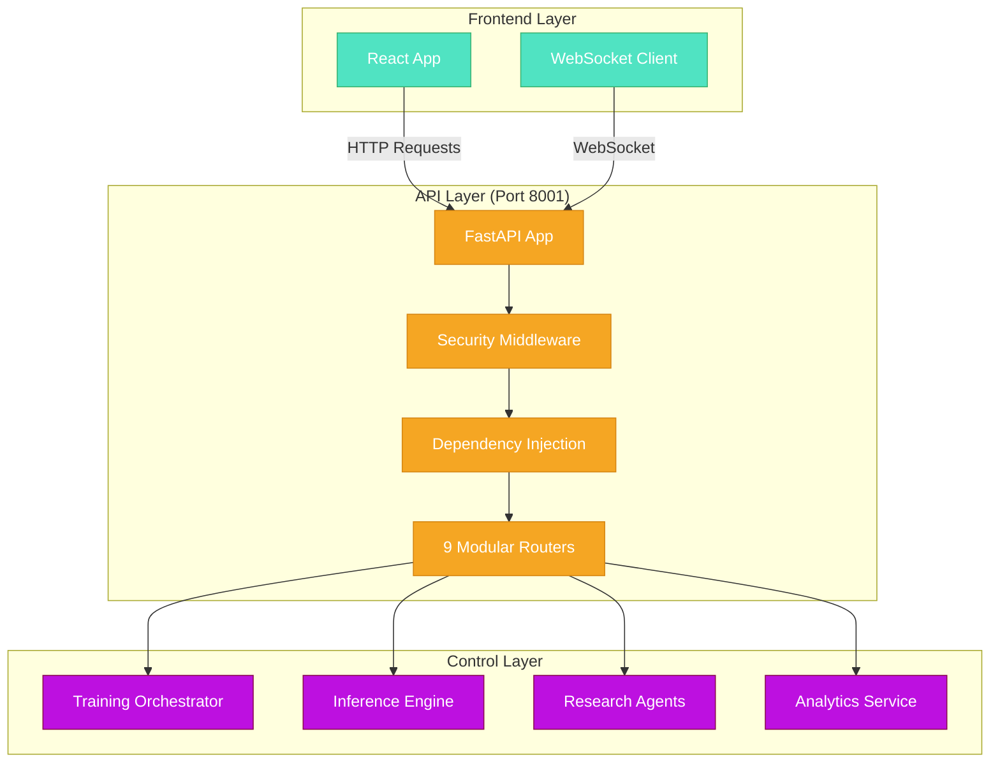
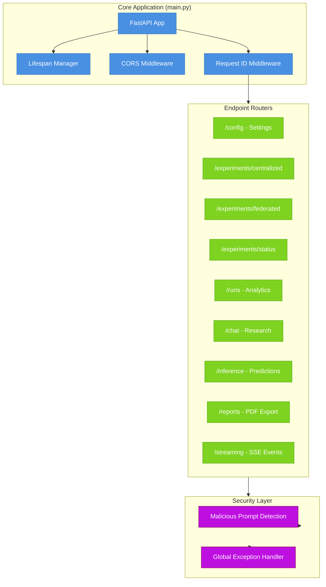
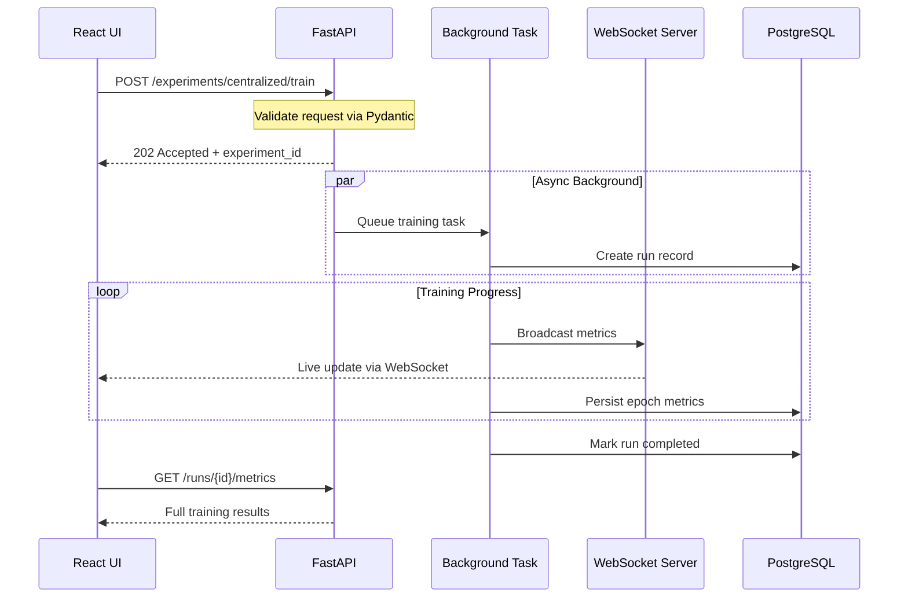
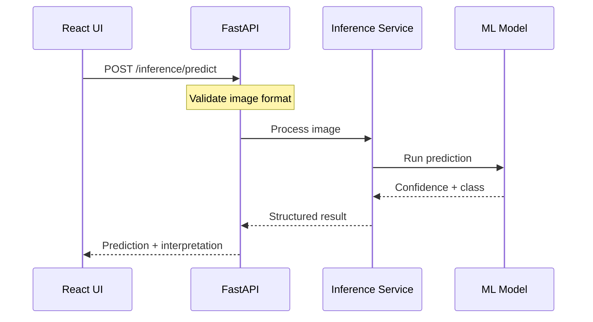
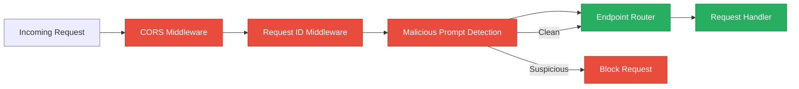

# API Layer

**Date**: 2026-01-24
**Agent**: Sub-Apollo (Documentation Specialist)

## Problem
The API layer needed comprehensive documentation that clearly explains its role as the gateway between the React frontend and the backend ML systems. Existing documentation lacked visual diagrams and clear file references.

## Solution
Created comprehensive documentation with professional Mermaid diagrams showing the API's architecture, data flow, and integration points. The documentation follows the problem-solution format with precise file references.

### Key Implementation Files
- `src/api/main.py:1` - FastAPI application bootstrap and router mounting
- `src/api/deps.py:1` - Dependency injection container for services
- `src/api/middleware/security.py:1` - Security middleware for prompt injection detection
- `src/api/services/startup.py:1` - Service initialization and lifecycle management

### System Connections



### Architecture Overview



### Decision Rationale
- **FastAPI Chosen**: High performance async framework with automatic OpenAPI docs
- **Modular Router Design**: Separates concerns across 9 domains for maintainability
- **Security Middleware**: Implements prompt injection detection for LLM safety
- **Dependency Injection**: Ensures testable and loosely coupled components

### Integration Points
- **Upstream**: Called by React frontend via HTTP/HTTPS and WebSocket
- **Downstream**: Delegates to Control layer for business logic
- **External**: Integrates with PostgreSQL, WebSocket server, and ML models
- **Configuration**: Uses settings from `config/settings.py`

## Module Overview

| Module | Purpose | Key Files | Pattern |
|--------|---------|-----------|---------|
| **experiments/** | Training job orchestration | `centralized_endpoints.py`, `federated_endpoints.py` | Background tasks |
| **inference/** | Model predictions | `single_prediction_endpoint.py`, `gradcam_endpoints.py` | Request/response |
| **runs_endpoints/** | Results analytics | `runs_list.py`, `runs_metrics.py` | Data export |
| **chat/** | Research assistant | `chat_endpoints.py`, `chat_stream.py` | SSE streaming |
| **reports/** | PDF generation | `report_endpoints.py` | Template rendering |
| **middleware/** | Security | `security.py`, `error_handler.py` | Request filtering |

## Data Flow Patterns

### Training Request Flow



### Inference Request Flow



## Security Implementation



**Security Features:**
- **CORS**: Allows specific origins (localhost:5173, :8080)
- **Prompt Injection Detection**: 5 attack categories, 70% repetition threshold
- **Request Tracking**: Unique IDs for distributed tracing
- **Global Exception Handling**: Structured error responses

## Quick Reference

| Action | Endpoint | Method | Description |
|--------|----------|--------|-------------|
| Start centralized training | `/experiments/centralized/train` | POST | Queue training job |
| Start federated training | `/experiments/federated/train` | POST | Start FL server |
| Check training status | `/experiments/status/{id}` | GET | Get run status |
| Get run metrics | `/runs/{id}/metrics` | GET | Fetch training metrics |
| Download results | `/runs/{id}/download/csv` | GET | Export CSV data |
| Single prediction | `/inference/predict` | POST | Run model inference |
| Batch prediction | `/inference/predict-batch` | POST | Process multiple images |
| Generate heatmap | `/inference/heatmap` | POST | Create GradCAM |
| Query research chat | `/chat/query/stream` | POST | Stream LLM response |
| Generate PDF report | `/reports/generate` | POST | Export results |

## Startup Sequence

```mermaid
flowchart LR
    A[Database Connection] --> B[WebSocket Server]
    B --> C[MCP Manager]
    C --> D[W&B Tracker]
    D --> E[Chat Services]

    A -->|Critical| Fail[Startup Fails]
    B -->|Warning| Continue[Continue with Warning]
    C -->|Warning| Continue
    D -->|Warning| Continue
    E -->|Warning| Continue

    classDef critical fill:#E74C3C,stroke:#C0392B,color:#fff
    classDef warning fill:#F39C12,stroke:#D68910,color:#fff
    classDef success fill:#27AE60,stroke:#1E8449,color:#fff

    class A,Fail critical
    class B,C,D,E,Continue warning
    class success
```

## Key Files Structure

```
src/api/
├── main.py                    # FastAPI app bootstrap
├── deps.py                    # Dependency injection
├── middleware/                # Security and error handling
│   ├── security.py           # Prompt injection detection
│   └── error_handler.py      # Global exception handling
├── services/                  # Startup services
│   └── startup.py            # Service initialization
└── endpoints/                 # Route definitions
    ├── experiments/          # Training endpoints
    ├── inference/            # Prediction endpoints
    ├── runs_endpoints/       # Analytics endpoints
    ├── chat/                 # Research assistant
    ├── reports/              # PDF generation
    ├── streaming/            # WebSocket/SSE
    └── schema/               # Pydantic models
```

## Configuration

```python
# Key settings from config/settings.py
class Settings:
    CORS_ORIGINS: List[str] = ["http://localhost:5173", "http://localhost:8080"]
    DATABASE_URL: str
    WEBSOCKET_URL: str = "ws://localhost:8765"
    LOG_LEVEL: str = "INFO"
    
    # Security settings
    MAX_QUERY_LENGTH: int = 10000
    REPETITION_THRESHOLD: float = 0.7
```

## Integration Points

- **Frontend**: React app on port 5173 (Vite dev) or 8080 (production)
- **Database**: PostgreSQL for persistent storage
- **WebSocket**: Port 8765 for real-time metrics
- **ML Models**: ResNet50 checkpoints for inference
- **External APIs**: ArXiv, Claude/Gemini for research chat