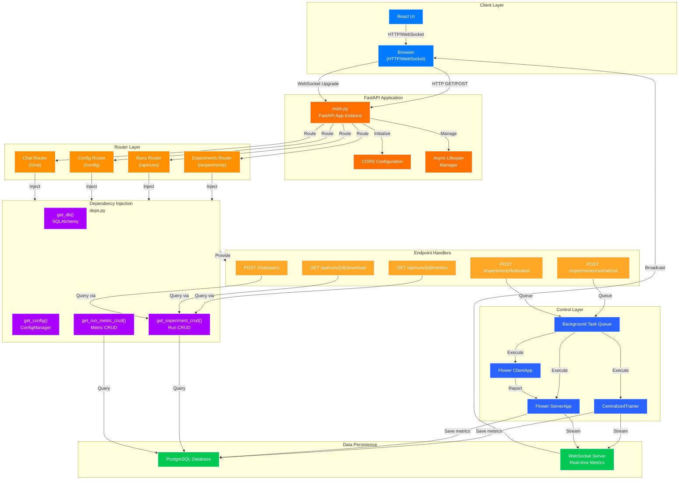

# FastAPI Layer - API Request Flow & Integration

**Purpose**: RESTful API interface providing training orchestration, real-time metrics streaming, and results retrieval for the federated pneumonia detection system.

---

## API Request Flow



---

## API Layer Overview

The API layer serves as the **Boundary** component of the ECB architecture, providing a RESTful interface for the React frontend to:

1. **Orchestrate training**: Start centralized or federated learning experiments
2. **Monitor progress**: Stream real-time metrics via WebSocket
3. **Retrieve results**: Query completed training runs and their metrics
4. **Manage configuration**: Read/update system settings
5. **Research assistance**: Query ArXiv and local RAG knowledge base

The API is fully **asynchronous** with FastAPI/Uvicorn, using dependency injection to decouple endpoint logic from database and service providers.

---

## Base Configuration

```yaml
Host: localhost
Port: 8001
WebSocket Port: 8765
Base URL: http://localhost:8001
WebSocket URL: ws://localhost:8765

CORS Settings:
  - Allow Origins: [http://localhost:3000, http://localhost:3001]
  - Allow Methods: [GET, POST, PUT, DELETE, OPTIONS]
  - Allow Headers: [Content-Type, Authorization]
  - Allow Credentials: true
```

See: `settings.py` for full configuration details.

---

## API Endpoints

### Experiment Management - Training Orchestration

#### POST /experiments/centralized
Start a centralized training run with provided data.

**Request**:
```json
{
  "data_zip": "multipart/form-data (binary .zip file)",
  "num_epochs": 10,
  "learning_rate": 0.001,
  "batch_size": 32,
  "test_split": 0.2
}
```

**Response** (202 Accepted):
```json
{
  "experiment_id": "uuid",
  "message": "Centralized training started",
  "status": "queued"
}
```

**Description**: Queues a centralized training task. Endpoint returns immediately; training executes in background.

---

#### POST /experiments/federated
Start a federated learning training run across multiple clients.

**Request**:
```json
{
  "data_zip": "multipart/form-data (binary .zip file)",
  "num_rounds": 15,
  "num_clients": 5,
  "epochs_per_round": 2,
  "learning_rate": 0.001,
  "batch_size": 16
}
```

**Response** (202 Accepted):
```json
{
  "experiment_id": "uuid",
  "message": "Federated learning started",
  "status": "queued",
  "num_rounds": 15,
  "num_clients": 5
}
```

**Description**: Queues federated learning with Flower orchestration. Data is partitioned across N clients; aggregation via FedAvg.

---

#### GET /experiments/status/{exp_id}
Poll current training status for an experiment.

**Response** (200 OK):
```json
{
  "experiment_id": "uuid",
  "status": "in_progress|completed|failed",
  "progress": 0.65,
  "current_epoch": 7,
  "total_epochs": 10,
  "elapsed_time_seconds": 1245,
  "error_message": null
}
```

**Description**: Returns current training state without blocking. Clients poll this to update UI.

---

#### GET /experiments/list
List all experiments (centralized and federated).

**Query Parameters**:
- `limit`: int (default: 100)
- `offset`: int (default: 0)
- `status`: str (all|completed|in_progress|failed, default: all)

**Response** (200 OK):
```json
{
  "total": 42,
  "items": [
    {
      "experiment_id": "uuid",
      "run_type": "centralized|federated",
      "status": "completed|in_progress|failed",
      "created_at": "2025-01-15T10:30:00Z",
      "completed_at": "2025-01-15T11:45:30Z"
    }
  ]
}
```

**Description**: Paginated list of all training experiments.

---

### Run Management - Results & Metrics

#### GET /api/runs/
List all completed training runs.

**Query Parameters**:
- `limit`: int (default: 100)
- `offset`: int (default: 0)

**Response** (200 OK):
```json
{
  "total": 42,
  "items": [
    {
      "run_id": 1,
      "run_type": "centralized|federated",
      "status": "completed|in_progress|failed",
      "created_at": "2025-01-15T10:30:00Z",
      "completed_at": "2025-01-15T11:45:30Z",
      "metrics_count": 150
    }
  ]
}
```

**Description**: Retrieve paginated list of training runs with summary metadata.

---

#### GET /api/runs/{run_id}
Retrieve a specific training run by ID.

**Response** (200 OK):
```json
{
  "run_id": 42,
  "run_type": "centralized",
  "status": "completed",
  "created_at": "2025-01-15T10:30:00Z",
  "completed_at": "2025-01-15T11:45:30Z",
  "total_time_seconds": 4530,
  "total_epochs": 10,
  "final_accuracy": 0.92,
  "final_loss": 0.087
}
```

**Error Responses**:
- `404 Not Found`: Run ID does not exist
- `500 Internal Server Error`: Database query failure

**Description**: Get full details of a specific completed run.

---

#### GET /api/runs/{run_id}/metrics
Retrieve all training metrics for a run.

**Query Parameters**:
- `epoch`: int (optional - filter by epoch)

**Response** (200 OK):
```json
{
  "run_id": 42,
  "run_type": "centralized",
  "metrics": [
    {
      "epoch": 1,
      "timestamp": "2025-01-15T10:35:00Z",
      "loss": 2.301,
      "accuracy": 0.35,
      "val_loss": 2.298,
      "val_accuracy": 0.38
    },
    {
      "epoch": 2,
      "timestamp": "2025-01-15T10:40:00Z",
      "loss": 1.845,
      "accuracy": 0.62,
      "val_loss": 1.821,
      "val_accuracy": 0.64
    }
  ]
}
```

**Description**: Complete training history for centralized runs. Per-epoch loss, accuracy, validation metrics.

---

#### GET /api/runs/{run_id}/federated-rounds
Retrieve per-round metrics for federated learning runs.

**Response** (200 OK):
```json
{
  "run_id": 42,
  "run_type": "federated",
  "total_rounds": 15,
  "num_clients": 5,
  "rounds": [
    {
      "round_number": 1,
      "timestamp": "2025-01-15T10:35:00Z",
      "global_loss": 2.301,
      "global_accuracy": 0.35,
      "client_losses": [2.310, 2.295, 2.305, 2.290, 2.315],
      "client_accuracies": [0.33, 0.37, 0.35, 0.40, 0.32]
    }
  ]
}
```

**Description**: FL-specific metrics: global model performance and per-client training metrics per round.

---

#### GET /api/runs/{run_id}/download/{format}
Download run results in specified format.

**Path Parameters**:
- `run_id`: int
- `format`: "json" | "csv" | "summary"

**Response** (200 OK):
- `json`: Application/json - Complete metrics as JSON
- `csv`: Text/csv - Flattened metrics table
- `summary`: Text/plain - Human-readable summary report

**Description**: Export training results for external analysis or archival.

---

### Configuration - System Settings

#### GET /config/
Retrieve current system configuration.

**Response** (200 OK):
```json
{
  "model": {
    "architecture": "resnet50",
    "pretrained": true,
    "freeze_backbone": false
  },
  "training": {
    "default_batch_size": 32,
    "default_learning_rate": 0.001,
    "default_epochs": 10,
    "device": "cuda|cpu"
  },
  "federated": {
    "default_num_rounds": 15,
    "default_num_clients": 5,
    "aggregation_strategy": "fedavg"
  },
  "data": {
    "train_test_split": 0.8,
    "normalize": true,
    "augmentation": true
  }
}
```

**Description**: Read-only system configuration used for training defaults.

---

#### POST /config/update
Update system configuration.

**Request**:
```json
{
  "training": {
    "default_learning_rate": 0.0005
  }
}
```

**Response** (200 OK):
```json
{
  "message": "Configuration updated",
  "updated_fields": ["training.default_learning_rate"]
}
```

**Error Responses**:
- `422 Unprocessable Entity`: Invalid config schema
- `500 Internal Server Error`: File write failure

**Description**: Persist configuration changes to YAML config file.

---

### Chat & Research - RAG & ArXiv

#### POST /chat/query
Query the research assistant (RAG + ArXiv search).

**Request**:
```json
{
  "query": "What are recent advances in federated learning?",
  "session_id": "uuid",
  "use_rag": true,
  "use_arxiv": true,
  "max_results": 5
}
```

**Response** (200 OK):
```json
{
  "query": "What are recent advances in federated learning?",
  "response": "Federated learning has seen significant advances...",
  "sources": [
    {
      "type": "rag|arxiv",
      "title": "Paper title",
      "url": "https://arxiv.org/...",
      "relevance": 0.92
    }
  ],
  "session_id": "uuid"
}
```

**Description**: Query local RAG knowledge base and ArXiv for research assistance with citations.

---

#### POST /chat/query/stream
Stream response from research assistant (Server-Sent Events).

**Request**:
```json
{
  "query": "What are recent advances in federated learning?",
  "session_id": "uuid"
}
```

**Response** (200 OK - text/event-stream):
```
data: "Federated learning has seen significant"
data: " advances in privacy-preserving training."
data: "\n"
data: {"type": "source_added", "title": "Paper X"}
```

**Description**: Stream response word-by-word for responsive UI experience.

---

#### GET /chat/history/{session_id}
Retrieve conversation history for a session.

**Response** (200 OK):
```json
{
  "session_id": "uuid",
  "messages": [
    {
      "role": "user",
      "content": "What are recent advances?",
      "timestamp": "2025-01-15T10:30:00Z"
    },
    {
      "role": "assistant",
      "content": "Federated learning has...",
      "timestamp": "2025-01-15T10:30:05Z"
    }
  ]
}
```

**Description**: Retrieve full chat history for given session.

---

#### DELETE /chat/history/{session_id}
Clear conversation history for a session.

**Response** (200 OK):
```json
{
  "message": "History cleared",
  "session_id": "uuid"
}
```

**Description**: Delete all messages in session.

---

## WebSocket Connections

### Real-Time Metrics Streaming

**URL**: `ws://localhost:8765`

**Connection Flow**:
1. Browser connects to WebSocket server
2. Receives training mode announcement: `{"type": "training_mode", "rounds": 15, "clients": 5}`
3. Receives periodic round metrics: `{"type": "round_metrics", "round": 3, "loss": 1.245, "accuracy": 0.87}`
4. Receives completion signal: `{"type": "training_end", "run_id": 42}`

**Message Types**:

```json
{
  "type": "training_mode",
  "num_rounds": 15,
  "num_clients": 5
}
```

```json
{
  "type": "round_metrics",
  "round": 3,
  "timestamp": "2025-01-15T10:35:00Z",
  "global_loss": 1.245,
  "global_accuracy": 0.87,
  "client_metrics": [
    {"client_id": 0, "loss": 1.250, "accuracy": 0.86}
  ]
}
```

```json
{
  "type": "training_end",
  "run_id": 42,
  "final_accuracy": 0.92
}
```

**Description**: Clients subscribe on training start; metrics pushed to all connected clients. Enables live progress dashboards.

---

## Dependency Injection

The `deps.py` module provides injectable dependencies to endpoints via FastAPI's `Depends()` mechanism.

**Providers**:

- `get_db()`: Returns SQLAlchemy session for database access
- `get_config()`: Returns ConfigManager instance with loaded YAML config
- `get_experiment_crud()`: Returns CRUD operations for experiment/run records
- `get_run_metric_crud()`: Returns CRUD operations for metrics

**Pattern**:
```python
@router.get("/api/runs/{run_id}/metrics")
async def get_metrics(
    run_id: int,
    db: Session = Depends(get_db),
    crud: RunMetricCRUD = Depends(get_run_metric_crud)
):
    return crud.get_metrics_for_run(db, run_id)
```

**Benefits**:
- Decouples endpoint logic from service initialization
- Enables easy mocking for unit tests
- Centralizes resource management (database sessions, config)
- Single source of truth for service configuration

---

## Error Handling

All endpoints follow standardized error response patterns:

**Validation Error** (422 Unprocessable Entity):
```json
{
  "detail": [
    {
      "loc": ["body", "data_zip"],
      "msg": "Field required",
      "type": "value_error.missing"
    }
  ]
}
```

**Resource Not Found** (404 Not Found):
```json
{
  "detail": "Run ID 999 not found"
}
```

**Server Error** (500 Internal Server Error):
```json
{
  "detail": "Internal server error",
  "request_id": "uuid"
}
```

**Business Logic Error** (via WebSocket during training):
```json
{
  "type": "error",
  "message": "Failed to load model checkpoint",
  "run_id": 42
}
```

**Strategy**:
- Validate inputs immediately (fail fast)
- Return specific HTTP status codes
- Include actionable error messages
- Log all errors with correlation IDs
- Send training failures via WebSocket for real-time UI updates

---

## Related Modules

**Control Layer** (Orchestration & Training):
See: `../control/README.md` - CentralizedTrainer, Flower ServerApp, ClientApp

**Boundary Layer** (Data Persistence):
See: `../boundary/README.md` - DAO patterns, CRUD operations

**Main System Architecture**:
See: `../../../README.md` - Full ECB architecture overview

---

## File Structure

```
api/
├── main.py                          # FastAPI app initialization
├── settings.py                      # Configuration & environment
├── deps.py                          # Dependency injection providers
│
├── endpoints/
│   ├── experiments/
│   │   ├── centralized_endpoints.py # POST /experiments/centralized
│   │   ├── federated_endpoints.py   # POST /experiments/federated
│   │   ├── status_endpoints.py      # GET /experiments/status
│   │   └── utils/
│   │       ├── centralized_tasks.py # Background task orchestration
│   │       ├── federated_tasks.py   # FL task setup & partitioning
│   │       └── file_handling.py     # ZIP extraction & validation
│   │
│   ├── runs_endpoints/
│   │   ├── runs_list.py             # GET /api/runs/
│   │   ├── runs_metrics.py          # GET /api/runs/{id}/metrics
│   │   ├── runs_federated_rounds.py # GET /api/runs/{id}/federated-rounds
│   │   ├── runs_server_evaluation.py# GET /api/runs/{id}/server-evaluation
│   │   ├── runs_download.py         # GET /api/runs/{id}/download/{format}
│   │   └── utils.py                 # Shared utilities & queries
│   │
│   ├── configuration_settings/
│   │   ├── configuration_endpoints.py# GET/POST /config/
│   │   └── schemas.py               # Pydantic config schemas
│   │
│   └── chat/
│       ├── chat_endpoints.py        # POST /chat/query
│       ├── chat_stream_endpoints.py # POST /chat/query/stream
│       └── chat_utils.py            # RAG & ArXiv integration
│
├── models/
│   ├── request_schemas.py           # Pydantic input models
│   └── response_schemas.py          # Pydantic output models
│
└── utils/
    ├── validators.py                # Input validation helpers
    └── transformers.py              # Response formatting helpers
```

---

## Request/Response Flow Examples

### Centralized Training Sequence

1. Client POST `/experiments/centralized` with ZIP file → API returns 202 Accepted
2. Background task extracts data, initializes CentralizedTrainer
3. Training loop begins; metrics sent to WebSocket every epoch
4. Database updated with run record and metrics
5. Client polls `GET /api/runs/{id}/metrics` to fetch results
6. Client connects WebSocket to stream live progress

### Federated Learning Sequence

1. Client POST `/experiments/federated` with config → API returns 202 Accepted
2. Background task partitions data across N clients
3. Flower ServerApp initialized with global model
4. Per-round client training executes in parallel
5. FedAvg aggregation on server after each round
6. Server evaluation metrics persisted to database
7. WebSocket broadcasts round metrics to all connected clients
8. Client downloads results via `GET /api/runs/{id}/download/json`

---
