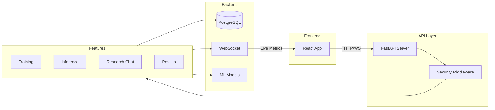
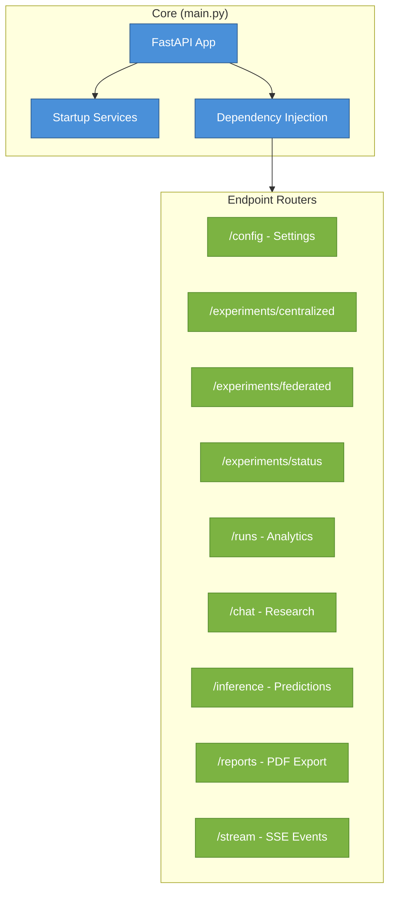
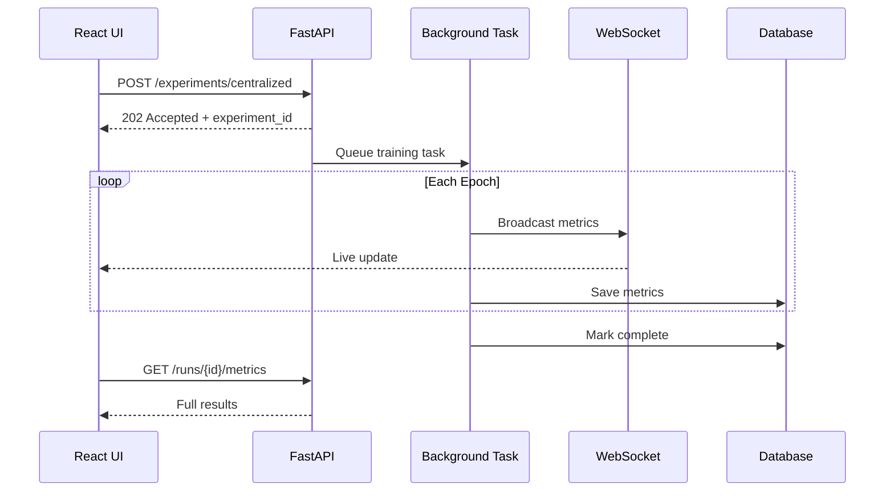
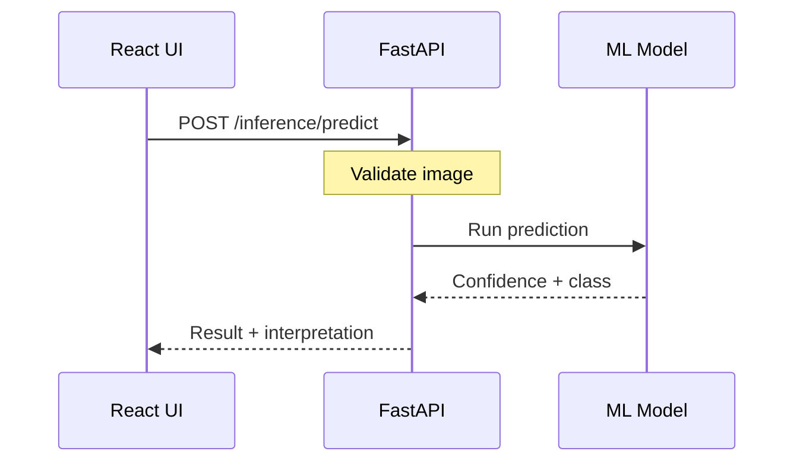

# API Layer

Backend server connecting the React frontend to ML training, inference, and research capabilities.

## What It Does



## Architecture

The API is organized into **9 modular routers**, each handling a specific domain:



## Module Overview

| Module              | Purpose                | Key Patterns                              |
| ------------------- | ---------------------- | ----------------------------------------- |
| **experiments/**    | Start training jobs    | Background tasks, subprocess spawning     |
| **inference/**      | Run predictions        | Single/batch processing, GradCAM heatmaps |
| **runs_endpoints/** | Query training results | Pluggable exporters, strategy pattern     |
| **chat/**           | Research assistant     | SSE streaming, ArXiv RAG integration      |
| **streaming/**      | Real-time updates      | WebSocket broadcast, SSE polling          |
| **reports/**        | Generate PDFs          | Template rendering                        |
| **middleware/**     | Security               | Prompt injection detection                |

## Data Flow

### Training Flow



### Inference Flow



## Key Files

```
api/
├── main.py           # App bootstrap, router mounting, CORS
├── deps.py           # Dependency injection (singletons)
├── settings.py       # Environment config
├── middleware/       # Security (prompt injection detection)
├── services/         # Startup initialization
└── endpoints/
    ├── experiments/  # Training orchestration
    ├── inference/    # Model predictions
    ├── runs_endpoints/  # Results & analytics
    ├── chat/         # Research assistant
    ├── reports/      # PDF generation
    ├── streaming/    # WebSocket + SSE
    └── schema/       # Pydantic models
```

## Real-Time Communication

Two channels for live updates:

| Channel       | Port | Use Case                 |
| ------------- | ---- | ------------------------ |
| **SSE**       | 8001 | Training progress events |
| **WebSocket** | 8765 | Metric broadcasts        |

## Security

- **CORS**: Allows localhost:5173 (Vite dev) and :8080
- **Prompt Injection Detection**: Blocks malicious chat queries
  - 5 attack categories (jailbreak, exfiltration, role-hijacking, etc.)
  - 10KB query limit, 70% repetition threshold

## Startup Sequence


Database is **critical** (fails startup). Others are optional with warnings.

## Quick Reference

| Action                     | Endpoint                              |
| -------------------------- | ------------------------------------- |
| Start centralized training | `POST /experiments/centralized/train` |
| Start federated training   | `POST /experiments/federated/train`   |
| Check training status      | `GET /experiments/status/{id}`        |
| Get run metrics            | `GET /runs/{id}/metrics`              |
| Download results           | `GET /runs/{id}/download/csv`         |
| Run single prediction      | `POST /inference/predict`             |
| Run batch prediction       | `POST /inference/predict-batch`       |
| Generate heatmap           | `POST /inference/heatmap`             |
| Query research chat        | `POST /chat/query/stream`             |
