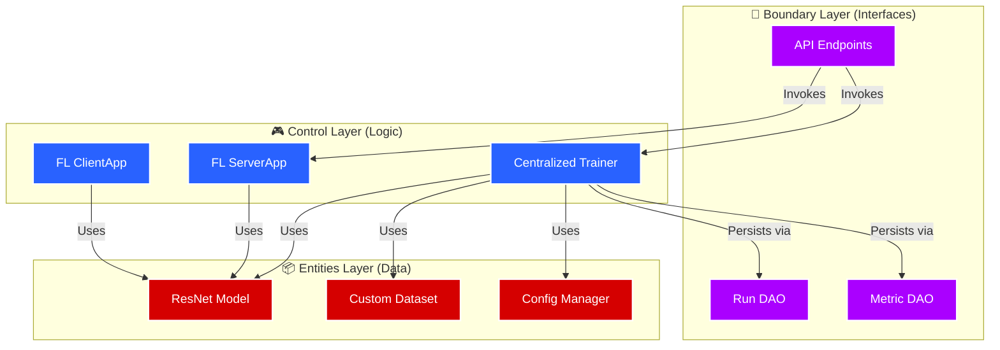
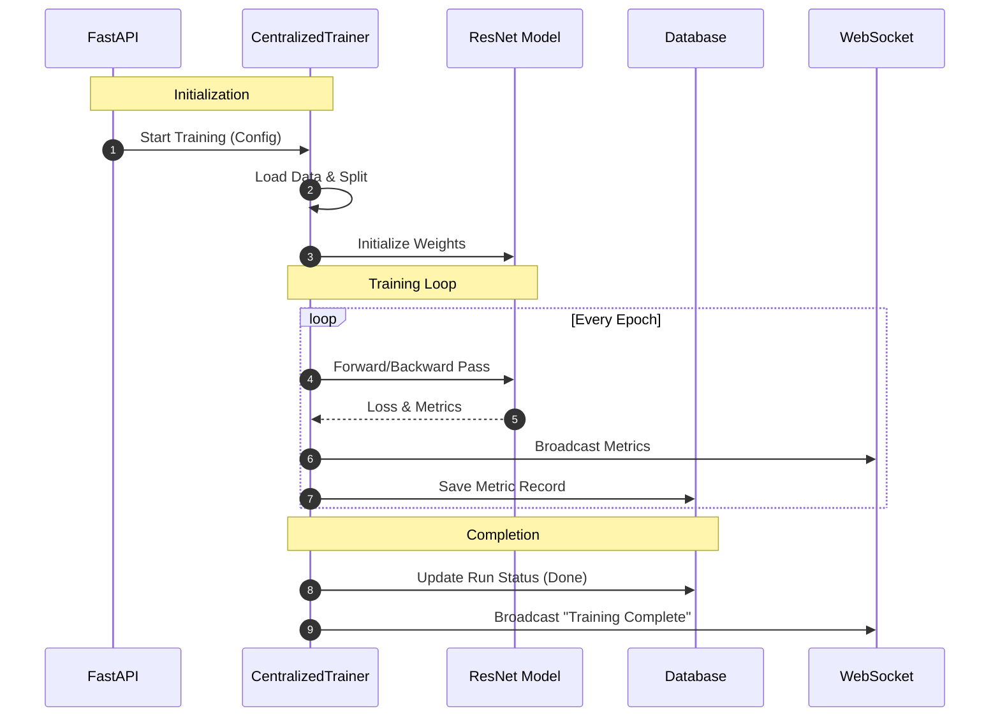
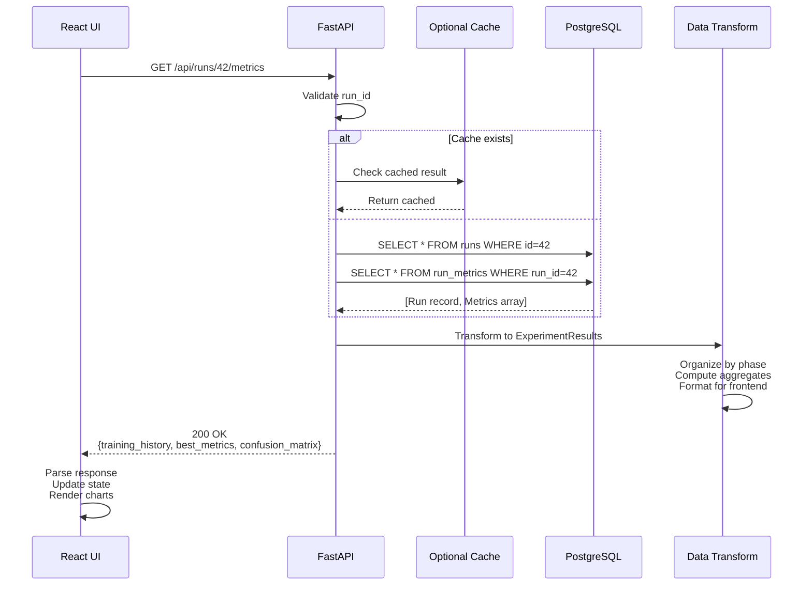
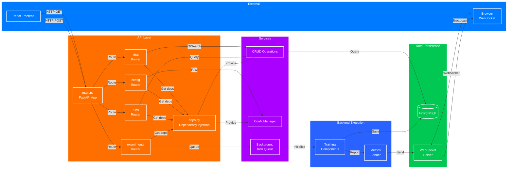
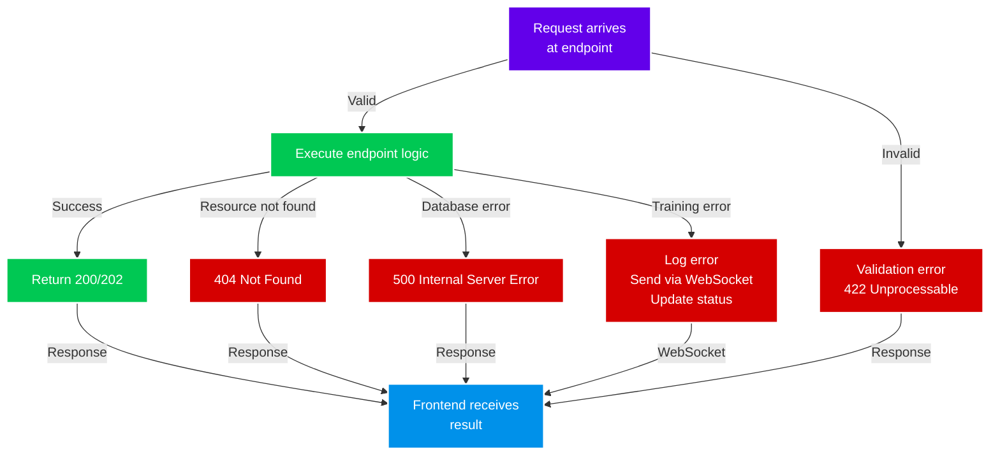

# FastAPI Layer - Training Orchestration & Results Management

**Purpose**: RESTful API interface providing training orchestration, real-time metrics streaming, and results retrieval for the federated pneumonia detection system.

---

## Table of Contents

1. [Overview](#overview)
2. [Functional Architecture](#functional-architecture)
3. [Request/Response Flows](#requestresponse-flows)
4. [Endpoint Groups](#endpoint-groups)
5. [Integration Flow](#integration-flow)
6. [Component Details](#component-details)

---

## Overview

**Framework**: FastAPI (async Python web framework)
**Server**: Uvicorn ASGI
**Base URL**: `http://localhost:8001`
**WebSocket**: `ws://localhost:8765` (real-time metrics relay)

**Key Capabilities**:
- **Orchestration**: Start centralized or federated training runs.
- **Persistence**: Query results and metrics from PostgreSQL.
- **Monitoring**: Stream real-time progress via WebSocket.
- **Assistant**: Query Arxiv and local RAG via the chat endpoints.

---

## Backend Architecture (ECB)



---

## Request/Response Flows

### Centralized Training Sequence



### Flow 2: Federated Learning (Complete Lifecycle)

```mermaid
sequenceDiagram
    participant UI as React UI
    participant API as FastAPI
    participant Task as Background Task
    participant Server as Flower ServerApp
    participant Clients as ClientApp ×N
    participant Send as WebSocket Sender
    participant WS as WebSocket Server
    participant DB as PostgreSQL

    UI->>API: POST /experiments/federated<br/>{data_zip, num_rounds=15, num_clients=5}
    API-->>UI: 202 Accepted<br/>{experiment_id}

    Task->>Task: Extract data<br/>Create partitions
    Task->>Server: Initialize Flower

    Server->>Server: Load global model<br/>Create run record
    Server->>DB: INSERT run record

    Server->>Send: send_training_mode(True, 15, 5)
    Send->>WS: JSON {type: training_mode}
    WS->>UI: WebSocket update
    UI->>UI: Update → "FL Mode: 15 rounds, 5 clients"

    loop For each Round (1 to num_rounds)
        Server->>Server: Get global weights
        Server->>Clients: Send weights + config

        par Client 0
            Clients->>Clients: Load partition 0
            Clients->>Clients: Train locally
            Clients->>Clients: Compute metrics
        and Client 1
            Clients->>Clients: Load partition 1
            Clients->>Clients: Train locally
            Clients->>Clients: Compute metrics
        and Client N
            Clients->>Clients: Load partition N
            Clients->>Clients: Train locally
            Clients->>Clients: Compute metrics
        end

        Clients-->>Server: Return weights + metrics

        Server->>Server: Aggregate (FedAvg)
        Server->>Server: Evaluate on server test set
        Server->>DB: Persist metrics & evaluations

        Server->>Send: send_round_metrics(round, metrics)
        Send->>WS: JSON {type: round_metrics}
        WS->>UI: WebSocket broadcast
        UI->>UI: Update round progress
    end

    Server->>DB: Mark run completed
    Server->>Send: send_training_end(run_id)
    Send->>WS: JSON {type: training_end}
    WS->>UI: Final signal

    UI->>API: GET /api/runs/42/federated-rounds
    API->>DB: SELECT * FROM server_evaluations
    DB-->>API: Per-round metrics
    API-->>UI: {rounds, metrics_per_round}
    UI->>UI: Render federated results

    style UI fill:#e1f5ff
    style API fill:#fff3e0
    style Server fill:#c8e6c9
    style DB fill:#e8f5e9
```

### Flow 3: Results Retrieval



---

## Endpoint Groups

### Group 1: Training Orchestration (`/experiments`)

| Endpoint | Method | Purpose | Status Code |
|----------|--------|---------|------------|
| `/experiments/centralized` | POST | Start centralized training | 202 |
| `/experiments/federated` | POST | Start federated training | 202 |
| `/experiments/status/{exp_id}` | GET | Poll training status | 200 |
| `/experiments/list` | GET | List all experiments | 200 |

**See**: [endpoints/experiments/](endpoints/experiments/) for implementation

---

### Group 2: Results Management (`/api/runs`)

| Endpoint | Method | Purpose | Status Code |
|----------|--------|---------|------------|
| `/api/runs/list` | GET | List all runs | 200 |
| `/api/runs/{run_id}/metrics` | GET | Get training metrics | 200 |
| `/api/runs/{run_id}/federated-rounds` | GET | Get per-round metrics (FL only) | 200 |
| `/api/runs/{run_id}/server-evaluation` | GET | Get server evaluations (FL only) | 200 |
| `/api/runs/{run_id}/download/json` | GET | Download as JSON | 200 |
| `/api/runs/{run_id}/download/csv` | GET | Download as CSV | 200 |
| `/api/runs/{run_id}/download/summary` | GET | Download text summary | 200 |

**See**: [endpoints/runs_endpoints/](endpoints/runs_endpoints/) for implementation

---

### Group 3: Configuration (`/config`)

| Endpoint | Method | Purpose | Status Code |
|----------|--------|---------|------------|
| `/config/current` | GET | Get current config | 200 |
| `/config/update` | POST | Update config | 200 |

**See**: [endpoints/configuration_settings/](endpoints/configuration_settings/) for implementation

---

### Group 4: Chat & RAG (`/chat`)

| Endpoint | Method | Purpose | Status Code |
|----------|--------|---------|------------|
| `/chat/query` | POST | Query with RAG + Arxiv | 200 |
| `/chat/query/stream` | POST | Stream response (SSE) | 200 |
| `/chat/history/{session_id}` | GET | Get conversation history | 200 |
| `/chat/history/{session_id}` | DELETE | Clear history | 200 |

**See**: [endpoints/chat/](endpoints/chat/) for implementation

---

## Integration Flow

### How the API Connects Everything



---

## Component Details

### 1. Main Application (`main.py`)

**Responsibilities**:
- FastAPI app initialization with async lifespan management
- CORS configuration for frontend access
- Route registration
- WebSocket server startup

---

### 2. Dependency Injection (`deps.py`)

**Providers**:
- `get_db()`: SQLAlchemy session
- `get_config()`: ConfigManager for YAML config
- `get_experiment_crud()`: Run CRUD operations
- `get_run_metric_crud()`: Metric CRUD operations

---

### 3. Endpoint Routers

**Location**: `endpoints/` directory

**Organization**:
```
endpoints/
├── experiments/
│   ├── centralized_endpoints.py    # POST /experiments/centralized
│   ├── federated_endpoints.py      # POST /experiments/federated
│   ├── status_endpoints.py         # GET /experiments/status
│   └── utils/
│       ├── centralized_tasks.py    # Background task for centralized
│       ├── federated_tasks.py      # Background task for federated
│       └── file_handling.py        # ZIP extraction, validation
├── runs_endpoints/
│   ├── runs_list.py                # GET /api/runs/list
│   ├── runs_metrics.py             # GET /api/runs/{id}/metrics
│   ├── runs_federated_rounds.py    # GET /api/runs/{id}/federated-rounds
│   ├── runs_server_evaluation.py   # GET /api/runs/{id}/server-evaluation
│   ├── runs_download.py            # GET /api/runs/{id}/download/{format}
│   └── utils.py                    # Shared utilities
├── configuration_settings/
│   ├── configuration_endpoints.py  # GET/POST /config
│   └── schemas.py                  # Pydantic schemas
└── chat/
    ├── chat_endpoints.py           # POST /chat/query
    └── chat_utils.py               # RAG, Arxiv integration
```

---

### 4. Background Task Execution

**Flow**:
1. Endpoint validates request → returns 202 Accepted immediately
2. Task queued to background executor
3. Training starts asynchronously
4. Metrics sent to WebSocket in real-time
5. Results persisted to database
6. Frontend polls `/api/runs/{id}/metrics` for results

---

## Error Handling Strategy



---

## Related Documentation

- **WebSocket Metrics**: [dl_model/utils/data/README.md](../control/dl_model/utils/data/README.md) - Real-time metric streaming
- **Federated Learning**: [control/federated_new_version/README.md](../control/federated_new_version/README.md) - FL orchestration
- **Centralized Training**: [control/dl_model/README.md](../control/dl_model/README.md) - Centralized training logic
- **System Architecture**: [README.md](../../README.md) - Overall system design
- **Dependency Injection**: [deps.py](deps.py) - Service providers
- **Configuration**: [settings.py](settings.py) - API configuration

