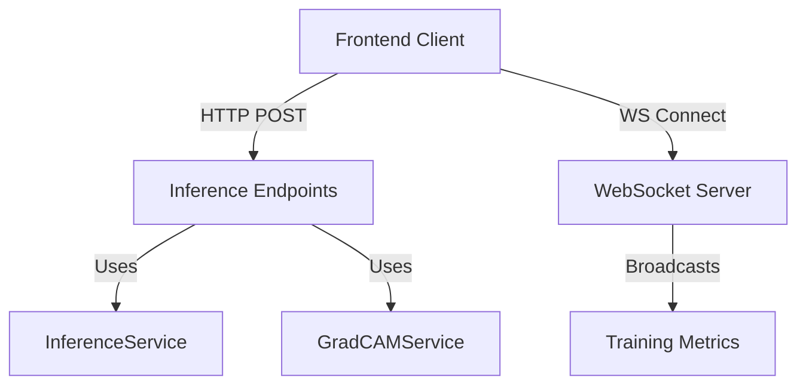

# API Endpoints Module

## Purpose
This module defines the REST and WebSocket endpoints for the Federated Pneumonia Detection system, organized by functional domain.

## Submodules

### 1. Inference (`inference/`)
Handles all deep learning model interactions for pneumonia detection.
- **Single Prediction**: `POST /api/inference/predict` - Processes a single chest X-ray image.
- **Batch Prediction**: `POST /api/inference/predict-batch` - Processes multiple images with aggregated results.
- **GradCAM Heatmaps**: 
  - `POST /api/inference/heatmap` - Generates explainability visualizations for a single image.
  - `POST /api/inference/heatmap-batch` - Generates visualizations for multiple images.
- **Health Check**: `GET /api/inference/health` - Monitors model loading status and GPU availability.

### 2. Streaming (`streaming/`)
Provides real-time data broadcasting capabilities.
- **WebSocket Server**: `websocket_server.py` - A standalone relay server that broadcasts training metrics and system status to connected frontend clients. Runs in a background thread to avoid blocking the main API.

### 3. Other Endpoints
- **Chat**: LLM-powered clinical assistant and research engine.
- **Experiments**: Management of centralized and federated training runs.
- **Reports**: Generation of clinical and experiment reports.
- **Runs**: Detailed metrics and analytics for training sessions.

## How It Works
Endpoints use FastAPI's dependency injection to access services (e.g., `InferenceService`, `GradCAMService`). They validate inputs using Pydantic schemas defined in the `schema/` submodule.

## Key Files
- `inference/single_prediction_endpoint.py:18` - Single image inference logic.
- `inference/batch_prediction_endpoints.py:20` - Batch processing logic.
- `inference/gradcam_endpoints.py:26` - Explainability visualization logic.
- `streaming/websocket_server.py:43` - WebSocket relay implementation.

## Architecture

## Integration Points
- **Upstream**: Called by the React frontend for predictions and real-time updates.
- **Downstream**: Calls services in `src/control/` for model execution and data processing.
