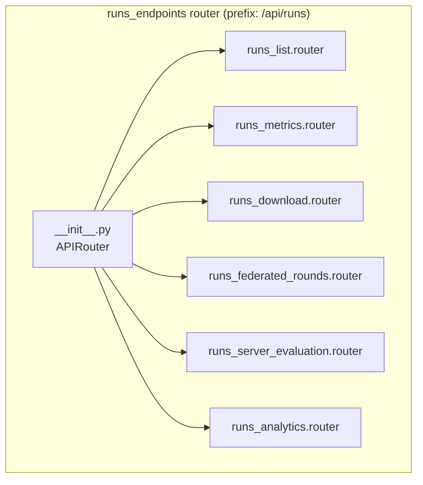
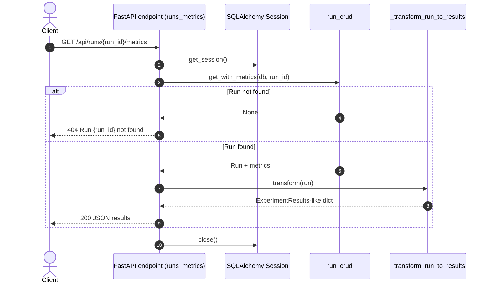
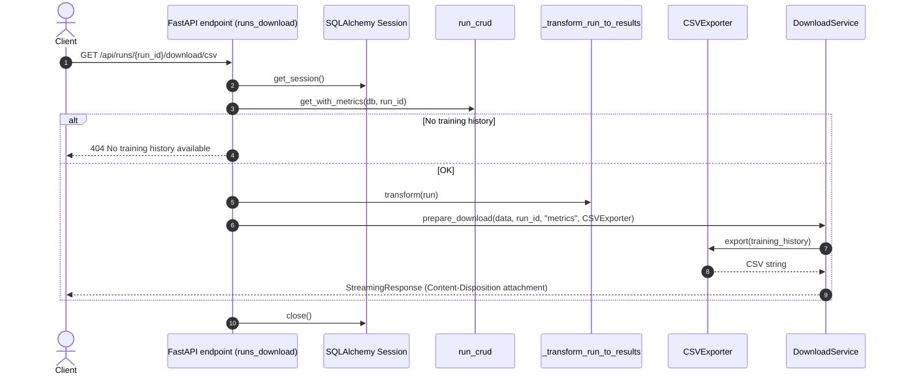
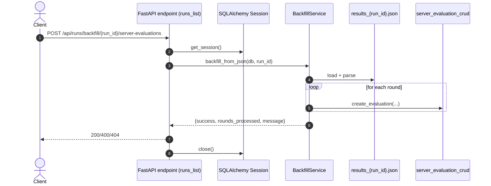
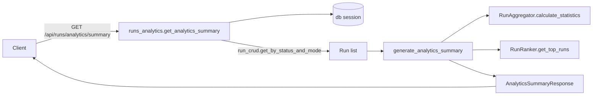

# Runs Endpoints (`/api/runs`)

This folder contains the FastAPI endpoints responsible for listing training runs and retrieving their results/metrics, plus federated-specific server evaluation + analytics utilities.

> Router entrypoint: `federated_pneumonia_detection/src/api/endpoints/runs_endpoints/__init__.py`

---

## Quick map

All routes in this folder are mounted under:

- Base prefix: **`/api/runs`**
- Tags: **`runs`**, **`results`**

### Endpoints

| Method | Path                                             | Module                      | Purpose                                                            |
| ------ | ------------------------------------------------ | --------------------------- | ------------------------------------------------------------------ |
| GET    | `/api/runs/list`                                 | `runs_list.py`              | List all runs (summary view)                                       |
| POST   | `/api/runs/backfill/{run_id}/server-evaluations` | `runs_list.py`              | Backfill server evals from a results JSON file                     |
| GET    | `/api/runs/{run_id}/metrics`                     | `runs_metrics.py`           | Fetch full run results (transformed for frontend)                  |
| GET    | `/api/runs/{run_id}/download/csv`                | `runs_download.py`          | Download training history as CSV                                   |
| GET    | `/api/runs/{run_id}/federated-rounds`            | `runs_federated_rounds.py`  | Federated per-round metrics (server-side eval only)                |
| GET    | `/api/runs/{run_id}/server-evaluation`           | `runs_server_evaluation.py` | Full server-side evaluations (incl confusion matrix if present)    |
| GET    | `/api/runs/analytics/summary`                    | `runs_analytics.py`         | Aggregated analytics summary (centralized vs federated + top runs) |

---

## Architecture

### Router composition



### Module responsibilities

- `__init__.py`
  - Aggregates routers from each module.

- `runs_list.py`
  - `GET /list`: returns summaries of runs.
  - `POST /backfill/{run_id}/server-evaluations`: triggers backfill of server eval records from a results JSON file.

- `runs_metrics.py`
  - `GET /{run_id}/metrics`: returns a frontend-compatible “ExperimentResults”-like dictionary.
  - Uses `_transform_run_to_results(run)`.

- `runs_download.py`
  - `GET /{run_id}/download/csv`: converts `training_history` into CSV and streams it as a download.
  - Uses `shared/exporters.py` + `_transform_run_to_results(run)`.

- `runs_federated_rounds.py`
  - `GET /{run_id}/federated-rounds`: returns round-indexed server evaluation metrics suitable for charting.

- `runs_server_evaluation.py`
  - `GET /{run_id}/server-evaluation`: returns a detailed evaluation list per round plus summary stats.

- `runs_analytics.py` + `runs_analytics_utils.py`
  - `GET /analytics/summary`: returns aggregated statistics for centralized vs federated runs.
  - Business logic in `generate_analytics_summary(...)`.

- `shared/` helpers
  - `summary_builder.py`: constructs a run summary and federated-specific info.
  - `metrics.py`: strategy-based metric extraction (centralized vs federated) and aggregation.
  - `exporters.py`: exporter classes and `DownloadService`.
  - `services.py`: backfill and ranking utilities.
  - `utils.py`: general utilities and also contains a copy of the run->results transformation.

---

## Data flow diagrams

### 1) Fetch run metrics (`GET /{run_id}/metrics`)



### 2) Download CSV (`GET /{run_id}/download/csv`)



### 3) Backfill server evaluations (`POST /backfill/{run_id}/server-evaluations`)



### 4) Analytics summary (`GET /analytics/summary`)



---

## Notes on response shapes

### Metrics endpoint response (conceptual)

The `GET /{run_id}/metrics` endpoint returns a dict shaped like:

- `final_metrics`: accuracy/precision/recall/f1/auc/loss
- `training_history`: epoch-indexed history (epochs are **1-indexed** for display)
- `metadata`: start/end time, best epoch, best metrics
- `confusion_matrix`: optional; includes derived stats like sensitivity/specificity

This is produced by `_transform_run_to_results(run)`.

### Federated endpoints

- `GET /{run_id}/federated-rounds` returns a compact list of rounds with a `metrics` dict.
- `GET /{run_id}/server-evaluation` returns more detail per round, plus `summary` from `server_evaluation_crud.get_summary_stats`.

---

## Enhancements (recommended)

These are based on the current implementation and are ordered roughly by impact.

### A) Correctness / consistency

1. **Fix possible “final metrics” correctness when metrics are unordered**
   - `_transform_run_to_results` currently updates `final_metrics` during iteration using `epoch >= max(metrics_by_epoch.keys())`.
   - If `run.metrics` isn’t sorted by epoch, late-arriving metrics for earlier epochs can cause `final_metrics` to reflect a mix of epochs.
   - Recommendation: first group all metrics, compute `last_epoch = max(keys)`, then compute `final_metrics` from that epoch only.

2. **Remove duplicated implementations of the transformer utilities**
   - `runs_endpoints/utils.py` and `runs_endpoints/shared/utils.py` both contain `_transform_run_to_results` and `_calculate_summary_statistics`.
   - Recommendation: keep a single source of truth (e.g., `shared/utils.py`) and import it everywhere.

3. **Clarify or rename `success_rate` in analytics**
   - `success_rate = total_runs / len(all_status_runs)` is likely not what “success rate” usually means.
   - Recommendation: define success rate explicitly (e.g., completed / total) and compute accordingly.

### B) API design

4. **Add `response_model` for endpoints returning raw dicts**
   - Today: `/{run_id}/metrics`, `/{run_id}/federated-rounds`, `/{run_id}/server-evaluation`, `/{run_id}/download/csv` do not declare response models.
   - Recommendation: add Pydantic models for stable contracts and OpenAPI docs.

5. **Pagination and filters for `/list`**
   - `/list` currently loads all runs, which can become expensive.
   - Recommendation: add query params like `limit`, `offset`, `status`, `training_mode`, `sort`.

### C) Performance

6. **Avoid N+1 DB queries in summaries**
   - `RunSummaryBuilder.build` calls `server_evaluation_crud.get_by_run` per federated run.
   - Recommendation: batch fetch summary stats for all runs (or join/aggregate in SQL).

### D) Robustness / security

7. **Harden backfill parsing**
   - `BackfillService._parse_metrics_string` uses `ast.literal_eval` on a string from the file.
   - It’s safer than `eval`, but still brittle.
   - Recommendation: store metrics in JSON (not stringified dict) and use `json.loads`.

8. **Backfill file location**
   - `results_{run_id}.json` is loaded from the current working directory.
   - Recommendation: use a configured results directory (e.g., `results/`), or accept a server-side configured base path.

### E) Testing

9. **Add endpoint-level tests for the run endpoints**
   - Suggested tests:
     - `/api/runs/list` returns expected shape
     - `/api/runs/{run_id}/metrics` returns 404 for missing run
     - `/api/runs/{run_id}/download/csv` returns CSV headers
     - `/api/runs/{run_id}/federated-rounds` returns `is_federated=false` for centralized runs

---

## Where to extend

- Add new export formats: implement a `DataExporter` in `shared/exporters.py` and create a route in `runs_download.py`.
- Add new analytics: extend `runs_analytics_utils.py` and keep endpoints thin.
- Add new summary fields: update `shared/summary_builder.py`.

---

## Local testing tips

If you’re using `pytest`, you can target API tests (if present) with:

```bash
pytest -q tests/api
```
