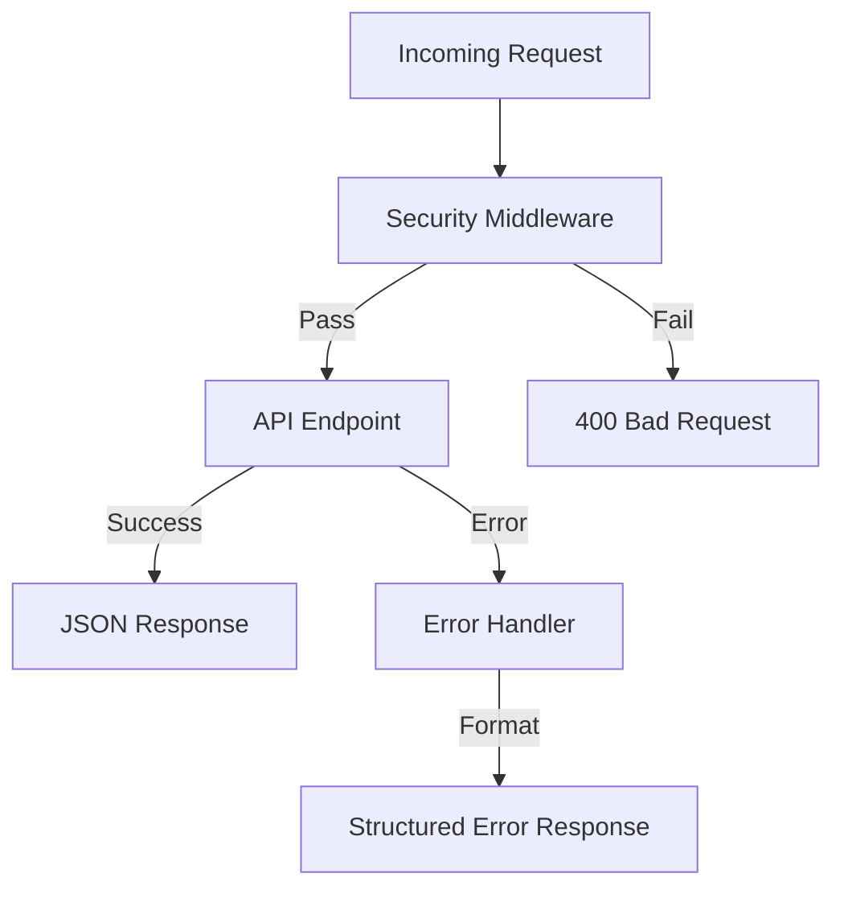

# API Middleware Module

## Purpose
This module provides cross-cutting concerns for the API, including security, error handling, and global constants.

## Components

### 1. Security (`security.py`)
Implements `MaliciousPromptMiddleware` to protect the system from prompt injection attacks.
- **Pattern Matching**: Uses regex to detect instruction bypass, data exfiltration, identity hijacking, and code injection.
- **Heuristics**: Checks for excessive query length, high character repetition, and suspicious Base64-like blocks.
- **Protected Paths**: Specifically targets `/chat/query` and `/chat/query/stream`.

### 2. Error Handling (`error_handler.py`)
Provides a centralized mechanism for catching and formatting exceptions.
- **Structured Responses**: Ensures all errors return a consistent JSON format (`APIErrorResponse`).
- **Exception Mapping**:
  - `APIException`: Custom application errors.
  - `RequestValidationError`: Pydantic validation errors (422).
  - `SQLAlchemyError`: Database errors (500, masked for security).
  - `Exception`: Catch-all for unhandled errors.

### 3. Constants (`consts.py`)
Centralized storage for security patterns and thresholds.
- **PATTERNS**: Compiled regex for malicious intent detection.
- **Thresholds**: `MAX_QUERY_LENGTH`, `MAX_REPETITION_RATIO`.

## How It Works
Middleware is registered in the FastAPI application (usually in `main.py`). The `MaliciousPromptMiddleware` intercepts requests before they reach the endpoints, while the exception handlers catch errors during request processing.

## Key Files
- `security.py:133` - `MaliciousPromptMiddleware` implementation.
- `error_handler.py:285` - `register_exception_handlers` function.
- `consts.py:31` - Security regex pattern definitions.

## Architecture

## Integration Points
- **Upstream**: Intercepts all incoming HTTP requests.
- **Downstream**: Wraps endpoint execution and database calls.
- **Config**: Uses thresholds defined in `consts.py`.
