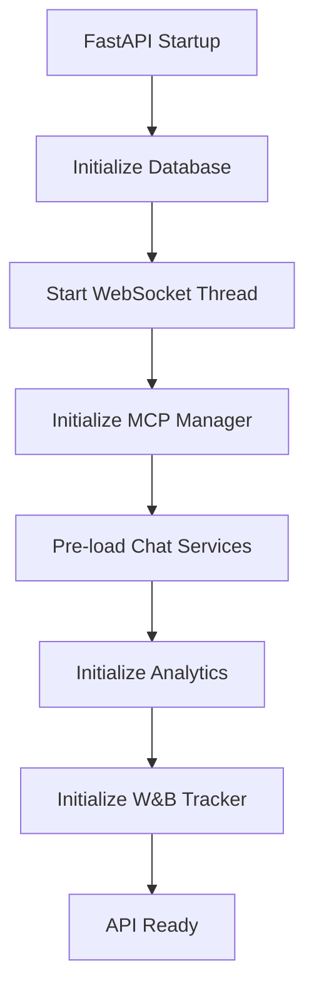

# API Services Module

## Purpose
This module manages the lifecycle of application services, including startup initialization and shutdown cleanup.

## Components

### 1. Startup Orchestration (`startup.py`)
Centralizes the initialization of all system components to ensure they are ready before the API starts accepting requests.
- **Critical Services**: Database table creation (raises error on failure).
- **Optional Services**: WebSocket server, MCP Manager (Arxiv), Chat services (RAG), Analytics services, and W&B tracker.
- **Performance Optimization**: Pre-initializes heavy services (LLMs, vector stores) to reduce first-request latency.

## How It Works
The `initialize_services` function is typically called during the FastAPI `lifespan` event. It follows a specific order of initialization, starting with critical infrastructure (DB) and moving to optional feature-specific services.

## Key Files
- `startup.py:46` - `initialize_services` function.
- `startup.py:82` - `shutdown_services` function.
- `startup.py:225` - `_initialize_chat_services` (heavy service pre-loading).

## Architecture

## Integration Points
- **Upstream**: Called by `main.py` during application startup/shutdown.
- **Downstream**: Initializes components in `src/boundary/`, `src/control/`, and `src/api/endpoints/streaming/`.
- **State**: Stores initialized service instances in `app.state` for access via dependency injection.
