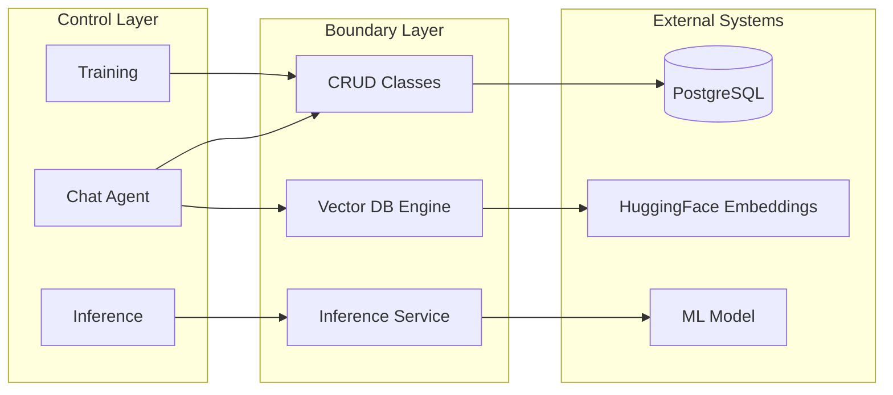
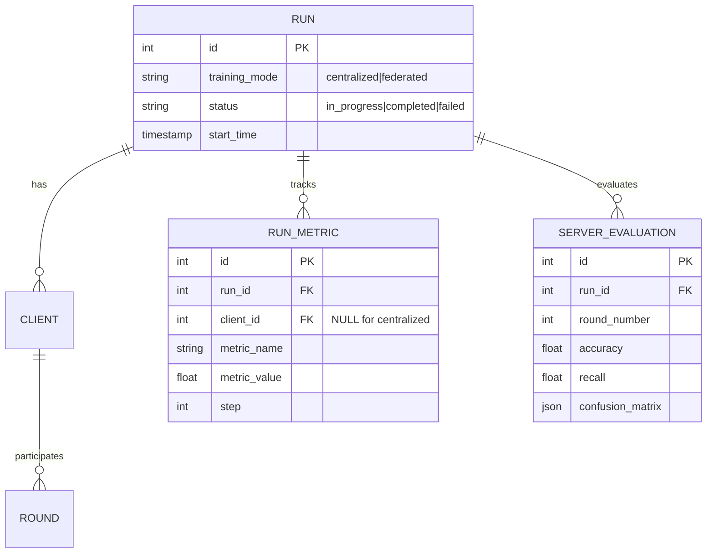
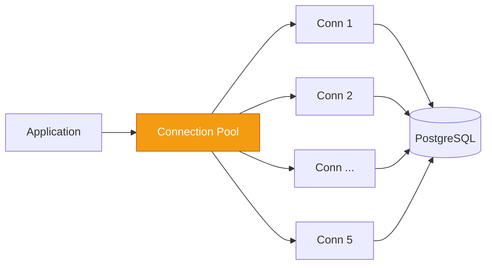
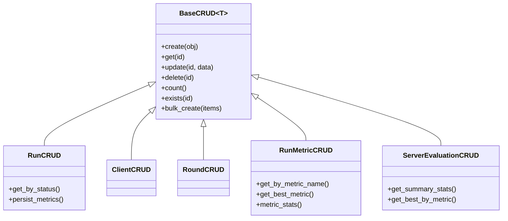
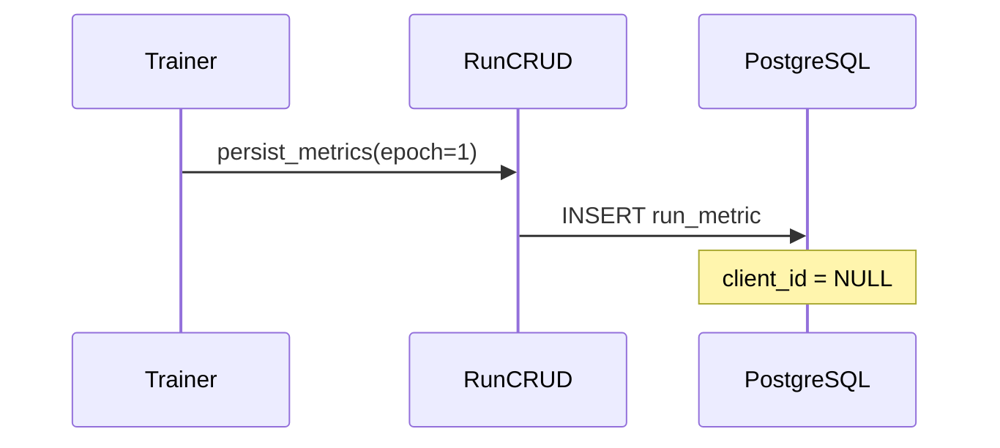
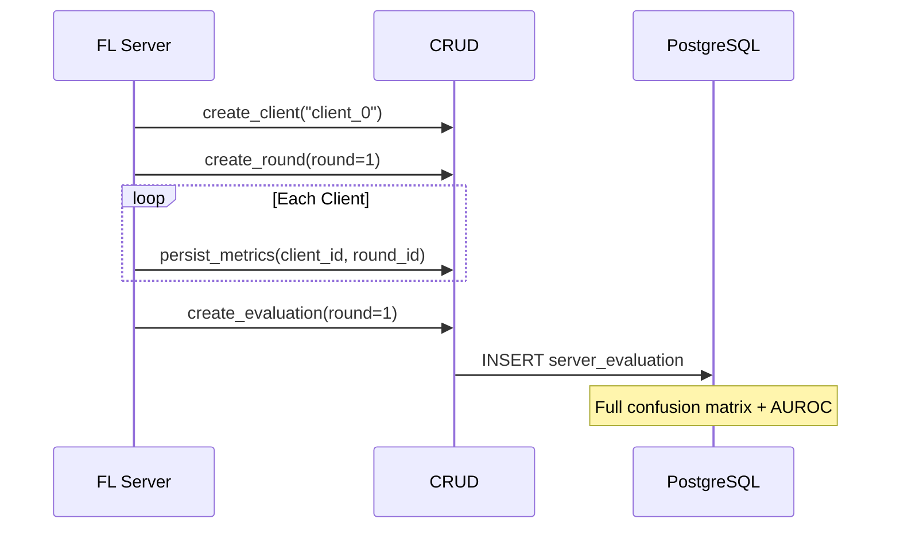
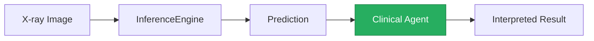
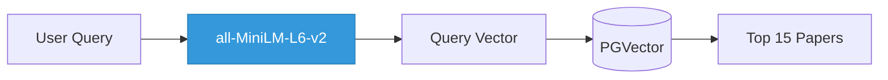

# Boundary Layer

Data access layer connecting business logic to PostgreSQL, ML models, and vector databases.

## What It Does



## Entity Relationships



## Module Overview

| Module | Purpose | Pattern |
|--------|---------|---------|
| **engine.py** | DB connection + session factory | Singleton, connection pooling |
| **models/** | SQLAlchemy ORM definitions | Declarative base |
| **CRUD/** | Data access operations | Generic base class |
| **inference_service.py** | ML prediction wrapper | Lazy singleton |
| **vdb_query_engine.py** | Semantic search for RAG | PGVector + HuggingFace |

## Database Engine

Connection pooling for production reliability:



| Setting | Value |
|---------|-------|
| Pool size | 5 |
| Max overflow | 10 |
| Pre-ping | Enabled |
| Recycle | 1 hour |

## CRUD Pattern

All CRUD classes inherit from a generic base:



## Data Flow

### Centralized Training


### Federated Training


## ML Services

### Inference Service

Wraps model prediction with clinical interpretation:



### Vector DB Engine

Semantic search for research papers:



## Key Files

```
boundary/
├── engine.py              # DB connection, session factory
├── inference_service.py   # ML prediction wrapper
├── vdb_query_engine.py    # Semantic search (RAG)
├── cleanup_database.py    # DB maintenance utilities
├── models/                # ORM entities
│   ├── run.py
│   ├── client.py
│   ├── round.py
│   ├── run_metric.py
│   ├── server_evaluation.py
│   └── chat_session.py
└── CRUD/                  # Data access classes
    ├── base.py            # Generic CRUD template
    ├── run.py
    ├── run_metric.py
    ├── server_evaluation.py
    ├── client.py
    ├── round.py
    ├── chat_history.py
    └── fetch_documents.py
```

## Quick Reference

| Action | Class/Method |
|--------|--------------|
| Create training run | `RunCRUD.create()` |
| Save epoch metrics | `RunCRUD.persist_metrics()` |
| Get best accuracy | `ServerEvaluationCRUD.get_best_by_metric('accuracy')` |
| Run prediction | `InferenceService.predict(image)` |
| Search papers | `VDBQueryEngine.query("federated learning")` |
| List chat sessions | `get_all_chat_sessions()` |
