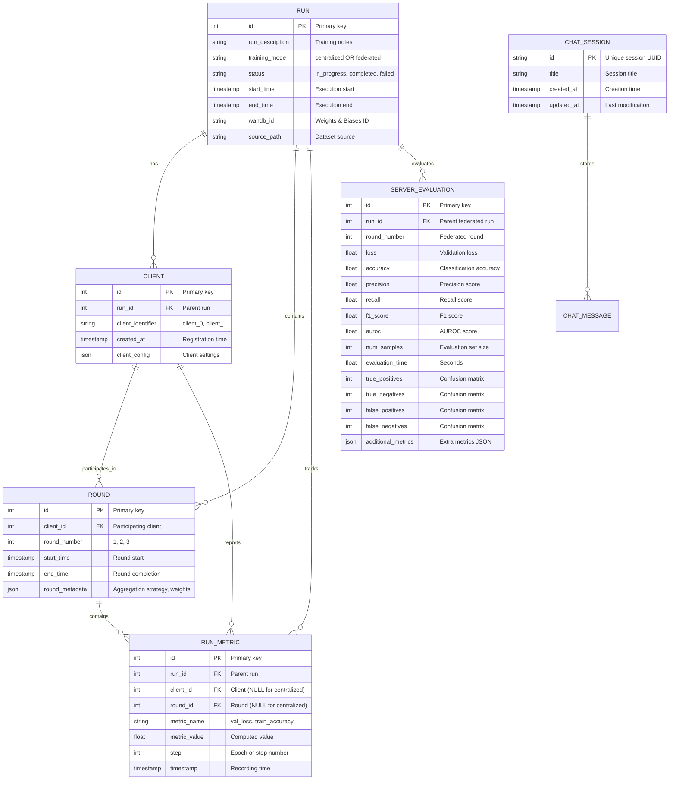

# Boundary Layer - Data Access Object (DAO) Pattern

**Purpose**: Database operations, data persistence, and external service integration for the federated pneumonia detection system.

The boundary layer implements the **Data Access Object (DAO)** pattern, separating business logic from database operations and providing a clean interface for data persistence. It serves as the lowest level in Clean Architecture, mediating between the Control layer (business logic) and the database.

## Table of Contents
- [Entity Relationship Diagram](#entity-relationship-diagram)
- [Boundary Layer Overview](#boundary-layer-overview)
- [Database Connection](#database-connection)
- [Data Models](#data-models)
- [CRUD Operations](#crud-operations)
- [Database Queries](#database-queries)
- [Migrations](#migrations)
- [Links](#links)

---

## Entity Relationship Diagram



---

## Boundary Layer Overview

### Role in Clean Architecture

The boundary layer is the **outermost framework layer**, responsible for interfacing with external systems:

- **Upward dependency**: Control layer (use cases, business logic) depends on boundary
- **Downward dependency**: Boundary depends on database and external services
- **No crossover**: Business logic never directly touches database; always via CRUD classes

### Core Responsibilities

| Responsibility | Details |
|---|---|
| **Database Configuration** | SQLAlchemy engine, session factory, connection pooling |
| **Data Models** | ORM entity definitions (Run, Client, Round, etc.) |
| **CRUD Operations** | Create, Read, Update, Delete via specialized classes |
| **Data Persistence** | Transaction management, rollback on failure |
| **External Services** | WandB integration, vector database queries (RAG) |

### Technology Stack

- **ORM**: SQLAlchemy 2.x
- **Database**: PostgreSQL
- **Configuration**: Pydantic environment variables
- **Connection Pool**: SQLAlchemy built-in pooling

---

## Database Connection

### PostgreSQL Setup

Database connection is configured via environment variables in `engine.py`:

```python
from federated_pneumonia_detection.src.boundary.engine import engine, Base, get_session

# Environment variables required:
# - POSTGRES_HOST
# - POSTGRES_PORT
# - POSTGRES_USER
# - POSTGRES_PASSWORD
# - POSTGRES_DB
# OR
# - POSTGRES_DB_URI (full connection string)
```

### SQLAlchemy Configuration

**File**: `engine.py`

```python
# Initialize engine with connection pooling
engine = create_engine(database_url, pool_pre_ping=True)

# Create all tables from models
Base.metadata.create_all(bind=engine)

# Get session for CRUD operations
session = get_session()
```

**Key Features**:
- Connection pooling for performance
- Pre-ping to detect stale connections
- Declarative base for all ORM models
- Session factory for transaction management

---

## Data Models

### 1. Run

**File**: `models/run.py`

**Purpose**: Represents a complete training execution (centralized or federated).

| Field | Type | Null | Purpose |
|-------|------|------|---------|
| `id` | Integer | NO | Unique run identifier (Primary Key) |
| `run_description` | String(1024) | YES | Training description/notes |
| `training_mode` | String(50) | NO | 'centralized' or 'federated' |
| `status` | String(50) | NO | Status: 'in_progress', 'completed', 'failed' |
| `start_time` | TIMESTAMP | NO | Run start timestamp |
| `end_time` | TIMESTAMP | YES | Run completion timestamp (NULL if in progress) |
| `wandb_id` | String(255) | YES | Weights & Biases integration ID |
| `source_path` | String(1024) | YES | Dataset source path |

**Relationships**:
- 1 Run → Many RunMetric
- 1 Run → Many Client (federated mode only)
- 1 Run → Many ServerEvaluation (federated mode only)

**Constraints**:
- `training_mode` must be either 'centralized' or 'federated'
- `status` must be one of: 'in_progress', 'completed', 'failed'

---

### 2. Client

**File**: `models/client.py`

**Purpose**: Represents a federated learning participant (not created for centralized training).

| Field | Type | Null | Purpose |
|-------|------|------|---------|
| `id` | Integer | NO | Unique client identifier (Primary Key) |
| `run_id` | Integer | NO | Parent run ID (Foreign Key) |
| `client_identifier` | String(255) | NO | Client label (e.g., 'client_0', 'client_1') |
| `created_at` | TIMESTAMP | NO | Client registration timestamp |
| `client_config` | JSON | YES | Client-specific configuration (optional) |

**Relationships**:
- Many Client → 1 Run
- 1 Client → Many Round
- 1 Client → Many RunMetric (optional)

**Constraints**:
- Foreign key to Run.id (cascade delete)
- `client_identifier` unique within a run

---

### 3. Round

**File**: `models/round.py`

**Purpose**: Tracks federated learning communication rounds per client.

| Field | Type | Null | Purpose |
|-------|------|------|---------|
| `id` | Integer | NO | Unique round identifier (Primary Key) |
| `client_id` | Integer | NO | Client participating in round (Foreign Key) |
| `round_number` | Integer | NO | Round number (1, 2, 3, ...) |
| `start_time` | TIMESTAMP | NO | Round start timestamp |
| `end_time` | TIMESTAMP | YES | Round completion timestamp |
| `round_metadata` | JSON | YES | Flexible metadata (aggregation strategy, weights, etc.) |

**Relationships**:
- Many Round → 1 Client
- 1 Round → Many RunMetric (optional)

**Constraints**:
- Foreign key to Client.id (cascade delete)
- Composite unique constraint: (client_id, round_number)

---

### 4. RunMetric

**File**: `models/run_metric.py`

**Purpose**: Stores training metrics (loss, accuracy, precision, etc.) per epoch/round.

| Field | Type | Null | Purpose |
|-------|------|------|---------|
| `id` | Integer | NO | Unique metric record ID (Primary Key) |
| `run_id` | Integer | NO | Parent run ID (Foreign Key) |
| `client_id` | Integer | YES | Client ID (NULL for centralized) |
| `round_id` | Integer | YES | Round ID (NULL for centralized) |
| `metric_name` | String(255) | NO | Metric name (e.g., 'val_loss', 'train_accuracy') |
| `metric_value` | Float | NO | Computed metric value |
| `step` | Integer | NO | Epoch or step number |
| `timestamp` | TIMESTAMP | NO | When metric was recorded |

**Relationships**:
- Many RunMetric → 1 Run
- Many RunMetric → 1 Client (optional, federated only)
- Many RunMetric → 1 Round (optional, federated only)

**Constraints**:
- Foreign key to Run.id (cascade delete)
- Foreign keys to Client.id and Round.id (optional, cascade delete)
- `step` must be positive integer

---

### 5. ServerEvaluation

**File**: `models/server_evaluation.py`

**Purpose**: Centralized server-side evaluation results per federated round.

| Field | Type | Null | Purpose |
|-------|------|------|---------|
| `id` | Integer | NO | Unique evaluation ID (Primary Key) |
| `run_id` | Integer | NO | Parent federated run (Foreign Key) |
| `round_number` | Integer | NO | Federated round number |
| `loss` | Float | NO | Validation loss |
| `accuracy` | Float | NO | Classification accuracy (0-1) |
| `precision` | Float | NO | Precision score (0-1) |
| `recall` | Float | NO | Recall score (0-1) |
| `f1_score` | Float | NO | F1 score (0-1) |
| `auroc` | Float | NO | AUROC score (0-1) |
| `num_samples` | Integer | NO | Samples in evaluation set |
| `evaluation_time` | Float | NO | Evaluation time (seconds) |
| `true_positives` | Integer | NO | Confusion matrix TP |
| `true_negatives` | Integer | NO | Confusion matrix TN |
| `false_positives` | Integer | NO | Confusion matrix FP |
| `false_negatives` | Integer | NO | Confusion matrix FN |
| `additional_metrics` | JSON | YES | Additional metrics in JSON format |

**Relationships**:
- Many ServerEvaluation → 1 Run

**Constraints**:
- Foreign key to Run.id (cascade delete)
- Composite unique constraint: (run_id, round_number)
- All metrics must be between 0 and 1

---

### 6. ChatSession

**File**: `models/chat_session.py`

**Purpose**: Stores chat sessions for RAG-based interaction and history tracking.

| Field | Type | Null | Purpose |
|-------|------|------|---------|
| `id` | String(36) | NO | Unique session UUID (Primary Key) |
| `title` | String(255) | YES | Optional session title |
| `created_at` | TIMESTAMP | NO | Session creation timestamp |
| `updated_at` | TIMESTAMP | NO | Last modification timestamp |

**Relationships**:
- 1 ChatSession → Many ChatMessage (external storage)

**Constraints**:
- `id` is UUID format
- `created_at` and `updated_at` auto-managed

---

## CRUD Operations

### Module Structure

```
boundary/
├── engine.py                  # SQLAlchemy configuration, session factory
├── models/                    # ORM model definitions
│   ├── __init__.py
│   ├── run.py
│   ├── client.py
│   ├── round.py
│   ├── run_metric.py
│   ├── server_evaluation.py
│   └── chat_session.py
├── CRUD/                      # Data access objects
│   ├── __init__.py
│   ├── base.py                # BaseCRUD abstract template
│   ├── run.py                 # Run CRUD operations
│   ├── client.py              # Client CRUD operations
│   ├── round.py               # Round CRUD operations
│   ├── run_metric.py          # RunMetric CRUD operations
│   ├── server_evaluation.py   # ServerEvaluation CRUD operations
│   ├── chat_history.py        # ChatSession management
│   └── fetch_documents.py     # Vector DB queries (RAG)
└── wandb_Integration/         # WandB integration (placeholder)
```

### CRUD Classes Overview

#### RunCRUD

**File**: `CRUD/run.py`

| Method | Purpose |
|--------|---------|
| `create_run()` | Create new run with initial status |
| `get_run()` | Retrieve run by ID |
| `get_all_runs()` | List all runs with optional filtering |
| `update_run_status()` | Update run status and end_time |
| `get_latest_run()` | Get most recent run |
| `persist_metrics()` | Save epoch metrics with federated context |

#### ClientCRUD

**File**: `CRUD/client.py`

| Method | Purpose |
|--------|---------|
| `create_client()` | Register new federated client |
| `get_client()` | Retrieve client by ID |
| `get_clients_for_run()` | List all clients in a run |

#### RoundCRUD

**File**: `CRUD/round.py`

| Method | Purpose |
|--------|---------|
| `create_round()` | Create new federated round record |
| `get_round()` | Retrieve round by ID |
| `get_rounds_for_client()` | List rounds for client |
| `update_round_end_time()` | Mark round as complete |

#### RunMetricCRUD

**File**: `CRUD/run_metric.py`

| Method | Purpose |
|--------|---------|
| `create_metric()` | Insert single metric record |
| `get_by_run()` | Retrieve all metrics for run |
| `get_by_metric_name()` | Filter by metric type |
| `get_best_metric()` | Find best value for metric |
| `get_metric_stats()` | Compute statistics for run |

#### ServerEvaluationCRUD

**File**: `CRUD/server_evaluation.py`

| Method | Purpose |
|--------|---------|
| `create_evaluation()` | Insert server evaluation record |
| `get_by_run()` | Retrieve all evaluations for run |
| `get_summary_stats()` | Compute best metrics across rounds |
| `get_best_by_metric()` | Find best round for metric |

#### ChatHistory Functions

**File**: `CRUD/chat_history.py`

| Function | Purpose |
|----------|---------|
| `create_chat_session()` | Initialize a new session record |
| `get_chat_session()` | Retrieve session by ID |
| `get_all_chat_sessions()` | List all sessions (sorted by update) |
| `update_chat_session_title()` | Rename a session |
| `delete_chat_session()` | Remove a session record |

---

## Database Queries

### Common Query Patterns

#### Get all metrics for a run
```python
from federated_pneumonia_detection.src.boundary.CRUD.run_metric import RunMetricCRUD

metrics = RunMetricCRUD(session).get_by_run(run_id=42)
```

#### Get best accuracy across federated rounds
```python
from federated_pneumonia_detection.src.boundary.CRUD.server_evaluation import ServerEvaluationCRUD

best = ServerEvaluationCRUD(session).get_best_by_metric(run_id=42, metric='accuracy')
```

#### Retrieve server evaluation for specific round
```python
from federated_pneumonia_detection.src.boundary.CRUD.server_evaluation import ServerEvaluationCRUD

evals = ServerEvaluationCRUD(session).get_by_run(run_id=42)
round_1_eval = [e for e in evals if e.round_number == 1][0]
```

#### Get all clients participating in a run
```python
from federated_pneumonia_detection.src.boundary.CRUD.client import ClientCRUD

clients = ClientCRUD(session).get_clients_for_run(run_id=42)
```

### Centralized Training Data Flow

```
CentralizedTrainer
  ↓
MetricsCollectorCallback (on_train_epoch_end)
  ↓
RunCRUD.persist_metrics()
  ↓
Insert into run_metrics:
  - run_id: 42
  - client_id: NULL
  - round_id: NULL
  - metric_name: 'train_loss'
  - metric_value: 0.245
  - step: 5
```

### Federated Training Data Flow

```
FederatedServer (round 1)
  ├─ Client 0: train_metrics → RunMetric (client_id=1)
  ├─ Client 1: train_metrics → RunMetric (client_id=2)
  └─ Server: evaluate() → ServerEvaluation
      ↓
Insert into server_evaluations:
  - run_id: 42
  - round_number: 1
  - loss: 0.312
  - accuracy: 0.876
  - true_positives: 245
  - true_negatives: 189
  - false_positives: 23
  - false_negatives: 17
  - additional_metrics: {confusion_matrix: {...}}
```

---

## Migrations

### Database Schema Management

Schema changes are managed through SQLAlchemy declarative models in the `models/` directory.

**Typical workflow**:

1. **Modify model** (e.g., `models/run.py`)
   - Add/remove columns, constraints, relationships

2. **Create migration** (manual or via Alembic)
   - Document schema changes
   - Create forward and rollback scripts

3. **Deploy migration**
   ```python
   from federated_pneumonia_detection.src.boundary.engine import Base, engine
   Base.metadata.create_all(bind=engine)
   ```

4. **Verify schema**
   - Check new tables/columns in PostgreSQL
   - Run integration tests

### Best Practices

- One schema change per migration
- Always include rollback scripts
- Test migrations locally first
- Keep migration history for auditing

---

## Links

### Architecture References

- **System Overview**: [../../../README.md](../../../README.md)
- **Control Layer**: [../control/README.md](../control/README.md)
- **API Layer**: [../api/README.md](../api/README.md)

### Configuration

- **Default Config**: [../../config/default_config.yaml](../../config/default_config.yaml)

### Model Details

- **Run Model**: `models/run.py`
- **Client Model**: `models/client.py`
- **Round Model**: `models/round.py`
- **RunMetric Model**: `models/run_metric.py`
- **ServerEvaluation Model**: `models/server_evaluation.py`
- **ChatSession Model**: `models/chat_session.py`

### CRUD Implementation

- **Base CRUD**: `CRUD/base.py`
- **Run CRUD**: `CRUD/run.py`
- **Client CRUD**: `CRUD/client.py`
- **Round CRUD**: `CRUD/round.py`
- **RunMetric CRUD**: `CRUD/run_metric.py`
- **ServerEvaluation CRUD**: `CRUD/server_evaluation.py`
- **Chat History**: `CRUD/chat_history.py`
