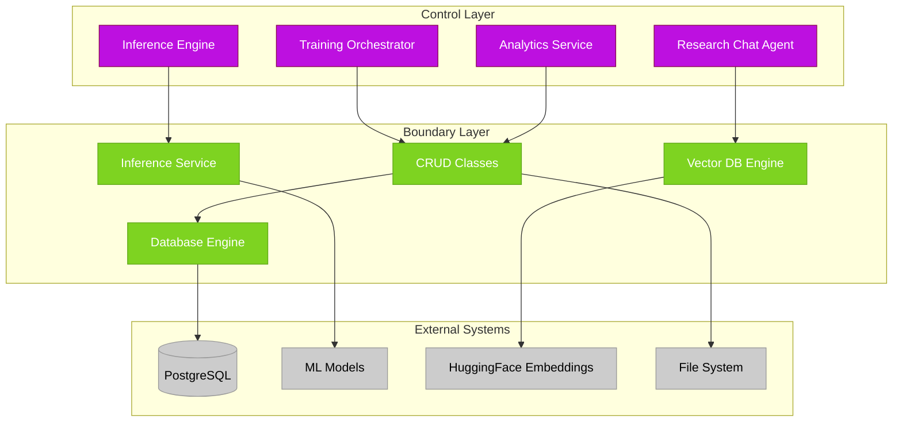
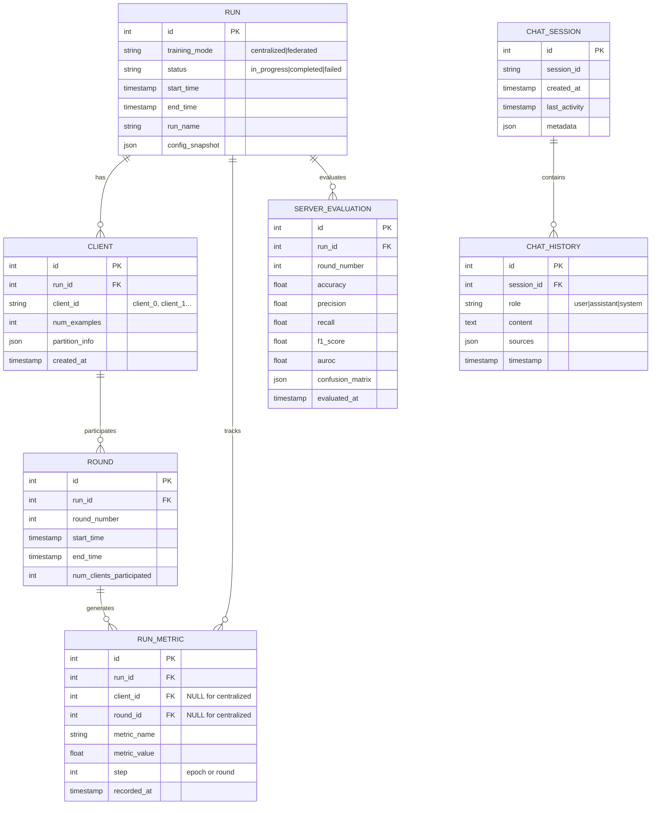
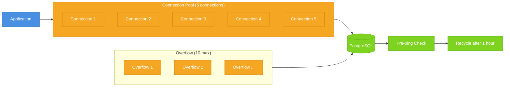
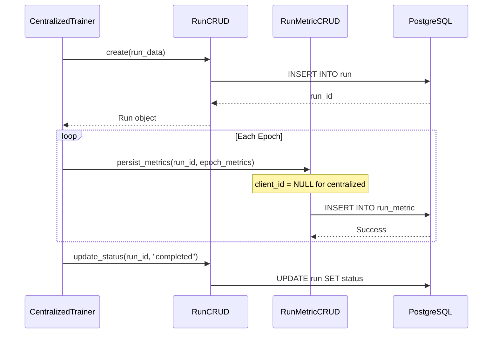
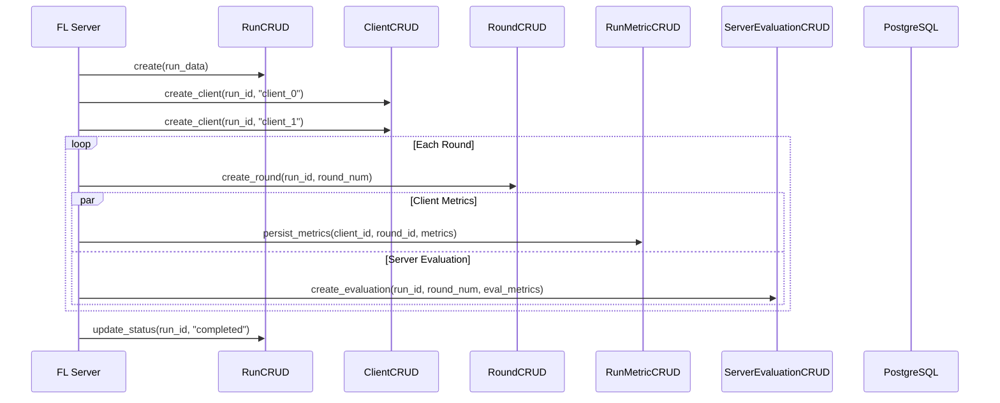
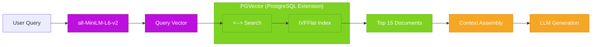
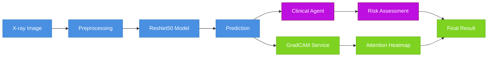

# Boundary Layer

**Date**: 2026-01-24
**Agent**: Sub-Apollo (Documentation Specialist)

## Problem
The Boundary layer required clear documentation explaining its role as the data access layer between business logic and external systems. The existing documentation needed better visual representation of database relationships and CRUD patterns.

## Solution
Created comprehensive documentation with professional Mermaid diagrams showing the database schema, CRUD patterns, and service integrations. The documentation clearly explains the Entity-Control-Boundary pattern implementation.

### Key Implementation Files
- `src/boundary/engine.py:1` - Database connection and session factory
- `src/boundary/models/base.py:1` - SQLAlchemy declarative base
- `src/boundary/CRUD/base.py:1` - Generic CRUD base class
- `src/boundary/vdb_query_engine.py:1` - Vector database query engine for RAG

### System Connections



### Database Schema



### CRUD Pattern Implementation

```mermaid
classDiagram
    class BaseCRUD~T~ {
        <<abstract>>
        +db: Session
        +model: Type[T]
        +create(obj_in: CreateSchemaType) T
        +get(id: int) Optional[T]
        +get_multi(skip: int, limit: int) List[T]
        +update(id: int, obj_in: UpdateSchemaType) T
        +delete(id: int) T
        +count() int
        +exists(id: int) bool
        +bulk_create(objects: List[CreateSchemaType]) List[T]
    }

    class RunCRUD {
        +get_by_status(status: str) List[Run]
        +persist_metrics(run_id: int, metrics: Dict) None
        +get_with_metrics(id: int) Optional[RunWithMetrics]
        +update_status(id: int, status: str) Run
    }

    class ClientCRUD {
        +get_by_run_id(run_id: int) List[Client]
        +create_client(run_id: int, client_id: str) Client
        +get_client_metrics(client_id: int) List[RunMetric]
    }

    class RunMetricCRUD {
        +get_by_metric_name(metric_name: str) List[RunMetric]
        +get_best_metric(run_id: int, metric_name: str) Optional[RunMetric]
        +metric_stats(run_id: int, metric_name: str) MetricStats
        +get_metrics_by_round(run_id: int, round_num: int) List[RunMetric]
    }

    class ServerEvaluationCRUD {
        +get_by_round(run_id: int, round_num: int) Optional[ServerEvaluation]
        +get_summary_stats(run_id: int) SummaryStats
        +get_best_by_metric(run_id: int, metric_name: str) Optional[ServerEvaluation]
    }

    BaseCRUD <|-- RunCRUD
    BaseCRUD <|-- ClientCRUD
    BaseCRUD <|-- RoundCRUD
    BaseCRUD <|-- RunMetricCRUD
    BaseCRUD <|-- ServerEvaluationCRUD
    BaseCRUD <|-- ChatSessionCRUD
    BaseCRUD <|-- ChatHistoryCRUD

    classDef base fill:#4A90E2,stroke:#357ABD,color:#fff
    classDef concrete fill:#7ED321,stroke:#5FA818,color:#fff

    class BaseCRUD base
    class RunCRUD,ClientCRUD,RoundCRUD,RunMetricCRUD,ServerEvaluationCRUD,ChatSessionCRUD,ChatHistoryCRUD concrete
```

### Database Engine Configuration



**Connection Pool Settings:**
- **Pool Size**: 5 connections
- **Max Overflow**: 10 additional connections
- **Pre-ping**: Enabled (validates connections before use)
- **Recycle**: 1 hour (prevents stale connections)

### Data Flow Patterns

#### Centralized Training Data Flow



#### Federated Learning Data Flow



### Vector Database Integration



### Inference Service Architecture



### Decision Rationale
- **SQLAlchemy Chosen**: Powerful ORM with connection pooling and migrations
- **Generic CRUD Base**: Reduces code duplication with type-safe operations
- **PGVector Integration**: Native PostgreSQL vector search for RAG
- **Connection Pooling**: Ensures production reliability and performance

### Integration Points
- **Upstream**: Called by Control layer for all data operations
- **Downstream**: Manages PostgreSQL database and file system
- **External**: Integrates with HuggingFace for embeddings
- **Models**: Uses SQLAlchemy models for ORM mapping

## Key Files Structure

```
src/boundary/
├── engine.py                    # Database connection and session factory
├── inference_service.py         # ML prediction wrapper
├── vdb_query_engine.py          # Vector database search (RAG)
├── cleanup_database.py          # Database maintenance utilities
├── models/                       # SQLAlchemy ORM definitions
│   ├── base.py                  # Declarative base and mixins
│   ├── run.py                   # Training run entity
│   ├── client.py                # FL client entity
│   ├── round.py                 # FL round entity
│   ├── run_metric.py            # Metrics entity
│   ├── server_evaluation.py     # FL server evaluation
│   ├── chat_session.py          # Chat session entity
│   └── chat_history.py          # Chat message history
└── CRUD/                         # Data access operations
    ├── base.py                  # Generic CRUD base class
    ├── run.py                   # Run CRUD operations
    ├── run_metric.py            # Metric CRUD operations
    ├── server_evaluation.py     # Evaluation CRUD
    ├── client.py                # Client CRUD
    ├── round.py                 # Round CRUD
    ├── chat_history.py          # Chat CRUD
    └── fetch_documents.py       # Document retrieval for RAG
```

## Quick Reference

| Operation | Class/Method | Description |
|-----------|--------------|-------------|
| Create training run | `RunCRUD.create()` | Initialize new training run |
| Save epoch metrics | `RunCRUD.persist_metrics()` | Store training metrics |
| Get best accuracy | `ServerEvaluationCRUD.get_best_by_metric('accuracy')` | Find best performing model |
| Run prediction | `InferenceService.predict(image)` | ML model inference |
| Search papers | `VDBQueryEngine.query("federated learning")` | Semantic document search |
| List chat sessions | `ChatSessionCRUD.get_multi()` | Get all chat sessions |
| Create FL client | `ClientCRUD.create_client()` | Register federated client |
| Get round metrics | `RunMetricCRUD.get_metrics_by_round()` | Fetch FL round data |

## Database Operations

### Connection Management

```python
# Session dependency pattern
from sqlalchemy.orm import Session

def get_db() -> Generator[Session, None, None]:
    """Database session dependency with automatic cleanup"""
    db = SessionLocal()
    try:
        yield db
    finally:
        db.close()
```

### Transaction Patterns

```python
# Atomic operations
def create_run_with_metrics(db: Session, run_data: dict, metrics: list):
    """Create run and metrics in single transaction"""
    try:
        run = RunCRUD(db).create(run_data)
        for metric in metrics:
            RunMetricCRUD(db).create({
                "run_id": run.id,
                **metric
            })
        db.commit()
        return run
    except Exception:
        db.rollback()
        raise
```

## Performance Optimizations

- **Connection Pooling**: 5 base connections + 10 overflow
- **Query Optimization**: Indexed foreign keys and metric names
- **Batch Operations**: Bulk inserts for metrics
- **Lazy Loading**: Relationships loaded on demand
- **Connection Recycling**: 1-hour timeout prevents stale connections

## Error Handling

- **Database Errors**: Wrapped in domain-specific exceptions
- **Connection Failures**: Automatic retry with exponential backoff
- **Validation Errors**: Pydantic schemas for data integrity
- **Constraint Violations**: Clear error messages for duplicate entries